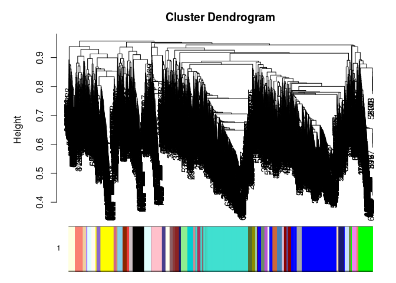
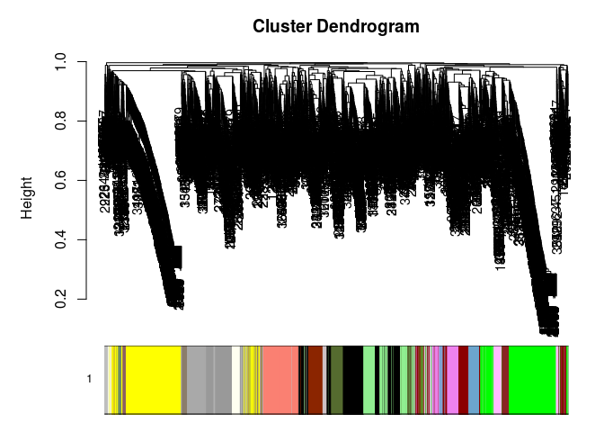

BoneCorrelations
================
Matthew Schmitz
March 15, 2018

So to get at the question of what is changing, perhaps we can use the variability of the FACS efficiency in the Ambrosi data, and the inter-individual animal variation to our advantage. I'll try to do this by looking for genes which covary across the samples, expecting to find sets related to cell type which are higher in their different sorted populations.

Load all the processed data from BoneNotebook.Rmd's cache

``` r
load("~/code/IngrahamLab/BoneNotebook_cache/markdown_github/everything.RData")
```

    ## 

Apply WGCNA:

``` r
library(WGCNA)
library(matrixStats)
softThresh <- WGCNA::pickSoftThreshold(t(log(ambrosiMatNorm[rowSds(ambrosiMatNorm)>.5,]+1,2)))
```

    ## Warning: executing %dopar% sequentially: no parallel backend registered

    ##    Power SFT.R.sq slope truncated.R.sq mean.k. median.k. max.k.
    ## 1      1  0.14700  3.31          0.825  4970.0   4970.00   6000
    ## 2      2  0.00943 -0.47          0.921  2010.0   2000.00   2850
    ## 3      3  0.10200 -1.34          0.994   993.0    983.00   1620
    ## 4      4  0.08870 -1.12          0.978   561.0    545.00   1030
    ## 5      5  0.15000 -1.23          0.963   348.0    331.00    705
    ## 6      6  0.20800 -1.21          0.884   232.0    217.00    516
    ## 7      7  0.33600 -1.03          0.804   164.0    147.00    400
    ## 8      8  0.62100 -1.44          0.855   121.0    103.00    357
    ## 9      9  0.79400 -1.63          0.888    93.1     74.40    326
    ## 10    10  0.88700 -1.73          0.904    73.8     55.20    304
    ## 11    12  0.75400 -1.94          0.697    50.3     32.30    273
    ## 12    14  0.70300 -1.83          0.620    37.2     20.10    253
    ## 13    16  0.67400 -1.72          0.580    29.3     13.30    240
    ## 14    18  0.62200 -1.66          0.515    24.2      9.09    229
    ## 15    20  0.63100 -1.53          0.527    20.7      6.42    222

``` r
softThresh
```

    ## $powerEstimate
    ## [1] 10
    ## 
    ## $fitIndices
    ##    Power    SFT.R.sq      slope truncated.R.sq    mean.k.   median.k.
    ## 1      1 0.146822772  3.3058850      0.8251071 4967.54091 4968.268406
    ## 2      2 0.009429139 -0.4695663      0.9210188 2005.35642 2000.337272
    ## 3      3 0.101900021 -1.3369674      0.9938442  992.97284  983.033219
    ## 4      4 0.088692103 -1.1233710      0.9782861  561.00611  544.569439
    ## 5      5 0.150204071 -1.2298886      0.9625716  348.30335  330.608170
    ## 6      6 0.207518648 -1.2095398      0.8838223  232.30248  217.087948
    ## 7      7 0.335767365 -1.0325293      0.8037003  163.96421  146.888799
    ## 8      8 0.620536874 -1.4443954      0.8551075  121.18957  103.095694
    ## 9      9 0.794266821 -1.6308100      0.8882261   93.07233   74.408428
    ## 10    10 0.886786125 -1.7275212      0.9042589   73.82734   55.239293
    ## 11    12 0.753943963 -1.9379268      0.6969536   50.26669   32.250229
    ## 12    14 0.703346576 -1.8308545      0.6197022   37.17365   20.118669
    ## 13    16 0.673661806 -1.7246431      0.5804973   29.26523   13.254244
    ## 14    18 0.622241600 -1.6623054      0.5148162   24.16806    9.089906
    ## 15    20 0.631409130 -1.5259908      0.5270651   20.70787    6.417209
    ##       max.k.
    ## 1  5996.3077
    ## 2  2849.7014
    ## 3  1621.0759
    ## 4  1029.0995
    ## 5   705.3459
    ## 6   515.9674
    ## 7   399.6349
    ## 8   356.6035
    ## 9   326.2214
    ## 10  303.7978
    ## 11  273.1597
    ## 12  253.3562
    ## 13  239.5678
    ## 14  229.4377
    ## 15  221.6892

``` r
#hardThresh <- pickHardThreshold(t(log(ambrosiMatNorm+1,2)))
AmbrosiBlocks <- blockwiseModules(t(log(ambrosiMatNorm[rowSds(ambrosiMatNorm)>.5,]+1,2)),maxBlockSize = 6000,power = 10)
```

``` r
softThresh <- WGCNA::pickSoftThreshold(t(log(boneMatNorm[rowSds(boneMatNorm)>.5,]+1,2)))
```

    ##    Power SFT.R.sq slope truncated.R.sq mean.k. median.k. max.k.
    ## 1      1   0.1220  2.38          0.742  7670.0    7580.0   9960
    ## 2      2   0.0871 -0.79          0.734  3750.0    3620.0   5980
    ## 3      3   0.4610 -1.48          0.837  2180.0    2040.0   4110
    ## 4      4   0.6430 -1.68          0.893  1400.0    1260.0   3040
    ## 5      5   0.7330 -1.75          0.914   964.0     838.0   2360
    ## 6      6   0.8040 -1.81          0.937   699.0     585.0   1900
    ## 7      7   0.8470 -1.84          0.950   526.0     428.0   1560
    ## 8      8   0.8710 -1.86          0.955   408.0     325.0   1320
    ## 9      9   0.8830 -1.90          0.954   325.0     258.0   1130
    ## 10    10   0.8880 -1.92          0.955   264.0     205.0    985
    ## 11    12   0.8960 -1.93          0.948   183.0     135.0    771
    ## 12    14   0.8960 -1.95          0.943   133.0      93.3    623
    ## 13    16   0.8960 -1.94          0.937   101.0      67.4    516
    ## 14    18   0.8820 -1.94          0.919    79.1      50.3    435
    ## 15    20   0.9480 -1.79          0.961    63.7      38.6    373

``` r
softThresh
```

    ## $powerEstimate
    ## [1] 8
    ## 
    ## $fitIndices
    ##    Power  SFT.R.sq      slope truncated.R.sq    mean.k.  median.k.
    ## 1      1 0.1219429  2.3793790      0.7424669 7665.87483 7581.86902
    ## 2      2 0.0870952 -0.7896094      0.7341802 3750.25070 3621.72336
    ## 3      3 0.4608855 -1.4786954      0.8369394 2176.39654 2036.07774
    ## 4      4 0.6431431 -1.6762661      0.8929851 1399.48723 1262.53626
    ## 5      5 0.7325193 -1.7534918      0.9142794  964.48436  838.38839
    ## 6      6 0.8041522 -1.8067489      0.9374252  698.95571  584.94215
    ## 7      7 0.8471114 -1.8352845      0.9496372  526.29375  428.34186
    ## 8      8 0.8714206 -1.8584506      0.9550985  408.44317  325.00252
    ## 9      9 0.8825472 -1.8956241      0.9543083  324.85518  257.91603
    ## 10    10 0.8880803 -1.9191426      0.9545144  263.68910  205.40906
    ## 11    12 0.8957269 -1.9300809      0.9483870  182.50210  134.76304
    ## 12    14 0.8956703 -1.9480707      0.9433175  133.02356   93.34749
    ## 13    16 0.8963097 -1.9444658      0.9374789  100.95011   67.42872
    ## 14    18 0.8820477 -1.9376703      0.9186235   79.14248   50.27329
    ## 15    20 0.9484299 -1.7927089      0.9605135   63.73918   38.64011
    ##       max.k.
    ## 1  9958.2991
    ## 2  5982.1328
    ## 3  4105.6167
    ## 4  3037.9515
    ## 5  2359.8590
    ## 6  1896.5979
    ## 7  1564.1388
    ## 8  1317.6724
    ## 9  1131.5339
    ## 10  985.3610
    ## 11  770.9973
    ## 12  622.9433
    ## 13  515.6717
    ## 14  435.0507
    ## 15  372.6810

``` r
#hardThresh <- pickHardThreshold(t(log(boneMatNorm+1,2)))
IngrahamBlocks <- blockwiseModules(t(log(boneMatNorm[rowSds(boneMatNorm)>.5,]+1,2)),maxBlockSize = 6000,power = 8)
```

``` r
save.image(file = "~/code/IngrahamLab/BoneCorrelations_cache/wgcnas.RData")
#load(file = "~/code/IngrahamLab/BoneCorrelations_cache/wgcnas.RData")

par(mfrow=c(2,2))
lapply(1:length(IngrahamBlocks$dendrograms),function(i) plotDendroAndColors(IngrahamBlocks$dendrograms[[i]],colors=IngrahamBlocks$colors[IngrahamBlocks$blockGenes[[i]]]))
```



    ## [[1]]
    ## [[1]]$mar
    ## [1] 1 5 0 1
    ## 
    ## 
    ## [[2]]
    ## [[2]]$mar
    ## [1] 1 5 0 1
    ## 
    ## 
    ## [[3]]
    ## [[3]]$mar
    ## [1] 1 5 0 1
    ## 
    ## 
    ## [[4]]
    ## [[4]]$mar
    ## [1] 1 5 0 1

``` r
par(mfrow=c(2,2))
lapply(1:length(AmbrosiBlocks$dendrograms),function(i) plotDendroAndColors(AmbrosiBlocks$dendrograms[[i]],colors=AmbrosiBlocks$colors[AmbrosiBlocks$blockGenes[[i]]]))
```



    ## [[1]]
    ## [[1]]$mar
    ## [1] 1 5 0 1
    ## 
    ## 
    ## [[2]]
    ## [[2]]$mar
    ## [1] 1 5 0 1
    ## 
    ## 
    ## [[3]]
    ## [[3]]$mar
    ## [1] 1 5 0 1
    ## 
    ## 
    ## [[4]]
    ## [[4]]$mar
    ## [1] 1 5 0 1

``` r
print(str(IngrahamBlocks))
```

    ## List of 10
    ##  $ colors        : chr [1:22578] "royalblue" "green4" "green" "navajowhite2" ...
    ##  $ unmergedColors: chr [1:22578] "coral" "bisque1" "blue" "ivory" ...
    ##  $ MEs           :'data.frame':  8 obs. of  200 variables:
    ##   ..$ MElightpink2     : num [1:8] 0.348 -0.358 -0.143 -0.523 -0.318 ...
    ##   ..$ MEpink4          : num [1:8] 0.2265 0.0244 -0.3937 -0.3656 -0.476 ...
    ##   ..$ MElightgreen     : num [1:8] -0.0743 -0.1861 -0.0409 -0.4485 -0.2902 ...
    ##   ..$ MEbrown          : num [1:8] -0.121 -0.197 -0.175 -0.189 -0.162 ...
    ##   ..$ MEdarkgrey       : num [1:8] -0.103 -0.142 -0.254 -0.27 -0.463 ...
    ##   ..$ MEblue3          : num [1:8] 0.0354 0.1378 -0.5713 0.1282 -0.4729 ...
    ##   ..$ MEpaleturquoise3 : num [1:8] 0.5502 -0.0515 -0.642 0.2518 -0.3506 ...
    ##   ..$ MElightpink1     : num [1:8] 0.092 -0.39 0.111 0.162 -0.242 ...
    ##   ..$ MElightpink4     : num [1:8] 0.256 -0.258 -0.1193 -0.0377 -0.6286 ...
    ##   ..$ MEplum4          : num [1:8] 0.183 -0.6089 -0.3193 0.0599 -0.2381 ...
    ##   ..$ MEthistle3       : num [1:8] 0.1905 -0.3457 -0.4133 0.0311 -0.1596 ...
    ##   ..$ MEdarkgoldenrod3 : num [1:8] -0.366 -0.124 0.138 -0.314 -0.279 ...
    ##   ..$ MElightcyan1     : num [1:8] -0.2032 -0.2902 -0.0994 -0.2362 -0.2241 ...
    ##   ..$ MEdarkolivegreen4: num [1:8] -0.164 -0.611 -0.218 -0.222 0.267 ...
    ##   ..$ MEdeeppink       : num [1:8] -0.149 -0.7 -0.303 0.137 0.495 ...
    ##   ..$ MEplum           : num [1:8] -0.4166 -0.1691 -0.5038 -0.0544 -0.1072 ...
    ##   ..$ MEthistle4       : num [1:8] -0.6226 -0.3554 -0.3175 0.0863 0.3301 ...
    ##   ..$ MEpalevioletred1 : num [1:8] -0.625 -0.2302 -0.0552 0.2116 -0.3072 ...
    ##   ..$ MEdarkolivegreen : num [1:8] -0.5271 -0.3075 -0.0795 -0.2415 0.1993 ...
    ##   ..$ MEmagenta3       : num [1:8] -0.3134 -0.538 -0.1805 0.0459 -0.0911 ...
    ##   ..$ MEchocolate4     : num [1:8] -0.0359 -0.4077 -0.6562 0.2157 0.1014 ...
    ##   ..$ MEdarkgreen      : num [1:8] 0.0655 -0.4989 -0.2481 -0.0124 0.2947 ...
    ##   ..$ MEivory          : num [1:8] 0.342 -0.2822 -0.4648 0.1526 -0.0264 ...
    ##   ..$ MEorange         : num [1:8] -0.1312 -0.152 -0.0914 0.2507 0.1375 ...
    ##   ..$ MEthistle1       : num [1:8] -0.176 -0.194 -0.176 0.503 -0.226 ...
    ##   ..$ MEindianred1     : num [1:8] -0.394 -0.418 -0.212 0.407 0.261 ...
    ##   ..$ MElightblue2     : num [1:8] -0.1747 -0.5721 0.0399 0.5297 0.2407 ...
    ##   ..$ MElightskyblue2  : num [1:8] 0.156 0.484 -0.54 -0.436 0.181 ...
    ##   ..$ MEgreen4         : num [1:8] -0.1187 0.0152 -0.4869 0.4805 -0.2166 ...
    ##   ..$ MEfirebrick      : num [1:8] -0.306 0.277 -0.379 0.107 0.135 ...
    ##   ..$ MEviolet         : num [1:8] -0.4743 -0.0421 -0.4671 0.1198 0.0697 ...
    ##   ..$ MEdarkred        : num [1:8] -0.216 -0.259 -0.314 -0.229 0.314 ...
    ##   ..$ MEblue2          : num [1:8] 0.159 0.147 -0.631 0.181 0.204 ...
    ##   ..$ MEyellow4        : num [1:8] 0.0747 -0.182 -0.6341 0.049 0.1618 ...
    ##   ..$ MElightsteelblue1: num [1:8] 0.0179 0.0882 0.1719 0.1726 -0.7123 ...
    ##   ..$ MEpalevioletred3 : num [1:8] -0.438 0.1225 -0.0448 0.1946 -0.5167 ...
    ##   ..$ MEfirebrick2     : num [1:8] -0.169 0.407 0.488 0.309 -0.476 ...
    ##   ..$ MEindianred      : num [1:8] 0.175 0.421 0.155 0.276 -0.675 ...
    ##   ..$ MEindianred4     : num [1:8] -0.175 -0.22 0.637 -0.181 -0.266 ...
    ##   ..$ MEdeepskyblue    : num [1:8] -0.318 0.36 0.432 -0.288 -0.342 ...
    ##   ..$ MElightcoral     : num [1:8] -0.3169 0.298 0.3544 0.0893 -0.5187 ...
    ##   ..$ MEhoneydew       : num [1:8] -0.423 0.136 0.302 0.236 -0.106 ...
    ##   ..$ MEmistyrose4     : num [1:8] -0.1533 0.2393 0.1532 0.0853 -0.4557 ...
    ##   ..$ MEantiquewhite   : num [1:8] -0.311 0.395 -0.216 -0.389 0.414 ...
    ##   ..$ MEroyalblue      : num [1:8] -0.217 0.507 -0.173 -0.211 -0.213 ...
    ##   ..$ MEpink2          : num [1:8] 0.227 -0.208 0.23 -0.552 0.29 ...
    ##   ..$ MEnavajowhite1   : num [1:8] -0.0371 0.1437 0.2811 -0.2998 -0.0628 ...
    ##   ..$ MEbrown3         : num [1:8] -0.0445 0.0322 0.4212 -0.6748 -0.109 ...
    ##   ..$ MEpalevioletred2 : num [1:8] -0.0772 -0.0365 -0.0302 -0.6491 0.0709 ...
    ##   ..$ MElightpink      : num [1:8] 0.2553 0.1892 -0.3259 -0.1491 -0.0542 ...
    ##   ..$ MEmoccasin       : num [1:8] 0.2372 0.0134 0.1402 -0.1881 -0.1041 ...
    ##   ..$ MEtan4           : num [1:8] 0.3107 0.1354 -0.0752 0.3569 -0.2261 ...
    ##   ..$ MEchocolate3     : num [1:8] 0.337 0.358 -0.421 0.219 -0.474 ...
    ##   ..$ MElavender       : num [1:8] 0.4068 0.0934 -0.2166 0.1877 -0.494 ...
    ##   ..$ MEnavajowhite4   : num [1:8] 0.341 -0.381 0.299 0.33 -0.237 ...
    ##   ..$ MEyellow         : num [1:8] 0.933 -0.13 -0.102 -0.122 -0.1 ...
    ##   ..$ MEgrey60         : num [1:8] 0.4981 -0.1454 -0.0206 -0.2595 -0.2585 ...
    ##   ..$ MEred1           : num [1:8] 0.7362 -0.2645 0.0146 -0.2124 -0.4639 ...
    ##   ..$ MEcornflowerblue : num [1:8] -0.461 0.184 -0.325 0.394 -0.276 ...
    ##   ..$ MEgreen          : num [1:8] -0.167 -0.103 -0.12 0.934 -0.147 ...
    ##   ..$ MEpalevioletred  : num [1:8] 0.2671 -0.0313 -0.2734 0.6445 -0.202 ...
    ##   ..$ MEsalmon1        : num [1:8] -0.0345 0.2719 -0.5215 0.4532 0.0674 ...
    ##   ..$ MElavenderblush3 : num [1:8] 0.427 -0.184 0.429 0.479 -0.364 ...
    ##   ..$ MEpaleturquoise4 : num [1:8] -0.00822 -0.1157 0.64445 0.29477 0.09702 ...
    ##   ..$ MEsalmon4        : num [1:8] -0.159 -0.176 0.611 0.605 -0.251 ...
    ##   ..$ MEgreenyellow    : num [1:8] -0.121 -0.122 0.934 -0.145 -0.136 ...
    ##   ..$ MEskyblue1       : num [1:8] 0.574 -0.151 0.646 -0.225 -0.203 ...
    ##   ..$ MElightpink3     : num [1:8] -0.315 0.483 -0.217 0.456 0.415 ...
    ##   ..$ MEbrown1         : num [1:8] -0.24 0.652 -0.165 0.563 -0.24 ...
    ##   ..$ MEpurple2        : num [1:8] -0.186 0.632 -0.208 0.331 -0.221 ...
    ##   ..$ MEblueviolet     : num [1:8] -0.364 0.208 0.387 0.476 -0.409 ...
    ##   ..$ MElightblue3     : num [1:8] -0.2152 0.3559 0.5515 0.0854 -0.6514 ...
    ##   ..$ MEmediumpurple1  : num [1:8] -0.199 0.724 0.291 -0.237 -0.106 ...
    ##   ..$ MEskyblue        : num [1:8] -0.199 0.619 0.605 -0.186 -0.203 ...
    ##   ..$ MEcyan           : num [1:8] 0.194 0.395 0.368 -0.176 -0.039 ...
    ##   ..$ MElightcyan      : num [1:8] -0.1874 0.5557 0.3401 0.0737 0.1517 ...
    ##   ..$ MEdarkseagreen1  : num [1:8] -0.641 0.378 0.5114 0.1974 0.0926 ...
    ##   ..$ MEpaleturquoise  : num [1:8] -0.418 0.359 0.273 0.362 0.186 ...
    ##   ..$ MEdarkorange2    : num [1:8] -0.144 0.239 0.564 0.344 0.164 ...
    ##   ..$ MEmidnightblue   : num [1:8] 0.0477 0.5263 0.3773 0.3427 -0.2471 ...
    ##   ..$ MEantiquewhite4  : num [1:8] 0.1711 -0.0503 0.1738 0.0677 0.1555 ...
    ##   ..$ MEmediumorchid4  : num [1:8] -0.1173 0.2531 -0.1157 0.0264 0.2447 ...
    ##   ..$ MEsienna2        : num [1:8] -0.365 -0.13 0.241 0.277 0.523 ...
    ##   ..$ MEdodgerblue4    : num [1:8] 0.1116 -0.26 0.1293 0.0214 0.6434 ...
    ##   ..$ MEfirebrick4     : num [1:8] -0.00919 -0.16623 -0.21399 0.1695 0.55889 ...
    ##   ..$ MEantiquewhite2  : num [1:8] -0.346 -0.434 0.415 -0.17 0.537 ...
    ##   ..$ MEdarkturquoise  : num [1:8] 0.0296 -0.2207 0.1777 -0.435 0.445 ...
    ##   ..$ MElavenderblush1 : num [1:8] 0.0269 -0.4827 -0.1315 -0.0611 0.6062 ...
    ##   ..$ MEnavajowhite3   : num [1:8] -0.145 -0.386 0.137 -0.368 0.481 ...
    ##   ..$ MElinen          : num [1:8] 0.459 -0.4 0.21 0.495 0.179 ...
    ##   ..$ MEsalmon2        : num [1:8] 0.461 -0.17 -0.268 0.496 0.395 ...
    ##   ..$ MEhoneydew1      : num [1:8] 0.244 -0.44 -0.082 0.356 0.446 ...
    ##   ..$ MEindianred3     : num [1:8] 0.6209 -0.3673 -0.2541 -0.0945 0.3098 ...
    ##   ..$ MEcoral          : num [1:8] -0.189 -0.149 0.675 -0.182 0.538 ...
    ##   ..$ MEslateblue1     : num [1:8] -0.287 0.357 0.517 -0.279 0.484 ...
    ##   ..$ MEcornsilk       : num [1:8] 0.3175 -0.2142 0.6737 -0.0994 0.2839 ...
    ##   ..$ MEroyalblue2     : num [1:8] 0.193 -0.271 0.43 0.21 0.463 ...
    ##   ..$ MEmediumpurple3  : num [1:8] -0.293 0.366 0.312 -0.261 0.364 ...
    ##   ..$ MEbrown4         : num [1:8] 0.1752 -0.0691 0.2084 -0.0575 0.5309 ...
    ##   .. [list output truncated]
    ##  $ goodSamples   : logi [1:8] TRUE TRUE TRUE TRUE TRUE TRUE ...
    ##  $ goodGenes     : logi [1:22578] TRUE TRUE TRUE TRUE TRUE TRUE ...
    ##  $ dendrograms   :List of 4
    ##   ..$ :List of 7
    ##   .. ..$ merge      : int [1:5931, 1:2] -2245 -2262 -2279 -2301 -2332 -2337 -2350 -2351 -5261 -5302 ...
    ##   .. ..$ height     : num [1:5931] 0.327 0.327 0.327 0.327 0.327 ...
    ##   .. ..$ order      : int [1:5932] 4976 5420 2534 1319 3574 5857 2843 2650 3290 5411 ...
    ##   .. ..$ labels     : NULL
    ##   .. ..$ method     : chr "average"
    ##   .. ..$ call       : language fastcluster::hclust(d = as.dist(dissTom), method = "average")
    ##   .. ..$ dist.method: NULL
    ##   .. ..- attr(*, "class")= chr "hclust"
    ##   ..$ :List of 7
    ##   .. ..$ merge      : int [1:5799, 1:2] -316 -448 -626 -848 -876 -983 -985 -1024 -1187 -1188 ...
    ##   .. ..$ height     : num [1:5799] 0.493 0.5 0.5 0.501 0.501 ...
    ##   .. ..$ order      : int [1:5800] 3495 5452 4170 2000 2814 1641 178 807 1696 4977 ...
    ##   .. ..$ labels     : NULL
    ##   .. ..$ method     : chr "average"
    ##   .. ..$ call       : language fastcluster::hclust(d = as.dist(dissTom), method = "average")
    ##   .. ..$ dist.method: NULL
    ##   .. ..- attr(*, "class")= chr "hclust"
    ##   ..$ :List of 7
    ##   .. ..$ merge      : int [1:5575, 1:2] -4637 -4771 -4783 -4917 -4928 -4482 -4556 5 -4957 -5466 ...
    ##   .. ..$ height     : num [1:5575] 0.257 0.257 0.257 0.257 0.257 ...
    ##   .. ..$ order      : int [1:5576] 2825 2470 548 5088 3185 4050 4699 3178 4752 4259 ...
    ##   .. ..$ labels     : NULL
    ##   .. ..$ method     : chr "average"
    ##   .. ..$ call       : language fastcluster::hclust(d = as.dist(dissTom), method = "average")
    ##   .. ..$ dist.method: NULL
    ##   .. ..- attr(*, "class")= chr "hclust"
    ##   ..$ :List of 7
    ##   .. ..$ merge      : int [1:5269, 1:2] -11 -61 -68 -81 -89 -103 -213 -312 -339 -388 ...
    ##   .. ..$ height     : num [1:5269] 0.313 0.323 0.329 0.334 0.335 ...
    ##   .. ..$ order      : int [1:5270] 1659 2213 1622 1627 1648 3543 1833 2547 2162 1879 ...
    ##   .. ..$ labels     : NULL
    ##   .. ..$ method     : chr "average"
    ##   .. ..$ call       : language fastcluster::hclust(d = as.dist(dissTom), method = "average")
    ##   .. ..$ dist.method: NULL
    ##   .. ..- attr(*, "class")= chr "hclust"
    ##  $ TOMFiles      : NULL
    ##  $ blockGenes    :List of 4
    ##   ..$ : int [1:5932] 3 4 7 9 20 23 24 34 36 38 ...
    ##   ..$ : int [1:5800] 1 6 12 13 14 16 18 28 29 32 ...
    ##   ..$ : int [1:5576] 5 8 10 19 21 22 25 26 27 33 ...
    ##   ..$ : int [1:5270] 2 11 15 17 30 31 42 46 49 54 ...
    ##  $ blocks        : num [1:22578] 2 4 1 1 3 2 1 3 1 3 ...
    ##  $ MEsOK         : logi TRUE
    ## NULL
