BoneNotebook
================
Matthew Schmitz
March 12, 2018

This is an analysis for Candice where we're going to compare the RNAseq data she has to the seq data from the Ambrosi et al data.

Ambrosi et al. Data Analysis
============================

This data was taken from ENA with accession number ERP013883 (<http://> www.ebi.ac.uk/ena). Following quality control, reads were quantified using Salmon.

First I'll load the libraries and functions I'll need for the analysis (skip this part).

``` r
library(DESeq2)
library(EBSeq)
library(matrixStats)
library(biomaRt)
library(gplots)
library(clusterProfiler)
library(RColorBrewer)
cols <-  colorRampPalette(rev(brewer.pal(11,"RdBu")))(50)

#see Github lengning
library(EACI)


median.normalize <- function(x){
  GetNormalizedMat(x,MedianNorm(x))
}

round.log <- function(s,base=2){
  round(log(s+1, base),digits = 1)
}

std.heatmap <- function(M,...){
  heatmap.2(M,Rowv = F,Colv = F,trace="none",col = cols,...)
}

rn.merge <- function(x,y,fill=0,simple.intersect=F){
  rn <- intersect(rownames(x),rownames(y))
  zerosx <- setdiff(rownames(x),rownames(y))
  zerosy <- setdiff(rownames(y),rownames(x))
  out <- cbind(x[rn,,drop=F],y[rn,,drop=F])
  if(simple.intersect){return(out)}
  else{
  if(length(zerosx)!=1  &length(zerosy)!=1){
    zx <- matrix(fill, nrow=length(zerosx), ncol =ncol(y), dimnames = list(zerosx,NULL))
    zy <- matrix(fill, nrow=length(zerosy), ncol =ncol(x), dimnames = list(zerosy,NULL))
    zx <- cbind(x[zerosx,],zx)
    zy <- cbind(zy,y[zerosy,])
  }else if(length(zerosx)==1){
    zx <- rep(fill, ncol(y))
    zy <- matrix(fill, nrow=length(zerosy), ncol =ncol(x), dimnames = list(zerosy,NULL))
    zx <- c(x[zerosx,],zx)
    zy <- cbind(zy,y[zerosy,])
  }else if(length(zerosy)==1){
    zx <- matrix(fill, nrow=length(zerosx), ncol =ncol(y), dimnames = list(zerosx,NULL))
    zy <- rep(fill, ncol(x))
    print(zx)
    print(zy)
    zx <- cbind(x[zerosx,],zx)
    zy <- c(zy,y[zerosy,])
  }
  out <- rbind(out,rbind(zx,zy))
  return(out)}
}
```

``` r
datapath <- "~/code/data/GEOData/seq/AmbrosiBone/out/"
setwd(datapath)
fileList <- dir()
fileList <- paste0(datapath,"/",fileList,"/","quant.sf")
dsList <- lapply(fileList,read.csv2, sep="\t",header=T,row.names=1,stringsAsFactors=F)
allRownames <- Reduce(union,lapply(dsList,rownames))

#Use Biomart to get the 
mart <- useMart(biomart = "ENSEMBL_MART_ENSEMBL", dataset = "mmusculus_gene_ensembl", host="www.ensembl.org")
rnSymbol <- getBM(attributes = c("ensembl_transcript_id_version","mgi_symbol"),filters = c("ensembl_transcript_id_version"),values =allRownames ,mart = mart) 
rnSymbolGenes <- rnSymbol[rnSymbol$mgi_symbol!="",]

#Load the table from ENA with the names of each sample
sampleMat <- read.table(file = "~/code/data/GEOData/seq/AmbrosiBone/PRJEB12408.txt",sep="\t",header = T,stringsAsFactors = F)
print(sampleMat)
```

    ##    study_accession sample_accession secondary_sample_accession
    ## 1       PRJEB12408     SAMEA3724741                 ERS1031890
    ## 2       PRJEB12408     SAMEA3724742                 ERS1031891
    ## 3       PRJEB12408     SAMEA3724743                 ERS1031892
    ## 4       PRJEB12408     SAMEA3724744                 ERS1031893
    ## 5       PRJEB12408     SAMEA3724745                 ERS1031894
    ## 6       PRJEB12408     SAMEA3724746                 ERS1031895
    ## 7       PRJEB12408     SAMEA3724747                 ERS1031896
    ## 8       PRJEB12408     SAMEA3724748                 ERS1031897
    ## 9       PRJEB12408     SAMEA3724749                 ERS1031898
    ## 10      PRJEB12408     SAMEA3724750                 ERS1031899
    ## 11      PRJEB12408     SAMEA3724751                 ERS1031900
    ## 12      PRJEB12408     SAMEA3724752                 ERS1031901
    ## 13      PRJEB12408     SAMEA3724741                 ERS1031890
    ## 14      PRJEB12408     SAMEA3724742                 ERS1031891
    ## 15      PRJEB12408     SAMEA3724743                 ERS1031892
    ## 16      PRJEB12408     SAMEA3724744                 ERS1031893
    ## 17      PRJEB12408     SAMEA3724745                 ERS1031894
    ## 18      PRJEB12408     SAMEA3724746                 ERS1031895
    ## 19      PRJEB12408     SAMEA3724747                 ERS1031896
    ## 20      PRJEB12408     SAMEA3724748                 ERS1031897
    ## 21      PRJEB12408     SAMEA3724749                 ERS1031898
    ## 22      PRJEB12408     SAMEA3724750                 ERS1031899
    ## 23      PRJEB12408     SAMEA3724751                 ERS1031900
    ## 24      PRJEB12408     SAMEA3724752                 ERS1031901
    ##    experiment_accession run_accession tax_id scientific_name
    ## 1            ERX1425553    ERR1354078  10090    Mus musculus
    ## 2            ERX1425554    ERR1354079  10090    Mus musculus
    ## 3            ERX1425555    ERR1354080  10090    Mus musculus
    ## 4            ERX1425556    ERR1354081  10090    Mus musculus
    ## 5            ERX1425557    ERR1354082  10090    Mus musculus
    ## 6            ERX1425558    ERR1354083  10090    Mus musculus
    ## 7            ERX1425559    ERR1354084  10090    Mus musculus
    ## 8            ERX1425560    ERR1354085  10090    Mus musculus
    ## 9            ERX1425561    ERR1354086  10090    Mus musculus
    ## 10           ERX1425562    ERR1354087  10090    Mus musculus
    ## 11           ERX1425563    ERR1354088  10090    Mus musculus
    ## 12           ERX1425564    ERR1354089  10090    Mus musculus
    ## 13           ERX1425565    ERR1354090  10090    Mus musculus
    ## 14           ERX1425566    ERR1354091  10090    Mus musculus
    ## 15           ERX1425567    ERR1354092  10090    Mus musculus
    ## 16           ERX1425568    ERR1354093  10090    Mus musculus
    ## 17           ERX1425569    ERR1354094  10090    Mus musculus
    ## 18           ERX1425570    ERR1354095  10090    Mus musculus
    ## 19           ERX1425571    ERR1354096  10090    Mus musculus
    ## 20           ERX1425572    ERR1354097  10090    Mus musculus
    ## 21           ERX1425573    ERR1354098  10090    Mus musculus
    ## 22           ERX1425574    ERR1354099  10090    Mus musculus
    ## 23           ERX1425575    ERR1354100  10090    Mus musculus
    ## 24           ERX1425576    ERR1354101  10090    Mus musculus
    ##       instrument_model library_name library_layout
    ## 1  Illumina HiSeq 2500     15587394         PAIRED
    ## 2  Illumina HiSeq 2500     15587395         PAIRED
    ## 3  Illumina HiSeq 2500     15587396         PAIRED
    ## 4  Illumina HiSeq 2500     15587397         PAIRED
    ## 5  Illumina HiSeq 2500     15587398         PAIRED
    ## 6  Illumina HiSeq 2500     15587399         PAIRED
    ## 7  Illumina HiSeq 2500     15587400         PAIRED
    ## 8  Illumina HiSeq 2500     15587401         PAIRED
    ## 9  Illumina HiSeq 2500     15587402         PAIRED
    ## 10 Illumina HiSeq 2500     15587403         PAIRED
    ## 11 Illumina HiSeq 2500     15587404         PAIRED
    ## 12 Illumina HiSeq 2500     15587405         PAIRED
    ## 13 Illumina HiSeq 2500     15587394         PAIRED
    ## 14 Illumina HiSeq 2500     15587395         PAIRED
    ## 15 Illumina HiSeq 2500     15587396         PAIRED
    ## 16 Illumina HiSeq 2500     15587397         PAIRED
    ## 17 Illumina HiSeq 2500     15587398         PAIRED
    ## 18 Illumina HiSeq 2500     15587399         PAIRED
    ## 19 Illumina HiSeq 2500     15587400         PAIRED
    ## 20 Illumina HiSeq 2500     15587401         PAIRED
    ## 21 Illumina HiSeq 2500     15587402         PAIRED
    ## 22 Illumina HiSeq 2500     15587403         PAIRED
    ## 23 Illumina HiSeq 2500     15587404         PAIRED
    ## 24 Illumina HiSeq 2500     15587405         PAIRED
    ##                                                                                                                                            fastq_ftp
    ## 1  ftp.sra.ebi.ac.uk/vol1/fastq/ERR135/008/ERR1354078/ERR1354078_1.fastq.gz;ftp.sra.ebi.ac.uk/vol1/fastq/ERR135/008/ERR1354078/ERR1354078_2.fastq.gz
    ## 2  ftp.sra.ebi.ac.uk/vol1/fastq/ERR135/009/ERR1354079/ERR1354079_1.fastq.gz;ftp.sra.ebi.ac.uk/vol1/fastq/ERR135/009/ERR1354079/ERR1354079_2.fastq.gz
    ## 3  ftp.sra.ebi.ac.uk/vol1/fastq/ERR135/000/ERR1354080/ERR1354080_1.fastq.gz;ftp.sra.ebi.ac.uk/vol1/fastq/ERR135/000/ERR1354080/ERR1354080_2.fastq.gz
    ## 4  ftp.sra.ebi.ac.uk/vol1/fastq/ERR135/001/ERR1354081/ERR1354081_1.fastq.gz;ftp.sra.ebi.ac.uk/vol1/fastq/ERR135/001/ERR1354081/ERR1354081_2.fastq.gz
    ## 5  ftp.sra.ebi.ac.uk/vol1/fastq/ERR135/002/ERR1354082/ERR1354082_1.fastq.gz;ftp.sra.ebi.ac.uk/vol1/fastq/ERR135/002/ERR1354082/ERR1354082_2.fastq.gz
    ## 6  ftp.sra.ebi.ac.uk/vol1/fastq/ERR135/003/ERR1354083/ERR1354083_1.fastq.gz;ftp.sra.ebi.ac.uk/vol1/fastq/ERR135/003/ERR1354083/ERR1354083_2.fastq.gz
    ## 7  ftp.sra.ebi.ac.uk/vol1/fastq/ERR135/004/ERR1354084/ERR1354084_1.fastq.gz;ftp.sra.ebi.ac.uk/vol1/fastq/ERR135/004/ERR1354084/ERR1354084_2.fastq.gz
    ## 8  ftp.sra.ebi.ac.uk/vol1/fastq/ERR135/005/ERR1354085/ERR1354085_1.fastq.gz;ftp.sra.ebi.ac.uk/vol1/fastq/ERR135/005/ERR1354085/ERR1354085_2.fastq.gz
    ## 9  ftp.sra.ebi.ac.uk/vol1/fastq/ERR135/006/ERR1354086/ERR1354086_1.fastq.gz;ftp.sra.ebi.ac.uk/vol1/fastq/ERR135/006/ERR1354086/ERR1354086_2.fastq.gz
    ## 10 ftp.sra.ebi.ac.uk/vol1/fastq/ERR135/007/ERR1354087/ERR1354087_1.fastq.gz;ftp.sra.ebi.ac.uk/vol1/fastq/ERR135/007/ERR1354087/ERR1354087_2.fastq.gz
    ## 11 ftp.sra.ebi.ac.uk/vol1/fastq/ERR135/008/ERR1354088/ERR1354088_1.fastq.gz;ftp.sra.ebi.ac.uk/vol1/fastq/ERR135/008/ERR1354088/ERR1354088_2.fastq.gz
    ## 12 ftp.sra.ebi.ac.uk/vol1/fastq/ERR135/009/ERR1354089/ERR1354089_1.fastq.gz;ftp.sra.ebi.ac.uk/vol1/fastq/ERR135/009/ERR1354089/ERR1354089_2.fastq.gz
    ## 13 ftp.sra.ebi.ac.uk/vol1/fastq/ERR135/000/ERR1354090/ERR1354090_1.fastq.gz;ftp.sra.ebi.ac.uk/vol1/fastq/ERR135/000/ERR1354090/ERR1354090_2.fastq.gz
    ## 14 ftp.sra.ebi.ac.uk/vol1/fastq/ERR135/001/ERR1354091/ERR1354091_1.fastq.gz;ftp.sra.ebi.ac.uk/vol1/fastq/ERR135/001/ERR1354091/ERR1354091_2.fastq.gz
    ## 15 ftp.sra.ebi.ac.uk/vol1/fastq/ERR135/002/ERR1354092/ERR1354092_1.fastq.gz;ftp.sra.ebi.ac.uk/vol1/fastq/ERR135/002/ERR1354092/ERR1354092_2.fastq.gz
    ## 16 ftp.sra.ebi.ac.uk/vol1/fastq/ERR135/003/ERR1354093/ERR1354093_1.fastq.gz;ftp.sra.ebi.ac.uk/vol1/fastq/ERR135/003/ERR1354093/ERR1354093_2.fastq.gz
    ## 17 ftp.sra.ebi.ac.uk/vol1/fastq/ERR135/004/ERR1354094/ERR1354094_1.fastq.gz;ftp.sra.ebi.ac.uk/vol1/fastq/ERR135/004/ERR1354094/ERR1354094_2.fastq.gz
    ## 18 ftp.sra.ebi.ac.uk/vol1/fastq/ERR135/005/ERR1354095/ERR1354095_1.fastq.gz;ftp.sra.ebi.ac.uk/vol1/fastq/ERR135/005/ERR1354095/ERR1354095_2.fastq.gz
    ## 19 ftp.sra.ebi.ac.uk/vol1/fastq/ERR135/006/ERR1354096/ERR1354096_1.fastq.gz;ftp.sra.ebi.ac.uk/vol1/fastq/ERR135/006/ERR1354096/ERR1354096_2.fastq.gz
    ## 20 ftp.sra.ebi.ac.uk/vol1/fastq/ERR135/007/ERR1354097/ERR1354097_1.fastq.gz;ftp.sra.ebi.ac.uk/vol1/fastq/ERR135/007/ERR1354097/ERR1354097_2.fastq.gz
    ## 21 ftp.sra.ebi.ac.uk/vol1/fastq/ERR135/008/ERR1354098/ERR1354098_1.fastq.gz;ftp.sra.ebi.ac.uk/vol1/fastq/ERR135/008/ERR1354098/ERR1354098_2.fastq.gz
    ## 22 ftp.sra.ebi.ac.uk/vol1/fastq/ERR135/009/ERR1354099/ERR1354099_1.fastq.gz;ftp.sra.ebi.ac.uk/vol1/fastq/ERR135/009/ERR1354099/ERR1354099_2.fastq.gz
    ## 23 ftp.sra.ebi.ac.uk/vol1/fastq/ERR135/000/ERR1354100/ERR1354100_1.fastq.gz;ftp.sra.ebi.ac.uk/vol1/fastq/ERR135/000/ERR1354100/ERR1354100_2.fastq.gz
    ## 24 ftp.sra.ebi.ac.uk/vol1/fastq/ERR135/001/ERR1354101/ERR1354101_1.fastq.gz;ftp.sra.ebi.ac.uk/vol1/fastq/ERR135/001/ERR1354101/ERR1354101_2.fastq.gz
    ##    sra_ftp sample_title
    ## 1       NA       1_ZFP+
    ## 2       NA      1_CD24-
    ## 3       NA      1_CD24+
    ## 4       NA      1_Sca1-
    ## 5       NA       2_ZFP+
    ## 6       NA      2_CD24-
    ## 7       NA      2_CD24+
    ## 8       NA      2_Sca1-
    ## 9       NA       3_ZFP+
    ## 10      NA      3_CD24-
    ## 11      NA      3_CD24+
    ## 12      NA      3_Sca1-
    ## 13      NA       1_ZFP+
    ## 14      NA      1_CD24-
    ## 15      NA      1_CD24+
    ## 16      NA      1_Sca1-
    ## 17      NA       2_ZFP+
    ## 18      NA      2_CD24-
    ## 19      NA      2_CD24+
    ## 20      NA      2_Sca1-
    ## 21      NA       3_ZFP+
    ## 22      NA      3_CD24-
    ## 23      NA      3_CD24+
    ## 24      NA      3_Sca1-

``` r
dsAgList <-  lapply(dsList,function(x){
  rnsgs <-  rnSymbolGenes[rnSymbolGenes$ensembl_transcript_id_version %in% rownames(x),]
  x <- x[rnsgs$ensembl_transcript_id_version,]
  ret <- aggregate(as.integer(x$NumReads), by=list(rnsgs$mgi_symbol),sum)
  rownames(ret) <- ret[,1]
  ret[,-1,drop=F]
})

ambrosiMat <-  as.matrix(Reduce(rn.merge,dsAgList))
colnames(ambrosiMat) <- sampleMat$sample_title

std.heatmap(cor(ambrosiMat,method="spearman"))
```

    ## Warning in heatmap.2(M, Rowv = F, Colv = F, trace = "none", col = cols, :
    ## Discrepancy: Rowv is FALSE, while dendrogram is `both'. Omitting row
    ## dendogram.

    ## Warning in heatmap.2(M, Rowv = F, Colv = F, trace = "none", col = cols, :
    ## Discrepancy: Colv is FALSE, while dendrogram is `column'. Omitting column
    ## dendogram.

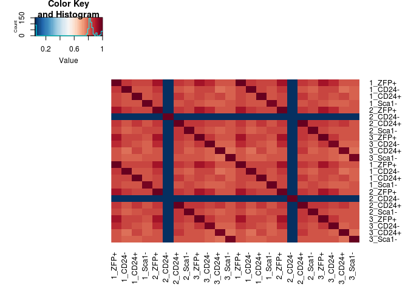

``` r
#Correlation between tech replicates super high. Pool the reads from the technical replicates.
ambrosiMat <- ambrosiMat[,1:12]+ambrosiMat[,13:24]
#Get rid of failed sample
ambrosiMat <- ambrosiMat[,-which(colnames(ambrosiMat)=="2_CD24-")]
ambrosiMatNorm <-  median.normalize(ambrosiMat[rowMaxs(ambrosiMat)>2,])
condits <- sapply(strsplit(colnames(ambrosiMat),"_"),function(x)x[2])
ambrosiMat <- ambrosiMat[,order(condits)]
ambrosiMatNorm <- ambrosiMatNorm[,order(condits)]
condits <- sort(condits)
condits <- gsub("\\+","plus",condits)
condits <- gsub("\\-","minus",condits)
```

Now we have normalized counts in "ambrosiMatNorm", the conditions in "condits", and the unnormalized counts for differential expression in "ambrosiMat."

``` r
head(ambrosiMat)
```

    ##               1_CD24- 3_CD24- 1_CD24+ 2_CD24+ 3_CD24+ 1_Sca1- 2_Sca1-
    ## 0610009B22Rik     168     291     240     499     360     174     347
    ## 0610009O20Rik     499     784    1293     467    1054     575     663
    ## 0610010F05Rik       0     376       7     130       0     282     207
    ## 0610010K14Rik     688     113     270     553     225     170      95
    ## 0610012G03Rik      12      27      77      38      22      69       2
    ## 0610030E20Rik     177      83      55       4     565      34     872
    ##               3_Sca1- 1_ZFP+ 2_ZFP+ 3_ZFP+
    ## 0610009B22Rik     301    441    436    562
    ## 0610009O20Rik     219    520    982    744
    ## 0610010F05Rik     105    211     11      6
    ## 0610010K14Rik     147    590    956    441
    ## 0610012G03Rik       0     64     71     27
    ## 0610030E20Rik      17    367    387    434

``` r
head(ambrosiMatNorm)
```

    ##                 1_CD24-  3_CD24-     1_CD24+    2_CD24+   3_CD24+
    ## 0610009B22Rik 155.75224 351.9009  213.711565 397.571556  346.1890
    ## 0610009O20Rik 462.62122 948.0767 1151.371055 372.075985 1013.5645
    ## 0610010F05Rik   0.00000 454.6898    6.233254 103.575756    0.0000
    ## 0610010K14Rik 637.84249 136.6488  240.425510 440.595332  216.3681
    ## 0610012G03Rik  11.12516  32.6506   68.565794  30.275990   21.1560
    ## 0610030E20Rik 164.09611 100.3704   48.975567   3.186946  543.3244
    ##                 1_Sca1-    2_Sca1-   3_Sca1-    1_ZFP+     2_ZFP+
    ## 0610009B22Rik 236.77779 329.973453 392.32423 304.28535 296.780898
    ## 0610009O20Rik 782.45532 630.468010 285.44520 358.79451 668.437711
    ## 0610010F05Rik 383.74331 196.842953 136.85729 145.58777   7.487591
    ## 0610010K14Rik 231.33462  90.338553 191.60020 407.09377 650.739768
    ## 0610012G03Rik  93.89464   1.901864   0.00000  44.15932  48.328999
    ## 0610030E20Rik  46.26692 829.212827  22.15785 253.22613 263.427082
    ##                   3_ZFP+
    ## 0610009B22Rik 428.225695
    ## 0610009O20Rik 566.903767
    ## 0610010F05Rik   4.571805
    ## 0610010K14Rik 336.027636
    ## 0610012G03Rik  20.573121
    ## 0610030E20Rik 330.693864

``` r
print(condits)
```

    ##  [1] "CD24minus" "CD24minus" "CD24plus"  "CD24plus"  "CD24plus" 
    ##  [6] "Sca1minus" "Sca1minus" "Sca1minus" "ZFPplus"   "ZFPplus"  
    ## [11] "ZFPplus"

``` r
barplot(ambrosiMatNorm["Esr1",],las=2,main="Esr1")
```

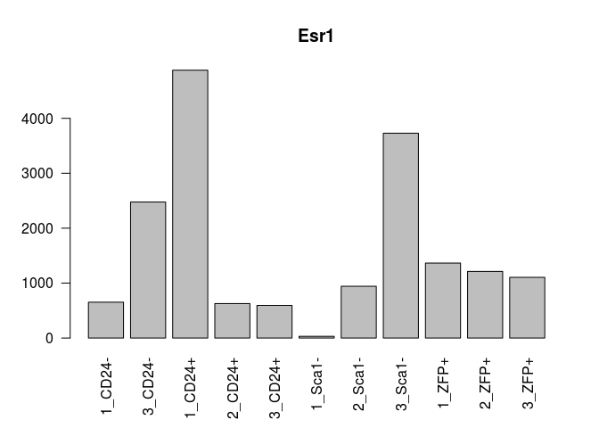

``` r
barplot(ambrosiMatNorm["Esr2",],las=2,main="Esr2")
```

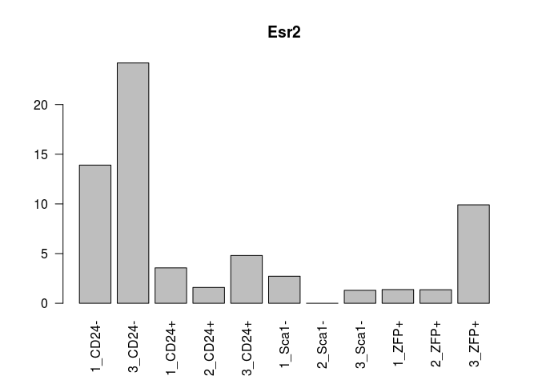

``` r
barplot(ambrosiMatNorm["Gper1",],las=2,main="Gper1")
```

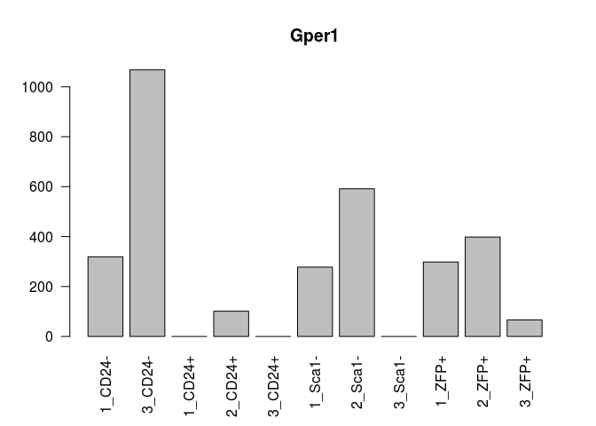

Let's redo the Principal component analysis (or singular value decomposition, svd) to check against figure 5 of the paper.

``` r
ambrosiCLN <- round.log(ambrosiMatNorm+1,2)
ambrosiCLN <- ambrosiCLN[rowSds(ambrosiCLN)>1,]
svAmbrosi <- svd((ambrosiCLN-rowMeans(ambrosiCLN))/rowSds(ambrosiCLN))

std.heatmap(cor(ambrosiMatNorm,method = "pea"))
```

    ## Warning in heatmap.2(M, Rowv = F, Colv = F, trace = "none", col = cols, :
    ## Discrepancy: Rowv is FALSE, while dendrogram is `both'. Omitting row
    ## dendogram.

    ## Warning in heatmap.2(M, Rowv = F, Colv = F, trace = "none", col = cols, :
    ## Discrepancy: Colv is FALSE, while dendrogram is `column'. Omitting column
    ## dendogram.

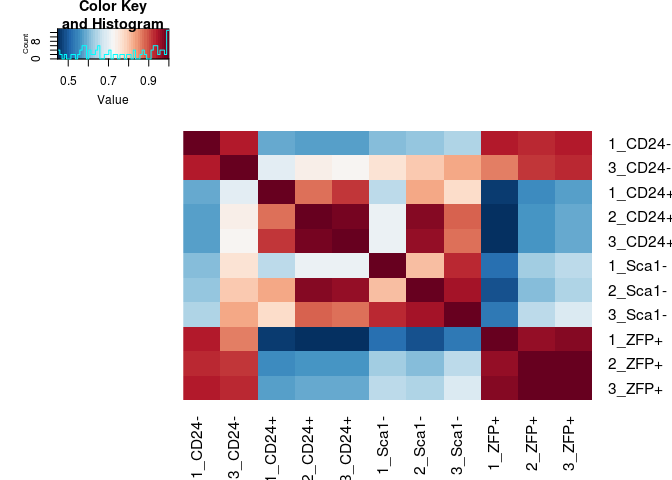

``` r
conditNums <- sapply(condits,function(x)which(x==sort(unique(condits))))
#Sca1minus is osteo, ZFP (mature) and CD24- (less mature) are adipocytes, cd24+ is multipotent
plot(svAmbrosi$v[,1:2],col=conditNums,xlab="PC1",ylab="PC2")
legend("bottomright",legend = unique(names(conditNums)),col=1:4,fill = 1:4)
```

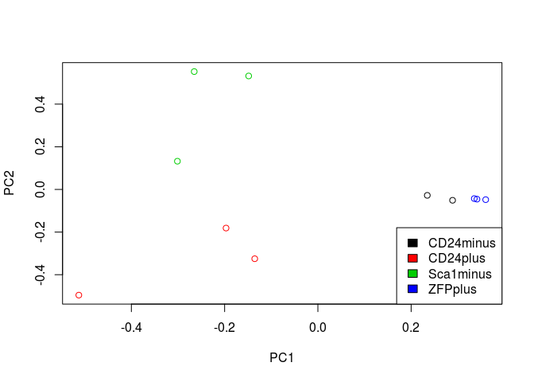

``` r
eaciout <- list()
l <- 1
eacivector <- svAmbrosi$u[,l]
names(eacivector) <- rownames(ambrosiCLN)
eaciout[[l]] <- eacitest(eacivector,"org.Mm.eg","SYMBOL",sets = "GO")$setscores
```

    ## Loading necessary libraries...

    ## Loaded Package org.Mm.eg.db

    ## Converting annotations to data.frames ...

    ## iteration 1 done; time  9.2 sec 
    ## iteration 2 done; time  6.24 sec 
    ## iteration 3 done; time  7.35 sec 
    ## iteration 4 done; time  6.25 sec 
    ## iteration 5 done; time  6.03 sec 
    ## iteration 6 done; time  7.25 sec 
    ## iteration 7 done; time  8.25 sec 
    ## iteration 8 done; time  7.21 sec 
    ## iteration 9 done; time  8.52 sec 
    ## iteration 10 done; time  6.1 sec

    ## Labeling output ...

    ## Loaded Package GO.db

``` r
l <- 2
eacivector <- svAmbrosi$u[,l]
names(eacivector) <- rownames(ambrosiCLN)
eaciout[[l]] <- eacitest(eacivector,"org.Mm.eg","SYMBOL",sets = "GO")$setscores
```

    ## Loading necessary libraries...

    ## Loaded Package org.Mm.eg.db

    ## Converting annotations to data.frames ...

    ## iteration 1 done; time  6.52 sec 
    ## iteration 2 done; time  7.11 sec 
    ## iteration 3 done; time  6.77 sec 
    ## iteration 4 done; time  7.34 sec 
    ## iteration 5 done; time  7.25 sec 
    ## iteration 6 done; time  7.36 sec 
    ## iteration 7 done; time  6.57 sec 
    ## iteration 8 done; time  6.14 sec 
    ## iteration 9 done; time  7.21 sec 
    ## iteration 10 done; time  7.26 sec

    ## Labeling output ...

    ## Loaded Package GO.db

So that reiterates the Ambrosi analysis. Now let's look at the continuous GO enrichment in the genes that contribute to PC1 (separates the osteocyte and progenitors from adipocytes)

``` r
#Positive
a <- eaciout[[1]][eaciout[[1]]$set.mean>0,]
print(a[1:25,])
```

    ##                                                               Term
    ## GO:1904181          positive regulation of membrane depolarization
    ## GO:0010935            regulation of macrophage cytokine production
    ## GO:0035455                            response to interferon-alpha
    ## GO:0035641                         locomotory exploration behavior
    ## GO:0070006                          metalloaminopeptidase activity
    ## GO:0097440                                         apical dendrite
    ## GO:0005161         platelet-derived growth factor receptor binding
    ## GO:0043034                                               costamere
    ## GO:0030742                           GTP-dependent protein binding
    ## GO:0051497            negative regulation of stress fiber assembly
    ## GO:0038191                                      neuropilin binding
    ## GO:0043649                     dicarboxylic acid catabolic process
    ## GO:0034312                               diol biosynthetic process
    ## GO:0060716             labyrinthine layer blood vessel development
    ## GO:0052744 phosphatidylinositol monophosphate phosphatase activity
    ## GO:0097320                              plasma membrane tubulation
    ## GO:2001212                            regulation of vasculogenesis
    ## GO:0051654             establishment of mitochondrion localization
    ## GO:0000062                                  fatty-acyl-CoA binding
    ## GO:0042581                                        specific granule
    ## GO:1990126       retrograde transport, endosome to plasma membrane
    ## GO:0004602                         glutathione peroxidase activity
    ## GO:0031579                              membrane raft organization
    ## GO:0070742                         C2H2 zinc finger domain binding
    ## GO:0030574                              collagen catabolic process
    ##            Ontology    set.mean      set.sd set.size         pval
    ## GO:1904181       BP 0.009540787 0.007417680       11 0.000000e+00
    ## GO:0010935       BP 0.008475386 0.004506944       10 0.000000e+00
    ## GO:0035455       BP 0.008179649 0.004484593       16 0.000000e+00
    ## GO:0035641       BP 0.008100013 0.003036715       12 0.000000e+00
    ## GO:0070006       MF 0.008029393 0.003411502        9 0.000000e+00
    ## GO:0097440       CC 0.007949549 0.007752464       16 0.000000e+00
    ## GO:0005161       MF 0.007456639 0.004110238       10 0.000000e+00
    ## GO:0043034       CC 0.007389192 0.003687449       12 0.000000e+00
    ## GO:0030742       MF 0.007069072 0.005912372       16 8.881784e-16
    ## GO:0051497       BP 0.006992098 0.004851236       19 1.776357e-15
    ## GO:0038191       MF 0.006893799 0.009470836       11 4.218847e-15
    ## GO:0043649       BP 0.006881281 0.004254370        9 4.884981e-15
    ## GO:0034312       BP 0.006841511 0.007135685       10 6.883383e-15
    ## GO:0060716       BP 0.006819999 0.003310984       13 8.437695e-15
    ## GO:0052744       MF 0.006663684 0.003078559        9 3.352874e-14
    ## GO:0097320       BP 0.006592918 0.004659027       11 6.239453e-14
    ## GO:2001212       BP 0.006488661 0.007587465       11 1.534328e-13
    ## GO:0051654       BP 0.006345124 0.003899079       10 5.182521e-13
    ## GO:0000062       MF 0.006270325 0.003657101       10 9.672263e-13
    ## GO:0042581       CC 0.006249306 0.008390978       11 1.151079e-12
    ## GO:1990126       BP 0.006207893 0.004112114       10 1.619149e-12
    ## GO:0004602       MF 0.006167700 0.005206195        9 2.250200e-12
    ## GO:0031579       BP 0.006133647 0.006401470        9 2.968958e-12
    ## GO:0070742       MF 0.006083792 0.003113963       10 4.443113e-12
    ## GO:0030574       BP 0.005978991 0.003841013       10 1.026201e-11

``` r
#Negative
a <- eaciout[[1]][eaciout[[1]]$set.mean<0,]
print(a[1:25,])
```

    ##                                                                              Term
    ## GO:0003417                                     growth plate cartilage development
    ## GO:0042555                                                            MCM complex
    ## GO:0006271                      DNA strand elongation involved in DNA replication
    ## GO:0050699                                                      WW domain binding
    ## GO:1904666                        regulation of ubiquitin protein ligase activity
    ## GO:0003688                                         DNA replication origin binding
    ## GO:0000940                                 condensed chromosome outer kinetochore
    ## GO:0043142                          single-stranded DNA-dependent ATPase activity
    ## GO:0018279                          protein N-linked glycosylation via asparagine
    ## GO:0051084                            'de novo' posttranslational protein folding
    ## GO:0030206                               chondroitin sulfate biosynthetic process
    ## GO:0005381                            iron ion transmembrane transporter activity
    ## GO:0050911 detection of chemical stimulus involved in sensory perception of smell
    ## GO:0000800                                                        lateral element
    ## GO:0005861                                                       troponin complex
    ## GO:0000796                                                      condensin complex
    ## GO:0010369                                                           chromocenter
    ## GO:0061436                                          establishment of skin barrier
    ## GO:0006198                                                 cAMP catabolic process
    ## GO:0034501                                    protein localization to kinetochore
    ## GO:0005251                           delayed rectifier potassium channel activity
    ## GO:0004936                                     alpha-adrenergic receptor activity
    ## GO:0002076                                                 osteoblast development
    ## GO:0000788                                                     nuclear nucleosome
    ## GO:0030660                                      Golgi-associated vesicle membrane
    ##            Ontology     set.mean      set.sd set.size         pval
    ## GO:0003417       BP -0.007967512 0.006352869        9 8.584292e-20
    ## GO:0042555       CC -0.007117453 0.005453724        9 4.088892e-16
    ## GO:0006271       BP -0.006729894 0.003356418       10 1.428011e-14
    ## GO:0050699       MF -0.006396089 0.003498829       16 2.611191e-13
    ## GO:1904666       BP -0.005958809 0.006240366       10 9.474176e-12
    ## GO:0003688       MF -0.005547820 0.003035995       11 2.217455e-10
    ## GO:0000940       CC -0.005490464 0.004229837       12 3.384681e-10
    ## GO:0043142       MF -0.005382783 0.003040660       14 7.403315e-10
    ## GO:0018279       BP -0.005111796 0.003613892       15 4.971787e-09
    ## GO:0051084       BP -0.005036021 0.007144489        9 8.328118e-09
    ## GO:0030206       BP -0.004959965 0.006360453        7 1.387495e-08
    ## GO:0005381       MF -0.004840068 0.005395183        7 3.056610e-08
    ## GO:0050911       BP -0.004585086 0.002184751       13 1.543337e-07
    ## GO:0000800       CC -0.004517803 0.006280772       14 2.333871e-07
    ## GO:0005861       CC -0.004391017 0.004463366        7 5.009579e-07
    ## GO:0000796       CC -0.004283040 0.004002026        7 9.448995e-07
    ## GO:0010369       CC -0.004168870 0.002691569       10 1.819085e-06
    ## GO:0061436       BP -0.004163811 0.003091336       15 1.871943e-06
    ## GO:0006198       BP -0.004158412 0.003669916       11 1.929993e-06
    ## GO:0034501       BP -0.004122025 0.002529116       17 2.368724e-06
    ## GO:0005251       MF -0.003957793 0.004980709       11 5.848861e-06
    ## GO:0004936       MF -0.003871622 0.004216625        4 9.272037e-06
    ## GO:0002076       BP -0.003861260 0.006792761       10 9.794147e-06
    ## GO:0000788       CC -0.003679761 0.003527436       15 2.501785e-05
    ## GO:0030660       CC -0.003433781 0.002415805       17 8.352381e-05

Interesting... Now PC2 (separates osteocytes from progenitors)

``` r
#Positive
a <- eaciout[[2]][eaciout[[1]]$set.mean>0,]
print(a[1:25,])
```

    ##                                                                  Term
    ## GO:0000076                                 DNA replication checkpoint
    ## GO:0019825                                             oxygen binding
    ## GO:0042168                                     heme metabolic process
    ## GO:0048845                          venous blood vessel morphogenesis
    ## GO:0042608                                    T cell receptor binding
    ## GO:0004745                             retinol dehydrogenase activity
    ## GO:0005779                 integral component of peroxisomal membrane
    ## GO:0070402                                              NADPH binding
    ## GO:0016755       transferase activity, transferring amino-acyl groups
    ## GO:0045948            positive regulation of translational initiation
    ## GO:0035641                            locomotory exploration behavior
    ## GO:0030687                       preribosome, large subunit precursor
    ## GO:0035859                                    Seh1-associated complex
    ## GO:0032823          regulation of natural killer cell differentiation
    ## GO:0006677                         glycosylceramide metabolic process
    ## GO:0090502        RNA phosphodiester bond hydrolysis, endonucleolytic
    ## GO:0052744    phosphatidylinositol monophosphate phosphatase activity
    ## GO:0000940                     condensed chromosome outer kinetochore
    ## GO:0048821                                    erythrocyte development
    ## GO:0008356                                   asymmetric cell division
    ## GO:0007076                            mitotic chromosome condensation
    ## GO:0002098                           tRNA wobble uridine modification
    ## GO:0009931 calcium-dependent protein serine/threonine kinase activity
    ## GO:0072576                                        liver morphogenesis
    ## GO:0007214                  gamma-aminobutyric acid signaling pathway
    ##            Ontology     set.mean      set.sd set.size         pval
    ## GO:0000076       BP  0.009615196 0.005016409       10 0.000000e+00
    ## GO:0019825       MF  0.008360877 0.004446153       13 0.000000e+00
    ## GO:0042168       BP  0.007882931 0.009897122       14 0.000000e+00
    ## GO:0048845       BP -0.007359190 0.003754399       10 2.243250e-20
    ## GO:0042608       MF -0.007310068 0.002537374       12 3.991114e-20
    ## GO:0004745       MF -0.006907912 0.004696231       10 3.871873e-18
    ## GO:0005779       CC -0.006847480 0.003861627       11 7.533488e-18
    ## GO:0070402       MF -0.006843770 0.003351163       11 7.846286e-18
    ## GO:0016755       MF -0.006580065 0.006133792       13 1.337918e-16
    ## GO:0045948       BP -0.006498461 0.006216034       12 3.148132e-16
    ## GO:0035641       BP  0.006407021 0.002836283       12 6.661338e-16
    ## GO:0030687       CC -0.006353456 0.002878246       13 1.403682e-15
    ## GO:0035859       CC -0.006059734 0.007981162       11 2.622416e-14
    ## GO:0032823       BP -0.006027126 0.006984531       12 3.599602e-14
    ## GO:0006677       BP -0.006010684 0.005911558       11 4.220274e-14
    ## GO:0090502       BP -0.005770300 0.004635664       12 4.116323e-13
    ## GO:0052744       MF  0.005673013 0.003687309        9 9.268142e-13
    ## GO:0000940       CC  0.005521746 0.004888167       12 3.635092e-12
    ## GO:0048821       BP  0.005447644 0.010238490       21 7.008172e-12
    ## GO:0008356       BP -0.005232414 0.004714601       11 4.859928e-11
    ## GO:0007076       BP  0.005226645 0.005956587        9 4.719292e-11
    ## GO:0002098       BP  0.005148514 0.003893779        9 9.095724e-11
    ## GO:0009931       MF -0.005099047 0.006776889        8 1.479980e-10
    ## GO:0072576       BP  0.005012840 0.006779259       10 2.779141e-10
    ## GO:0007214       BP -0.004960674 0.002687077       12 4.564537e-10

``` r
#Negative
a <- eaciout[[2]][eaciout[[1]]$set.mean<0,]
print(a[1:25,])
```

    ##                                                                                     Term
    ## GO:0042555                                                                   MCM complex
    ## GO:0043034                                                                     costamere
    ## GO:0048875                                          chemical homeostasis within a tissue
    ## GO:0060004                                                                        reflex
    ## GO:0043142                                 single-stranded DNA-dependent ATPase activity
    ## GO:0051443                 positive regulation of ubiquitin-protein transferase activity
    ## GO:0007064                                             mitotic sister chromatid cohesion
    ## GO:0016922                                     ligand-dependent nuclear receptor binding
    ## GO:0000062                                                        fatty-acyl-CoA binding
    ## GO:0004143                                                diacylglycerol kinase activity
    ## GO:0004467                                     long-chain fatty acid-CoA ligase activity
    ## GO:0046966                                              thyroid hormone receptor binding
    ## GO:0042790 transcription of nuclear large rRNA transcript from RNA polymerase I promoter
    ## GO:0042588                                                               zymogen granule
    ## GO:1903077                negative regulation of protein localization to plasma membrane
    ## GO:0006335                                 DNA replication-dependent nucleosome assembly
    ## GO:0034723                             DNA replication-dependent nucleosome organization
    ## GO:0043240                                               Fanconi anaemia nuclear complex
    ## GO:0000413                                         protein peptidyl-prolyl isomerization
    ## GO:0043687                                       post-translational protein modification
    ## GO:2000369                                  regulation of clathrin-dependent endocytosis
    ## GO:0034219                                          carbohydrate transmembrane transport
    ## GO:0032793                     positive regulation of CREB transcription factor activity
    ## GO:0052646                                           alditol phosphate metabolic process
    ## GO:0042407                                                             cristae formation
    ##            Ontology     set.mean      set.sd set.size         pval
    ## GO:0042555       CC  0.007180768 0.005252514        9 0.000000e+00
    ## GO:0043034       CC  0.006840889 0.003487247       12 0.000000e+00
    ## GO:0048875       BP -0.006012858 0.006183006       11 4.132506e-14
    ## GO:0060004       BP  0.005626890 0.003281712       14 1.411316e-12
    ## GO:0043142       MF  0.004847823 0.002419726       14 1.040463e-09
    ## GO:0051443       BP -0.004570007 0.002927050       17 9.354615e-09
    ## GO:0007064       BP  0.004542517 0.004914272       13 1.071005e-08
    ## GO:0016922       MF -0.004509303 0.003186444       11 1.464394e-08
    ## GO:0000062       MF -0.004312339 0.002103698       10 6.028410e-08
    ## GO:0004143       MF -0.004255370 0.005066818        9 8.976804e-08
    ## GO:0004467       MF -0.004123597 0.006990212        8 2.212090e-07
    ## GO:0046966       MF -0.004063852 0.006689654       12 3.300501e-07
    ## GO:0042790       BP -0.004007188 0.008877302       11 4.799525e-07
    ## GO:0042588       CC  0.003986197 0.002123809       12 5.183815e-07
    ## GO:1903077       BP -0.003850028 0.002443080       11 1.321499e-06
    ## GO:0006335       BP  0.003704615 0.003428725       17 3.082776e-06
    ## GO:0034723       BP  0.003704615 0.003428725       17 3.082776e-06
    ## GO:0043240       CC  0.003704036 0.006547982       12 3.093717e-06
    ## GO:0000413       BP -0.003703515 0.004599179       11 3.283828e-06
    ## GO:0043687       BP -0.003677610 0.003810090       18 3.844129e-06
    ## GO:2000369       BP  0.003615209 0.002418128       13 5.294221e-06
    ## GO:0034219       BP -0.003456942 0.001825648       10 1.411297e-05
    ## GO:0032793       BP -0.003433720 0.005966559       10 1.611353e-05
    ## GO:0052646       BP -0.003228119 0.003180319        7 5.028510e-05
    ## GO:0042407       BP  0.003112112 0.006278929       10 8.854322e-05

Sweet.

Time for some differential expression

``` r
cond <- as.factor(condits)
colnames(ambrosiMat) <- make.names(condits,unique = T)
dds <- DESeqDataSetFromMatrix(ambrosiMat,colData = DataFrame(cond),design = formula(~cond+0))
DESeqOutput <-  DESeq(dds)
```

    ## estimating size factors

    ## estimating dispersions

    ## gene-wise dispersion estimates

    ## mean-dispersion relationship

    ## final dispersion estimates

    ## fitting model and testing

``` r
resultsNames(DESeqOutput)
```

    ## [1] "condCD24minus" "condCD24plus"  "condSca1minus" "condZFPplus"

``` r
resList <-  list(results(DESeqOutput,contrast = c(1,-1/3,-1/3,-1/3 ),cooksCutoff=T),results(DESeqOutput,contrast = c(-1/3,1,-1/3,-1/3 ),cooksCutoff=T),results(DESeqOutput,contrast = c(-1/3,-1/3,1,-1/3 ),cooksCutoff=T),results(DESeqOutput,contrast = c(-1/3,-1/3,-1/3 ,1),cooksCutoff=T))

ambrosiUpDown <-lapply(resList,function(res){
  res <- res[!is.na(res$padj),]
  list(rownames(res[res$padj<.1&res$log2FoldChange>0,]),rownames(res[res$padj<.1&res$log2FoldChange<0,]))
})

print(str(ambrosiUpDown))
```

    ## List of 4
    ##  $ :List of 2
    ##   ..$ : chr [1:429] "1700066M21Rik" "5430403G16Rik" "6430548M08Rik" "8430408G22Rik" ...
    ##   ..$ : chr [1:613] "1110008L16Rik" "1700047I17Rik2" "1810041L15Rik" "2610008E11Rik" ...
    ##  $ :List of 2
    ##   ..$ : chr [1:899] "1190002N15Rik" "1700028J19Rik" "1700047I17Rik2" "1810013L24Rik" ...
    ##   ..$ : chr [1:806] "1700019D03Rik" "2200002D01Rik" "2310009B15Rik" "2310061I04Rik" ...
    ##  $ :List of 2
    ##   ..$ : chr [1:910] "1500015O10Rik" "1700008O03Rik" "1700047I17Rik2" "1810041L15Rik" ...
    ##   ..$ : chr [1:857] "0610040J01Rik" "1700029J07Rik" "1810043G02Rik" "2510039O18Rik" ...
    ##  $ :List of 2
    ##   ..$ : chr [1:689] "1700084J12Rik" "2200002D01Rik" "2810021J22Rik" "3830406C13Rik" ...
    ##   ..$ : chr [1:755] "1500015O10Rik" "1700028J19Rik" "1700047I17Rik2" "1700066M21Rik" ...
    ## NULL

So there's a bunch of genes differentially expressed up or down for each cell type compared to all the others.

``` r
for(i in 1:length(resList)){
  print(resultsNames(DESeqOutput)[i])
  res <- resList[[i]]
  res <- res[!is.na(res$padj),]
  res <- res[res$padj<.1&res$log2FoldChange>0,]
  std.heatmap(log(ambrosiMatNorm[rownames(res[order(res$padj,decreasing = F),])[1:25],]+1,2),main=paste(resultsNames(DESeqOutput)[i],"Up vs All"))
}
```

    ## [1] "condCD24minus"

    ## Warning in heatmap.2(M, Rowv = F, Colv = F, trace = "none", col = cols, :
    ## Discrepancy: Rowv is FALSE, while dendrogram is `both'. Omitting row
    ## dendogram.

    ## Warning in heatmap.2(M, Rowv = F, Colv = F, trace = "none", col = cols, :
    ## Discrepancy: Colv is FALSE, while dendrogram is `column'. Omitting column
    ## dendogram.

    ## [1] "condCD24plus"

    ## Warning in heatmap.2(M, Rowv = F, Colv = F, trace = "none", col = cols, :
    ## Discrepancy: Rowv is FALSE, while dendrogram is `both'. Omitting row
    ## dendogram.

    ## Warning in heatmap.2(M, Rowv = F, Colv = F, trace = "none", col = cols, :
    ## Discrepancy: Colv is FALSE, while dendrogram is `column'. Omitting column
    ## dendogram.

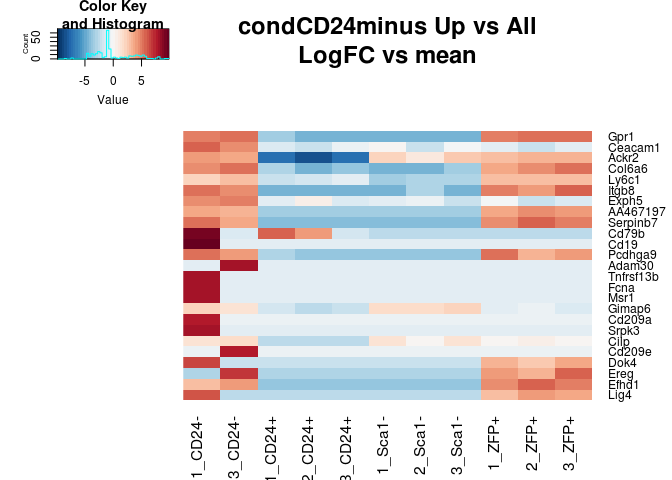

    ## [1] "condSca1minus"

    ## Warning in heatmap.2(M, Rowv = F, Colv = F, trace = "none", col = cols, :
    ## Discrepancy: Rowv is FALSE, while dendrogram is `both'. Omitting row
    ## dendogram.

    ## Warning in heatmap.2(M, Rowv = F, Colv = F, trace = "none", col = cols, :
    ## Discrepancy: Colv is FALSE, while dendrogram is `column'. Omitting column
    ## dendogram.

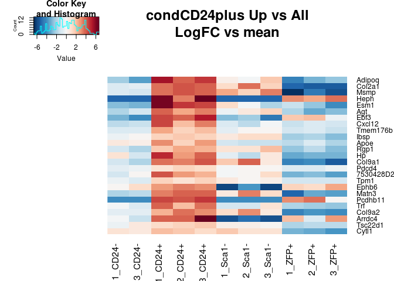

    ## [1] "condZFPplus"

    ## Warning in heatmap.2(M, Rowv = F, Colv = F, trace = "none", col = cols, :
    ## Discrepancy: Rowv is FALSE, while dendrogram is `both'. Omitting row
    ## dendogram.

    ## Warning in heatmap.2(M, Rowv = F, Colv = F, trace = "none", col = cols, :
    ## Discrepancy: Colv is FALSE, while dendrogram is `column'. Omitting column
    ## dendogram.

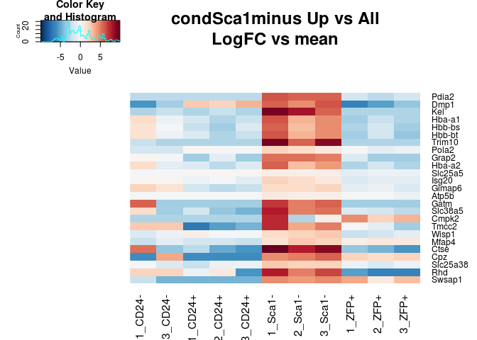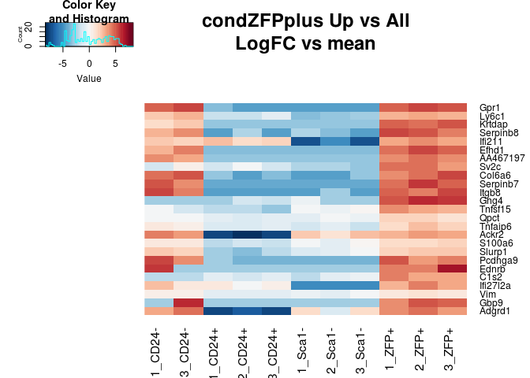

Candice's Data
--------------

The data for the Ingraham lab RNAseq was also passed to Salmon after fastqc and trimming with trimgalore.

``` r
datapath <- "~/code/IngrahamLabData/BoneSalmonOutputs/"
fileList <- dir(datapath)
fileList <- fileList[!grepl("Gene|pdf",fileList)]
dsList <- lapply(paste0(datapath,fileList),read.csv2, sep="\t",header=T,row.names=1,stringsAsFactors=F)
allRownames <- Reduce(union,lapply(dsList,rownames))

mart <- useMart(biomart = "ENSEMBL_MART_ENSEMBL", dataset = "mmusculus_gene_ensembl", host="www.ensembl.org")
rnSymbol <- getBM(attributes = c("ensembl_transcript_id_version","mgi_symbol"),filters = c("ensembl_transcript_id_version"),values =allRownames ,mart = mart) 
rnSymbolGenes <- rnSymbol[rnSymbol$mgi_symbol!="",]

dsAgList <-  lapply(dsList,function(x){
  rnsgs <-  rnSymbolGenes[rnSymbolGenes$ensembl_transcript_id_version %in% rownames(x),]
  x <- x[rnsgs$ensembl_transcript_id_version,]
  ret <- aggregate(as.integer(x$NumReads), by=list(rnsgs$mgi_symbol),sum)
  rownames(ret) <- ret[,1]
  ret[,-1,drop=F]
})
sampleNames <- c("1807_BM_fl_A1","1810_BM_KO_E1","1811_BM_KO_G1","1815_BM_fl_B1","1818_BM_fl_C1","1825_BM_KO_F1","1984_BM_fl_D1","1985_BM_KO_H1")
SampleNameMat <- sapply(strsplit(sampleNames,"_"),function(i)i)
boneMat <-  as.matrix(Reduce(rn.merge,dsAgList))
colnames(boneMat) <- paste(SampleNameMat[3,],gsub("[[:digit:]]","",SampleNameMat[4,]),sep = "_")
boneMatNorm <-  median.normalize(boneMat)
boneMatNorm <- boneMatNorm[,order(colnames(boneMatNorm))]
heatmap.2(cor(boneMatNorm,method = "spe"),col=cols,trace="none")
```

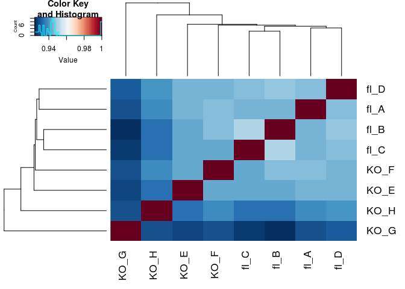

``` r
std.heatmap(cor(rn.merge(boneMatNorm,ambrosiMatNorm),method = "spe"),main="Sets vs Each Other")
```

    ## Warning in heatmap.2(M, Rowv = F, Colv = F, trace = "none", col = cols, :
    ## Discrepancy: Rowv is FALSE, while dendrogram is `both'. Omitting row
    ## dendogram.

    ## Warning in heatmap.2(M, Rowv = F, Colv = F, trace = "none", col = cols, :
    ## Discrepancy: Colv is FALSE, while dendrogram is `column'. Omitting column
    ## dendogram.

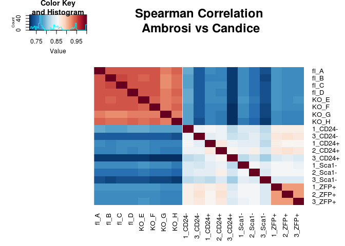

``` r
cond <- as.factor(SampleNameMat[3,])
dds <- DESeqDataSetFromMatrix(boneMat,colData = DataFrame(cond),design = ~cond)
DESeqOutput <-  DESeq(dds)
```

    ## estimating size factors

    ## estimating dispersions

    ## gene-wise dispersion estimates

    ## mean-dispersion relationship

    ## final dispersion estimates

    ## fitting model and testing

``` r
res <-  results(DESeqOutput)
res <- res[!is.na(res$padj),]
res <- res[res$log2FoldChange<0,]
std.heatmap(log(boneMatNorm[rownames(res[order(res$pvalue,decreasing = F),])[1:25],]+1,2),main="Most significant DE genes\ndown in KO\nlog2(normalized counts + 1)")
```

    ## Warning in heatmap.2(M, Rowv = F, Colv = F, trace = "none", col = cols, :
    ## Discrepancy: Rowv is FALSE, while dendrogram is `both'. Omitting row
    ## dendogram.

    ## Warning in heatmap.2(M, Rowv = F, Colv = F, trace = "none", col = cols, :
    ## Discrepancy: Colv is FALSE, while dendrogram is `column'. Omitting column
    ## dendogram.

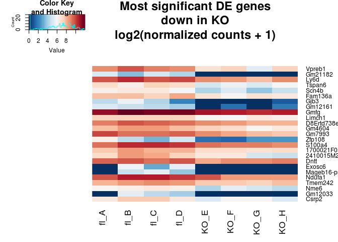

``` r
res <-  results(DESeqOutput)
res <- res[!is.na(res$padj),]
boneUpDown <- list(rownames(res[res$padj<.1&res$log2FoldChange>0,]),rownames(res[res$padj<.1&res$log2FoldChange<0,]))
res <- res[res$log2FoldChange>0,]
std.heatmap(log(boneMatNorm[rownames(res[order(res$pvalue,decreasing = F),])[1:25],]+1,2),main="Most significant DE genes\nup in KO\nlog2(normalized counts + 1)")
```

    ## Warning in heatmap.2(M, Rowv = F, Colv = F, trace = "none", col = cols, :
    ## Discrepancy: Rowv is FALSE, while dendrogram is `both'. Omitting row
    ## dendogram.

    ## Warning in heatmap.2(M, Rowv = F, Colv = F, trace = "none", col = cols, :
    ## Discrepancy: Colv is FALSE, while dendrogram is `column'. Omitting column
    ## dendogram.

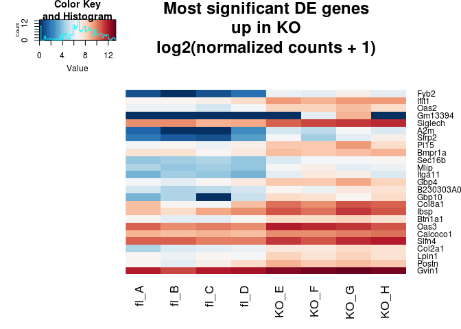

``` r
res <-  results(DESeqOutput)
res <- res[!is.na(res$padj),]

#ESR1 not differentially expressed
barplot((boneMatNorm["Esr1",]),main="ESR1")
```

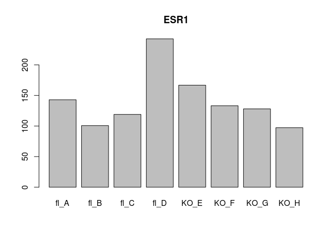

``` r
hist(res$log2FoldChange)
```

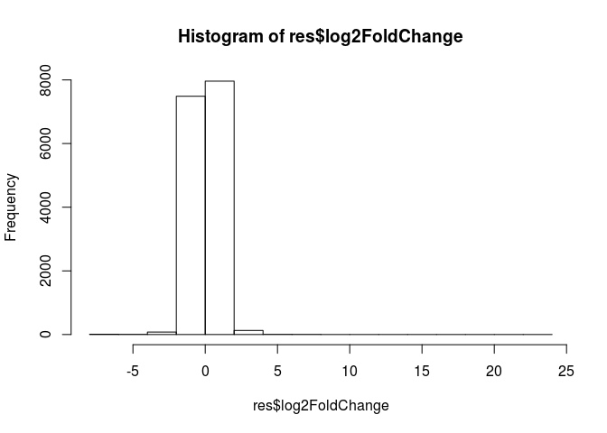

``` r
plot(res$log2FoldChange,-log(res$padj),ylab="-logPadj",xlab="logFC")
```

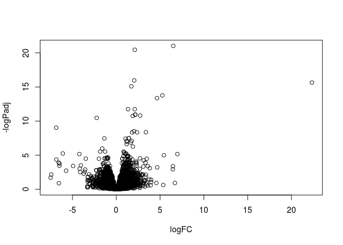

``` r
eG <- enrichGO(rownames(res[res$padj<.1,]),OrgDb ='org.Mm.eg.db',keyType = "SYMBOL",ont = "BP")
dfGO <- as.data.frame(eG)
ifnGenes <- Reduce(union,strsplit(dfGO[which(grepl(pattern = "defense|interferon",dfGO[,2])),"geneID"],"/"))
repairGenes <- Reduce(union,strsplit(dfGO[which(grepl(pattern = "pyrimidine|repair",dfGO[,2])),"geneID"],"/"))
bmpGenes <- Reduce(union,strsplit(dfGO[which(grepl(pattern = "ossi|osteoblast|collagen",dfGO[,2])),"geneID"],"/"))

std.heatmap(log(boneMatNorm[ifnGenes,]+1,2),main="IFN response\nLog2(normalized counts+1)")
```

    ## Warning in heatmap.2(M, Rowv = F, Colv = F, trace = "none", col = cols, :
    ## Discrepancy: Rowv is FALSE, while dendrogram is `both'. Omitting row
    ## dendogram.

    ## Warning in heatmap.2(M, Rowv = F, Colv = F, trace = "none", col = cols, :
    ## Discrepancy: Colv is FALSE, while dendrogram is `column'. Omitting column
    ## dendogram.

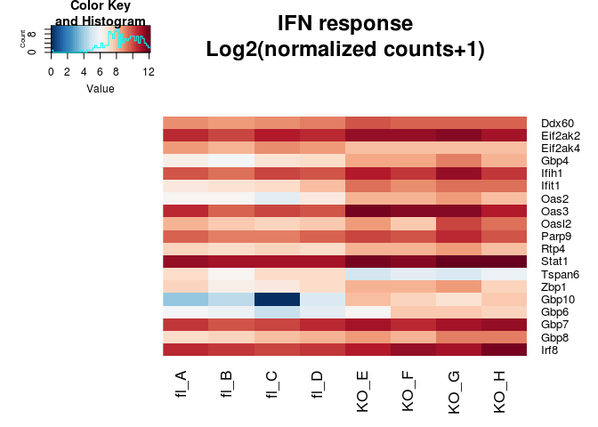

``` r
std.heatmap(log(boneMatNorm[repairGenes,]+1,2),main="DNA synth/repair\nLog2(normalized counts+1)")
```

    ## Warning in heatmap.2(M, Rowv = F, Colv = F, trace = "none", col = cols, :
    ## Discrepancy: Rowv is FALSE, while dendrogram is `both'. Omitting row
    ## dendogram.

    ## Warning in heatmap.2(M, Rowv = F, Colv = F, trace = "none", col = cols, :
    ## Discrepancy: Colv is FALSE, while dendrogram is `column'. Omitting column
    ## dendogram.

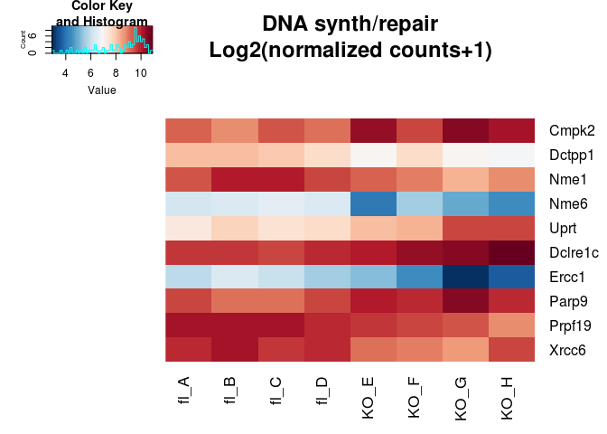

``` r
std.heatmap(log(boneMatNorm[bmpGenes,]+1,2),main="BMP Related\nLog2(normalized counts+1)")
```

    ## Warning in heatmap.2(M, Rowv = F, Colv = F, trace = "none", col = cols, :
    ## Discrepancy: Rowv is FALSE, while dendrogram is `both'. Omitting row
    ## dendogram.

    ## Warning in heatmap.2(M, Rowv = F, Colv = F, trace = "none", col = cols, :
    ## Discrepancy: Colv is FALSE, while dendrogram is `column'. Omitting column
    ## dendogram.

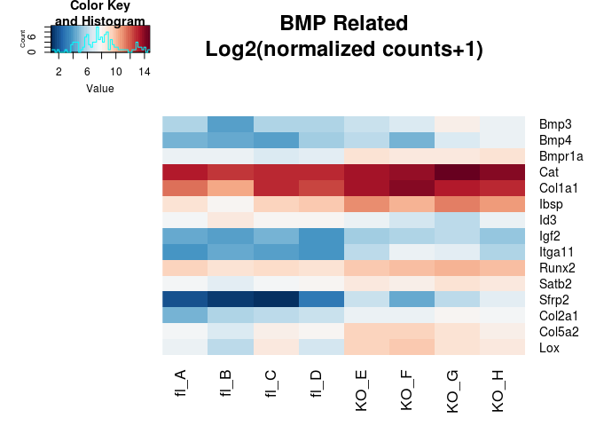

Overlap
-------

So what overlaps in the up/down for each sorted cell type and the KO vs fl data?

Note: Sca1minus is osteo, ZFP (mature) and CD24- (less mature) are adipocytes, cd24+ is multipotent progenitor

``` r
overlaps <- lapply(1:2,function(u){
  a <- sapply(ambrosiUpDown,function(x){
    c("up"=sum(boneUpDown[[u]]%in%x[[1]]), "down"=sum(boneUpDown[[u]]%in%x[[2]]))
  })
  colnames(a) <- sort(unique(sapply(strsplit(colnames(ambrosiMatNorm),"_"),function(x)x[2])))
  a
})
#Up in KO
print(overlaps[[1]])
```

    ##      CD24- CD24+ Sca1- ZFP+
    ## up       8    17    19    9
    ## down     5    18    11   17

``` r
#Down in KO
print(overlaps[[2]])
```

    ##      CD24- CD24+ Sca1- ZFP+
    ## up       2    10     2    6
    ## down     3     3     3    2

Not much.
