BoneNotebook
================
Matthew Schmitz
March 12, 2018

This is an analysis for Candice where we're going to compare the RNAseq data she has to the seq data from the Ambrosi et al data.

Ambrosi et al. Data Analysis
============================

This data was taken from ENA with accession number ERP013883 (<http://> www.ebi.ac.uk/ena). Following quality control, reads were quantified using Salmon.

First I'll load the libraries and functions I'll need for the analysis (skip this part).

``` r
library(DESeq2)
library(EBSeq)
library(matrixStats)
library(biomaRt)
library(gplots)
library(clusterProfiler)
library(RColorBrewer)
library(tximport)
cols <-  colorRampPalette(rev(brewer.pal(11,"RdBu")))(50)

#see Github lengning
library(EACI)


median.normalize <- function(x){
  GetNormalizedMat(x,MedianNorm(x))
}

round.log <- function(s,base=2){
  round(log(s+1, base),digits = 1)
}

std.heatmap <- function(M,...){
  heatmap.2(M,Rowv = F,Colv = F,trace="none",col = cols,...)
}

rn.merge <- function(x,y,fill=0,simple.intersect=F){
  rn <- intersect(rownames(x),rownames(y))
  zerosx <- setdiff(rownames(x),rownames(y))
  zerosy <- setdiff(rownames(y),rownames(x))
  out <- cbind(x[rn,,drop=F],y[rn,,drop=F])
  if(simple.intersect){return(out)}
  else{
  if(length(zerosx)!=1  &length(zerosy)!=1){
    zx <- matrix(fill, nrow=length(zerosx), ncol =ncol(y), dimnames = list(zerosx,NULL))
    zy <- matrix(fill, nrow=length(zerosy), ncol =ncol(x), dimnames = list(zerosy,NULL))
    zx <- cbind(x[zerosx,],zx)
    zy <- cbind(zy,y[zerosy,])
  }else if(length(zerosx)==1){
    zx <- rep(fill, ncol(y))
    zy <- matrix(fill, nrow=length(zerosy), ncol =ncol(x), dimnames = list(zerosy,NULL))
    zx <- c(x[zerosx,],zx)
    zy <- cbind(zy,y[zerosy,])
  }else if(length(zerosy)==1){
    zx <- matrix(fill, nrow=length(zerosx), ncol =ncol(y), dimnames = list(zerosx,NULL))
    zy <- rep(fill, ncol(x))
    print(zx)
    print(zy)
    zx <- cbind(x[zerosx,],zx)
    zy <- c(zy,y[zerosy,])
  }
  out <- rbind(out,rbind(zx,zy))
  return(out)}
}

cor.compare <- function(x,y,min=0, varX=NULL ,interest.set =NULL, ...){
  d <- rn.compare(x,y)
  x <- d[[1]]
  y <- d[[2]]
  i = intersect(rownames(x), rownames(y))
  i = i[rowMaxs(x[i,],na.rm = T)>=min | rowMaxs(y[i,],na.rm = )>=min]
  if(!is.null(interest.set)){
    i = interest.set[interest.set%in%i]
  }
  if(!is.null(varX)){
    i = i[order(rowMeans(cbind(rowSds(x[i,]), rowSds(y[i,]))),decreasing = T)]
    i = i[1:ifelse(varX>length(i),length(i),varX)]
  }
  print("Num Genes:")
  print(length(i))
  return(cor(as.matrix(x[i,]),as.matrix(y[i,]), ...))
}

rn.compare <- function(x,y,fill=0){
  rn <- as.character(intersect(rownames(x),rownames(y)))
  zerosx <- setdiff(rownames(x),rownames(y))
  zerosy <- setdiff(rownames(y),rownames(x))
  zx <- matrix(fill, nrow=length(zerosx), ncol =ncol(y), dimnames = list(zerosx,NULL))
  zy <- matrix(fill, nrow=length(zerosy), ncol =ncol(x), dimnames = list(zerosy,NULL))
  nx <- rbind(x,zy)
  ny <- rbind(y,zx)
  return(list(nx[rownames(ny),,drop=F],ny[rownames(nx),,drop=F]))
}
mypar <- function (a = 1, b = 1, brewer.n = 8, brewer.name = "Dark2", 
          cex.lab = 1, cex.main = 1.2, cex.axis = 1, mar = c(2.5, 2.5, 
                                                             1.6, 1.1), mgp = c(1.5, 0.5, 0), ...) 
{
  par(mar = mar, mgp = mgp, cex.lab = cex.lab, cex.main = cex.main, 
      cex.axis = cex.axis)
  par(mfrow = c(a, b), ...)
  palette(RColorBrewer::brewer.pal(brewer.n, brewer.name))
}
```

``` r
datapath <- "~/code/data/GEOData/seq/AmbrosiBone/out/"
fileList <- dir(datapath)
fileList <- paste0(datapath,"/",fileList,"/","quant.sf")

dsList <- lapply(fileList,read.csv2, sep="\t",header=T,row.names=1,stringsAsFactors=F)
allRownames <- Reduce(union,lapply(dsList,rownames))

#Use Biomart to get the 
mart <- useMart(biomart = "ENSEMBL_MART_ENSEMBL", dataset = "mmusculus_gene_ensembl", host="www.ensembl.org")
rnSymbol <- getBM(attributes = c("ensembl_transcript_id_version","mgi_symbol","description"),filters = c("ensembl_transcript_id_version"),values =allRownames ,mart = mart) 
rnSymbolGenes <- rnSymbol[rnSymbol$mgi_symbol!="",]
rnSymbolGenes <- rnSymbol[rnSymbol$mgi_symbol!=""& !grepl("predicted gene", rnSymbol$description),]

#Load the table from ENA with the names of each sample
sampleMat <- read.table(file = "~/code/data/GEOData/seq/AmbrosiBone/PRJEB12408.txt",sep="\t",header = T,stringsAsFactors = F)
print(sampleMat)
```

    ##    study_accession sample_accession secondary_sample_accession
    ## 1       PRJEB12408     SAMEA3724741                 ERS1031890
    ## 2       PRJEB12408     SAMEA3724742                 ERS1031891
    ## 3       PRJEB12408     SAMEA3724743                 ERS1031892
    ## 4       PRJEB12408     SAMEA3724744                 ERS1031893
    ## 5       PRJEB12408     SAMEA3724745                 ERS1031894
    ## 6       PRJEB12408     SAMEA3724746                 ERS1031895
    ## 7       PRJEB12408     SAMEA3724747                 ERS1031896
    ## 8       PRJEB12408     SAMEA3724748                 ERS1031897
    ## 9       PRJEB12408     SAMEA3724749                 ERS1031898
    ## 10      PRJEB12408     SAMEA3724750                 ERS1031899
    ## 11      PRJEB12408     SAMEA3724751                 ERS1031900
    ## 12      PRJEB12408     SAMEA3724752                 ERS1031901
    ## 13      PRJEB12408     SAMEA3724741                 ERS1031890
    ## 14      PRJEB12408     SAMEA3724742                 ERS1031891
    ## 15      PRJEB12408     SAMEA3724743                 ERS1031892
    ## 16      PRJEB12408     SAMEA3724744                 ERS1031893
    ## 17      PRJEB12408     SAMEA3724745                 ERS1031894
    ## 18      PRJEB12408     SAMEA3724746                 ERS1031895
    ## 19      PRJEB12408     SAMEA3724747                 ERS1031896
    ## 20      PRJEB12408     SAMEA3724748                 ERS1031897
    ## 21      PRJEB12408     SAMEA3724749                 ERS1031898
    ## 22      PRJEB12408     SAMEA3724750                 ERS1031899
    ## 23      PRJEB12408     SAMEA3724751                 ERS1031900
    ## 24      PRJEB12408     SAMEA3724752                 ERS1031901
    ##    experiment_accession run_accession tax_id scientific_name
    ## 1            ERX1425553    ERR1354078  10090    Mus musculus
    ## 2            ERX1425554    ERR1354079  10090    Mus musculus
    ## 3            ERX1425555    ERR1354080  10090    Mus musculus
    ## 4            ERX1425556    ERR1354081  10090    Mus musculus
    ## 5            ERX1425557    ERR1354082  10090    Mus musculus
    ## 6            ERX1425558    ERR1354083  10090    Mus musculus
    ## 7            ERX1425559    ERR1354084  10090    Mus musculus
    ## 8            ERX1425560    ERR1354085  10090    Mus musculus
    ## 9            ERX1425561    ERR1354086  10090    Mus musculus
    ## 10           ERX1425562    ERR1354087  10090    Mus musculus
    ## 11           ERX1425563    ERR1354088  10090    Mus musculus
    ## 12           ERX1425564    ERR1354089  10090    Mus musculus
    ## 13           ERX1425565    ERR1354090  10090    Mus musculus
    ## 14           ERX1425566    ERR1354091  10090    Mus musculus
    ## 15           ERX1425567    ERR1354092  10090    Mus musculus
    ## 16           ERX1425568    ERR1354093  10090    Mus musculus
    ## 17           ERX1425569    ERR1354094  10090    Mus musculus
    ## 18           ERX1425570    ERR1354095  10090    Mus musculus
    ## 19           ERX1425571    ERR1354096  10090    Mus musculus
    ## 20           ERX1425572    ERR1354097  10090    Mus musculus
    ## 21           ERX1425573    ERR1354098  10090    Mus musculus
    ## 22           ERX1425574    ERR1354099  10090    Mus musculus
    ## 23           ERX1425575    ERR1354100  10090    Mus musculus
    ## 24           ERX1425576    ERR1354101  10090    Mus musculus
    ##       instrument_model library_name library_layout
    ## 1  Illumina HiSeq 2500     15587394         PAIRED
    ## 2  Illumina HiSeq 2500     15587395         PAIRED
    ## 3  Illumina HiSeq 2500     15587396         PAIRED
    ## 4  Illumina HiSeq 2500     15587397         PAIRED
    ## 5  Illumina HiSeq 2500     15587398         PAIRED
    ## 6  Illumina HiSeq 2500     15587399         PAIRED
    ## 7  Illumina HiSeq 2500     15587400         PAIRED
    ## 8  Illumina HiSeq 2500     15587401         PAIRED
    ## 9  Illumina HiSeq 2500     15587402         PAIRED
    ## 10 Illumina HiSeq 2500     15587403         PAIRED
    ## 11 Illumina HiSeq 2500     15587404         PAIRED
    ## 12 Illumina HiSeq 2500     15587405         PAIRED
    ## 13 Illumina HiSeq 2500     15587394         PAIRED
    ## 14 Illumina HiSeq 2500     15587395         PAIRED
    ## 15 Illumina HiSeq 2500     15587396         PAIRED
    ## 16 Illumina HiSeq 2500     15587397         PAIRED
    ## 17 Illumina HiSeq 2500     15587398         PAIRED
    ## 18 Illumina HiSeq 2500     15587399         PAIRED
    ## 19 Illumina HiSeq 2500     15587400         PAIRED
    ## 20 Illumina HiSeq 2500     15587401         PAIRED
    ## 21 Illumina HiSeq 2500     15587402         PAIRED
    ## 22 Illumina HiSeq 2500     15587403         PAIRED
    ## 23 Illumina HiSeq 2500     15587404         PAIRED
    ## 24 Illumina HiSeq 2500     15587405         PAIRED
    ##                                                                                                                                            fastq_ftp
    ## 1  ftp.sra.ebi.ac.uk/vol1/fastq/ERR135/008/ERR1354078/ERR1354078_1.fastq.gz;ftp.sra.ebi.ac.uk/vol1/fastq/ERR135/008/ERR1354078/ERR1354078_2.fastq.gz
    ## 2  ftp.sra.ebi.ac.uk/vol1/fastq/ERR135/009/ERR1354079/ERR1354079_1.fastq.gz;ftp.sra.ebi.ac.uk/vol1/fastq/ERR135/009/ERR1354079/ERR1354079_2.fastq.gz
    ## 3  ftp.sra.ebi.ac.uk/vol1/fastq/ERR135/000/ERR1354080/ERR1354080_1.fastq.gz;ftp.sra.ebi.ac.uk/vol1/fastq/ERR135/000/ERR1354080/ERR1354080_2.fastq.gz
    ## 4  ftp.sra.ebi.ac.uk/vol1/fastq/ERR135/001/ERR1354081/ERR1354081_1.fastq.gz;ftp.sra.ebi.ac.uk/vol1/fastq/ERR135/001/ERR1354081/ERR1354081_2.fastq.gz
    ## 5  ftp.sra.ebi.ac.uk/vol1/fastq/ERR135/002/ERR1354082/ERR1354082_1.fastq.gz;ftp.sra.ebi.ac.uk/vol1/fastq/ERR135/002/ERR1354082/ERR1354082_2.fastq.gz
    ## 6  ftp.sra.ebi.ac.uk/vol1/fastq/ERR135/003/ERR1354083/ERR1354083_1.fastq.gz;ftp.sra.ebi.ac.uk/vol1/fastq/ERR135/003/ERR1354083/ERR1354083_2.fastq.gz
    ## 7  ftp.sra.ebi.ac.uk/vol1/fastq/ERR135/004/ERR1354084/ERR1354084_1.fastq.gz;ftp.sra.ebi.ac.uk/vol1/fastq/ERR135/004/ERR1354084/ERR1354084_2.fastq.gz
    ## 8  ftp.sra.ebi.ac.uk/vol1/fastq/ERR135/005/ERR1354085/ERR1354085_1.fastq.gz;ftp.sra.ebi.ac.uk/vol1/fastq/ERR135/005/ERR1354085/ERR1354085_2.fastq.gz
    ## 9  ftp.sra.ebi.ac.uk/vol1/fastq/ERR135/006/ERR1354086/ERR1354086_1.fastq.gz;ftp.sra.ebi.ac.uk/vol1/fastq/ERR135/006/ERR1354086/ERR1354086_2.fastq.gz
    ## 10 ftp.sra.ebi.ac.uk/vol1/fastq/ERR135/007/ERR1354087/ERR1354087_1.fastq.gz;ftp.sra.ebi.ac.uk/vol1/fastq/ERR135/007/ERR1354087/ERR1354087_2.fastq.gz
    ## 11 ftp.sra.ebi.ac.uk/vol1/fastq/ERR135/008/ERR1354088/ERR1354088_1.fastq.gz;ftp.sra.ebi.ac.uk/vol1/fastq/ERR135/008/ERR1354088/ERR1354088_2.fastq.gz
    ## 12 ftp.sra.ebi.ac.uk/vol1/fastq/ERR135/009/ERR1354089/ERR1354089_1.fastq.gz;ftp.sra.ebi.ac.uk/vol1/fastq/ERR135/009/ERR1354089/ERR1354089_2.fastq.gz
    ## 13 ftp.sra.ebi.ac.uk/vol1/fastq/ERR135/000/ERR1354090/ERR1354090_1.fastq.gz;ftp.sra.ebi.ac.uk/vol1/fastq/ERR135/000/ERR1354090/ERR1354090_2.fastq.gz
    ## 14 ftp.sra.ebi.ac.uk/vol1/fastq/ERR135/001/ERR1354091/ERR1354091_1.fastq.gz;ftp.sra.ebi.ac.uk/vol1/fastq/ERR135/001/ERR1354091/ERR1354091_2.fastq.gz
    ## 15 ftp.sra.ebi.ac.uk/vol1/fastq/ERR135/002/ERR1354092/ERR1354092_1.fastq.gz;ftp.sra.ebi.ac.uk/vol1/fastq/ERR135/002/ERR1354092/ERR1354092_2.fastq.gz
    ## 16 ftp.sra.ebi.ac.uk/vol1/fastq/ERR135/003/ERR1354093/ERR1354093_1.fastq.gz;ftp.sra.ebi.ac.uk/vol1/fastq/ERR135/003/ERR1354093/ERR1354093_2.fastq.gz
    ## 17 ftp.sra.ebi.ac.uk/vol1/fastq/ERR135/004/ERR1354094/ERR1354094_1.fastq.gz;ftp.sra.ebi.ac.uk/vol1/fastq/ERR135/004/ERR1354094/ERR1354094_2.fastq.gz
    ## 18 ftp.sra.ebi.ac.uk/vol1/fastq/ERR135/005/ERR1354095/ERR1354095_1.fastq.gz;ftp.sra.ebi.ac.uk/vol1/fastq/ERR135/005/ERR1354095/ERR1354095_2.fastq.gz
    ## 19 ftp.sra.ebi.ac.uk/vol1/fastq/ERR135/006/ERR1354096/ERR1354096_1.fastq.gz;ftp.sra.ebi.ac.uk/vol1/fastq/ERR135/006/ERR1354096/ERR1354096_2.fastq.gz
    ## 20 ftp.sra.ebi.ac.uk/vol1/fastq/ERR135/007/ERR1354097/ERR1354097_1.fastq.gz;ftp.sra.ebi.ac.uk/vol1/fastq/ERR135/007/ERR1354097/ERR1354097_2.fastq.gz
    ## 21 ftp.sra.ebi.ac.uk/vol1/fastq/ERR135/008/ERR1354098/ERR1354098_1.fastq.gz;ftp.sra.ebi.ac.uk/vol1/fastq/ERR135/008/ERR1354098/ERR1354098_2.fastq.gz
    ## 22 ftp.sra.ebi.ac.uk/vol1/fastq/ERR135/009/ERR1354099/ERR1354099_1.fastq.gz;ftp.sra.ebi.ac.uk/vol1/fastq/ERR135/009/ERR1354099/ERR1354099_2.fastq.gz
    ## 23 ftp.sra.ebi.ac.uk/vol1/fastq/ERR135/000/ERR1354100/ERR1354100_1.fastq.gz;ftp.sra.ebi.ac.uk/vol1/fastq/ERR135/000/ERR1354100/ERR1354100_2.fastq.gz
    ## 24 ftp.sra.ebi.ac.uk/vol1/fastq/ERR135/001/ERR1354101/ERR1354101_1.fastq.gz;ftp.sra.ebi.ac.uk/vol1/fastq/ERR135/001/ERR1354101/ERR1354101_2.fastq.gz
    ##    sra_ftp sample_title
    ## 1       NA       1_ZFP+
    ## 2       NA      1_CD24-
    ## 3       NA      1_CD24+
    ## 4       NA      1_Sca1-
    ## 5       NA       2_ZFP+
    ## 6       NA      2_CD24-
    ## 7       NA      2_CD24+
    ## 8       NA      2_Sca1-
    ## 9       NA       3_ZFP+
    ## 10      NA      3_CD24-
    ## 11      NA      3_CD24+
    ## 12      NA      3_Sca1-
    ## 13      NA       1_ZFP+
    ## 14      NA      1_CD24-
    ## 15      NA      1_CD24+
    ## 16      NA      1_Sca1-
    ## 17      NA       2_ZFP+
    ## 18      NA      2_CD24-
    ## 19      NA      2_CD24+
    ## 20      NA      2_Sca1-
    ## 21      NA       3_ZFP+
    ## 22      NA      3_CD24-
    ## 23      NA      3_CD24+
    ## 24      NA      3_Sca1-

``` r
# dsAgList <-  lapply(dsList,function(x){
#   rnsgs <-  rnSymbolGenes[rnSymbolGenes$ensembl_transcript_id_version %in% rownames(x),]
#   x - x[rnsgs$ensembl_transcript_id_version,]
#   ret <- aggregate(as.integer(x$NumReads), by=list(rnsgs$mgi_symbol),sum)
#   rownames(ret) <- ret[,1]
#   ret[,-1,drop=F]
# })
#
#ambrosiMat <-  as.matrix(Reduce(rn.merge,dsAgList))
txList <-  tximport(fileList,type="salmon",txOut = T)
```

    ## reading in files with read_tsv

    ## 1 2 3 4 5 6 7 8 9 10 11 12 13 14 15 16 17 18 19 20 21 22 23 24

``` r
ambrosiMat <-  summarizeToGene(txList,rnSymbolGenes)$counts[-1,]
```

    ## removing duplicated transcript rows from tx2gene
    ## transcripts missing from tx2gene: 12967
    ## summarizing abundance
    ## summarizing counts
    ## summarizing length

``` r
colnames(ambrosiMat) <- sampleMat$sample_title

#There's a failed sample in there
std.heatmap(cor(ambrosiMat,method="spearman"))
```

    ## Warning in heatmap.2(M, Rowv = F, Colv = F, trace = "none", col = cols, :
    ## Discrepancy: Rowv is FALSE, while dendrogram is `both'. Omitting row
    ## dendogram.

    ## Warning in heatmap.2(M, Rowv = F, Colv = F, trace = "none", col = cols, :
    ## Discrepancy: Colv is FALSE, while dendrogram is `column'. Omitting column
    ## dendogram.


``` r
#Correlation between tech replicates super high. Pool the reads from the technical replicates.
ambrosiMat <- ambrosiMat[,1:12]+ambrosiMat[,13:24]
#Get rid of failed sample
ambrosiMat <- ambrosiMat[,-which(colnames(ambrosiMat)=="2_CD24-")]
#Check failed sample removal
std.heatmap(cor(ambrosiMat,method = "spearman"))
```

    ## Warning in heatmap.2(M, Rowv = F, Colv = F, trace = "none", col = cols, :
    ## Discrepancy: Rowv is FALSE, while dendrogram is `both'. Omitting row
    ## dendogram.

    ## Warning in heatmap.2(M, Rowv = F, Colv = F, trace = "none", col = cols, :
    ## Discrepancy: Colv is FALSE, while dendrogram is `column'. Omitting column
    ## dendogram.


``` r
ambrosiMatNorm <-  median.normalize(ambrosiMat[rowMaxs(ambrosiMat)>2,])
condits <- sapply(strsplit(colnames(ambrosiMat),"_"),function(x)x[2])
ambrosiMat <- ambrosiMat[,order(condits)]
ambrosiMatNorm <- ambrosiMatNorm[,order(condits)]
condits <- condits[order(condits)]
condits <- gsub("\\+","plus",condits)
condits <- gsub("\\-","minus",condits)
```

Now we have normalized counts in "ambrosiMatNorm", the conditions in "condits", and the unnormalized counts for differential expression in "ambrosiMat."

### A few genes of interest

``` r
head(ambrosiMat)
```

    ##                 1_CD24-   3_CD24-    1_CD24+    2_CD24+    3_CD24+
    ## 0610009B22Rik 168.00000 291.00000  240.00000 499.000000  360.00000
    ## 0610009O20Rik 499.00000 784.00000 1293.00000 467.000000 1054.00000
    ## 0610010F05Rik   0.00000 379.00000    7.00000 132.000000    0.00000
    ## 0610010K14Rik 697.63399 117.73001  273.36182 561.736115  226.69839
    ## 0610012G03Rik  12.02473  27.97399   77.97179  39.534603   22.93296
    ## 0610030E20Rik 181.16982  83.18100   60.10451   5.043553  565.96365
    ##                 1_Sca1-    2_Sca1-  3_Sca1-    1_ZFP+   2_ZFP+    3_ZFP+
    ## 0610009B22Rik 174.00000 347.000000 301.5604 441.00000 437.0000 562.00000
    ## 0610009O20Rik 575.00000 663.000000 219.0000 520.00000 982.0000 744.00000
    ## 0610010F05Rik 284.00000 209.000001 107.0000 216.00000  11.0000   7.00000
    ## 0610010K14Rik 177.14379  99.160890 151.7189 598.96206 967.5398 448.18364
    ## 0610012G03Rik  69.56521   2.412995   0.0000  64.76743  71.5059  28.75185
    ## 0610030E20Rik  34.00000 873.346671  19.0000 368.30748 390.3008 438.34378

``` r
head(ambrosiMatNorm)
```

    ##                 1_CD24-   3_CD24-    1_CD24+    2_CD24+    3_CD24+
    ## 0610009B22Rik 155.31431 352.25089  212.88925 397.418205  347.91985
    ## 0610009O20Rik 461.32047 949.01959 1146.94084 371.932468 1018.63200
    ## 0610010F05Rik   0.00000 458.77350    6.20927 105.128663    0.00000
    ## 0610010K14Rik 644.95558 142.51031  242.48247 447.383083  219.09131
    ## 0610012G03Rik  11.11674  33.86208   69.16398  31.486515   22.16342
    ## 0610030E20Rik 167.48967 100.68929   53.31502   4.016833  546.97218
    ##                 1_Sca1-    2_Sca1-   3_Sca1-    1_ZFP+     2_ZFP+
    ## 0610009B22Rik 235.30292 329.986313 393.85481 303.75905 297.504949
    ## 0610009O20Rik 777.58148 630.492581 286.02629 358.17393 668.535147
    ## 0610010F05Rik 384.05764 198.752564 139.74801 148.77994   7.488683
    ## 0610010K14Rik 239.55431  94.298952 198.15342 412.56269 658.690778
    ## 0610012G03Rik  94.07412   2.294684   0.00000  44.61155  48.680458
    ## 0610030E20Rik  45.97873 830.525787  24.81507 253.68873 265.712629
    ##                   3_ZFP+
    ## 0610009B22Rik 426.661806
    ## 0610009O20Rik 564.833423
    ## 0610010F05Rik   5.314293
    ## 0610010K14Rik 340.254163
    ## 0610012G03Rik  21.827964
    ## 0610030E20Rik 332.783894

``` r
print(condits)
```

    ##  [1] "CD24minus" "CD24minus" "CD24plus"  "CD24plus"  "CD24plus" 
    ##  [6] "Sca1minus" "Sca1minus" "Sca1minus" "ZFPplus"   "ZFPplus"  
    ## [11] "ZFPplus"

``` r
barplot(ambrosiMatNorm["Esr1",],las=2,main="Esr1")
```


``` r
barplot(ambrosiMatNorm["Esr2",],las=2,main="Esr2")
```


``` r
barplot(ambrosiMatNorm["Gper1",],las=2,main="Gper1")
```

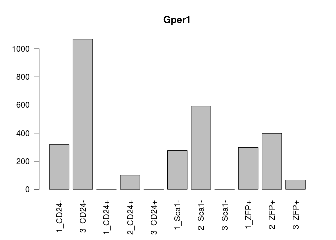

### PCA

Let's redo the Principal component analysis (or singular value decomposition, svd) to check against figure 5 of the paper.

``` r
ambrosiCLN <- round.log(ambrosiMatNorm+1,2)
ambrosiCLN <- ambrosiCLN[rowSds(ambrosiCLN)>1,]
svAmbrosi <- svd((ambrosiCLN-rowMeans(ambrosiCLN))/rowSds(ambrosiCLN))

std.heatmap(cor(ambrosiMatNorm,method = "spearman"))
```

    ## Warning in heatmap.2(M, Rowv = F, Colv = F, trace = "none", col = cols, :
    ## Discrepancy: Rowv is FALSE, while dendrogram is `both'. Omitting row
    ## dendogram.

    ## Warning in heatmap.2(M, Rowv = F, Colv = F, trace = "none", col = cols, :
    ## Discrepancy: Colv is FALSE, while dendrogram is `column'. Omitting column
    ## dendogram.


``` r
conditNums <- sapply(condits,function(x)which(x==sort(unique(condits))))
#Sca1minus is osteo, ZFP (mature) and CD24- (less mature) are adipocytes, cd24+ is multipotent
plot(svAmbrosi$v[,1:2],col=conditNums,xlab="PC1",ylab="PC2")
legend("bottomright",legend = unique(names(conditNums)),col=1:4,fill = 1:4)
```


``` r
eaciout <- list()
l <- 1
eacivector <- svAmbrosi$u[,l]
names(eacivector) <- rownames(ambrosiCLN)
eaciout[[l]] <- eacitest(eacivector,"org.Mm.eg","SYMBOL",sets = "GO")$setscores
```

    ## Loading necessary libraries...

    ## Loaded Package org.Mm.eg.db

    ## Converting annotations to data.frames ...

    ## iteration 1 done; time  9.51 sec 
    ## iteration 2 done; time  7.51 sec 
    ## iteration 3 done; time  7.78 sec 
    ## iteration 4 done; time  8.01 sec 
    ## iteration 5 done; time  7.24 sec 
    ## iteration 6 done; time  7.81 sec 
    ## iteration 7 done; time  7.58 sec 
    ## iteration 8 done; time  7.77 sec 
    ## iteration 9 done; time  7.83 sec 
    ## iteration 10 done; time  8.03 sec

    ## Labeling output ...

    ## Loaded Package GO.db

``` r
l <- 2
eacivector <- svAmbrosi$u[,l]
names(eacivector) <- rownames(ambrosiCLN)
eaciout[[l]] <- eacitest(eacivector,"org.Mm.eg","SYMBOL",sets = "GO")$setscores
```

    ## Loading necessary libraries...

    ## Loaded Package org.Mm.eg.db

    ## Converting annotations to data.frames ...

    ## iteration 1 done; time  5.94 sec 
    ## iteration 2 done; time  7.86 sec 
    ## iteration 3 done; time  9.61 sec 
    ## iteration 4 done; time  7.36 sec 
    ## iteration 5 done; time  7.45 sec 
    ## iteration 6 done; time  7.24 sec 
    ## iteration 7 done; time  5.73 sec 
    ## iteration 8 done; time  8.26 sec 
    ## iteration 9 done; time  9.45 sec 
    ## iteration 10 done; time  8.23 sec

    ## Labeling output ...

    ## Loaded Package GO.db

### GO enrichment of Principal Components

So that reiterates the Ambrosi analysis. Now let's look at the continuous GO enrichment in the genes that contribute to PC1 (separates the osteocyte and progenitors from adipocytes)

``` r
#PC1 Positive
a <- eaciout[[1]][eaciout[[1]]$set.mean>0,]
print(a[1:25,])
```

    ##                                                               Term
    ## GO:1904181          positive regulation of membrane depolarization
    ## GO:0010935            regulation of macrophage cytokine production
    ## GO:0035455                            response to interferon-alpha
    ## GO:0035641                         locomotory exploration behavior
    ## GO:0070006                          metalloaminopeptidase activity
    ## GO:0043034                                               costamere
    ## GO:0005161         platelet-derived growth factor receptor binding
    ## GO:0030742                           GTP-dependent protein binding
    ## GO:0043649                     dicarboxylic acid catabolic process
    ## GO:0051497            negative regulation of stress fiber assembly
    ## GO:0097440                                         apical dendrite
    ## GO:0038191                                      neuropilin binding
    ## GO:0060716             labyrinthine layer blood vessel development
    ## GO:0034312                               diol biosynthetic process
    ## GO:0052744 phosphatidylinositol monophosphate phosphatase activity
    ## GO:0097320                              plasma membrane tubulation
    ## GO:2001212                            regulation of vasculogenesis
    ## GO:0000062                                  fatty-acyl-CoA binding
    ## GO:0042581                                        specific granule
    ## GO:1990126       retrograde transport, endosome to plasma membrane
    ## GO:0051654             establishment of mitochondrion localization
    ## GO:0031579                              membrane raft organization
    ## GO:0004602                         glutathione peroxidase activity
    ## GO:0030574                              collagen catabolic process
    ## GO:0021846                         cell proliferation in forebrain
    ##            Ontology    set.mean      set.sd set.size         pval
    ## GO:1904181       BP 0.009550961 0.007362549       11 0.000000e+00
    ## GO:0010935       BP 0.008480568 0.004542898       10 0.000000e+00
    ## GO:0035455       BP 0.008176674 0.004452738       16 0.000000e+00
    ## GO:0035641       BP 0.008128965 0.003041400       12 0.000000e+00
    ## GO:0070006       MF 0.008062144 0.003396604        9 0.000000e+00
    ## GO:0043034       CC 0.007416668 0.003652416       12 0.000000e+00
    ## GO:0005161       MF 0.007303739 0.004115494       10 0.000000e+00
    ## GO:0030742       MF 0.007236354 0.005686460       16 0.000000e+00
    ## GO:0043649       BP 0.007048522 0.004348495        9 6.661338e-16
    ## GO:0051497       BP 0.006929356 0.004769006       19 1.998401e-15
    ## GO:0097440       CC 0.006927306 0.008652274       17 1.998401e-15
    ## GO:0038191       MF 0.006925863 0.009478934       11 1.998401e-15
    ## GO:0060716       BP 0.006921120 0.003255819       13 1.998401e-15
    ## GO:0034312       BP 0.006855821 0.007104589       10 3.774758e-15
    ## GO:0052744       MF 0.006738662 0.002955610        9 1.110223e-14
    ## GO:0097320       BP 0.006549348 0.004641722       11 5.995204e-14
    ## GO:2001212       BP 0.006467521 0.007580034       11 1.225686e-13
    ## GO:0000062       MF 0.006281751 0.003783333       10 5.995204e-13
    ## GO:0042581       CC 0.006236637 0.008351424       11 8.757439e-13
    ## GO:1990126       BP 0.006187573 0.004099407       10 1.318279e-12
    ## GO:0051654       BP 0.006159705 0.003921547       10 1.660672e-12
    ## GO:0031579       BP 0.006144897 0.006097797        9 1.876721e-12
    ## GO:0004602       MF 0.006067209 0.005298084        9 3.548717e-12
    ## GO:0030574       BP 0.005944741 0.003864840       10 9.534373e-12
    ## GO:0021846       BP 0.005903418 0.007465946       18 1.325007e-11

``` r
#PC1 Negative
a <- eaciout[[1]][eaciout[[1]]$set.mean<0,]
print(a[1:25,])
```

    ##                                                                              Term
    ## GO:0003417                                     growth plate cartilage development
    ## GO:0042555                                                            MCM complex
    ## GO:0006271                      DNA strand elongation involved in DNA replication
    ## GO:0050699                                                      WW domain binding
    ## GO:0000940                                 condensed chromosome outer kinetochore
    ## GO:0031643                                     positive regulation of myelination
    ## GO:0003688                                         DNA replication origin binding
    ## GO:0043142                          single-stranded DNA-dependent ATPase activity
    ## GO:0051084                            'de novo' posttranslational protein folding
    ## GO:0030206                               chondroitin sulfate biosynthetic process
    ## GO:1904666                        regulation of ubiquitin protein ligase activity
    ## GO:0050911 detection of chemical stimulus involved in sensory perception of smell
    ## GO:0000800                                                        lateral element
    ## GO:0005861                                                       troponin complex
    ## GO:0002076                                                 osteoblast development
    ## GO:0061436                                          establishment of skin barrier
    ## GO:0000796                                                      condensin complex
    ## GO:0006198                                                 cAMP catabolic process
    ## GO:0010369                                                           chromocenter
    ## GO:0034501                                    protein localization to kinetochore
    ## GO:0018279                          protein N-linked glycosylation via asparagine
    ## GO:0005251                           delayed rectifier potassium channel activity
    ## GO:0004936                                     alpha-adrenergic receptor activity
    ## GO:0030033                                                   microvillus assembly
    ## GO:0045120                                                             pronucleus
    ##            Ontology     set.mean      set.sd set.size         pval
    ## GO:0003417       BP -0.007913482 0.006350914        9 8.242433e-20
    ## GO:0042555       CC -0.007165374 0.005537788        9 1.579214e-16
    ## GO:0006271       BP -0.006697905 0.003346225       10 1.226746e-14
    ## GO:0050699       MF -0.006399908 0.003496455       16 1.695746e-13
    ## GO:0000940       CC -0.006360513 0.004464935       12 2.379024e-13
    ## GO:0031643       BP -0.005818542 0.003866918       12 2.044247e-11
    ## GO:0003688       MF -0.005554578 0.003062234       11 1.558571e-10
    ## GO:0043142       MF -0.005363276 0.003052580       14 6.421543e-10
    ## GO:0051084       BP -0.005140655 0.007101077        9 3.143476e-09
    ## GO:0030206       BP -0.004989020 0.006338731        7 8.940523e-09
    ## GO:1904666       BP -0.004803296 0.007399239       11 3.089380e-08
    ## GO:0050911       BP -0.004620843 0.002097693       13 1.000393e-07
    ## GO:0000800       CC -0.004529402 0.006367887       14 1.773971e-07
    ## GO:0005861       CC -0.004385660 0.004648931        7 4.271912e-07
    ## GO:0002076       BP -0.004371176 0.006836826       10 4.660641e-07
    ## GO:0061436       BP -0.004240701 0.003095505       15 1.009057e-06
    ## GO:0000796       CC -0.004222971 0.003853109        7 1.118854e-06
    ## GO:0006198       BP -0.004200151 0.003667048       11 1.277187e-06
    ## GO:0010369       CC -0.004170686 0.002705810       10 1.513719e-06
    ## GO:0034501       BP -0.004121958 0.002540034       17 1.999980e-06
    ## GO:0018279       BP -0.003973351 0.005387521       15 4.590650e-06
    ## GO:0005251       MF -0.003906662 0.004965269       11 6.604611e-06
    ## GO:0004936       MF -0.003844353 0.004192067        4 9.230585e-06
    ## GO:0030033       BP -0.003498827 0.009998889       10 5.403767e-05
    ## GO:0045120       CC -0.003392271 0.007256207       13 9.040247e-05

Interesting... Now PC2 (separates osteocytes from progenitors)

``` r
#PC2 Positive
a <- eaciout[[2]][eaciout[[2]]$set.mean>0,]
print(a[1:25,])
```

    ##                                                                           Term
    ## GO:0000076                                          DNA replication checkpoint
    ## GO:0042168                                              heme metabolic process
    ## GO:0019825                                                      oxygen binding
    ## GO:0042555                                                         MCM complex
    ## GO:0043034                                                           costamere
    ## GO:0060004                                                              reflex
    ## GO:0035641                                     locomotory exploration behavior
    ## GO:0048821                                             erythrocyte development
    ## GO:0052744             phosphatidylinositol monophosphate phosphatase activity
    ## GO:0000940                              condensed chromosome outer kinetochore
    ## GO:0006271                   DNA strand elongation involved in DNA replication
    ## GO:0007076                                     mitotic chromosome condensation
    ## GO:0002098                                    tRNA wobble uridine modification
    ## GO:0043142                       single-stranded DNA-dependent ATPase activity
    ## GO:0030539                                          male genitalia development
    ## GO:0043567 regulation of insulin-like growth factor receptor signaling pathway
    ## GO:0008139                               nuclear localization sequence binding
    ## GO:0007064                                   mitotic sister chromatid cohesion
    ## GO:0034508                                         centromere complex assembly
    ## GO:0005847        mRNA cleavage and polyadenylation specificity factor complex
    ## GO:0071108                                 protein K48-linked deubiquitination
    ## GO:0003688                                      DNA replication origin binding
    ## GO:0042588                                                     zymogen granule
    ## GO:0032769                       negative regulation of monooxygenase activity
    ## GO:0043240                                     Fanconi anaemia nuclear complex
    ##            Ontology    set.mean      set.sd set.size         pval
    ## GO:0000076       BP 0.009693135 0.004932242       10 0.000000e+00
    ## GO:0042168       BP 0.007914790 0.009950480       14 0.000000e+00
    ## GO:0019825       MF 0.007654870 0.004611019       13 0.000000e+00
    ## GO:0042555       CC 0.007441273 0.004535643        9 0.000000e+00
    ## GO:0043034       CC 0.006902043 0.003410221       12 0.000000e+00
    ## GO:0060004       BP 0.006565326 0.003320756       13 2.220446e-16
    ## GO:0035641       BP 0.006333117 0.002822265       12 1.776357e-15
    ## GO:0048821       BP 0.005632202 0.010486405       21 1.544986e-12
    ## GO:0052744       MF 0.005609784 0.003603374        9 1.891154e-12
    ## GO:0000940       CC 0.005590678 0.004938136       12 2.245759e-12
    ## GO:0006271       BP 0.005444022 0.002063442       10 8.237189e-12
    ## GO:0007076       BP 0.005298614 0.006001636        9 2.891776e-11
    ## GO:0002098       BP 0.005133174 0.003917011        9 1.160048e-10
    ## GO:0043142       MF 0.004823193 0.002418823       14 1.398381e-09
    ## GO:0030539       BP 0.004799560 0.003085027       12 1.680430e-09
    ## GO:0043567       BP 0.004590763 0.002749857       16 8.207849e-09
    ## GO:0008139       MF 0.004501030 0.002706107       10 1.589782e-08
    ## GO:0007064       BP 0.004474369 0.004951665       13 1.930226e-08
    ## GO:0034508       BP 0.004467597 0.003425169       17 2.027394e-08
    ## GO:0005847       CC 0.004274121 0.002753735        8 8.006887e-08
    ## GO:0071108       BP 0.004062983 0.002363101       11 3.358228e-07
    ## GO:0003688       MF 0.004058608 0.002412097       11 3.456995e-07
    ## GO:0042588       CC 0.004049460 0.002115837       12 3.672673e-07
    ## GO:0032769       BP 0.004039837 0.002196960       12 3.913548e-07
    ## GO:0043240       CC 0.003699106 0.006487035       12 3.388582e-06

``` r
#PC2 Negative
a <- eaciout[[2]][eaciout[[2]]$set.mean<0,]
print(a[1:25,])
```

    ##                                                                  Term
    ## GO:0042608                                    T cell receptor binding
    ## GO:0004745                             retinol dehydrogenase activity
    ## GO:0005779                 integral component of peroxisomal membrane
    ## GO:0070402                                              NADPH binding
    ## GO:0016755       transferase activity, transferring amino-acyl groups
    ## GO:0045948            positive regulation of translational initiation
    ## GO:0030687                       preribosome, large subunit precursor
    ## GO:0048845                          venous blood vessel morphogenesis
    ## GO:1904424                                  regulation of GTP binding
    ## GO:0048875                       chemical homeostasis within a tissue
    ## GO:0032823          regulation of natural killer cell differentiation
    ## GO:0035859                                    Seh1-associated complex
    ## GO:0006677                         glycosylceramide metabolic process
    ## GO:0090502        RNA phosphodiester bond hydrolysis, endonucleolytic
    ## GO:0004467                  long-chain fatty acid-CoA ligase activity
    ## GO:0008356                                   asymmetric cell division
    ## GO:0009931 calcium-dependent protein serine/threonine kinase activity
    ## GO:0031902                                     late endosome membrane
    ## GO:0007214                  gamma-aminobutyric acid signaling pathway
    ## GO:0004115                3',5'-cyclic-AMP phosphodiesterase activity
    ## GO:0046966                           thyroid hormone receptor binding
    ## GO:0097546                                               ciliary base
    ## GO:0036158                                  outer dynein arm assembly
    ## GO:0045236                            CXCR chemokine receptor binding
    ## GO:0050774              negative regulation of dendrite morphogenesis
    ##            Ontology     set.mean      set.sd set.size         pval
    ## GO:0042608       MF -0.007225827 0.002514962       12 1.338052e-19
    ## GO:0004745       MF -0.006967215 0.004736985       10 2.483191e-18
    ## GO:0005779       CC -0.006921376 0.003991866       11 4.122337e-18
    ## GO:0070402       MF -0.006843526 0.003357262       11 9.677517e-18
    ## GO:0016755       MF -0.006644089 0.006152538       13 8.252173e-17
    ## GO:0045948       BP -0.006520814 0.006213942       12 3.009541e-16
    ## GO:0030687       CC -0.006427968 0.002866980       13 7.851767e-16
    ## GO:0048845       BP -0.006133401 0.003886870       10 1.506047e-14
    ## GO:1904424       BP -0.006115307 0.002902614       10 1.797771e-14
    ## GO:0048875       BP -0.006060489 0.006105307       11 3.064503e-14
    ## GO:0032823       BP -0.006047297 0.006936837       12 3.481768e-14
    ## GO:0035859       CC -0.006046898 0.008022817       11 3.495241e-14
    ## GO:0006677       BP -0.005997180 0.005862817       11 5.640960e-14
    ## GO:0090502       BP -0.005861337 0.004638792       12 2.045740e-13
    ## GO:0004467       MF -0.005442840 0.004942386        8 9.049884e-12
    ## GO:0008356       BP -0.005246803 0.004761979       11 4.866223e-11
    ## GO:0009931       MF -0.005184949 0.006868003        8 8.172605e-11
    ## GO:0031902       CC -0.004992897 0.003392507       13 3.937092e-10
    ## GO:0007214       BP -0.004960321 0.002685419       12 5.111538e-10
    ## GO:0004115       MF -0.004908306 0.003028564       11 7.728744e-10
    ## GO:0046966       MF -0.004798493 0.005462973       12 1.824991e-09
    ## GO:0097546       CC -0.004753170 0.005377825       19 2.587775e-09
    ## GO:0036158       BP -0.004745586 0.003401511        9 2.742657e-09
    ## GO:0045236       MF -0.004722545 0.004456333       10 3.270645e-09
    ## GO:0050774       BP -0.004630942 0.002674785       10 6.533070e-09

Sweet.

Time for some differential expression

``` r
cond <- as.factor(condits)
colnames(ambrosiMat) <- make.names(condits,unique = T)
dds <- DESeqDataSetFromMatrix(round(ambrosiMat),colData = DataFrame(cond),design = formula(~cond+0))
```

    ## converting counts to integer mode

``` r
DESeqOutput <-  DESeq(dds)
```

    ## estimating size factors

    ## estimating dispersions

    ## gene-wise dispersion estimates

    ## mean-dispersion relationship

    ## final dispersion estimates

    ## fitting model and testing

``` r
resultsNames(DESeqOutput)
```

    ## [1] "condCD24minus" "condCD24plus"  "condSca1minus" "condZFPplus"

``` r
resList <-  list(results(DESeqOutput,contrast = c(1,-1/3,-1/3,-1/3 ),cooksCutoff=T),results(DESeqOutput,contrast = c(-1/3,1,-1/3,-1/3 ),cooksCutoff=T),results(DESeqOutput,contrast = c(-1/3,-1/3,1,-1/3 ),cooksCutoff=T),results(DESeqOutput,contrast = c(-1/3,-1/3,-1/3 ,1),cooksCutoff=T))

ambrosiUpDown <-lapply(resList,function(res){
  res <- res[!is.na(res$padj),]
  list(rownames(res[res$padj<.1&res$log2FoldChange>0,]),rownames(res[res$padj<.1&res$log2FoldChange<0,]))
})

print(str(ambrosiUpDown))
```

    ## List of 4
    ##  $ :List of 2
    ##   ..$ : chr [1:419] "1700066M21Rik" "5430403G16Rik" "6430548M08Rik" "8430408G22Rik" ...
    ##   ..$ : chr [1:591] "1110008L16Rik" "1810041L15Rik" "2610008E11Rik" "3110062M04Rik" ...
    ##  $ :List of 2
    ##   ..$ : chr [1:896] "1190002N15Rik" "1700028J19Rik" "1700047I17Rik2" "1810013L24Rik" ...
    ##   ..$ : chr [1:800] "1700019D03Rik" "2200002D01Rik" "2310009B15Rik" "2310061I04Rik" ...
    ##  $ :List of 2
    ##   ..$ : chr [1:894] "1500015O10Rik" "1700008O03Rik" "1700047I17Rik2" "1810041L15Rik" ...
    ##   ..$ : chr [1:853] "0610040J01Rik" "1700029J07Rik" "1810043G02Rik" "2510039O18Rik" ...
    ##  $ :List of 2
    ##   ..$ : chr [1:689] "2200002D01Rik" "2810021J22Rik" "3830406C13Rik" "4930432E11Rik" ...
    ##   ..$ : chr [1:765] "1500015O10Rik" "1700028J19Rik" "1700047I17Rik2" "1700066M21Rik" ...
    ## NULL

So there's a bunch of genes differentially expressed up or down for each cell type compared to all the others.

``` r
for(i in 1:length(resList)){
  print(resultsNames(DESeqOutput)[i])
  res <- resList[[i]]
    write.table(res[order(res$log2FoldChange,decreasing = T),],paste0("~/Desktop/DEG_",resultsNames(DESeqOutput)[i],".txt"),sep = "\t",quote = F)
  res <- res[!is.na(res$padj),]
  res <- res[res$padj<.1&res$log2FoldChange>0,]
  mat <- log(ambrosiMatNorm+1,2)-rowMeans(log(ambrosiMatNorm+1,2))
  std.heatmap(mat[rownames(res[order(res$padj,decreasing = F),])[1:25],],main=paste(resultsNames(DESeqOutput)[i],"Up vs All\nLogFC vs mean"))
}
```

    ## [1] "condCD24minus"

    ## Warning in heatmap.2(M, Rowv = F, Colv = F, trace = "none", col = cols, :
    ## Discrepancy: Rowv is FALSE, while dendrogram is `both'. Omitting row
    ## dendogram.

    ## Warning in heatmap.2(M, Rowv = F, Colv = F, trace = "none", col = cols, :
    ## Discrepancy: Colv is FALSE, while dendrogram is `column'. Omitting column
    ## dendogram.

    ## [1] "condCD24plus"

    ## Warning in heatmap.2(M, Rowv = F, Colv = F, trace = "none", col = cols, :
    ## Discrepancy: Rowv is FALSE, while dendrogram is `both'. Omitting row
    ## dendogram.

    ## Warning in heatmap.2(M, Rowv = F, Colv = F, trace = "none", col = cols, :
    ## Discrepancy: Colv is FALSE, while dendrogram is `column'. Omitting column
    ## dendogram.

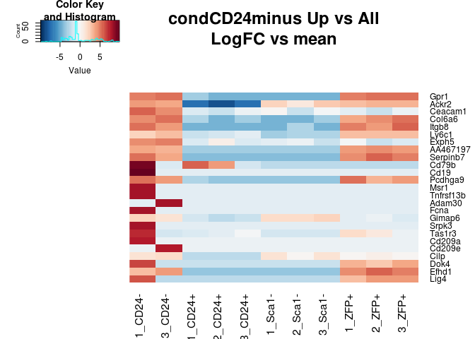

    ## [1] "condSca1minus"

    ## Warning in heatmap.2(M, Rowv = F, Colv = F, trace = "none", col = cols, :
    ## Discrepancy: Rowv is FALSE, while dendrogram is `both'. Omitting row
    ## dendogram.

    ## Warning in heatmap.2(M, Rowv = F, Colv = F, trace = "none", col = cols, :
    ## Discrepancy: Colv is FALSE, while dendrogram is `column'. Omitting column
    ## dendogram.


    ## [1] "condZFPplus"

    ## Warning in heatmap.2(M, Rowv = F, Colv = F, trace = "none", col = cols, :
    ## Discrepancy: Rowv is FALSE, while dendrogram is `both'. Omitting row
    ## dendogram.

    ## Warning in heatmap.2(M, Rowv = F, Colv = F, trace = "none", col = cols, :
    ## Discrepancy: Colv is FALSE, while dendrogram is `column'. Omitting column
    ## dendogram.


``` r
for(i in 1:length(resList)){
  print(resultsNames(DESeqOutput)[i])
  res <- resList[[i]]
  res <- res[!is.na(res$padj),]
  res <- res[res$padj<.1&res$log2FoldChange>0,]
  std.heatmap(log(ambrosiMatNorm[rownames(res[order(res$padj,decreasing = F),])[1:25],]+1,2),main=paste(resultsNames(DESeqOutput)[i],"Up vs All"))
}
```

    ## [1] "condCD24minus"

    ## Warning in heatmap.2(M, Rowv = F, Colv = F, trace = "none", col = cols, :
    ## Discrepancy: Rowv is FALSE, while dendrogram is `both'. Omitting row
    ## dendogram.

    ## Warning in heatmap.2(M, Rowv = F, Colv = F, trace = "none", col = cols, :
    ## Discrepancy: Colv is FALSE, while dendrogram is `column'. Omitting column
    ## dendogram.

    ## [1] "condCD24plus"

    ## Warning in heatmap.2(M, Rowv = F, Colv = F, trace = "none", col = cols, :
    ## Discrepancy: Rowv is FALSE, while dendrogram is `both'. Omitting row
    ## dendogram.

    ## Warning in heatmap.2(M, Rowv = F, Colv = F, trace = "none", col = cols, :
    ## Discrepancy: Colv is FALSE, while dendrogram is `column'. Omitting column
    ## dendogram.


    ## [1] "condSca1minus"

    ## Warning in heatmap.2(M, Rowv = F, Colv = F, trace = "none", col = cols, :
    ## Discrepancy: Rowv is FALSE, while dendrogram is `both'. Omitting row
    ## dendogram.

    ## Warning in heatmap.2(M, Rowv = F, Colv = F, trace = "none", col = cols, :
    ## Discrepancy: Colv is FALSE, while dendrogram is `column'. Omitting column
    ## dendogram.


    ## [1] "condZFPplus"

    ## Warning in heatmap.2(M, Rowv = F, Colv = F, trace = "none", col = cols, :
    ## Discrepancy: Rowv is FALSE, while dendrogram is `both'. Omitting row
    ## dendogram.

    ## Warning in heatmap.2(M, Rowv = F, Colv = F, trace = "none", col = cols, :
    ## Discrepancy: Colv is FALSE, while dendrogram is `column'. Omitting column
    ## dendogram.


Candice's Data
--------------

The data for the Ingraham lab RNAseq was also passed to Salmon after fastqc and trimming with trimgalore as suggested by the NuGen Prep.

``` r
# datapath <- "~/code/IngrahamLabData/BoneSalmonOutputs/"
# fileList <- dir(datapath)
# fileList <- fileList[!grepl("Gene|pdf",fileList)]
# dsList <- lapply(paste0(datapath,fileList),read.csv2, sep="\t",header=T,row.names=1,stringsAsFactors=F)
# allRownames <- Reduce(union,lapply(dsList,rownames))

datapath <- "~/code/IngrahamLabData/galaxyBone/"
fileList <- dir(datapath,full.names = T)
fileList <- fileList[!grepl("Gene|pdf",fileList)]
dsList <- lapply(fileList,read.csv2, sep="\t",header=T,row.names=1,stringsAsFactors=F)
allRownames <- Reduce(union,lapply(dsList,rownames))


mart <- useMart(biomart = "ENSEMBL_MART_ENSEMBL", dataset = "mmusculus_gene_ensembl", host="www.ensembl.org")
# rnSymbol <- getBM(attributes = c("ensembl_transcript_id_version","mgi_symbol","description"),filters = c("ensembl_transcript_id_version"),values =allRownames ,mart = mart) 
rnSymbol <- getBM(attributes = c("entrezgene","mgi_symbol",'description'),filters = c("entrezgene"),values =allRownames ,mart = mart) 
rnSymbolGenes <- rnSymbol[rnSymbol$mgi_symbol!=""& !grepl("predicted gene", rnSymbol$description),]
```

``` r
# dsAgList <-  lapply(dsList,function(x){
#   rnsgs <-  rnSymbolGenes[rnSymbolGenes$ensembl_transcript_id_version %in% rownames(x),]
#   x <- x[rnsgs$ensembl_transcript_id_version,]
#   ret <- aggregate(as.integer(x$NumReads), by=list(rnsgs$mgi_symbol),sum)
#   rownames(ret) <- ret[,1]
#   ret[,-1,drop=F]
# })

dsAgList <- lapply(colnames(dsList[[1]]),function(n){
  Reduce(cbind,lapply(dsList,function(x)x[,n,drop=F]))
  })
dsAgList <- lapply(1:4,function(x)dsAgList[[1]])
names(dsAgList) <- names(txList)[c(3,4,1,2)]
dsAgList <- lapply(dsAgList,function(x){
  x <- as.matrix(x)
  storage.mode(x) <- "numeric"
  x
  })
boneMat <- summarizeToGene(dsAgList,rnSymbolGenes)$counts[-1,]
```

    ## removing duplicated transcript rows from tx2gene

    ## transcripts missing from tx2gene: 6386

    ## summarizing abundance

    ## summarizing counts

    ## summarizing length

``` r
sampleNames <- c("1807_BM_fl_A1","1810_BM_KO_E1","1811_BM_KO_G1","1815_BM_fl_B1","1818_BM_fl_C1","1825_BM_KO_F1","1984_BM_fl_D1","1985_BM_KO_H1")
SampleNameMat <- sapply(strsplit(sampleNames,"_"),function(i)i)
#boneMat <-  as.matrix(Reduce(rn.merge,dsAgList))
colnames(boneMat) <- paste(SampleNameMat[3,],gsub("[[:digit:]]","",SampleNameMat[4,]),sep = "_")
boneMatNorm <-  median.normalize(boneMat)
boneMatNorm <- boneMatNorm[,order(colnames(boneMatNorm))]
heatmap.2(cor(boneMatNorm,method = "spe"),col=cols,trace="none")
```


``` r
std.heatmap(cor(rn.merge(boneMatNorm,ambrosiMatNorm),method = "spe"),main="Spearman Correlation\n Ambrosi vs Candice")
```

    ## Warning in heatmap.2(M, Rowv = F, Colv = F, trace = "none", col = cols, :
    ## Discrepancy: Rowv is FALSE, while dendrogram is `both'. Omitting row
    ## dendogram.

    ## Warning in heatmap.2(M, Rowv = F, Colv = F, trace = "none", col = cols, :
    ## Discrepancy: Colv is FALSE, while dendrogram is `column'. Omitting column
    ## dendogram.


### PCA Candice

``` r
boneCLN <- round.log(boneMatNorm+1,2)
boneCLN <- boneCLN[rowSds(boneCLN)>.7,]
svbone <- svd((boneCLN-rowMeans(boneCLN))/rowSds(boneCLN))

condits <- sapply(strsplit(colnames(boneMatNorm),"_"),function(i) i[1])
conditNums <- sapply(condits,function(x)which(x==sort(unique(condits))))
#Sca1minus is osteo, ZFP (mature) and CD24- (less mature) are adipocytes, cd24+ is multipotent

boneCors <-  cor(t(boneCLN),method = "pearson")
boneCors <- 1-(boneCors+1)/2
hclustbonecors <-  hclust(as.dist(boneCors))
plot(hclustbonecors)
```


``` r
corclusts <-cutree(hclustbonecors,k = 12)
matplot(sapply(1:12,function(i) colMeans(t(scale(t(boneCLN[names(corclusts)[corclusts==i],]))))),type="l")
```


``` r
hcEnrichment <-  sapply(1:12,function(i)enrichGO(names(corclusts)[corclusts==i],OrgDb ='org.Mm.eg.db',keyType = "SYMBOL",ont = "BP"))
sapply(1:12,function(i){
  scalemat <- scale(t(boneCLN[names(corclusts)[corclusts==i],]))
  rownames(scalemat) <- colnames(boneCLN)
  barplot(colMeans(t(scalemat)),main=paste(as.data.frame(hcEnrichment[[i]])[1:3,"Description"],collapse = "\n"))
  })
```

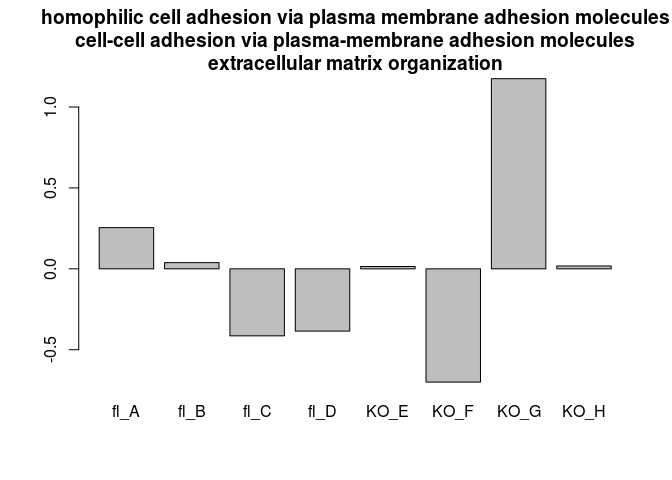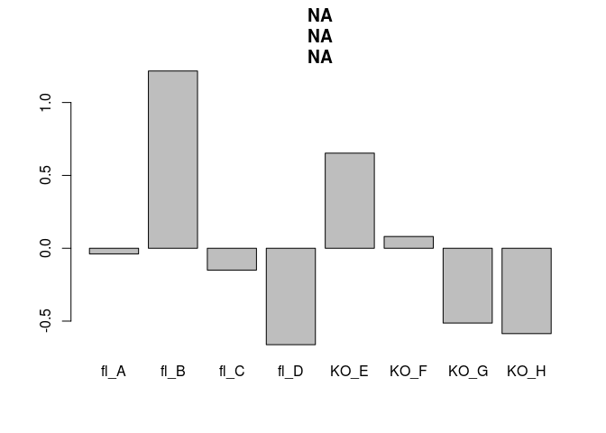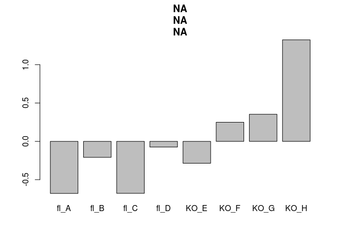

    ##      [,1] [,2] [,3] [,4] [,5] [,6] [,7] [,8] [,9] [,10] [,11] [,12]
    ## [1,]  0.7  0.7  0.7  0.7  0.7  0.7  0.7  0.7  0.7   0.7   0.7   0.7
    ## [2,]  1.9  1.9  1.9  1.9  1.9  1.9  1.9  1.9  1.9   1.9   1.9   1.9
    ## [3,]  3.1  3.1  3.1  3.1  3.1  3.1  3.1  3.1  3.1   3.1   3.1   3.1
    ## [4,]  4.3  4.3  4.3  4.3  4.3  4.3  4.3  4.3  4.3   4.3   4.3   4.3
    ## [5,]  5.5  5.5  5.5  5.5  5.5  5.5  5.5  5.5  5.5   5.5   5.5   5.5
    ## [6,]  6.7  6.7  6.7  6.7  6.7  6.7  6.7  6.7  6.7   6.7   6.7   6.7
    ## [7,]  7.9  7.9  7.9  7.9  7.9  7.9  7.9  7.9  7.9   7.9   7.9   7.9
    ## [8,]  9.1  9.1  9.1  9.1  9.1  9.1  9.1  9.1  9.1   9.1   9.1   9.1

``` r
sapply(1:12,function(i)names(corclusts)[corclusts==i])
```

    ## [[1]]
    ##   [1] "0610040J01Rik" "1600002K03Rik" "1810065E05Rik" "2210010C04Rik"
    ##   [5] "4932438H23Rik" "6330403K07Rik" "6330409D20Rik" "9130008F23Rik"
    ##   [9] "A4galt"        "Aard"          "Abcc12"        "Abhd14a"      
    ##  [13] "Acy1"          "Adamts8"       "Adgrd1"        "AI182371"     
    ##  [17] "Akr1c19"       "Akr7a5"        "Aldh3a1"       "Als2cr12"     
    ##  [21] "Amph"          "Angptl3"       "Ank2"          "Apoa5"        
    ##  [25] "Apol8"         "Aqp11"         "Arhgap28"      "Arhgdig"      
    ##  [29] "Artn"          "Asb2"          "Atpaf1"        "B4galnt2"     
    ##  [33] "Bbc3"          "Best2"         "C1qtnf3"       "C7"           
    ##  [37] "Caml"          "Cant1"         "Capn15"        "Card19"       
    ##  [41] "Casc1"         "Ccdc169"       "Cd109"         "Cd276"        
    ##  [45] "Cdkn2b"        "Cgref1"        "Chpf"          "Ciart"        
    ##  [49] "Cldn5"         "Clic6"         "Cmtm8"         "Col15a1"      
    ##  [53] "Col4a6"        "Colec12"       "Corin"         "Cpne8"        
    ##  [57] "Crb2"          "Creld1"        "Ctgf"          "Ctsk"         
    ##  [61] "Cyp7b1"        "Cyr61"         "Cyyr1"         "Dand5"        
    ##  [65] "Dcaf12l1"      "Dcaf15"        "Dhrs7b"        "Dnajb2"       
    ##  [69] "Dnm1"          "Dnph1"         "Dock6"         "Dpep2"        
    ##  [73] "Dpp6"          "Dppa3"         "Dqx1"          "Draxin"       
    ##  [77] "Dusp18"        "Dusp28"        "Eef1akmt1"     "Elavl3"       
    ##  [81] "Elf5"          "Elfn1"         "Eln"           "Enox1"        
    ##  [85] "Ephb1"         "Epn2"          "Erfe"          "Fah"          
    ##  [89] "Fam109a"       "Fam110c"       "Fam184b"       "Fgf23"        
    ##  [93] "Fgfbp3"        "Fgfr3"         "Fkbp10"        "Foxj1"        
    ##  [97] "Foxp3"         "Fzd4"          "Fzd6"          "Fzd7"         
    ## [101] "Galnt14"       "Gatsl3"        "Gh"            "Glt8d2"       
    ## [105] "Gm10767"       "Gm5148"        "Gpr137"        "Gpr182"       
    ## [109] "Gpr68"         "Gpr83"         "Gprc5b"        "Gria2"        
    ## [113] "Hap1"          "Hbb-y"         "Hist1h3d"      "Hist1h4i"     
    ## [117] "Hist2h3c2"     "Hmcn1"         "Htra4"         "Ift122"       
    ## [121] "Igfbp2"        "Il20ra"        "Il27"          "Insm1"        
    ## [125] "Irx5"          "Islr"          "Itih2"         "Kazald1"      
    ## [129] "Kcnj14"        "Kcnma1"        "Kcnq3"         "Kctd19"       
    ## [133] "Kctd6"         "Klhl41"        "Klrg2"         "Kremen1"      
    ## [137] "Kyat1"         "Lipm"          "Lmo1"          "Lrguk"        
    ## [141] "Lsm2"          "Lzts3"         "Mcmdc2"        "Mecom"        
    ## [145] "Mnd1"          "Morn1"         "Mrps34"        "Mtfp1"        
    ## [149] "Myo5b"         "Mzf1"          "Nacad"         "Ndufab1"      
    ## [153] "Nectin4"       "Ninj2"         "Nlrp6"         "Noxa1"        
    ## [157] "Olfml2b"       "Olfr303"       "Pak6"          "Pamr1"        
    ## [161] "Pcdhga6"       "Pdia2"         "Pelo"          "Per1"         
    ## [165] "Pex16"         "Phb"           "Pih1d2"        "Plek2"        
    ## [169] "Pnp2"          "Podxl"         "Prox1"         "Prrt1"        
    ## [173] "Psen2"         "Ptk7"          "Ptprb"         "Ptprf"        
    ## [177] "Ptprz1"        "Rapsn"         "Reep2"         "Rhbdf1"       
    ## [181] "Rita1"         "Robo4"         "Rorc"          "Rtl8c"        
    ## [185] "Scara5"        "Selp"          "Serpine1"      "Serpinf1"     
    ## [189] "Serpinf2"      "Sertad1"       "Shisa7"        "Slc12a4"      
    ## [193] "Slc13a5"       "Slc16a11"      "Slc1a4"        "Slc26a6"      
    ## [197] "Slc2a10"       "Slc44a4"       "Slc5a10"       "Slc8a3"       
    ## [201] "Smc1b"         "Smoc2"         "Smpdl3b"       "Smtnl1"       
    ## [205] "Snx24"         "Spaca9"        "Sparcl1"       "Spry2"        
    ## [209] "Srpx"          "St3gal3"       "Stab1"         "Sumf2"        
    ## [213] "Syngr1"        "Tarbp2"        "Tbxa2r"        "Tex38"        
    ## [217] "Tfcp2l1"       "Tjp3"          "Tmc5"          "Tmeff1"       
    ## [221] "Tmem136"       "Tmem203"       "Tmem251"       "Tmem81"       
    ## [225] "Tmtc2"         "Tmub1"         "Tnfrsf8"       "Tnfsf12"      
    ## [229] "Trib3"         "Trim14"        "Trmu"          "Trpv5"        
    ## [233] "Tshz2"         "Tspan10"       "Ubd"           "Vil1"         
    ## [237] "Vmn2r96"       "Vwa3a"         "Wdr34"         "Wdr78"        
    ## [241] "Wwox"          "Xlr4b"         "Yipf2"         "Zbtb48"       
    ## [245] "Zfp82"         "Zfp954"        "Zfp964"        "Zglp1"        
    ## 
    ## [[2]]
    ##    [1] "1110008F13Rik"  "1110012L19Rik"  "1110032F04Rik"  "1110065P20Rik" 
    ##    [5] "1190007I07Rik"  "1500009L16Rik"  "1500015O10Rik"  "1700020L24Rik" 
    ##    [9] "1700021F05Rik"  "1700027J19Rik"  "1700029I15Rik"  "1700030J22Rik" 
    ##   [13] "1700037C18Rik"  "1700067K01Rik"  "1700093K21Rik"  "1700113H08Rik" 
    ##   [17] "1810009A15Rik"  "1810037I17Rik"  "2010107E04Rik"  "2010109A12Rik" 
    ##   [21] "2010111I01Rik"  "2010300C02Rik"  "2200002D01Rik"  "2310009A05Rik" 
    ##   [25] "2310009B15Rik"  "2310039H08Rik"  "2410015M20Rik"  "2610524H06Rik" 
    ##   [29] "4930539E08Rik"  "4933408B17Rik"  "6820408C15Rik"  "9230110C19Rik" 
    ##   [33] "9330182L06Rik"  "9530077C05Rik"  "9930111J21Rik2" "A230050P20Rik" 
    ##   [37] "A430005L14Rik"  "Aars2"          "Aatk"           "Abca4"         
    ##   [41] "Abca5"          "Abcc10"         "Abcc2"          "Abcd4"         
    ##   [45] "Abhd17a"        "Abhd8"          "Acads"          "Acbd7"         
    ##   [49] "Ace"            "Ace2"           "Acer1"          "Acoxl"         
    ##   [53] "Acsm4"          "Acss2"          "Acy3"           "Adam1b"        
    ##   [57] "Adat2"          "Adat3"          "Adck1"          "Adck2"         
    ##   [61] "Adcy2"          "Adcy5"          "Adgra2"         "Adgrb2"        
    ##   [65] "Adora2a"        "Adprhl2"        "Afp"            "Aga"           
    ##   [69] "Agap2"          "Agap3"          "Ager"           "Agmat"         
    ##   [73] "Agpat2"         "Ahcy"           "Ahrr"           "Aifm2"         
    ##   [77] "Aip"            "Aipl1"          "Ak1"            "Akap6"         
    ##   [81] "Akr1b10"        "Akr1c13"        "Aldh3b2"        "Aldh5a1"       
    ##   [85] "Alg1"           "Alg3"           "Alkbh4"         "Alpk2"         
    ##   [89] "Amigo1"         "Amt"            "Ankrd35"        "Ankrd39"       
    ##   [93] "Ankrd46"        "Ankrd53"        "Ano1"           "Aoc1"          
    ##   [97] "Aoc2"           "Aox1"           "Ap1s3"          "Ap2s1"         
    ##  [101] "Apba3"          "Apbb1"          "Apcdd1"         "Apom"          
    ##  [105] "Arf5"           "Arfrp1"         "Arhgap20"       "Arhgap42"      
    ##  [109] "Arhgap44"       "Arhgef16"       "Arhgef28"       "Arhgef9"       
    ##  [113] "Arl11"          "Arl13b"         "Arl16"          "Arl3"          
    ##  [117] "Arl4d"          "Arl6"           "Armc3"          "Armc6"         
    ##  [121] "Armcx5"         "Armcx6"         "Arntl2"         "Arpc5l"        
    ##  [125] "Arrdc1"         "As3mt"          "Asb10"          "Asb13"         
    ##  [129] "Ascl2"          "Asrgl1"         "Astl"           "Atg101"        
    ##  [133] "Atg16l2"        "Atoh8"          "Atp23"          "Atp5e"         
    ##  [137] "Atp5h"          "Atp5k"          "Atp5l"          "Atp6v0a4"      
    ##  [141] "Atp6v0b"        "Atp6v0c"        "Atp6v1g1"       "Atp6v1g2"      
    ##  [145] "Atpaf2"         "Atxn7l3"        "B3galt5"        "B3gnt3"        
    ##  [149] "B4galt2"        "Bace2"          "Bad"            "Baiap2"        
    ##  [153] "Basp1"          "BC022687"       "BC030499"       "BC031181"      
    ##  [157] "BC034090"       "BC048507"       "Bcdin3d"        "Bcl6b"         
    ##  [161] "Bco2"           "Bicdl1"         "Bmf"            "Bmp1"          
    ##  [165] "Bmp7"           "Bmpr1b"         "Boc"            "Bok"           
    ##  [169] "Bola1"          "Bola2"          "Bpnt1"          "Brinp1"        
    ##  [173] "Btbd2"          "Btbd6"          "Btnl2"          "C1qb"          
    ##  [177] "C1qtnf1"        "C1qtnf7"        "C4a"            "C77080"        
    ##  [181] "Cacna2d2"       "Cacng5"         "Camk2n1"        "Camkk1"        
    ##  [185] "Capn10"         "Capn13"         "Capsl"          "Car12"         
    ##  [189] "Car14"          "Card10"         "Casq2"          "Cav2"          
    ##  [193] "Cbr2"           "Cbr3"           "Cbx8"           "Ccdc107"       
    ##  [197] "Ccdc112"        "Ccdc114"        "Ccdc124"        "Ccdc130"       
    ##  [201] "Ccdc134"        "Ccdc141"        "Ccdc146"        "Ccdc160"       
    ##  [205] "Ccdc28a"        "Ccdc38"         "Ccdc51"         "Ccdc68"        
    ##  [209] "Ccdc89"         "Ccdc94"         "Cchcr1"         "Ccl8"          
    ##  [213] "Ccr1l1"         "Cd151"          "Cd200r4"        "Cd209c"        
    ##  [217] "Cd34"           "Cd3d"           "Cd55b"          "Cd5l"          
    ##  [221] "Cdc20b"         "Cdc42ep2"       "Cdk15"          "Cdk5r1"        
    ##  [225] "Cdk9"           "Cdkl4"          "Cdpf1"          "Cdr2l"         
    ##  [229] "Cebpb"          "Cel"            "Celsr3"         "Cenpm"         
    ##  [233] "Cenpv"          "Cep131"         "Cep44"          "Ces1d"         
    ##  [237] "Cfap45"         "Cgn"            "Chchd2-ps"      "Chmp6"         
    ##  [241] "Chp2"           "Chsy3"          "Churc1"         "Cib1"          
    ##  [245] "Cib2"           "Cirbp"          "Cisd3"          "Clasrp"        
    ##  [249] "Clcf1"          "Clcnka"         "Cldn13"         "Cldn20"        
    ##  [253] "Clec18a"        "Clstn3"         "Cmc2"           "Cmss1"         
    ##  [257] "Cmtr2"          "Cngb1"          "Cnnm2"          "Cnnm3"         
    ##  [261] "Cnrip1"         "Cntn3"          "Cntn4"          "Coa7"          
    ##  [265] "Col4a5"         "Col6a6"         "Colq"           "Commd6"        
    ##  [269] "Commd9"         "Comtd1"         "Cops9"          "Coq4"          
    ##  [273] "Coq6"           "Coq8a"          "Cox4i1"         "Cox5b"         
    ##  [277] "Cox6b2"         "Cox6c"          "Cox7a1"         "Cox7a2"        
    ##  [281] "Cox7c"          "Cpb1"           "Cpne9"          "Crip1"         
    ##  [285] "Crispld1"       "Crocc"          "Crtc1"          "Cryba4"        
    ##  [289] "Cryl1"          "Csk"            "Csrnp1"         "Cst3"          
    ##  [293] "Cstad"          "Ctnnal1"        "Ctnnbip1"       "Ctrl"          
    ##  [297] "Ctu1"           "Ctu2"           "Cuedc2"         "Cul7"          
    ##  [301] "Cxxc5"          "Cyb5d1"         "Cyb5rl"         "Cyct"          
    ##  [305] "Cygb"           "Cyp26a1"        "Cyp2ab1"        "Cyp2t4"        
    ##  [309] "Cyp4a31"        "Cyp4f15"        "Cys1"           "D2hgdh"        
    ##  [313] "D630023F18Rik"  "D630045J12Rik"  "Dbn1"           "Dbndd2"        
    ##  [317] "Dbpht2"         "Dcaf12l2"       "Dclk3"          "Dcst1"         
    ##  [321] "Dcstamp"        "Ddit4"          "Ddx25"          "Ddx56"         
    ##  [325] "Dennd6b"        "Derl3"          "Dexi"           "Dffb"          
    ##  [329] "Dhtkd1"         "Dhx37"          "Dlec1"          "Dlg3"          
    ##  [333] "Dlgap1"         "Dmrta1"         "Dnaaf1"         "Dnah1"         
    ##  [337] "Dnah10"         "Dnah17"         "Dnah2"          "Dnah5"         
    ##  [341] "Dnah8"          "Dnajb13"        "Dnajb7"         "Dnajc17"       
    ##  [345] "Dnajc30"        "Dnm3"           "Dohh"           "Dok4"          
    ##  [349] "Dph7"           "Dpm3"           "Dtd2"           "Dtx2"          
    ##  [353] "Dusp19"         "Dusp4"          "Dusp5"          "Dusp6"         
    ##  [357] "Dusp7"          "Dut"            "Dynll1"         "Dyrk4"         
    ##  [361] "E130311K13Rik"  "E330009J07Rik"  "Eda"            "Eda2r"         
    ##  [365] "Edar"           "Edil3"          "Eepd1"          "Efhd2"         
    ##  [369] "Efnb1"          "Efr3b"          "Egfl7"          "Ehf"           
    ##  [373] "Eid2"           "Elac1"          "Elp6"           "Emc9"          
    ##  [377] "Eml2"           "Emp1"           "Epb41l1"        "Epha2"         
    ##  [381] "Ephb2"          "Ephx3"          "Erbb3"          "Ercc1"         
    ##  [385] "Erf"            "Ern2"           "Erp27"          "Esrra"         
    ##  [389] "Etfb"           "Ethe1"          "Eva1c"          "Exoc3l4"       
    ##  [393] "F2rl1"          "F8a"            "Faah"           "Fahd2a"        
    ##  [397] "Fam131a"        "Fam160a1"       "Fam173a"        "Fam189a1"      
    ##  [401] "Fam198a"        "Fam19a3"        "Fam207a"        "Fam213b"       
    ##  [405] "Fam219a"        "Fam219b"        "Fam227b"        "Fam228a"       
    ##  [409] "Fam241b"        "Fam26e"         "Fam43a"         "Fam46d"        
    ##  [413] "Fam57b"         "Fam69b"         "Fam71f2"        "Fam72a"        
    ##  [417] "Fam83f"         "Fam96b"         "Fam98c"         "Fance"         
    ##  [421] "Fas"            "Fbln2"          "Fbxl15"         "Fbxo27"        
    ##  [425] "Fbxo36"         "Fbxw21"         "Fbxw9"          "Fcgr4"         
    ##  [429] "Fchsd1"         "Fcnb"           "Fdx1"           "Ffar1"         
    ##  [433] "Fhl4"           "Fkbp5"          "Fkbpl"          "Flrt3"         
    ##  [437] "Flvcr2"         "Fmc1"           "Fndc11"         "Fndc4"         
    ##  [441] "Folr1"          "Frat1"          "Frmd3"          "Frmpd3"        
    ##  [445] "Fscn2"          "Fst"            "Fstl3"          "Ftl1"          
    ##  [449] "Fxyd6"          "Fzd1"           "Fzd8"           "Gabbr2"        
    ##  [453] "Gad1"           "Gadd45g"        "Gadd45gip1"     "Galnt15"       
    ##  [457] "Galnt18"        "Galnt6"         "Gar1"           "Gata6"         
    ##  [461] "Gdf11"          "Gdpd4"          "Gemin6"         "Get4"          
    ##  [465] "Gfra1"          "Gfra2"          "Gga1"           "Ghrl"          
    ##  [469] "Gimap7"         "Gipc1"          "Gjb3"           "Glp2r"         
    ##  [473] "Gm128"          "Gm14025"        "Gm17455"        "Gm4832"        
    ##  [477] "Gm4943"         "Gm4951"         "Gm5111"         "Gm6034"        
    ##  [481] "Gm6377"         "Gm6987"         "Gm973"          "Gmds"          
    ##  [485] "Gmpr"           "Gnat3"          "Gnb1l"          "Gnb2"          
    ##  [489] "Gngt2"          "Gnl1"           "Gnmt"           "Gorasp1"       
    ##  [493] "Gpatch2"        "Gpc2"           "Gpc3"           "Gpc5"          
    ##  [497] "Gpihbp1"        "Gpn2"           "Gpr61"          "Gpt"           
    ##  [501] "Gpx4"           "Gramd2"         "Grb14"          "Grhpr"         
    ##  [505] "Grik5"          "Grin3a"         "Grrp1"          "Gstm4"         
    ##  [509] "Gstt3"          "H2-Aa"          "H2-Bl"          "H2-DMa"        
    ##  [513] "H2-DMb2"        "H2-Oa"          "H2-Q6"          "H2afj"         
    ##  [517] "H2afv"          "H2afx"          "H2afz"          "H3f3a"         
    ##  [521] "Haao"           "Hbb-bh2"        "Hbb-bs"         "Hbq1a"         
    ##  [525] "Hcar2"          "Hcn3"           "Hdac3"          "Hdhd3"         
    ##  [529] "Hes6"           "Hexa"           "Hhat"           "Hif3a"         
    ##  [533] "Hint2"          "Hist1h1b"       "Hist1h1e"       "Hist1h1t"      
    ##  [537] "Hist1h2ab"      "Hist1h2ac"      "Hist1h2ae"      "Hist1h2ag"     
    ##  [541] "Hist1h2ah"      "Hist1h2ai"      "Hist1h2an"      "Hist1h2ao"     
    ##  [545] "Hist1h2ap"      "Hist1h2be"      "Hist1h2bg"      "Hist1h2bh"     
    ##  [549] "Hist1h2bj"      "Hist1h2bk"      "Hist1h2bl"      "Hist1h2bm"     
    ##  [553] "Hist1h2bn"      "Hist1h2bp"      "Hist1h2bq"      "Hist1h3a"      
    ##  [557] "Hist1h3b"       "Hist1h3c"       "Hist1h3e"       "Hist1h3f"      
    ##  [561] "Hist1h3g"       "Hist1h3h"       "Hist1h3i"       "Hist1h4a"      
    ##  [565] "Hist1h4b"       "Hist1h4c"       "Hist1h4d"       "Hist1h4f"      
    ##  [569] "Hist1h4h"       "Hist1h4j"       "Hist1h4n"       "Hist2h2ab"     
    ##  [573] "Hist2h2ac"      "Hist2h3b"       "Hist2h4"        "Hist3h2ba"     
    ##  [577] "Hist4h4"        "Hmcn2"          "Hmox2"          "Hook2"         
    ##  [581] "Hoxa2"          "Hoxb4"          "Hpn"            "Hps6"          
    ##  [585] "Hras"           "Hsd11b2"        "Hsd17b14"       "Hsd17b7"       
    ##  [589] "Hsd3b1"         "Hsdl1"          "Hspa1b"         "Hspb11"        
    ##  [593] "Htatip2"        "Hyal2"          "Hypk"           "Ica1"          
    ##  [597] "Icam2"          "Icam4"          "Icam5"          "Id1"           
    ##  [601] "Ier5l"          "Iffo1"          "Ifitm1"         "Ift140"        
    ##  [605] "Ift22"          "Ift81"          "Igf2bp2"        "Igll1"         
    ##  [609] "Il17rc"         "Il1a"           "Il2rb"          "Il3ra"         
    ##  [613] "Il4i1"          "Il6"            "Il7"            "Imp3"          
    ##  [617] "Inca1"          "Inha"           "Insl6"          "Iqsec2"        
    ##  [621] "Irf2bpl"        "Isoc2a"         "Isoc2b"         "Itga10"        
    ##  [625] "Itgb7"          "Itih4"          "Itpka"          "Jak3"          
    ##  [629] "Josd2"          "Jph3"           "Jrk"            "Kank4"         
    ##  [633] "Kcna4"          "Kcna6"          "Kcnb1"          "Kcnc1"         
    ##  [637] "Kcng2"          "Kcnh2"          "Kcnh7"          "Kcnip2"        
    ##  [641] "Kcnk10"         "Kcnk12"         "Kcnn1"          "Kcnq2"         
    ##  [645] "Kctd2"          "Kctd21"         "Kif17"          "Kif19a"        
    ##  [649] "Kirrel"         "Klc2"           "Klc4"           "Klf4"          
    ##  [653] "Klhdc9"         "Klk10"          "Klk8"           "Klra1"         
    ##  [657] "Klra3"          "Klra7"          "Klrc3"          "Kmt5c"         
    ##  [661] "Krba1"          "Krtcap2"        "Krtcap3"        "Lag3"          
    ##  [665] "Lama2"          "Lamb2"          "Lamp5"          "Lamtor2"       
    ##  [669] "Lamtor4"        "Large1"         "Lax1"           "Lcat"          
    ##  [673] "Lefty1"         "Lgals1"         "Lgals3bp"       "Limk1"         
    ##  [677] "Lims2"          "Lipc"           "Lipt2"          "Llgl2"         
    ##  [681] "Lpar2"          "Lpcat2b"        "Lpxn"           "Lrp2"          
    ##  [685] "Lrrc14"         "Lrrc14b"        "Lrrc15"         "Lrrc49"        
    ##  [689] "Lrrc56"         "Lrrc69"         "Lrrc73"         "Lrrc75a"       
    ##  [693] "Lsm4"           "Lsmem1"         "Ltbp4"          "Ly6c1"         
    ##  [697] "Ly6d"           "Ly6g6f"         "Ly6k"           "Lysmd1"        
    ##  [701] "Lzts2"          "Macrod1"        "Macrod2"        "Magix"         
    ##  [705] "Mamdc4"         "Man2c1"         "Maob"           "Map1a"         
    ##  [709] "Map1lc3a"       "Map2"           "Map3k11"        "Map3k13"       
    ##  [713] "Map3k14"        "Mapk11"         "March10"        "Marco"         
    ##  [717] "Mars2"          "Marveld1"       "Mc2r"           "Mcc"           
    ##  [721] "Mccc2"          "Mcpt2"          "Mcrip2"         "Mdfi"          
    ##  [725] "Mdk"            "Me3"            "Mecr"           "Med29"         
    ##  [729] "Mef2b"          "Megf8"          "Meis3"          "Metrn"         
    ##  [733] "Mettl18"        "Mettl26"        "Mex3d"          "Mfsd11"        
    ##  [737] "Mfsd5"          "Mgarp"          "Mgmt"           "Mgst3"         
    ##  [741] "Mib2"           "Mien1"          "Mier2"          "Mindy4"        
    ##  [745] "Mmp24"          "Mn1"            "Mob2"           "Morc4"         
    ##  [749] "Mpnd"           "Mpped2"         "Mpv17l2"        "Mrm2"          
    ##  [753] "Mrpl11"         "Mrpl12"         "Mrpl28"         "Mrpl33"        
    ##  [757] "Mrpl34"         "Mrpl41"         "Mrpl53"         "Mrpl55"        
    ##  [761] "Mrps11"         "Mrps12"         "Mrps16"         "Mrps18a"       
    ##  [765] "Mrps18c"        "Mrps27"         "Mrps28"         "Mrto4"         
    ##  [769] "Ms4a4d"         "Mterf1a"        "Mthfs"          "Mthfsd"        
    ##  [773] "Mtx1"           "Muc1"           "Mus81"          "Mutyh"         
    ##  [777] "Mvb12a"         "Mxra8"          "Myh1"           "Myl2"          
    ##  [781] "Myl4"           "Myl9"           "Mylpf"          "Myo7b"         
    ##  [785] "Myom2"          "Mypop"          "Mzb1"           "Naaladl1"      
    ##  [789] "Napb"           "Nat8l"          "Ncam2"          "Ndst3"         
    ##  [793] "Ndufa2"         "Ndufa7"         "Ndufa8"         "Ndufaf3"       
    ##  [797] "Ndufaf8"        "Ndufb10"        "Ndufb2"         "Ndufb6"        
    ##  [801] "Ndufb7"         "Ndufs6"         "Necab3"         "Nedd8"         
    ##  [805] "Neil1"          "Nenf"           "Nexmif"         "Nfkbil1"       
    ##  [809] "Nhp2"           "Nhsl1"          "Nim1k"          "Ninj1"         
    ##  [813] "Nipsnap1"       "Nkd1"           "Nkx1-2"         "Nlgn2"         
    ##  [817] "Nlrp10"         "Nlrp1a"         "Nmbr"           "Nme6"          
    ##  [821] "Nnmt"           "Notch3"         "Notch4"         "Npdc1"         
    ##  [825] "Npm3"           "Nr2c2ap"        "Nr4a1"          "Nrep"          
    ##  [829] "Nrg4"           "Nsmce3"         "Nt5c3b"         "Ntmt1"         
    ##  [833] "Ntng1"          "Nubpl"          "Nudc"           "Nudt1"         
    ##  [837] "Nudt14"         "Nudt16l1"       "Nudt21"         "Nudt6"         
    ##  [841] "Nudt8"          "Nyap2"          "Nyx"            "Obscn"         
    ##  [845] "Ogg1"           "Olfr1396"       "Olfr543"        "Oosp1"         
    ##  [849] "Oplah"          "Opn1sw"         "Ormdl3"         "Oscp1"         
    ##  [853] "Osgep"          "Ovca2"          "Ovgp1"          "Ovol1"         
    ##  [857] "Oxld1"          "Oxnad1"         "P2ry2"          "P4ha1"         
    ##  [861] "P4htm"          "Pabpc1l"        "Pacrg"          "Pafah1b3"      
    ##  [865] "Panx2"          "Paqr7"          "Pard6a"         "Pard6b"        
    ##  [869] "Pax8"           "Paxx"           "Pcbp3"          "Pcbp4"         
    ##  [873] "Pcdhb10"        "Pcdhb11"        "Pcdhb13"        "Pcdhb15"       
    ##  [877] "Pcdhb17"        "Pcdhb19"        "Pcdhga10"       "Pcdhga7"       
    ##  [881] "Pcdhgb5"        "Pcdhgc4"        "Pcif1"          "Pcolce"        
    ##  [885] "Pcyox1l"        "Pdxp"           "Pex10"          "Pex11b"        
    ##  [889] "Pfdn5"          "Pfdn6"          "Pgm5"           "Phc2"          
    ##  [893] "Phf11a"         "Phf19"          "Phf21b"         "Phf7"          
    ##  [897] "Phlda3"         "Phldb3"         "Phyhip"         "Pias3"         
    ##  [901] "Pias4"          "Pigx"           "Pih1d1"         "Pin1rt1"       
    ##  [905] "Piwil2"         "Pkp2"           "Pla2g15"        "Pla2g2d"       
    ##  [909] "Plekha8"        "Plin4"          "Pllp"           "Plpp6"         
    ##  [913] "Pls3"           "Plscr3"         "Plvap"          "Plxna3"        
    ##  [917] "Pnkd"           "Pnldc1"         "Pnpla1"         "Poll"          
    ##  [921] "Polr2f"         "Polr2j"         "Polr3h"         "Polrmt"        
    ##  [925] "Pomgnt1"        "Pop7"           "Popdc2"         "Ppara"         
    ##  [929] "Ppcs"           "Ppef1"          "Ppef2"          "Ppm1j"         
    ##  [933] "Ppm1l"          "Ppp1r14a"       "Ppp1r16a"       "Ppp1r1a"       
    ##  [937] "Ppp1r35"        "Ppp2r3d"        "Ppp2r5b"        "Ppt2"          
    ##  [941] "Pqlc2"          "Praf2"          "Prdx2"          "Prelp"         
    ##  [945] "Prickle3"       "Prkaca"         "Prlr"           "Proca1"        
    ##  [949] "Prr15"          "Prr7"           "Prss12"         "Prss16"        
    ##  [953] "Prss48"         "Prss57"         "Prtg"           "Psma8"         
    ##  [957] "Psmb4"          "Psmb9"          "Psmg3"          "Psmg4"         
    ##  [961] "Psrc1"          "Ptges2"         "Ptpa"           "Ptpdc1"        
    ##  [965] "Ptpn18"         "Ptprr"          "Ptpru"          "Ptprv"         
    ##  [969] "Purg"           "Pwwp2b"         "Pxdc1"          "Pycrl"         
    ##  [973] "Pygo2"          "Pym1"           "Qpct"           "Qpctl"         
    ##  [977] "Qprt"           "Qtrt1"          "R3hdm4"         "Rab11fip3"     
    ##  [981] "Rab11fip4"      "Rab34"          "Rab37"          "Rab40c"        
    ##  [985] "Rab42"          "Rabac1"         "Rabep2"         "Rabepk"        
    ##  [989] "Rabl2"          "Rack1"          "Ramp1"          "Rangrf"        
    ##  [993] "Rapgef3"        "Rasgrf1"        "Rasl10a"        "Rasl12"        
    ##  [997] "Rassf7"         "Rbm38"          "Rcc1"           "Rcc1l"         
    ## [1001] "Rce1"           "Rcn3"           "Rd3"            "Rdh5"          
    ## [1005] "Relb"           "Rem1"           "Rem2"           "Rex1bd"        
    ## [1009] "Rgs13"          "Rhbdd3"         "Rhob"           "Rhobtb1"       
    ## [1013] "Rhpn2"          "Ribc1"          "Rilp"           "Rilpl2"        
    ## [1017] "Rnasek"         "Rnf128"         "Rnf212"         "Rnf25"         
    ## [1021] "Robo3"          "Rom1"           "Romo1"          "Ropn1l"        
    ## [1025] "Rp1"            "Rpa2"           "Rpa3"           "Rpl13"         
    ## [1029] "Rpl14"          "Rpl18"          "Rpl19"          "Rpl22l1"       
    ## [1033] "Rpl27"          "Rpl29"          "Rpl32l"         "Rpl34-ps1"     
    ## [1037] "Rpl35a"         "Rpl37a"         "Rpl39"          "Rpl41"         
    ## [1041] "Rplp0"          "Rplp1"          "Rplp2"          "Rpp40"         
    ## [1045] "Rps10"          "Rps14"          "Rps16"          "Rps2"          
    ## [1049] "Rps20"          "Rps21"          "Rps27"          "Rps27rt"       
    ## [1053] "Rps3"           "Rps4x"          "Rps5"           "Rps6ka4"       
    ## [1057] "Rps9"           "Rpusd1"         "Rpusd4"         "Rrp12"         
    ## [1061] "Rrp15"          "Rrp36"          "Rrp9"           "Rsph1"         
    ## [1065] "Rsph4a"         "Rtkn2"          "Rtl6"           "Rtn1"          
    ## [1069] "Rxfp1"          "Rxrb"           "S100a1"         "S100a16"       
    ## [1073] "S100a6"         "S100g"          "S1pr5"          "Sac3d1"        
    ## [1077] "Sardh"          "Sat2"           "Scamp5"         "Scand1"        
    ## [1081] "Scarf2"         "Scgb3a1"        "Scml4"          "Scn11a"        
    ## [1085] "Scn1b"          "Scn4a"          "Scn4b"          "Scn7a"         
    ## [1089] "Scube1"         "Sdf2l1"         "Sdhaf1"         "Sdhaf3"        
    ## [1093] "Sdhaf4"         "Sdsl"           "Sec61b"         "Selenoh"       
    ## [1097] "Sem1"           "Sema3f"         "Sema3g"         "Serinc4"       
    ## [1101] "Serpina3b"      "Setd4"          "Sf3b4"          "Sf3b5"         
    ## [1105] "Sgsh"           "Sgsm3"          "Sh2d7"          "Sh3bgr"        
    ## [1109] "Sh3gl3"         "Sh3tc1"         "Shank1"         "Shf"           
    ## [1113] "Shisa2"         "Shpk"           "Shroom3"        "Sidt1"         
    ## [1117] "Sil1"           "Six5"           "Slc12a7"        "Slc12a9"       
    ## [1121] "Slc15a3"        "Slc16a14"       "Slc16a2"        "Slc16a3"       
    ## [1125] "Slc24a3"        "Slc25a1"        "Slc25a17"       "Slc25a2"       
    ## [1129] "Slc25a25"       "Slc25a29"       "Slc25a33"       "Slc25a42"      
    ## [1133] "Slc25a47"       "Slc27a1"        "Slc27a3"        "Slc2a13"       
    ## [1137] "Slc2a4"         "Slc2a8"         "Slc35b2"        "Slc35d3"       
    ## [1141] "Slc44a3"        "Slc46a1"        "Slc50a1"        "Slc52a2"       
    ## [1145] "Slc5a2"         "Slc5a5"         "Slc5a9"         "Slc6a13"       
    ## [1149] "Slc6a3"         "Slc9a2"         "Slc9a5"         "Slc9b2"        
    ## [1153] "Slco2a1"        "Slco4a1"        "Slurp1"         "Smco3"         
    ## [1157] "Smg9"           "Smim1"          "Smim12"         "Smim22"        
    ## [1161] "Smim26"         "Smim4"          "Smim5"          "Smyd5"         
    ## [1165] "Snap47"         "Sned1"          "Snrpd2"         "Snrpd3"        
    ## [1169] "Snrpe"          "Snrpf"          "Snu13"          "Sox18"         
    ## [1173] "Sox7"           "Spag4"          "Spata6"         "Spef1"         
    ## [1177] "Spin4"          "Spns2"          "Spout1"         "Spr"           
    ## [1181] "Spryd3"         "Spsb1"          "Spsb2"          "Sptbn4"        
    ## [1185] "Srprb"          "Ssr4"           "Sssca1"         "St8sia1"       
    ## [1189] "Stap2"          "Stard3nl"       "Stc1"           "Ston1"         
    ## [1193] "Stx18"          "Supt4a"         "Svbp"           "Syp"           
    ## [1197] "Syt6"           "Syt9"           "Sytl1"          "Sytl4"         
    ## [1201] "Tac4"           "Taf10"          "Taf1c"          "Tagln2"        
    ## [1205] "Tal2"           "Tas1r3"         "Tatdn3"         "Tax1bp3"       
    ## [1209] "Tbc1d17"        "Tbc1d7"         "Tbx2"           "Tcaf1"         
    ## [1213] "Tcam1"          "Tcea2"          "Tcea3"          "Tceal1"        
    ## [1217] "Tcf7"           "Tcp11"          "Tctex1d4"       "Tepsin"        
    ## [1221] "Tert"           "Tesc"           "Tesmin"         "Tex264"        
    ## [1225] "Tex45"          "Tfpi2"          "Tg"             "Tgfa"          
    ## [1229] "Tgm1"           "Tha1"           "Thap7"          "Them4"         
    ## [1233] "Thrb"           "Tie1"           "Timm13"         "Timm22"        
    ## [1237] "Timm50"         "Timm8a2"        "Tinagl1"        "Tle2"          
    ## [1241] "Tlr11"          "Tm4sf19"        "Tmc3"           "Tmed1"         
    ## [1245] "Tmed9"          "Tmem100"        "Tmem107"        "Tmem108"       
    ## [1249] "Tmem110"        "Tmem121"        "Tmem132e"       "Tmem141"       
    ## [1253] "Tmem143"        "Tmem14a"        "Tmem150a"       "Tmem150b"      
    ## [1257] "Tmem161a"       "Tmem170"        "Tmem181a"       "Tmem184a"      
    ## [1261] "Tmem192"        "Tmem198b"       "Tmem205"        "Tmem241"       
    ## [1265] "Tmem246"        "Tmem25"         "Tmem256"        "Tmem258"       
    ## [1269] "Tmem35b"        "Tmem37"         "Tmem51"         "Tmem79"        
    ## [1273] "Tmem97"         "Tmprss3"        "Tmsb10"         "Tnfrsf26"      
    ## [1277] "Tnfrsf4"        "Tnip3"          "Tnni1"          "Tnr"           
    ## [1281] "Tomm6"          "Tomm7"          "Tox3"           "Tpcn2"         
    ## [1285] "Trabd2b"        "Trappc3"        "Trappc4"        "Trappc6a"      
    ## [1289] "Trex1"          "Trib2"          "Tril"           "Trim15"        
    ## [1293] "Trim3"          "Trim43c"        "Trim46"         "Trim55"        
    ## [1297] "Trim6"          "Trip6"          "Trmt112"        "Trnau1ap"      
    ## [1301] "Trp53i13"       "Trp53tg5"       "Tspan14"        "Tspan4"        
    ## [1305] "Tssc4"          "Tsta3"          "Ttc30a1"        "Ttc39c"        
    ## [1309] "Ttr"            "Tuba1c"         "Tuba8"          "Tubg2"         
    ## [1313] "Tufm"           "Tulp3"          "Tvp23b"         "Twnk"          
    ## [1317] "Tymp"           "Uba52"          "Ube2s"          "Ubfd1"         
    ## [1321] "Ubiad1"         "Ubxn11"         "Ugt1a2"         "Unc5cl"        
    ## [1325] "Uox"            "Upb1"           "Upp1"           "Uqcc2"         
    ## [1329] "Uqcr10"         "Uqcrq"          "Urm1"           "Use1"          
    ## [1333] "Ushbp1"         "Usmg5"          "Usp27x"         "Usp44"         
    ## [1337] "Utf1"           "Vash1"          "Vit"            "Vmac"          
    ## [1341] "Vmn1r4"         "Vmn2r57"        "Vpreb1"         "Vpreb3"        
    ## [1345] "Vps37b"         "Vsig10"         "Vsig2"          "Vwce"          
    ## [1349] "Wdr25"          "Wdr35"          "Wdr66"          "Wnk4"          
    ## [1353] "Wnt4"           "Wnt5b"          "Wrap53"         "Wrap73"        
    ## [1357] "Xrcc1"          "Xxylt1"         "Yap1"           "Yif1a"         
    ## [1361] "Yif1b"          "Zbtb49"         "Zc3h12a"        "Zc3h12b"       
    ## [1365] "Zc3hc1"         "Zcchc12"        "Zdhhc4"         "Zfp108"        
    ## [1369] "Zfp112"         "Zfp184"         "Zfp235"         "Zfp282"        
    ## [1373] "Zfp365"         "Zfp385b"        "Zfp41"          "Zfp428"        
    ## [1377] "Zfp446"         "Zfp449"         "Zfp473"         "Zfp524"        
    ## [1381] "Zfp566"         "Zfp579"         "Zfp593"         "Zfp689"        
    ## [1385] "Zfp707"         "Zfp768"         "Zfp771"         "Zfp772"        
    ## [1389] "Zfp775"         "Zfp777"         "Zfp879"         "Zfp941"        
    ## [1393] "Zfp963"         "Zfpl1"          "Zfr2"           "Zfyve28"       
    ## [1397] "Zkscan7"        "Zmynd10"        "Zscan2"         "Zscan20"       
    ## [1401] "Zswim7"        
    ## 
    ## [[3]]
    ##   [1] "1110038F14Rik" "1700020D05Rik" "1700029H14Rik" "1700066B19Rik"
    ##   [5] "1810043G02Rik" "3110009E18Rik" "3110062M04Rik" "3300002I08Rik"
    ##   [9] "4930415O20Rik" "4930432K21Rik" "4930563E22Rik" "4933413G19Rik"
    ##  [13] "4933428G20Rik" "A930033H14Rik" "Abhd16b"       "Abt1"         
    ##  [17] "Acod1"         "Acta1"         "Actn2"         "Actn3"        
    ##  [21] "Adam1a"        "Adam23"        "Adamts2"       "Adck5"        
    ##  [25] "Adgb"          "Adora3"        "Afap1l2"       "Aff2"         
    ##  [29] "Agt"           "Ajuba"         "Akap14"        "Akap5"        
    ##  [33] "Aldh4a1"       "Als2cl"        "Amelx"         "Amigo3"       
    ##  [37] "Amot"          "Ankrd29"       "Ankrd65"       "Antxr1"       
    ##  [41] "Aox4"          "Aph1a"         "Arhgef17"      "Armc2"        
    ##  [45] "Arr3"          "Atp2a1"        "Atp2b2"        "AU022252"     
    ##  [49] "Auts2"         "Bbof1"         "BC049352"      "Bcam"         
    ##  [53] "Bcat1"         "Bcl2l14"       "Bean1"         "Bend7"        
    ##  [57] "Bhlhe41"       "C130050O18Rik" "C130074G19Rik" "C1qtnf9"      
    ##  [61] "C1s1"          "C2"            "Cabp4"         "Cacna1s"      
    ##  [65] "Cacnb1"        "Calcr"         "Calr4"         "Camk2n2"      
    ##  [69] "Casp12"        "Catsperd"      "Cbln3"         "Ccdc102a"     
    ##  [73] "Ccdc142"       "Ccdc157"       "Ccdc24"        "Ccdc62"       
    ##  [77] "Ccdc85a"       "Ccdc92"        "Ccl3"          "Ccl5"         
    ##  [81] "Ccm2l"         "Ccnjl"         "Cd207"         "Cd5"          
    ##  [85] "Cd59b"         "Cdh4"          "Cdnf"          "Cecr6"        
    ##  [89] "Celf3"         "Cetn4"         "Cfap161"       "Chl1"         
    ##  [93] "Chst13"        "Clec9a"        "Cmya5"         "Cnnm4"        
    ##  [97] "Cntn2"         "Col14a1"       "Col28a1"       "Col6a4"       
    ## [101] "Coq8b"         "Cpa6"          "Cped1"         "Cpne4"        
    ## [105] "Cpne5"         "Cpq"           "Cpsf4l"        "Crlf2"        
    ## [109] "Crtac1"        "Crtam"         "Crybg2"        "Csmd1"        
    ## [113] "Csmd2"         "Csrp2"         "Cth"           "Cxcl14"       
    ## [117] "Cxcl9"         "Cyp4b1"        "Dcst2"         "Dgcr6"        
    ## [121] "Dkk3"          "Dll4"          "Dmpk"          "Dsg2"         
    ## [125] "Dsp"           "Dtna"          "Ebf2"          "Ece1"         
    ## [129] "Ece2"          "Ecscr"         "Efna1"         "Efnb2"        
    ## [133] "Ell3"          "Elovl7"        "Epb41l4a"      "Ephx2"        
    ## [137] "Epop"          "Erc2"          "Esam"          "Esm1"         
    ## [141] "Exph5"         "Eya2"          "F11r"          "F3"           
    ## [145] "Fam13c"        "Fam229b"       "Fat4"          "Fbln5"        
    ## [149] "Fbn2"          "Fbp1"          "Fbxo32"        "Fbxo40"       
    ## [153] "Fhl3"          "Filip1"        "Fmo2"          "Fmod"         
    ## [157] "Frmd5"         "Frmpd4"        "Fscn1"         "Fut10"        
    ## [161] "Fut2"          "Fxyd7"         "Gabbr1"        "Gas1"         
    ## [165] "Gatsl2"        "Gfi1"          "Gfpt2"         "Gjc1"         
    ## [169] "Gli3"          "Glis1"         "Glt28d2"       "Glt8d1"       
    ## [173] "Gm20594"       "Gm8369"        "Gnaz"          "Gnb3"         
    ## [177] "Gng7"          "Gp6"           "Gper1"         "Gpr15"        
    ## [181] "Gpr55"         "Gpr63"         "Gpx3"          "Gpx7"         
    ## [185] "Gpx8"          "Grasp"         "Gsdma"         "Gstm7"        
    ## [189] "Gucy2g"        "H19"           "Hamp"          "Hba-a2"       
    ## [193] "Hist2h3c1"     "Hmga2"         "Hoxb3"         "Ica1l"        
    ## [197] "Ifnk"          "Iglon5"        "Iigp1"         "Il33"         
    ## [201] "Inhbb"         "Irx3"          "Itih3"         "Kcnj16"       
    ## [205] "Kcnk1"         "Kdm8"          "Kif5a"         "Kirrel3"      
    ## [209] "Kiss1r"        "Klb"           "Klf8"          "Klhl33"       
    ## [213] "Klhl35"        "Klk1b27"       "Klra17"        "Klra5"        
    ## [217] "Klrc1"         "Klrc2"         "Lama1"         "Lama3"        
    ## [221] "Lamb1"         "Layn"          "Lca5l"         "Lctl"         
    ## [225] "Ldhal6b"       "Ldlrad4"       "Lmln"          "Lmo7"         
    ## [229] "Loxl2"         "Lpar5"         "Ly6g6c"        "Lypd6b"       
    ## [233] "Lzts1"         "Mab21l2"       "Map6"          "Mapk4"        
    ## [237] "Mapt"          "Mdga1"         "Megf6"         "Mfap3l"       
    ## [241] "Mfsd7a"        "Mgp"           "Mkrn3"         "Mkx"          
    ## [245] "Mlxipl"        "Mmel1"         "Mmp16"         "Mmp23"        
    ## [249] "Mmrn2"         "Mpig6b"        "Mrpl16"        "Mrpl27"       
    ## [253] "Mst1r"         "mt-Nd3"        "Mtcl1"         "Muc4"         
    ## [257] "Muc5b"         "Mug1"          "Myo6"          "Mypn"         
    ## [261] "Myrfl"         "Naalad2"       "Nap1l3"        "Nbea"         
    ## [265] "Ncan"          "Nckap5"        "Ndnf"          "Necab1"       
    ## [269] "Nectin2"       "Ngfr"          "Nhs"           "Nlrc3"        
    ## [273] "Nmnat1"        "Nod2"          "Nodal"         "Ntn4"         
    ## [277] "Oas1g"         "Oasl2"         "Ogn"           "Olfr231"      
    ## [281] "Olfr629"       "Orm3"          "Osgin1"        "Otof"         
    ## [285] "P2rx5"         "P2rx7"         "P3h2"          "Pabpc4l"      
    ## [289] "Pbld2"         "Pbx4"          "Pcdhb6"        "Pcdhga5"      
    ## [293] "Pcdhgb6"       "Pcdhgc3"       "Pdgfc"         "Pdgfra"       
    ## [297] "Pdgfrb"        "Pdlim4"        "Pfn2"          "Pgghg"        
    ## [301] "Pglyrp2"       "Pgr"           "Phf11c"        "Phf13"        
    ## [305] "Phlda1"        "Pick1"         "Pigr"          "Pkd1l2"       
    ## [309] "Pla1a"         "Plcd3"         "Plcxd2"        "Plekha6"      
    ## [313] "Plekhg1"       "Plekhg6"       "Plscr2"        "Plscr4"       
    ## [317] "Pm20d2"        "Podn"          "Porcn"         "Ppp2r2b"      
    ## [321] "Prdm5"         "Prg4"          "Proser2"       "Prox2"        
    ## [325] "Prr15l"        "Prrg4"         "Ptchd1"        "Ptgdr"        
    ## [329] "Ptgds"         "Ptrh1"         "Pus1"          "Pzp"          
    ## [333] "Rab3b"         "Raet1e"        "Ramp2"         "Rarg"         
    ## [337] "Rasal2"        "Rasgrf2"       "Rasl11a"       "Rbp7"         
    ## [341] "Rgl3"          "Rgs3"          "Rgs4"          "Rgs5"         
    ## [345] "Rgs8"          "Rimbp3"        "Rimkla"        "Rimklb"       
    ## [349] "Rnf113a1"      "Rnf17"         "Rs1"           "Rsph14"       
    ## [353] "Rsph9"         "Rufy3"         "Rwdd3"         "Ryr2"         
    ## [357] "Ryr3"          "Sbspon"        "Scd1"          "Scn1a"        
    ## [361] "Scn3b"         "Scrn1"         "Sdk2"          "Sec14l5"      
    ## [365] "Sel1l3"        "Sema3a"        "Sema4f"        "Serpina3i"    
    ## [369] "Sez6l2"        "Sgtb"          "Shroom4"       "Skap1"        
    ## [373] "Slc16a9"       "Slc1a3"        "Slc24a1"       "Slc25a30"     
    ## [377] "Slc26a9"       "Slc2a2"        "Slc39a12"      "Slc4a10"      
    ## [381] "Slc5a6"        "Slc6a19"       "Slc6a8"        "Slc9a9"       
    ## [385] "Slco1a5"       "Slco2b1"       "Slit1"         "Smagp"        
    ## [389] "Snapc2"        "Sobp"          "Sowahd"        "Spata21"      
    ## [393] "Spata25"       "Spata48"       "Spata9"        "Spdya"        
    ## [397] "Spint1"        "Srl"           "Srrd"          "Ssc5d"        
    ## [401] "Steap2"        "Stox2"         "Tango6"        "Tcap"         
    ## [405] "Tek"           "Terf2ip"       "Tex11"         "Tfpi"         
    ## [409] "Tgfb2"         "Tgfbr3l"       "Tlcd2"         "Tldc2"        
    ## [413] "Tle6"          "Tlr1"          "Tlr5"          "Tmc2"         
    ## [417] "Tmem144"       "Tmem156"       "Tmem200b"      "Tmem221"      
    ## [421] "Tmem38a"       "Tmem86a"       "Tmem88"        "Tmem95"       
    ## [425] "Tmod4"         "Tnfrsf25"      "Tnnc2"         "Tph1"         
    ## [429] "Trcg1"         "Trim17"        "Tro"           "Trpc1"        
    ## [433] "Trpv4"         "Ttpa"          "Ttyh1"         "Uggt2"        
    ## [437] "Unc79"         "Usp13"         "Vegfc"         "Vstm5"        
    ## [441] "Vwa1"          "Wdr72"         "Wdr86"         "Xkr6"         
    ## [445] "Xylt2"         "Zbtb8a"        "Zc3h3"         "Zc4h2"        
    ## [449] "Zfp202"        "Zfp28"         "Zfp37"         "Zfp385c"      
    ## [453] "Zfp438"        "Zfp454"        "Zfp462"        "Zfp503"       
    ## [457] "Zfp595"        "Zfp61"         "Zfp712"        "Zfp781"       
    ## [461] "Zfp939"        "Zfp971"       
    ## 
    ## [[4]]
    ##   [1] "1700001O22Rik" "1700102P08Rik" "2610528J11Rik" "4921536K21Rik"
    ##   [5] "Abcb1a"        "Abcb6"         "Abhd14b"       "Acacb"        
    ##   [9] "Adamts20"      "Adgrl1"        "Ak9"           "Aldh1a3"      
    ##  [13] "Amigo2"        "Ano5"          "Arhgap33"      "Arl13a"       
    ##  [17] "Arl2"          "Armc12"        "Avpi1"         "B230217C12Rik"
    ##  [21] "Bcat2"         "Bicdl2"        "Borcs6"        "C8g"          
    ##  [25] "Ccdc36"        "Cfap157"       "Cfb"           "Chpf2"        
    ##  [29] "Cideb"         "Cited4"        "Clca3a2"       "Clcn1"        
    ##  [33] "Cldnd2"        "Cltb"          "Col18a1"       "Cyb561"       
    ##  [37] "Cyp2f2"        "Dchs1"         "Dhx34"         "Dmwd"         
    ##  [41] "Dnaaf3"        "Dnajb3"        "Dpysl5"        "Efna4"        
    ##  [45] "Exosc5"        "Fam131b"       "Fam167a"       "Fam171a2"     
    ##  [49] "Fam173b"       "Fam184a"       "Fam71e2"       "Fcamr"        
    ##  [53] "Fga"           "Fitm2"         "Foxd2"         "Frmpd1"       
    ##  [57] "Gas8"          "Gja5"          "Gkn3"          "Gprc5d"       
    ##  [61] "Gtpbp3"        "Gtpbp6"        "Guca1b"        "Gucy1a2"      
    ##  [65] "H3f3c"         "Hist1h2ad"     "Hmgcs2"        "Hoxa5"        
    ##  [69] "Hoxa6"         "Hs6st2"        "Hspb8"         "Htra3"        
    ##  [73] "Ift27"         "Igflr1"        "Il12rb2"       "Il4"          
    ##  [77] "Impg1"         "Itln1"         "Kcnc3"         "Kcnh1"        
    ##  [81] "Kcnh4"         "Kcnk7"         "Khdc3"         "Klf12"        
    ##  [85] "Klf15"         "Klhl13"        "Krt10"         "Krt83"        
    ##  [89] "Lars2"         "Lhx1"          "Lrrc23"        "Mageb3"       
    ##  [93] "Mall"          "Matn3"         "Meox1"         "Mgat4c"       
    ##  [97] "Mlana"         "Mmp17"         "Mospd3"        "Mpzl1"        
    ## [101] "Mybpc3"        "Mycn"          "Nags"          "Nckap5l"      
    ## [105] "Nrn1l"         "Nxpe5"         "Nyap1"         "Obsl1"        
    ## [109] "Odf3b"         "Olfm1"         "P3h3"          "P4ha3"        
    ## [113] "Pacsin3"       "Padi6"         "Pcdhb22"       "Pde6g"        
    ## [117] "Pgp"           "Phospho1"      "Pkdcc"         "Pld6"         
    ## [121] "Ppp1r13l"      "Prdm11"        "Prkg2"         "Prr18"        
    ## [125] "Prr22"         "Prrg2"         "Prss21"        "Prss23"       
    ## [129] "Prss36"        "Psors1c2"      "Pxmp2"         "Rab25"        
    ## [133] "Raver2"        "Rbp4"          "Rims3"         "Ripor3"       
    ## [137] "Rnf32"         "Rps19bp1"      "Rtn2"          "S100a3"       
    ## [141] "S100a7a"       "Sag"           "Serpinb9e"     "Sh3rf3"       
    ## [145] "Sirt4"         "Slc19a1"       "Slc36a2"       "Slc3a1"       
    ## [149] "Slfnl1"        "Snta1"         "Socs1"         "Spag8"        
    ## [153] "Speg"          "Spred3"        "Srcin1"        "Srgap1"       
    ## [157] "Ssh3"          "Stk32b"        "Syna"          "Tbx6"         
    ## [161] "Tcaf2"         "Tchh"          "Tcl1b2"        "Tctex1d1"     
    ## [165] "Tead3"         "Tm6sf2"        "Tmem116"       "Tmem120b"     
    ## [169] "Tmem125"       "Tmem98"        "Tnfrsf12a"     "Tnni3"        
    ## [173] "Trib1"         "Ttc36"         "Tulp2"         "Umod"         
    ## [177] "Vsnl1"         "Vwa5b1"        "Wfikkn1"       "Wipf3"        
    ## [181] "Ybx2"          "Zbtb12"        "Zfp433"        "Znhit2"       
    ## 
    ## [[5]]
    ##   [1] "1700001P01Rik" "1810024B03Rik" "2610318N02Rik" "3632451O06Rik"
    ##   [5] "4931408C20Rik" "4931428F04Rik" "4931429L15Rik" "A730046J19Rik"
    ##   [9] "Abca8a"        "Abhd12b"       "Abhd6"         "Acan"         
    ##  [13] "Ackr2"         "Acsf3"         "Acss3"         "Actl7b"       
    ##  [17] "Actr3b"        "Adam2"         "Adamts4"       "Adgrg4"       
    ##  [21] "Adprm"         "Agbl2"         "AI661453"      "Alb"          
    ##  [25] "Aldh7a1"       "Alkbh6"        "Alpl"          "Amdhd2"       
    ##  [29] "Amy1"          "Angptl6"       "Ankrd13b"      "Ankrd24"      
    ##  [33] "Ankrd36"       "Aox3"          "Apoc2"         "Apol7c"       
    ##  [37] "Apon"          "Ar"            "Arg1"          "Arg2"         
    ##  [41] "Arhgef25"      "Arl14"         "Art1"          "Arvcf"        
    ##  [45] "Asap3"         "Asgr2"         "Asic1"         "Atf3"         
    ##  [49] "Atp4a"         "Awat2"         "B3galt4"       "BC030870"     
    ##  [53] "Bcl2a1d"       "Bcl3"          "Bdh1"          "Best3"        
    ##  [57] "Bex1"          "Bik"           "Brinp2"        "Btbd11"       
    ##  [61] "Btbd18"        "Camk2a"        "Capn6"         "Casq1"        
    ##  [65] "Catsper3"      "Cbs"           "Ccdc120"       "Ccdc149"      
    ##  [69] "Ccdc153"       "Ccdc27"        "Ccdc30"        "Ccdc33"       
    ##  [73] "Ccdc63"        "Ccdc96"        "Cct8l1"        "Cd101"        
    ##  [77] "Cd200r2"       "Cd209a"        "Cd300ld"       "Cd8a"         
    ##  [81] "Cdkl3"         "Ceacam2"       "Celsr1"        "Cep295nl"     
    ##  [85] "Cfap43"        "Cfap70"        "Chac1"         "Chrna2"       
    ##  [89] "Chrnb4"        "Chst1"         "Ciita"         "Ckm"          
    ##  [93] "Cldn7"         "Clec3a"        "Clic3"         "Clic5"        
    ##  [97] "Clip2"         "Clip4"         "Clnk"          "Cma1"         
    ## [101] "Cnmd"          "Cnpy3"         "Cntn1"         "Coch"         
    ## [105] "Col17a1"       "Col25a1"       "Col7a1"        "Col9a1"       
    ## [109] "Col9a3"        "Comp"          "Copz2"         "Cox6a2"       
    ## [113] "Cpn1"          "Creb3l2"       "Creb3l3"       "Creb5"        
    ## [117] "Cthrc1"        "Cul9"          "Cybrd1"        "Cyp11a1"      
    ## [121] "Cyp2c23"       "Cyp2j6"        "Dab2ip"        "Dbndd1"       
    ## [125] "Dcakd"         "Ddah1"         "Ddi1"          "Dedd2"        
    ## [129] "Deptor"        "Dkk1"          "Dlgap2"        "Dmrt3"        
    ## [133] "Dnajb5"        "Dnajc12"       "Dnmt3l"        "Doc2g"        
    ## [137] "Dpt"           "Dpyd"          "Dxo"           "E230025N22Rik"
    ## [141] "Ebf4"          "Echdc1"        "Efcab12"       "Efcab5"       
    ## [145] "Egf"           "Egfl6"         "Elovl3"        "Elovl4"       
    ## [149] "Emx2"          "Epgn"          "Eqtn"          "Esrp2"        
    ## [153] "Etnk2"         "Eva1a"         "F9"            "Fam169a"      
    ## [157] "Fblim1"        "Fbxl21"        "Fbxo4"         "Fbxw13"       
    ## [161] "Fbxw17"        "Fgf10"         "Fgf2"          "Fgf7"         
    ## [165] "Fhad1"         "Fjx1"          "Fkbp11"        "Flywch2"      
    ## [169] "Foxi1"         "Galnt12"       "Gata3"         "Gcnt4"        
    ## [173] "Gdf5"          "Gfod2"         "Ggact"         "Ghrhr"        
    ## [177] "Gif"           "Glb1l2"        "Gli1"          "Gm10045"      
    ## [181] "Gm13288"       "Gm2022"        "Gm3336"        "Gm4841"       
    ## [185] "Gm4952"        "Gm5294"        "Gm5416"        "Gm595"        
    ## [189] "Gm8165"        "Gm8439"        "Gml2"          "Gna15"        
    ## [193] "Gpatch3"       "Gpc6"          "Gpr151"        "Gpr152"       
    ## [197] "Gpr157"        "Gpr27"         "Gprasp2"       "Grb7"         
    ## [201] "Grem2"         "Gsto2"         "H2-T3"         "Habp2"        
    ## [205] "Hapln1"        "Hc"            "Hic2"          "Hist1h2ba"    
    ## [209] "Hlcs"          "Hmgn3"         "Hnf1a"         "Hrc"          
    ## [213] "Hsd17b2"       "Hsf2bp"        "Hspb9"         "Htr5b"        
    ## [217] "Icos"          "Ifi205"        "Ifitm5"        "Ifng"         
    ## [221] "Igdcc4"        "Il12b"         "Il18"          "Irgq"         
    ## [225] "Itgb4"         "Itih5l-ps"     "Jakmip2"       "Kcnd3"        
    ## [229] "Kcnj6"         "Klhl10"        "Klhl21"        "Klhl30"       
    ## [233] "Klhl8"         "Klk1b11"       "Kndc1"         "Krt222"       
    ## [237] "Kynu"          "L3hypdh"       "L3mbtl1"       "Lad1"         
    ## [241] "Lage3"         "Lgals2"        "Lhx6"          "Liph"         
    ## [245] "Lrmda"         "Lrrc34"        "Lrrc51"        "Lrrc6"        
    ## [249] "Lrrc75b"       "Lrrc9"         "Lrrn4cl"       "Lta"          
    ## [253] "Lurap1"        "Lurap1l"       "Lvrn"          "Mapk12"       
    ## [257] "Mapk15"        "Mapre3"        "Mark4"         "Matn4"        
    ## [261] "Mcam"          "Mcpt1"         "Mcpt4"         "Mcub"         
    ## [265] "Methig1"       "Mfap2"         "Mgl2"          "Mia2"         
    ## [269] "Mmgt2"         "Mmp12"         "Mon1a"         "Morn4"        
    ## [273] "Mpzl3"         "Mrgpre"        "Mroh8"         "Ms4a1"        
    ## [277] "Ms4a8a"        "Msh4"          "Msh5"          "Mthfr"        
    ## [281] "Mustn1"        "Myo16"         "Myo18b"        "Myo3b"        
    ## [285] "Myrf"          "Myzap"         "Ncdn"          "Nek11"        
    ## [289] "Nek3"          "Nfatc2"        "Ngf"           "Nkd2"         
    ## [293] "Nlgn3"         "Nlrp4e"        "Nostrin"       "Nova1"        
    ## [297] "Nphp4"         "Npnt"          "Npr3"          "Nr1h5"        
    ## [301] "Nr2f6"         "Nr4a2"         "Nr6a1"         "Nrg2"         
    ## [305] "Nsg2"          "Ntng2"         "Nxnl1"         "Olfm2"        
    ## [309] "Olfm5"         "Olfr372"       "Olfr632"       "Olfr657"      
    ## [313] "Olfr920"       "Olfr99"        "Oosp2"         "Osbpl5"       
    ## [317] "Oscar"         "Oxct2b"        "Palm2"         "Panx3"        
    ## [321] "Papln"         "Parva"         "Pck1"          "Pclo"         
    ## [325] "Pcp4"          "Pdk4"          "Pecr"          "Pex26"        
    ## [329] "Pfn4"          "Pfpl"          "Pglyrp4"       "Phpt1"        
    ## [333] "Piezo2"        "Pim3"          "Pkn3"          "Pkp3"         
    ## [337] "Pla2g3"        "Plau"          "Plcxd1"        "Plekhf1"      
    ## [341] "Plg"           "Plk3"          "Plppr4"        "Pmel"         
    ## [345] "Pop4"          "Ppp1r1b"       "Ppp3cc"        "Prnd"         
    ## [349] "Prol1"         "Prps1l1"       "Prrt3"         "Prss30"       
    ## [353] "Prss50"        "Prss8"         "Ptprn2"        "Ptx3"         
    ## [357] "Pvr"           "Rab19"         "Rac3"          "Rai2"         
    ## [361] "Rapgef4"       "Rbm11"         "Rfx4"          "Rgl2"         
    ## [365] "Rgs9"          "Ripk4"         "Rnase2a"       "Rph3a"        
    ## [369] "Rsg1"          "S100b"         "S1pr2"         "Sall2"        
    ## [373] "Samd10"        "Samd7"         "Sapcd1"        "Scgn"         
    ## [377] "Scin"          "Scn2b"         "Sdcbp2"        "Serp2"        
    ## [381] "Serpina3c"     "Serpinb7"      "Sertad3"       "Sh3bp1"       
    ## [385] "Sh3bp4"        "Shc2"          "Shisa4"        "Sipa1l2"      
    ## [389] "Slamf9"        "Slc12a5"       "Slc17a4"       "Slc22a12"     
    ## [393] "Slc22a17"      "Slc25a43"      "Slc26a10"      "Slc27a2"      
    ## [397] "Slc2a9"        "Slc38a4"       "Slc39a5"       "Slc45a1"      
    ## [401] "Slc52a3"       "Slc6a15"       "Slx1b"         "Smpd2"        
    ## [405] "Smpd5"         "Snph"          "Sntg2"         "Sox11"        
    ## [409] "St6galnac5"    "Stfa1"         "Stox1"         "Stra6l"       
    ## [413] "Stum"          "Sult2b1"       "Sun5"          "Surf2"        
    ## [417] "Svopl"         "Synj2"         "Synpo2"        "Tbc1d2"       
    ## [421] "Tbx21"         "Tcf24"         "Tcstv1"        "Tdrd9"        
    ## [425] "Tead2"         "Tex14"         "Thegl"         "Tigd3"        
    ## [429] "Tigit"         "Timp4"         "Tk2"           "Tktl1"        
    ## [433] "Tmem132a"      "Tmem159"       "Tmem253"       "Tmem262"      
    ## [437] "Tmem52b"       "Tmem88b"       "Tmem8b"        "Tmie"         
    ## [441] "Tmprss6"       "Tnfaip8l1"     "Tnfrsf9"       "Tnfsf9"       
    ## [445] "Tnk1"          "Tnn"           "Tnnc1"         "Tns4"         
    ## [449] "Tomm20l"       "Tox2"          "Tph2"          "Tppp"         
    ## [453] "Tprg"          "Trdn"          "Trim62"        "Trim68"       
    ## [457] "Triqk"         "Trnp1"         "Trp53i11"      "Trpc5"        
    ## [461] "Trpc5os"       "Trpm3"         "Trpm4"         "Tspear"       
    ## [465] "Tubb4a"        "Tvp23a"        "Ubtd1"         "Uchl1"        
    ## [469] "Ugt3a2"        "Unc5a"         "Unc93a"        "Vmn2r18"      
    ## [473] "Vpreb2"        "Vsig4"         "Washc1"        "Wdpcp"        
    ## [477] "Wisp1"         "Wnt10a"        "Wnt11"         "Wnt16"        
    ## [481] "Wnt5a"         "Wwc1"          "Xylb"          "Ydjc"         
    ## [485] "Ypel1"         "Zap70"         "Zbed5"         "Zbtb32"       
    ## [489] "Zc3h12d"       "Zdhhc8"        "Zfp111"        "Zfp296"       
    ## [493] "Zfp395"        "Zfp423"        "Zfp455"        "Zfp523"       
    ## [497] "Zfp607b"       "Zfp647"        "Zfp784"        "Zfp92"        
    ## [501] "Zfp974"        "Zfyve21"       "Zkscan16"      "Zmat5"        
    ## [505] "Znrd1as"      
    ## 
    ## [[6]]
    ##   [1] "1700008O03Rik" "1700019A02Rik" "1700028K03Rik" "1700034J05Rik"
    ##   [5] "1810011H11Rik" "2010005H15Rik" "4430402I18Rik" "4930447C04Rik"
    ##   [9] "4933430I17Rik" "5430419D17Rik" "5730409E04Rik" "6430550D23Rik"
    ##  [13] "9130019O22Rik" "9930012K11Rik" "A1cf"          "A430105I19Rik"
    ##  [17] "Abca8b"        "Abcc3"         "Abcc9"         "Abcg8"        
    ##  [21] "Abhd3"         "Acnat1"        "Acot6"         "Actg2"        
    ##  [25] "Actl10"        "Adad1"         "Adam22"        "Adam4"        
    ##  [29] "Adam5"         "Adamts12"      "Adamtsl3"      "Adap2"        
    ##  [33] "Adarb1"        "Adgrf5"        "Adgrg2"        "Adh1"         
    ##  [37] "Aebp1"         "AF067061"      "Afg1l"         "Agr2"         
    ##  [41] "AI846148"      "Aicda"         "Ak8"           "Aknad1"       
    ##  [45] "Akr1c14"       "Aldh1l2"       "Amdhd1"        "Amotl2"       
    ##  [49] "Amz1"          "Angpt4"        "Angptl1"       "Ankrd45"      
    ##  [53] "Ankub1"        "Aoc3"          "Apc2"          "Apobec2"      
    ##  [57] "Apod"          "Apol11b"       "Apol6"         "Arfgef3"      
    ##  [61] "Arhgef15"      "Arhgef5"       "Arl10"         "Asb4"         
    ##  [65] "Aspn"          "Asxl3"         "Atp10b"        "Atp8b3"       
    ##  [69] "Atp8b5"        "AU041133"      "AW146154"      "B3galt2"      
    ##  [73] "Baiap2l1"      "Blcap"         "Bmp2"          "Bmp8b"        
    ##  [77] "Brf2"          "Bst2"          "Btd"           "C4b"          
    ##  [81] "C8a"           "Cacna2d3"      "Cadps2"        "Calr3"        
    ##  [85] "Camk2b"        "Capn3"         "Carnmt1"       "Cavin3"       
    ##  [89] "Cc2d2b"        "Ccdc116"       "Ccdc148"       "Ccdc8"        
    ##  [93] "Ccl12"         "Ccser1"        "Cct6b"         "Cd248"        
    ##  [97] "Cd300lg"       "Cd46"          "Cdh2"          "Cdkl2"        
    ## [101] "Cdkl5"         "Cdkn1c"        "Cdon"          "Ceacam1"      
    ## [105] "Ceacam18"      "Cemip"         "Cep126"        "Ces1g"        
    ## [109] "Chd5"          "Chrdl1"        "Chst2"         "Chst7"        
    ## [113] "Clca3b"        "Clec14a"       "Clec1a"        "Clec4b2"      
    ## [117] "Clec4f"        "Clmp"          "Cmpk2"         "Cnnm1"        
    ## [121] "Cntnap1"       "Cobl"          "Col16a1"       "Col4a3"       
    ## [125] "Col6a5"        "Colgalt2"      "Coro2b"        "Cplx3"        
    ## [129] "Cpne6"         "Cpxm1"         "Cr2"           "Crisp2"       
    ## [133] "Crp"           "Cry2"          "Csnka2ip"      "Cspg5"        
    ## [137] "Cts8"          "Cttnbp2"       "Cxcl10"        "Cycs"         
    ## [141] "Cyp1a1"        "Cysltr2"       "Cytl1"         "D7Ertd443e"   
    ## [145] "Daam2"         "Dazl"          "Dclk1"         "Dctd"         
    ## [149] "Ddit4l"        "Ddx4"          "Degs2"         "Dhx58"        
    ## [153] "Disp3"         "Dmbt1"         "Dmc1"          "Dnah11"       
    ## [157] "Dnah12"        "Dnah7c"        "Dnase1"        "Dpep1"        
    ## [161] "Dpysl3"        "Drc3"          "Drp2"          "Duox1"        
    ## [165] "Dusp27"        "Dysf"          "Dzank1"        "Efcc1"        
    ## [169] "Efemp2"        "Elavl4"        "Eml1"          "Epha1"        
    ## [173] "Ephb4"         "Epm2a"         "Erich6"        "Esr2"         
    ## [177] "Etv1"          "Evc2"          "Exoc3l2"       "F2rl2"        
    ## [181] "F2rl3"         "F8"            "Fam110b"       "Fam129b"      
    ## [185] "Fam135a"       "Fam159b"       "Fam166a"       "Fam169b"      
    ## [189] "Fam196b"       "Fam205c"       "Fam212b"       "Fam217b"      
    ## [193] "Fam3b"         "Fam71d"        "Fap"           "Farp2"        
    ## [197] "Fbn1"          "Fbxl7"         "Fbxo17"        "Fbxw10"       
    ## [201] "Fgd5"          "Fgf16"         "Fgfr2"         "Fign"         
    ## [205] "Flnc"          "Flt1"          "Flt4"          "Fmo1"         
    ## [209] "Folr2"         "Frk"           "Gabrb1"        "Gabrr2"       
    ## [213] "Garnl3"        "Gcsam"         "Gdpd2"         "Ggnbp1"       
    ## [217] "Gimap4"        "Gimap5"        "Gkap1"         "Gm10471"      
    ## [221] "Gm17660"       "Gm4787"        "Gm5141"        "Gm5565"       
    ## [225] "Gm5767"        "Gm7173"        "Gnai1"         "Gnao1"        
    ## [229] "Gpat2"         "Gpc4"          "Gpm6a"         "Gpr162"       
    ## [233] "Gpr183"        "Gpr21"         "Gpr22"         "Gpr87"        
    ## [237] "Gpr88"         "Gprc5c"        "Gstk1"         "Gstt1"        
    ## [241] "Gxylt2"        "H2-Ab1"        "H2-Ea-ps"      "H3f3b"        
    ## [245] "Has1"          "Heatr9"        "Hectd2"        "Hepacam2"     
    ## [249] "Heph"          "Hfe"           "Hipk4"         "Homer2"       
    ## [253] "Hoxc10"        "Hoxc6"         "Hrct1"         "Hsf3"         
    ## [257] "Hsf4"          "Hspa12a"       "Hyal6"         "Id4"          
    ## [261] "Idi2"          "Ifit3"         "Ifitm10"       "Igfbp3"       
    ## [265] "Igfn1"         "Il12a"         "Il13"          "Il2"          
    ## [269] "Il34"          "Ip6k3"         "Iqcg"          "Irgc1"        
    ## [273] "Itga3"         "Itgae"         "Itgb1bp2"      "Itk"          
    ## [277] "Ivl"           "Jam2"          "Jph1"          "Kcnj5"        
    ## [281] "Kcnt2"         "Klhdc8b"       "Klhl31"        "Klhl34"       
    ## [285] "Klra4"         "Klra6"         "Klrb1b"        "Kng2"         
    ## [289] "Krt80"         "Lama5"         "Lancl3"        "Laptm4b"      
    ## [293] "Lat"           "Lct"           "Lepr"          "Lexm"         
    ## [297] "Lin28b"        "Lmcd1"         "Lonrf2"        "Lpar1"        
    ## [301] "Lrrc17"        "Lrrc18"        "Lrrc24"        "Lrrc32"       
    ## [305] "Lrrc36"        "Lrrc4"         "Lrrc63"        "Lrrc71"       
    ## [309] "Ltbp2"         "Ly6f"          "Ly6g5b"        "Lyve1"        
    ## [313] "Mageh1"        "Mamld1"        "Map3k19"       "Marveld2"     
    ## [317] "Masp2"         "Mb21d2"        "Mcoln3"        "Megf11"       
    ## [321] "Meis2"         "Mest"          "Mfge8"         "Mfsd3"        
    ## [325] "Mfsd9"         "Mid2"          "Mpdz"          "Mpl"          
    ## [329] "Mrap"          "Mrgpra2b"      "Ms4a14"        "Ms4a7"        
    ## [333] "Msantd1"       "Msi1"          "Mxra7"         "Myh11"        
    ## [337] "Myh4"          "Myl1"          "Mylk4"         "Myo15"        
    ## [341] "Ncald"         "Nebl"          "Negr1"         "Neurl2"       
    ## [345] "Nfatc4"        "Npr1"          "Npr2"          "Npy"          
    ## [349] "Npy6r"         "Nr2f2"         "Nr5a2"         "Nrcam"        
    ## [353] "Nrn1"          "Nsg1"          "Nwd1"          "Nxnl2"        
    ## [357] "Olfr248"       "Olfr433"       "Olfr631"       "Omd"          
    ## [361] "Omp"           "Osmr"          "Osr1"          "P4ha2"        
    ## [365] "Pak3"          "Pappa"         "Pard3"         "Parp12"       
    ## [369] "Parp6"         "Pcdh17"        "Pcdh7"         "Pcdhb20"      
    ## [373] "Pcdhb5"        "Pcdhb9"        "Pcdhga11"      "Pcdhgb4"      
    ## [377] "Pcp2"          "Pcp4l1"        "Pde1a"         "Pde1b"        
    ## [381] "Pde3a"         "Pde9a"         "Pdgfa"         "Pdzrn4"       
    ## [385] "Pex11g"        "Phactr1"       "Pipox"         "Pkdrej"       
    ## [389] "Pld2"          "Plod2"         "Plp1"          "Plpp3"        
    ## [393] "Plxna2"        "Plxnb1"        "Pnck"          "Podnl1"       
    ## [397] "Pou2f2"        "Pou2f3"        "Pparg"         "Ppargc1a"     
    ## [401] "Ppfia2"        "Ppl"           "Ppp1r14c"      "Prex2"        
    ## [405] "Prf1"          "Prickle2"      "Prkcg"         "Prkg1"        
    ## [409] "Prodh"         "Prr16"         "Prr5l"         "Prrt2"        
    ## [413] "Psg16"         "Pter"          "Ptgfr"         "Ptgis"        
    ## [417] "Pth1r"         "Ptprg"         "Pus7l"         "Pxdn"         
    ## [421] "Pycr1"         "Rab13"         "Rasip1"        "Rbfox1"       
    ## [425] "Rbks"          "Reep1"         "Retn"          "Retnlb"       
    ## [429] "Rft1"          "Rgs6"          "Rgs7bp"        "Rgs9bp"       
    ## [433] "Rhobtb3"       "Rhod"          "Ric3"          "Rln1"         
    ## [437] "Rnf150"        "Rnf151"        "Rnf180"        "Robo1"        
    ## [441] "Rora"          "Rph3al"        "Rpl10l"        "Rspo3"        
    ## [445] "Rufy4"         "S1pr3"         "Samd3"         "Sema3d"       
    ## [449] "Sema6a"        "Sergef"        "Serpina1b"     "Serpinb1a"    
    ## [453] "Serpinb8"      "Serpine3"      "Setd6"         "Sfn"          
    ## [457] "Sfrp4"         "Sh2d4b"        "Shroom2"       "Six4"         
    ## [461] "Slc10a6"       "Slc12a1"       "Slc15a2"       "Slc17a1"      
    ## [465] "Slc17a9"       "Slc1a2"        "Slc22a6"       "Slc25a18"     
    ## [469] "Slc26a7"       "Slc30a8"       "Slc35g2"       "Slc41a2"      
    ## [473] "Slc46a2"       "Slc4a3"        "Slc4a4"        "Slc4a5"       
    ## [477] "Slc7a4"        "Slco1a6"       "Slit3"         "Smarca1"      
    ## [481] "Smim24"        "Sox5"          "Spaca6"        "Spag17"       
    ## [485] "Spats2"        "Spats2l"       "Sphkap"        "Spic"         
    ## [489] "Spink4"        "Spon1"         "Spry1"         "Spryd4"       
    ## [493] "St8sia2"       "St8sia6"       "Stab2"         "Sulf1"        
    ## [497] "Sult1a1"       "Sumo2"         "Sv2b"          "Sybu"         
    ## [501] "Syn1"          "Syt15"         "Syt7"          "Sytl5"        
    ## [505] "Tacr1"         "Tarm1"         "Tctn3"         "Tead1"        
    ## [509] "Tespa1"        "Tgtp1"         "Tgtp2"         "Thnsl1"       
    ## [513] "Thrsp"         "Thsd7a"        "Thsd7b"        "Tln2"         
    ## [517] "Tlr3"          "Tm4sf5"        "Tmc1"          "Tmem101"      
    ## [521] "Tmem178"       "Tmem218"       "Tmem235"       "Tmem255a"     
    ## [525] "Tmem41a"       "Tmem47"        "Tmem53"        "Tmem91"       
    ## [529] "Tmtc1"         "Tnfrsf19"      "Tnfsf8"        "Tnks1bp1"     
    ## [533] "Tomt"          "Tppp3"         "Trim13"        "Trim47"       
    ## [537] "Trim67"        "Trpa1"         "Tsc22d3"       "Tshb"         
    ## [541] "Tshz3"         "Tspan11"       "Tspan12"       "Ttc12"        
    ## [545] "Ttn"           "Txk"           "Txnrd3"        "Ube2d2b"      
    ## [549] "Ugt1a1"        "Ugt1a5"        "Ugt1a6a"       "Ugt1a6b"      
    ## [553] "Unc13b"        "Unkl"          "Vamp5"         "Vcan"         
    ## [557] "Vdr"           "Vegfd"         "Vsx1"          "Vwa7"         
    ## [561] "Vwc2"          "Wdr31"         "Wisp2"         "Wisp3"        
    ## [565] "Wnt2b"         "Xcl1"          "Xcr1"          "Xirp2"        
    ## [569] "Zbp1"          "Zbtb46"        "Zfp300"        "Zfp334"       
    ## [573] "Zfp36l3"       "Zfp57"         "Zfp618"        "Zfp697"       
    ## [577] "Zfp991"        "Zfyve9"        "Zg16"          "Zic3"         
    ## [581] "Zscan18"      
    ## 
    ## [[7]]
    ##   [1] "1700010I14Rik" "1700029J07Rik" "4921507P07Rik" "5430427O19Rik"
    ##   [5] "A2m"           "A530099J19Rik" "Aanat"         "Acot1"        
    ##   [9] "Adamdec1"      "Adh6b"         "Adhfe1"        "Agbl1"        
    ##  [13] "AI481877"      "Aldh1a2"       "Amer2"         "Aox2"         
    ##  [17] "Arl9"          "Arnt2"         "Asb14"         "Atp1a3"       
    ##  [21] "Avil"          "Batf2"         "BC051142"      "Bcas1"        
    ##  [25] "Bckdha"        "Bend5"         "Best1"         "Bex6"         
    ##  [29] "Bhlha15"       "Blk"           "Bmp4"          "Bmpr1a"       
    ##  [33] "Bpifc"         "Btn1a1"        "C130026I21Rik" "Camsap3"      
    ##  [37] "Cand2"         "Card6"         "Casp4"         "Ccdc122"      
    ##  [41] "Ccpg1os"       "Cd209f"        "Cd209g"        "Cd300e"       
    ##  [45] "Cd33"          "Cd3e"          "Cd3g"          "Cd4"          
    ##  [49] "Cd79a"         "Cd80"          "Cdk14"         "Cdk5"         
    ##  [53] "Cenps"         "Chil4"         "Chil5"         "Chit1"        
    ##  [57] "Cnih2"         "Col10a1"       "Col23a1"       "Col4a4"       
    ##  [61] "Col8a1"        "Crisp3"        "Cryab"         "Csf2ra"       
    ##  [65] "Csrp3"         "Ctf1"          "Cyp17a1"       "Cyp4f17"      
    ##  [69] "Cystm1"        "D430042O09Rik" "Dach2"         "Dcc"          
    ##  [73] "Ddb2"          "Ddc"           "Dennd2a"       "Dgkq"         
    ##  [77] "Dnase1l2"      "Dsc2"          "Eml6"          "Epha7"        
    ##  [81] "Ephx1"         "Eva1b"         "Evi2b"         "Fam13a"       
    ##  [85] "Fam171b"       "Fam24a"        "Fam71e1"       "Fancd2os"     
    ##  [89] "Fbxo16"        "Fcrl6"         "Fkbp7"         "Fos"          
    ##  [93] "Fyb2"          "Gbp10"         "Gcnt7"         "Gdi1"         
    ##  [97] "Gimap3"        "Glod5"         "Gpr12"         "Gpr25"        
    ## [101] "Grip1"         "Grm8"          "Havcr2"        "Heyl"         
    ## [105] "Hlx"           "Hoxa10"        "Hoxb1"         "Hoxd8"        
    ## [109] "Hyal5"         "Hykk"          "I830077J02Rik" "Ifi213"       
    ## [113] "Ifit1"         "Ift74"         "Il10"          "Il18r1"       
    ## [117] "Il1f9"         "Inhba"         "Itpk1"         "Jchain"       
    ## [121] "Kcne3"         "Kcnk13"        "Kctd11"        "Kdelc2"       
    ## [125] "Kdelr3"        "Kif26b"        "Klf7"          "Klhl32"       
    ## [129] "Klrb1a"        "Klrb1c"        "L1cam"         "Lenep"        
    ## [133] "Lilrb4"        "Lix1"          "Lrrc10b"       "Lrrc37a"      
    ## [137] "Lss"           "Ly6a"          "Ly6i"          "Maf"          
    ## [141] "Mal2"          "Man1c1"        "Map7d3"        "Marc1"        
    ## [145] "Meg3"          "Mei4"          "Mex3a"         "Mid1"         
    ## [149] "Miox"          "Mmp28"         "Mras"          "mt-Atp6"      
    ## [153] "mt-Atp8"       "mt-Cytb"       "mt-Nd1"        "mt-Nd2"       
    ## [157] "mt-Nd4"        "mt-Nd5"        "mt-Nd6"        "Mvk"          
    ## [161] "Myh13"         "Nab2"          "Naip1"         "Ndrg2"        
    ## [165] "Nlrp3"         "Nol3"          "Noxred1"       "Npas3"        
    ## [169] "Npm2"          "Nrxn1"         "Oas1a"         "Olfml2a"      
    ## [173] "Olfr432"       "Oprm1"         "Orm1"          "Osm"          
    ## [177] "Pcbd1"         "Pcdh11x"       "Pcdhga1"       "Pcdhga12"     
    ## [181] "Pcdhga4"       "Pcdhgb1"       "Pdgfrl"        "Pdxk"         
    ## [185] "Pemt"          "Pgpep1l"       "Phyhd1"        "Pik3r5"       
    ## [189] "Plcl1"         "Pomgnt2"       "Pou4f1"        "Ppp1r3e"      
    ## [193] "Prag1"         "Prdm16"        "Prkaa2"        "Prm1"         
    ## [197] "Pstpip2"       "Ptgir"         "Ptn"           "Pydc3"        
    ## [201] "Qrfp"          "Rab26"         "Rab39b"        "Rab7"         
    ## [205] "Rara"          "Rerg"          "Rhbdl1"        "Rspo1"        
    ## [209] "Rtl5"          "Rtn4r"         "Ryr1"          "Scrg1"        
    ## [213] "Sdr42e1"       "Sema4g"        "Sfrp2"         "Sftpb"        
    ## [217] "Sfxn5"         "Sgsm2"         "Shank2"        "Shisa3"       
    ## [221] "Siglech"       "Sirpb1c"       "Slc18b1"       "Slc39a14"     
    ## [225] "Slc39a4"       "Slc6a20b"      "Slco4c1"       "Slco5a1"      
    ## [229] "Slfn4"         "Snap23"        "Soat2"         "Sp6"          
    ## [233] "Spata2l"       "Spon2"         "Ssmem1"        "Supt7l"       
    ## [237] "Sycp2"         "Synm"          "Tacstd2"       "Tagln"        
    ## [241] "Tas1r1"        "Tcf15"         "Tdrd12"        "Tdrkh"        
    ## [245] "Themis"        "Timd2"         "Tmcc3"         "Tmprss7"      
    ## [249] "Tnfrsf11b"     "Tnfrsf13b"     "Tnfsf13"       "Trat1"        
    ## [253] "Trim32"        "Trim65"        "Trpc3"         "Trpt1"        
    ## [257] "Tslp"          "Ttc30b"        "Ttc39d"        "Tubb2b"       
    ## [261] "Tubb6"         "Tyw3"          "Ugt8a"         "Xkrx"         
    ## [265] "Zc2hc1c"       "Zfhx2"         "Zfp105"        "Zfp11"        
    ## [269] "Zfp418"        "Zfp457"        "Zfp51"         "Zfp819"       
    ## 
    ## [[8]]
    ##   [1] "1700012B09Rik" "1700056E22Rik" "1700061G19Rik" "2010109I03Rik"
    ##   [5] "3425401B19Rik" "4930407I10Rik" "4930486L24Rik" "4930502E18Rik"
    ##   [9] "4930562C15Rik" "A630076J17Rik" "Acad12"        "Acox2"        
    ##  [13] "Acvr1"         "Acvr2b"        "Adam11"        "Adam3"        
    ##  [17] "Adamts9"       "Adcy1"         "Adm"           "Adra1b"       
    ##  [21] "Adra2b"        "AI593442"      "Aldh1b1"       "Alox12e"      
    ##  [25] "Ambp"          "Ampd1"         "Ankrd42"       "Ankrd66"      
    ##  [29] "Anpep"         "Apln"          "Apoc1"         "Apol9b"       
    ##  [33] "Arc"           "Arv1"          "Asb15"         "Atp1a2"       
    ##  [37] "Atp6v0d2"      "Atp6v0e2"      "Aven"          "Avpr2"        
    ##  [41] "Awat1"         "Axdnd1"        "Azin2"         "B3galt1"      
    ##  [45] "B4galnt3"      "B4galt7"       "B4gat1"        "BC049715"     
    ##  [49] "BC049762"      "Bcan"          "Bcl2l15"       "Bcl7c"        
    ##  [53] "Bend6"         "Bglap"         "Bglap2"        "Bglap3"       
    ##  [57] "Bhlhe22"       "Bicc1"         "Brinp3"        "C6"           
    ##  [61] "Cacna1a"       "Cacna1b"       "Cacna2d4"      "Cacnb2"       
    ##  [65] "Capn12"        "Car3"          "Car7"          "Ccdc103"      
    ##  [69] "Ccdc126"       "Ccdc155"       "Ccdc166"       "Ccdc190"      
    ##  [73] "Ccdc80"        "Ccl17"         "Ccl22"         "Ccl25"        
    ##  [77] "Ccl4"          "Ccl7"          "Ccr4"          "Ccr6"         
    ##  [81] "Cd160"         "Cd1d2"         "Cd200r3"       "Cd28"         
    ##  [85] "Cd6"           "Cda"           "Cdh13"         "Cdh17"        
    ##  [89] "Cdh24"         "Cdkn1a"        "Cdo1"          "Celf5"        
    ##  [93] "Cfap53"        "Cfap73"        "Cgnl1"         "Ch25h"        
    ##  [97] "Clec12b"       "Clec4n"        "Clhc1"         "Cmbl"         
    ## [101] "Col11a1"       "Col13a1"       "Col19a1"       "Col1a1"       
    ## [105] "Col1a2"        "Col22a1"       "Col24a1"       "Col2a1"       
    ## [109] "Col5a2"        "Coq10a"        "Coro6"         "Cpe"          
    ## [113] "Cpz"           "Creb3l1"       "Creb3l4"       "Cryz"         
    ## [117] "Csrnp3"        "Ctla4"         "Cxcr6"         "Cyp26c1"      
    ## [121] "Cyp2b10"       "Cyp2s1"        "Cyp4f39"       "D1Pas1"       
    ## [125] "D330045A20Rik" "D430019H16Rik" "Dagla"         "Dbx2"         
    ## [129] "Dcn"           "Det1"          "Dgki"          "Disc1"        
    ## [133] "Dixdc1"        "Dll1"          "Dlx5"          "Dmp1"         
    ## [137] "Dok5"          "Dpp7"          "Dscam"         "Dusp9"        
    ## [141] "E030018B13Rik" "Efcab1"        "Efcab9"        "Efna5"        
    ## [145] "Efs"           "Enpep"         "Entpd3"        "Epha10"       
    ## [149] "Epha3"         "Epha4"         "Erbb2"         "Erich5"       
    ## [153] "Evc"           "Extl1"         "F830016B08Rik" "F830045P16Rik"
    ## [157] "Fam124a"       "Fam178b"       "Fam196a"       "Fam20c"       
    ## [161] "Fam217a"       "Fam78b"        "Fam83e"        "Fam83h"       
    ## [165] "Fasl"          "Fbxo41"        "Fhit"          "Fhod3"        
    ## [169] "Fignl2"        "Fkbp14"        "Fkbp9"         "Foxp2"        
    ## [173] "Foxs1"         "Fras1"         "Fuk"           "Fxyd1"        
    ## [177] "Gbp4"          "Gbx2"          "Gdf15"         "Gfra4"        
    ## [181] "Glis2"         "Glrb"          "Gm17359"       "Gm19345"      
    ## [185] "Gm4788"        "Gm7694"        "Gnb5"          "Gpbar1"       
    ## [189] "Gpd1"          "Gpr149"        "Gpsm1"         "Grik2"        
    ## [193] "Grik3"         "Gsta3"         "Gtf2a1l"       "Gzme"         
    ## [197] "H1fx"          "H2afy2"        "Hcrtr2"        "Hdac11"       
    ## [201] "Hebp2"         "Hey1"          "Hic1"          "Hid1"         
    ## [205] "Hist1h4k"      "Hmces"         "Hnf4a"         "Hoxc4"        
    ## [209] "Hoxd9"         "Hrh4"          "Hs3st1"        "Hspa1l"       
    ## [213] "Ibsp"          "Ifit3b"        "Igfbp6"        "Ihh"          
    ## [217] "Ikzf4"         "Il17f"         "Il1f5"         "Il20rb"       
    ## [221] "Insc"          "Iqck"          "Iqub"          "Isg15"        
    ## [225] "Ispd"          "Itga2"         "Izumo1r"       "Jag2"         
    ## [229] "Kank1"         "Kazn"          "Kcnab1"        "Kcnc4"        
    ## [233] "Kcnd1"         "Kcne4"         "Kcnj1"         "Kcnj10"       
    ## [237] "Kcnj13"        "Kcnj3"         "Kcnj9"         "Klhl38"       
    ## [241] "Klhl4"         "Klrb1"         "Klre1"         "Klrg1"        
    ## [245] "Klri1"         "Krt86"         "Larp6"         "Ldb3"         
    ## [249] "Lgals12"       "Lgi1"          "Lhfpl1"        "Lkaaear1"     
    ## [253] "Lox"           "Loxl1"         "Lrrc55"        "Lrrc8e"       
    ## [257] "Ltbp3"         "Ly6g6e"        "Lypd6"         "Lyplal1"      
    ## [261] "Mak"           "Mamdc2"        "Maneal"        "Map3k21"      
    ## [265] "Map3k7cl"      "Mc1r"          "Mdga2"         "Medag"        
    ## [269] "Mepe"          "Mettl21a"      "Mettl21c"      "Mfsd13b"      
    ## [273] "Mfsd6l"        "Mical2"        "Mmp13"         "Mok"          
    ## [277] "Mrc2"          "Ms4a4b"        "Mum1l1"        "Musk"         
    ## [281] "Mybpc1"        "Mybphl"        "Myh2"          "Myl10"        
    ## [285] "Myo1b"         "Myo5c"         "Myot"          "Nccrp1"       
    ## [289] "Ndrg4"         "Neb"           "Nectin1"       "Nes"          
    ## [293] "Nhlh2"         "Nos3"          "Npas2"         "Npas4"        
    ## [297] "Nr1h3"         "Nr4a3"         "Nrarp"         "Nrbp2"        
    ## [301] "Nrp2"          "Nrxn2"         "Ntpcr"         "Ntrk3"        
    ## [305] "Nxf2"          "Nynrin"        "Ocstamp"       "Olfr314"      
    ## [309] "Olfr324"       "Olfr397"       "Olfr419"       "Olfr56"       
    ## [313] "Ophn1"         "P2rx6"         "P3h4"          "Paqr3"        
    ## [317] "Paqr6"         "Park2"         "Pate2"         "Patl2"        
    ## [321] "Pcdh12"        "Pcdh18"        "Pcdh9"         "Pcdhga2"      
    ## [325] "Pcdhga9"       "Pcdhgb2"       "Pcdhgc5"       "Pde1c"        
    ## [329] "Pdk2"          "Pdpn"          "Peg3"          "Penk"         
    ## [333] "Pgbd1"         "Phactr3"       "Phex"          "Pkd2"         
    ## [337] "Pkib"          "Pla2g4e"       "Plb1"          "Plbd2"        
    ## [341] "Plcd1"         "Plch1"         "Plekha4"       "Plekhh3"      
    ## [345] "Plxnb3"        "Pm20d1"        "Pmp22"         "Pomc"         
    ## [349] "Postn"         "Ppargc1b"      "Ppp4r4"        "Prdm12"       
    ## [353] "Prok2"         "Prss35"        "Ptger3"        "Ptges3l"      
    ## [357] "Ptgs2"         "Ptpn14"        "Pxt1"          "Qrich2"       
    ## [361] "Rab40b"        "Radil"         "Rasd1"         "Rasgef1a"     
    ## [365] "Rassf8"        "Rcan2"         "Rec8"          "Renbp"        
    ## [369] "Rgmb"          "Rnd2"          "Rnls"          "Robo2"        
    ## [373] "Rpl3l"         "Rragb"         "Rspo2"         "Rtkn"         
    ## [377] "Rwdd2a"        "Rxfp4"         "Samd5"         "Saxo2"        
    ## [381] "Scarf1"        "Scgb1a1"       "Scn2a"         "Scrn2"        
    ## [385] "Sec16b"        "Sema3b"        "Sema5a"        "Sema6c"       
    ## [389] "Sema7a"        "Serinc2"       "Serpina3n"     "Serpinc1"     
    ## [393] "Sftpa1"        "Sgca"          "Sgcd"          "Sh3d21"       
    ## [397] "Shox2"         "Siglec15"      "Slc14a2"       "Slc23a3"      
    ## [401] "Slc23a4"       "Slc25a31"      "Slc27a6"       "Slc28a3"      
    ## [405] "Slc35e4"       "Slc38a6"       "Slc39a3"       "Slc44a5"      
    ## [409] "Slc4a11"       "Slc51b"        "Slc6a2"        "Slc7a2"       
    ## [413] "Slc9b1"        "Slit2"         "Slitrk6"       "Smad6"        
    ## [417] "Smad9"         "Smpd1"         "Smpd3"         "Snx21"        
    ## [421] "Sost"          "Sp7"           "Spag11b"       "Spin2c"       
    ## [425] "Spp1"          "Sptbn5"        "Srpx2"         "Srsf12"       
    ## [429] "Sspn"          "Sstr1"         "St18"          "Stau2"        
    ## [433] "Stc2"          "Stoml1"        "Susd2"         "Syngr4"       
    ## [437] "Sypl2"         "Sytl2"         "Taf7l"         "Tbata"        
    ## [441] "Tdg"           "Tdo2"          "Tecrl"         "Tex21"        
    ## [445] "Tgfb3"         "Tgif2"         "Thbs2"         "Them7"        
    ## [449] "Timp1"         "Tldc1"         "Tlr12"         "Tmem119"      
    ## [453] "Tmem200a"      "Tmem215"       "Tmem220"       "Tmem229a"     
    ## [457] "Tmem238"       "Tmem42"        "Tmem45a"       "Tmem52"       
    ## [461] "Tmppe"         "Tmtc4"         "Tnfsf15"       "Tnfsf4"       
    ## [465] "Trim69"        "Ttc26"         "Ttc39a"        "Ttc9b"        
    ## [469] "Ttll1"         "Txlnb"         "Uap1l1"        "Unc5b"        
    ## [473] "Usp51"         "Vldlr"         "Vstm4"         "Vwa5b2"       
    ## [477] "Wdr38"         "Wdr64"         "Whrn"          "Wnk2"         
    ## [481] "Xpnpep2"       "Xrra1"         "Zan"           "Zbtb7c"       
    ## [485] "Zc2hc1a"       "Zcwpw1"        "Zdbf2"         "Zfp109"       
    ## [489] "Zfp345"        "Zfp366"        "Zfp383"        "Zfp532"       
    ## [493] "Zfp558"        "Zfp580"        "Zfp711"        "Zfp9"         
    ## [497] "Zfp937"        "Zfp940"        "Zfp97"         "Zfp981"       
    ## 
    ## [[9]]
    ##   [1] "1700016C15Rik" "1700065D16Rik" "2610528A11Rik" "4930452B06Rik"
    ##   [5] "4930563M21Rik" "5330417C22Rik" "6430573F11Rik" "A930009A15Rik"
    ##   [9] "Acat3"         "Accs"          "Ackr3"         "Acp4"         
    ##  [13] "Adamts15"      "Adamts17"      "Adcy10"        "Adgrv1"       
    ##  [17] "Agmo"          "Agrp"          "Ak5"           "Aldh1l1"      
    ##  [21] "Ang"           "Angel1"        "Ankrd55"       "Ankrd63"      
    ##  [25] "Apob"          "Arhgef26"      "Art3"          "Atp4b"        
    ##  [29] "BC048671"      "Bcl2a1b"       "Bex2"          "Bmper"        
    ##  [33] "Btnl9"         "Cabcoco1"      "Cacna1i"       "Calml4"       
    ##  [37] "Car8"          "Carns1"        "Catsperg1"     "Ccl28"        
    ##  [41] "Ccnb3"         "Ccr10"         "Ccr5"          "Cd209e"       
    ##  [45] "Cd8b1"         "Cdk18"         "Ceacam19"      "Celf4"        
    ##  [49] "Cep170b"       "Cfap74"        "Cfap77"        "Cftr"         
    ##  [53] "Chic1"         "Chrnb2"        "Chst14"        "Clip3"        
    ##  [57] "Cmklr1"        "Cnn1"          "Cnr1"          "Col6a1"       
    ##  [61] "Col8a2"        "Cpeb1"         "Cry1"          "Csdc2"        
    ##  [65] "Cx3cl1"        "Cxcl16"        "Cxcr1"         "Cyp4x1"       
    ##  [69] "Dact3"         "Dbil5"         "Ddn"           "Des"          
    ##  [73] "Dkkl1"         "Dmrta2"        "Dnah7a"        "Dnal1"        
    ##  [77] "Dus4l"         "Dusp23"        "Dzip1l"        "Echdc2"       
    ##  [81] "Echdc3"        "Efhc1"         "Egr3"          "Elovl2"       
    ##  [85] "Epcam"         "Esrrb"         "Evl"           "Ext2"         
    ##  [89] "Fastkd3"       "Fbxl13"        "Fcrls"         "Fgd1"         
    ##  [93] "Frem3"         "Frs3"          "Fscn3"         "Galnt5"       
    ##  [97] "Gatb"          "Gipc2"         "Glra4"         "Gls2"         
    ## [101] "Gml"           "Gnat2"         "Gpr153"        "Gpr176"       
    ## [105] "Gsg1l"         "Havcr1"        "Hcn4"          "Hes5"         
    ## [109] "Hesx1"         "Hey2"          "Hs1bp3"        "Hsbp1l1"      
    ## [113] "Ifitm7"        "Igsf5"         "Igsf9"         "Inpp5j"       
    ## [117] "Kif5c"         "Klk1"          "Klra9"         "Klrd1"        
    ## [121] "Leng9"         "Lgr4"          "Lhpp"          "Lin7a"        
    ## [125] "Lrp11"         "Lrrc19"        "Lrrc27"        "Lrrc46"       
    ## [129] "Lrrd1"         "Ltc4s"         "Lyrm1"         "Lysmd2"       
    ## [133] "Magee1"        "Magee2"        "Map10"         "Meiob"        
    ## [137] "Meioc"         "Mmp19"         "Mmp27"         "Mroh1"        
    ## [141] "Ms4a4a"        "Mthfd2l"       "Myadml2"       "Nat8f2"       
    ## [145] "Nhlrc1"        "Nipal1"        "Nkapl"         "Nmb"          
    ## [149] "Nnat"          "Nphp3"         "Nudt22"        "Nutm1"        
    ## [153] "Olfr67"        "Olfr69"        "Osbpl6"        "Pars2"        
    ## [157] "Pcdhb3"        "Pcdhga3"       "Pcolce2"       "Pdcd1lg2"     
    ## [161] "Pde8b"         "Pdia5"         "Pdzph1"        "Pigz"         
    ## [165] "Pkia"          "Pkmyt1"        "Pla2g5"        "Plekhs1"      
    ## [169] "Plpp7"         "Poln"          "Ppp1r26"       "Prickle4"     
    ## [173] "Prmt2"         "Ptpn20"        "Rab15"         "Rab20"        
    ## [177] "Rab7b"         "Rasal1"        "Rdh16"         "Ren1"         
    ## [181] "Rnase1"        "Rnase2b"       "Rnaseh1"       "Rpl39l"       
    ## [185] "Rps28"         "Rtbdn"         "Sarm1"         "Scg5"         
    ## [189] "Scn3a"         "Sgpp2"         "Sgsm1"         "Sh2d1a"       
    ## [193] "Sh2d1b1"       "Shroom1"       "Sigirr"        "Slc13a3"      
    ## [197] "Slc22a20"      "Slc25a27"      "Slc35f2"       "Slc36a3"      
    ## [201] "Slc39a2"       "Slc5a11"       "Smarcd3"       "Smim6"        
    ## [205] "Sntb1"         "Spaar"         "Speer2"        "Ssc4d"        
    ## [209] "Stard13"       "Stbd1"         "Stk32a"        "Stk36"        
    ## [213] "Stkld1"        "Styk1"         "Sult5a1"       "Sv2a"         
    ## [217] "Syde1"         "Syndig1l"      "Sytl3"         "Tbc1d16"      
    ## [221] "Tcf7l1"        "Tcim"          "Tmem117"       "Tmem151b"     
    ## [225] "Tmem158"       "Tmem202"       "Tmem44"        "Tnnt3"        
    ## [229] "Tox"           "Tpbgl"         "Traf1"         "Trem2"        
    ## [233] "Trim40"        "Trim9"         "Trmt1"         "Tspan9"       
    ## [237] "Tspyl4"        "Tsr3"          "Tssk4"         "Ttll9"        
    ## [241] "Tub"           "Tusc5"         "Ube2d1"        "Ube2e2"       
    ## [245] "Vmn1r21"       "Wnk3"          "Wnt6"          "Zbtb3"        
    ## [249] "Zdhhc1"        "Zfp354a"       "Zfp551"        "Zfp651"       
    ## 
    ## [[10]]
    ##   [1] "1700016G14Rik" "1700092M07Rik" "4931414P19Rik" "9130409I23Rik"
    ##   [5] "9430069I07Rik" "Abca6"         "Adam32"        "Adamts1"      
    ##   [9] "Adamtsl4"      "Adcy9"         "AI464131"      "Aldh8a1"      
    ##  [13] "Angptl7"       "Ankrd13d"      "Anks6"         "Ano2"         
    ##  [17] "Ap1s1"         "Apex1"         "Asb16"         "Bbs5"         
    ##  [21] "Bcl2l12"       "Bnipl"         "Bud13"         "Cables1"      
    ##  [25] "Cadm4"         "Cbln1"         "Cbx7"          "Ccbe1"        
    ##  [29] "Ccdc159"       "Ccdc170"       "Ccdc180"       "Ccdc78"       
    ##  [33] "Ccl2"          "Cd247"         "Cd69"          "Cdc42ep1"     
    ##  [37] "Cdr1"          "Ceacam16"      "Clec2g"        "Cnga4"        
    ##  [41] "Cnih3"         "Cntnap2"       "Coprs"         "Cpa5"         
    ##  [45] "Creg2"         "Cryba1"        "Cxcl12"        "Cyp2j9"       
    ##  [49] "Cyp4f13"       "Dact1"         "Dgcr14"        "Dlg4"         
    ##  [53] "Dlx3"          "Dmkn"          "Dph1"          "Dusp14"       
    ##  [57] "Dync2li1"      "Enc1"          "Endog"         "Etfbkmt"      
    ##  [61] "Fabp4"         "Fabp7"         "Fads6"         "Fam124b"      
    ##  [65] "Fam167b"       "Fam181b"       "Fam198b"       "Fndc3c1"      
    ##  [69] "Frg2f1"        "Fsip1"         "Fsip2"         "Gbp2b"        
    ##  [73] "Gcat"          "Gdap1"         "Gdpd5"         "Ggt1"         
    ##  [77] "Gja6"          "Gli2"          "Gm5134"        "Gm6583"       
    ##  [81] "Gna14"         "Gng4"          "Gprin3"        "Grhl1"        
    ##  [85] "Grid2"         "Grm1"          "Grm6"          "Gsta2"        
    ##  [89] "H2-M9"         "H2-Q7"         "Henmt1"        "Higd1b"       
    ##  [93] "Hilpda"        "Hpse2"         "Hus1b"         "Id3"          
    ##  [97] "Ift43"         "Igdcc3"        "Igfals"        "Il22ra2"      
    ## [101] "Insm2"         "Irs3"          "Ism1"          "Kbtbd13"      
    ## [105] "Kcnj15"        "Kcnt1"         "Kctd15"        "Kif27"        
    ## [109] "Kifc2"         "Krt18"         "Ky"            "Ldhb"         
    ## [113] "Lgi2"          "Lhx2"          "Lipg"          "Lipt1"        
    ## [117] "Lpar4"         "Lrig3"         "Lrriq3"        "Lsm7"         
    ## [121] "Lysmd4"        "M1ap"          "Maff"          "Majin"        
    ## [125] "Map9"          "Mark1"         "Matk"          "Mfsd4b5"      
    ## [129] "Mlf1"          "Mpp4"          "Mrap2"         "Myoz3"        
    ## [133] "Nap1l5"        "Nat8f4"        "Ndufa1"        "Nkiras2"      
    ## [137] "Nova2"         "Noxo1"         "Nr3c2"         "Ntm"          
    ## [141] "Ntrk2"         "Nudt17"        "Nutf2"         "Nxf3"         
    ## [145] "Oaz3"          "Olfr1444"      "Osbp2"         "P2rx2"        
    ## [149] "Parm1"         "Pcdhb16"       "Pcdhb18"       "Pcdhb2"       
    ## [153] "Pcdhb21"       "Pcdhgb7"       "Pcdhgb8"       "Pcnx4"        
    ## [157] "Pdzd7"         "Pgap3"         "Pgf"           "Phldb1"       
    ## [161] "Pik3c2g"       "Plac8"         "Pou5f2"        "Ppp1r3c"      
    ## [165] "Prrg3"         "Prss53"        "Ptgdr2"        "Pygm"         
    ## [169] "Pygo1"         "Qsox2"         "Rab33a"        "Ranbp3l"      
    ## [173] "Rap1gap"       "Rdh9"          "Rin1"          "Rnf225"       
    ## [177] "Rpp25"         "Rps18"         "Rusc1"         "S100a10"      
    ## [181] "S100a13"       "Sdk1"          "Serpind1"      "Shisa8"       
    ## [185] "Slc18a1"       "Slc28a1"       "Slc29a4"       "Slc34a1"      
    ## [189] "Slc35g3"       "Sorbs3"        "Sox17"         "Sox9"         
    ## [193] "Spag6"         "Spdye4b"       "Spry4"         "Spsb4"        
    ## [197] "St14"          "Stk19"         "Stx19"         "Syt13"        
    ## [201] "Tceal3"        "Tctn2"         "Terb1"         "Tfpt"         
    ## [205] "Thbs3"         "Thnsl2"        "Tmem176a"      "Tmem191c"     
    ## [209] "Top1mt"        "Trappc2"       "Trim43a"       "Trip10"       
    ## [213] "Tsen54"        "Tspan6"        "Ttll11"        "Ttll13"       
    ## [217] "Ttyh2"         "Twist1"        "Tyro3"         "Ulk4"         
    ## [221] "Usp50"         "Uty"           "Wdr95"         "Wee2"         
    ## [225] "Wif1"          "Wnt10b"        "Wscd1"         "Wtip"         
    ## [229] "Zcchc18"       "Zfp13"         "Zfp786"        "Zic2"         
    ## 
    ## [[11]]
    ##   [1] "1700019D03Rik" "2900026A02Rik" "9930104L06Rik" "Acp6"         
    ##   [5] "Adamts14"      "Adamtsl5"      "Adora2b"       "AI413582"     
    ##   [9] "Ak7"           "Akr1b8"        "Akr1c12"       "Aldob"        
    ##  [13] "Alkbh2"        "Alyref2"       "Amd2"          "Ankdd1b"      
    ##  [17] "Ano8"          "Aplnr"         "Arrdc5"        "Arsa"         
    ##  [21] "Aspa"          "Atg9b"         "Atp1b2"        "Atp9a"        
    ##  [25] "B3gnt4"        "B4galt4"       "Baat"          "Bbs1"         
    ##  [29] "BC016579"      "BC024978"      "BC051019"      "Bfsp2"        
    ##  [33] "Bmp6"          "Bmyc"          "Brdt"          "Bspry"        
    ##  [37] "C030006K11Rik" "C2cd4a"        "Cabyr"         "Cacna1f"      
    ##  [41] "Camk1g"        "Carmil3"       "Cbln2"         "Ccdc106"      
    ##  [45] "Ccdc138"       "Ccdc3"         "Cd19"          "Cd209d"       
    ##  [49] "Cd27"          "Cd320"         "Cdk20"         "Cfap100"      
    ##  [53] "Chchd6"        "Chkb"          "Chrd"          "Cish"         
    ##  [57] "Clec2e"        "Clec4a4"       "Clmn"          "Cnga1"        
    ##  [61] "Col5a3"        "Cplx2"         "Cpt1c"         "Cryzl2"       
    ##  [65] "Ctnnd2"        "Ctsw"          "Ctxn1"         "Cux2"         
    ##  [69] "Cyp2c29"       "Cyp2c67"       "Cyp2d22"       "Dcbld1"       
    ##  [73] "Ddx43"         "Disp2"         "Dnali1"        "Dnase2b"      
    ##  [77] "Dpf1"          "Dusp21"        "Dvl2"          "Ebpl"         
    ##  [81] "Ednrb"         "Egfl8"         "Emid1"         "Ephb6"        
    ##  [85] "Etv5"          "Evpl"          "Faim2"         "Fam227a"      
    ##  [89] "Fam83a"        "Fancc"         "Fbxo15"        "Fbxo24"       
    ##  [93] "Fgf13"         "Fgf17"         "Fgl1"          "Fibin"        
    ##  [97] "Fndc1"         "Foxd4"         "Foxh1"         "Fsd2"         
    ## [101] "Gamt"          "Gdf3"          "Glt1d1"        "Glyctk"       
    ## [105] "Gm10778"       "Gm1110"        "Gm12185"       "Gm5127"       
    ## [109] "Gm5544"        "Gpr150"        "Gpt2"          "Gpx2"         
    ## [113] "H2-M2"         "H60c"          "Hbegf"         "Hdac8"        
    ## [117] "Hes1"          "Hormad2"       "Hs6st3"        "Hsd17b1"      
    ## [121] "Hsf5"          "Htra1"         "Il11ra1"       "Il12rb1"      
    ## [125] "Iqch"          "Kcnj8"         "Kcnk3"         "Kcnmb4"       
    ## [129] "Klc3"          "Klhdc1"        "Klhl29"        "Lekr1"        
    ## [133] "Lgr5"          "Lix1l"         "Lmf1"          "Lpar3"        
    ## [137] "Lrfn1"         "Lrrc2"         "Lrrc3"         "Lrrn4"        
    ## [141] "Ltk"           "Lxn"           "Mansc1"        "Mansc4"       
    ## [145] "March9"        "Med27"         "Mef2d"         "Mfng"         
    ## [149] "Mrpl2"         "Msmb"          "Msto1"         "Mup5"         
    ## [153] "Myh7b"         "Myl6b"         "Naif1"         "Nat14"        
    ## [157] "Nat8f1"        "Ncmap"         "Ndn"           "Nmnat2"       
    ## [161] "Npff"          "Nppa"          "Nrip2"         "Nthl1"        
    ## [165] "Nudt18"        "Olfml1"        "Otx2"          "P2ry6"        
    ## [169] "Palmd"         "Patj"          "Pcdhb14"       "Pcdhga8"      
    ## [173] "Pcgf2"         "Pcsk9"         "Pdgfb"         "Pdlim3"       
    ## [177] "Perp"          "Pigh"          "Pla2r1"        "Plekha7"      
    ## [181] "Plekhb1"       "Plekhg5"       "Pmch"          "Prkar1b"      
    ## [185] "Prob1"         "Procr"         "Proz"          "Prr36"        
    ## [189] "Qdpr"          "Qrfpr"         "Rab6b"         "Rad9b"        
    ## [193] "Rag2"          "Rarres2"       "Rasgrp3"       "Rassf6"       
    ## [197] "Rbfox3"        "Ret"           "Rfxap"         "Rhov"         
    ## [201] "Rnaset2b"      "Rps6ka6"       "Rps6kl1"       "Rras"         
    ## [205] "Rsph3a"        "Rtl8b"         "Rundc3b"       "Rusc2"        
    ## [209] "Saa4"          "Sdc1"          "Sec22a"        "Sec31b"       
    ## [213] "Sema4c"        "Sgce"          "Sirt5"         "Sit1"         
    ## [217] "Six1"          "Skida1"        "Slamf7"        "Slc10a5"      
    ## [221] "Slc13a4"       "Slc16a12"      "Slc17a3"       "Slc22a21"     
    ## [225] "Slc29a2"       "Slc6a12"       "Socs3"         "Sorcs2"       
    ## [229] "Spaca1"        "Spo11"         "Srd5a1"        "Stac2"        
    ## [233] "Svep1"         "Syce1"         "Tat"           "Tbc1d30"      
    ## [237] "Tecpr1"        "Thop1"         "Tigd5"         "Tmem190"      
    ## [241] "Tmem269"       "Tmem67"        "Tnnt2"         "Try10"        
    ## [245] "Tsacc"         "Tsku"          "Tssk3"         "Ttll7"        
    ## [249] "Ube2cbp"       "Unc45b"        "Vgf"           "Vnn3"         
    ## [253] "Zc3h10"        "Zdhhc23"       "Zfp811"        "Zfp94"        
    ## [257] "Zfp979"        "Zkscan2"       "Zpbp2"        
    ## 
    ## [[12]]
    ##   [1] "1810010H24Rik" "1810046K07Rik" "2310030G06Rik" "3110082I17Rik"
    ##   [5] "4931406C07Rik" "4931440F15Rik" "A430078G23Rik" "Abcc1"        
    ##   [9] "Acp1"          "Adamtsl1"      "AF366264"      "Aldoc"        
    ##  [13] "Alkal2"        "Amacr"         "Angpt2"        "Angptl8"      
    ##  [17] "Ankrd49"       "Anks1b"        "Apol11a"       "Apol7a"       
    ##  [21] "Arhgap5"       "Asb5"          "Asic3"         "Aspdh"        
    ##  [25] "Bambi"         "Bbs7"          "Bco1"          "Bicd1"        
    ##  [29] "Bmp3"          "Bmp8a"         "Brsk2"         "C3ar1"        
    ##  [33] "Cacna1c"       "Cacna1d"       "Cacnb3"        "Cacnb4"       
    ##  [37] "Cadm1"         "Cadm2"         "Cadm3"         "Camkv"        
    ##  [41] "Cap2"          "Car5b"         "Cat"           "Ccdc162"      
    ##  [45] "Ccnyl1"        "Cd300c"        "Cd7"           "Cdc14b"       
    ##  [49] "Cerkl"         "Chrm3"         "Clec11a"       "Cnbd2"        
    ##  [53] "Cntf"          "Col4a2"        "Crispld2"      "Crlf1"        
    ##  [57] "Ctif"          "Cubn"          "Cxcr3"         "Cyp4f16"      
    ##  [61] "D10Jhu81e"     "D130040H23Rik" "Ddr1"          "Deup1"        
    ##  [65] "Dhdh"          "Dnaaf5"        "Dnah7b"        "Dtx1"         
    ##  [69] "Dtx3"          "Dyx1c1"        "Efnb3"         "Egln3"        
    ##  [73] "Egr2"          "Ehd3"          "Enah"          "Enho"         
    ##  [77] "Enpp6"         "Esrrg"         "F2"            "Fam209"       
    ##  [81] "Fam20a"        "Fam222a"       "Fam57a"        "Fat3"         
    ##  [85] "Faxc"          "Fbxl2"         "Fbxw5"         "Fcrl5"        
    ##  [89] "Fkbp1b"        "Flrt1"         "Flrt2"         "Fndc10"       
    ##  [93] "Frzb"          "Fxyd4"         "Fzd3"          "Gbp11"        
    ##  [97] "Gbp8"          "Gdpgp1"        "Ghdc"          "Ghr"          
    ## [101] "Gm12253"       "Gm13212"       "Gm5464"        "Gm960"        
    ## [105] "Gng3"          "Gpr62"         "Gpr82"         "Greb1"        
    ## [109] "Grem1"         "Grm5"          "Gulp1"         "Haghl"        
    ## [113] "Hal"           "Hdx"           "Hlf"           "Hoxa4"        
    ## [117] "Hoxc13"        "Hsd3b6"        "Hspb7"         "Htr1b"        
    ## [121] "Htr2a"         "Ido1"          "Ifi207"        "Ifi44"        
    ## [125] "Ifit1bl1"      "Igf2"          "Igsf10"        "Il17rb"       
    ## [129] "Il17rd"        "Il31ra"        "Impg2"         "Irs1"         
    ## [133] "Islr2"         "Itga11"        "Itga7"         "Itpkc"        
    ## [137] "Kank2"         "Kank3"         "Kcnab3"        "Kcnf1"        
    ## [141] "Kcng3"         "Kcnip3"        "Kcnk2"         "Kcnmb1"       
    ## [145] "Kdm4d"         "Kif1a"         "Kif21a"        "Kif26a"       
    ## [149] "Kif7"          "Ksr2"          "Lacc1"         "Lcn4"         
    ## [153] "Lefty2"        "Lgals4"        "Lilra5"        "Lmntd2"       
    ## [157] "Lrg1"          "Lrp2bp"        "Ly96"          "Mafb"         
    ## [161] "Mag"           "Maged2"        "Magi2"         "Mapkbp1"      
    ## [165] "Mast1"         "Megf10"        "Mettl1"        "Mill2"        
    ## [169] "Mlip"          "Mmp11"         "Mpp3"          "Mpv17"        
    ## [173] "Mrpl23"        "Muc13"         "Muc6"          "Mycl"         
    ## [177] "Myh14"         "Nap1l2"        "Nat1"          "Nav3"         
    ## [181] "Necap1"        "Nek10"         "Nhlrc4"        "Nkain1"       
    ## [185] "Npas1"         "Nqo2"          "Nrap"          "Ntn1"         
    ## [189] "Numbl"         "Oas1e"         "Oas2"          "Oas3"         
    ## [193] "Oasl1"         "Oit3"          "Olfr164"       "Olfr420"      
    ## [197] "Pacsin1"       "Pald1"         "Pappa2"        "Papss2"       
    ## [201] "Pax6"          "Pcdh1"         "Pcsk4"         "Pcsk6"        
    ## [205] "Pde6a"         "Pdgfd"         "Pdzd9"         "Phf11d"       
    ## [209] "Phkg1"         "Pi15"          "Pianp"         "Pilrb2"       
    ## [213] "Pkd2l1"        "Pknox2"        "Pla2g4d"       "Plagl1"       
    ## [217] "Plpp2"         "Plppr5"        "Pp2d1"         "Ppp1r32"      
    ## [221] "Ppp1r36"       "Ppp1r3d"       "Ppp1r3f"       "Ppp1r42"      
    ## [225] "Prdm8"         "Prrx1"         "Ptges"         "Ptpn13"       
    ## [229] "Ptprk"         "Rad51d"        "Rassf9"        "Rbm20"        
    ## [233] "Rdh12"         "Rgs20"         "Rhoc"          "Rnf152"       
    ## [237] "Rnf224"        "Rnf39"         "Rpusd3"        "Runx1t1"      
    ## [241] "Samd15"        "Sars2"         "Sebox"         "Sema3e"       
    ## [245] "Sept3"         "Serpinb10"     "Serpinb9b"     "Sgip1"        
    ## [249] "Sh2d2a"        "Siglec5"       "Slc31a2"       "Slc7a15"      
    ## [253] "Slc9a3r2"      "Slc9c1"        "Smim10l2a"     "Smoc1"        
    ## [257] "Sod3"          "Sptbn2"        "Stac3"         "Sycp3"        
    ## [261] "Synpo"         "Tas2r108"      "Tbx15"         "Tbx18"        
    ## [265] "Tchp"          "Teddm1a"       "Tenm3"         "Tex12"        
    ## [269] "Thbs4"         "Thsd4"         "Tm4sf20"       "Tmco2"        
    ## [273] "Tmem17"        "Tmod2"         "Tnfrsf13c"     "Tnfsf11"      
    ## [277] "Trim30b"       "Trim72"        "Tshr"          "Tsnaxip1"     
    ## [281] "Tspan17"       "Tspan18"       "Ttc23"         "Ttc25"        
    ## [285] "Upk1b"         "Uprt"          "Ust"           "Vash2"        
    ## [289] "Vmn1r32"       "Vps33b"        "Vsig10l"       "Xlr"          
    ## [293] "Yes1"          "Zfhx4"         "Zfp248"        "Zfp286"       
    ## [297] "Zfp3"          "Zfp30"         "Zfp420"        "Zfp442"       
    ## [301] "Zfp458"        "Zfp493"        "Zfp72"         "Zfp738"       
    ## [305] "Zfp93"

``` r
plot(svbone$v[,1:2],col=conditNums,xlab="PC1",ylab="PC2")
legend("bottomright",legend = unique(names(conditNums)),col=1:2,fill = 1:2)
```


``` r
library(EACI)
for(l in 1:4){
  eacivector <- svbone$u[,l]
  names(eacivector) <- rownames(boneCLN)
  eaciout[[l]] <- eacitest(eacivector,"org.Mm.eg","SYMBOL",sets = "GO")$setscores

  mypar(1,1)
  plot(svbone$v[,l],svbone$v[,l+1],pch=conditNums,col=conditNums,main=paste("PC",l,"vs",l+1))
  print(paste("LOADINGS PC",l))
  print(paste("*************************Enriched Down for PC",l,"*************************"))
  loading1 <- rownames(boneCLN)[order(svbone$u[,l])]
  mypar(4,4)
  for(i in 1:32)plot(boneCLN[loading1[i],],pch=conditNums,col=conditNums,main=loading1[i])
  print(eaciout[[l]][order(eaciout[[l]]$set.mean,decreasing = F)[1:25],c("pval","Term")])

  print(paste("*************************Enriched Up for PC",l,"*************************"))
  loading1 <- rownames(boneCLN)[order(svbone$u[,l],decreasing = T)]
  mypar(4,4)
  for(i in 1:32)plot(boneCLN[loading1[i],],pch=conditNums,col=conditNums,main=loading1[i])
  print(eaciout[[l]][order(eaciout[[l]]$set.mean,decreasing = T)[1:25],c("pval","Term")])

}
```

    ## Loading necessary libraries...

    ## Loaded Package org.Mm.eg.db

    ## Converting annotations to data.frames ...

    ## iteration 1 done; time  2.85 sec 
    ## iteration 2 done; time  1.75 sec 
    ## iteration 3 done; time  2 sec 
    ## iteration 4 done; time  2.98 sec 
    ## iteration 5 done; time  1.86 sec 
    ## iteration 6 done; time  2.97 sec 
    ## iteration 7 done; time  1.92 sec 
    ## iteration 8 done; time  2.97 sec 
    ## iteration 9 done; time  1.87 sec 
    ## iteration 10 done; time  1.79 sec

    ## Labeling output ...

    ## Loaded Package GO.db


    ## [1] "LOADINGS PC 1"
    ## [1] "*************************Enriched Down for PC 1 *************************"


    ##                    pval
    ## GO:0070566 7.607572e-14
    ## GO:0035458 3.304110e-12
    ## GO:0005161 1.596934e-10
    ## GO:0038065 1.984349e-10
    ## GO:1904037 2.239786e-10
    ## GO:0031941 8.743526e-10
    ## GO:0050907 1.498345e-08
    ## GO:0043236 4.033187e-07
    ## GO:0085029 3.168805e-06
    ## GO:0017145 1.073265e-05
    ## GO:0005326 4.648073e-05
    ## GO:0046625 4.896034e-05
    ## GO:0016805 5.400087e-05
    ## GO:0007130 7.107311e-05
    ## GO:0015301 8.568400e-05
    ## GO:0033144 8.918757e-05
    ## GO:0070207 9.120552e-05
    ## GO:0034505 1.097866e-04
    ## GO:0005844 1.527675e-04
    ## GO:0005548 5.301896e-04
    ## GO:0006958 5.621254e-04
    ## GO:0003407 7.928374e-04
    ## GO:0005798 1.021517e-03
    ## GO:0001191 1.085061e-03
    ## GO:0016860 1.163158e-03
    ##                                                                                          Term
    ## GO:0070566                                                       adenylyltransferase activity
    ## GO:0035458                                               cellular response to interferon-beta
    ## GO:0005161                                    platelet-derived growth factor receptor binding
    ## GO:0038065                                               collagen-activated signaling pathway
    ## GO:1904037                           positive regulation of epithelial cell apoptotic process
    ## GO:0031941                                                                  filamentous actin
    ## GO:0050907                      detection of chemical stimulus involved in sensory perception
    ## GO:0043236                                                                    laminin binding
    ## GO:0085029                                                      extracellular matrix assembly
    ## GO:0017145                                                                 stem cell division
    ## GO:0005326                                              neurotransmitter transporter activity
    ## GO:0046625                                                               sphingolipid binding
    ## GO:0016805                                                               dipeptidase activity
    ## GO:0007130                                                      synaptonemal complex assembly
    ## GO:0015301                                                    anion:anion antiporter activity
    ## GO:0033144    negative regulation of intracellular steroid hormone receptor signaling pathway
    ## GO:0070207                                                          protein homotrimerization
    ## GO:0034505                                                               tooth mineralization
    ## GO:0005844                                                                           polysome
    ## GO:0005548                                                  phospholipid transporter activity
    ## GO:0006958                                           complement activation, classical pathway
    ## GO:0003407                                                          neural retina development
    ## GO:0005798                                                           Golgi-associated vesicle
    ## GO:0001191 transcriptional repressor activity, RNA polymerase II transcription factor binding
    ## GO:0016860                                             intramolecular oxidoreductase activity
    ## [1] "*************************Enriched Up for PC 1 *************************"


    ##                    pval
    ## GO:0002181 0.000000e+00
    ## GO:0006342 0.000000e+00
    ## GO:0019843 0.000000e+00
    ## GO:0008565 0.000000e+00
    ## GO:0030515 0.000000e+00
    ## GO:0002251 0.000000e+00
    ## GO:0042775 0.000000e+00
    ## GO:0031492 0.000000e+00
    ## GO:0000049 0.000000e+00
    ## GO:1905368 0.000000e+00
    ## GO:0034644 0.000000e+00
    ## GO:0099023 1.776357e-15
    ## GO:0000186 3.108624e-15
    ## GO:0006336 3.419487e-14
    ## GO:0034724 3.419487e-14
    ## GO:0005793 6.417089e-14
    ## GO:0007098 8.040235e-13
    ## GO:0000428 5.237810e-12
    ## GO:0045746 1.075873e-11
    ## GO:1901505 4.622791e-11
    ## GO:0045259 6.277778e-11
    ## GO:0061512 4.833236e-10
    ## GO:0051082 5.707212e-10
    ## GO:0043001 8.298739e-10
    ## GO:0071013 9.734480e-10
    ##                                                                  Term
    ## GO:0002181                                    cytoplasmic translation
    ## GO:0006342                                        chromatin silencing
    ## GO:0019843                                               rRNA binding
    ## GO:0008565                               protein transporter activity
    ## GO:0030515                                             snoRNA binding
    ## GO:0002251                   organ or tissue specific immune response
    ## GO:0042775     mitochondrial ATP synthesis coupled electron transport
    ## GO:0031492                                    nucleosomal DNA binding
    ## GO:0000049                                               tRNA binding
    ## GO:1905368                                          peptidase complex
    ## GO:0034644                                    cellular response to UV
    ## GO:0099023                                          tethering complex
    ## GO:0000186                               activation of MAPKK activity
    ## GO:0006336            DNA replication-independent nucleosome assembly
    ## GO:0034724        DNA replication-independent nucleosome organization
    ## GO:0005793       endoplasmic reticulum-Golgi intermediate compartment
    ## GO:0007098                                           centrosome cycle
    ## GO:0000428                        DNA-directed RNA polymerase complex
    ## GO:0045746             negative regulation of Notch signaling pathway
    ## GO:1901505 carbohydrate derivative transmembrane transporter activity
    ## GO:0045259                   proton-transporting ATP synthase complex
    ## GO:0061512                             protein localization to cilium
    ## GO:0051082                                   unfolded protein binding
    ## GO:0043001                 Golgi to plasma membrane protein transport
    ## GO:0071013                               catalytic step 2 spliceosome

    ## Loading necessary libraries...

    ## Loaded Package org.Mm.eg.db

    ## Converting annotations to data.frames ...

    ## iteration 1 done; time  1.76 sec 
    ## iteration 2 done; time  1.94 sec 
    ## iteration 3 done; time  1.77 sec 
    ## iteration 4 done; time  2.12 sec 
    ## iteration 5 done; time  1.73 sec 
    ## iteration 6 done; time  1.96 sec 
    ## iteration 7 done; time  1.98 sec 
    ## iteration 8 done; time  1.79 sec 
    ## iteration 9 done; time  2.01 sec 
    ## iteration 10 done; time  2 sec

    ## Labeling output ...

    ## Loaded Package GO.db

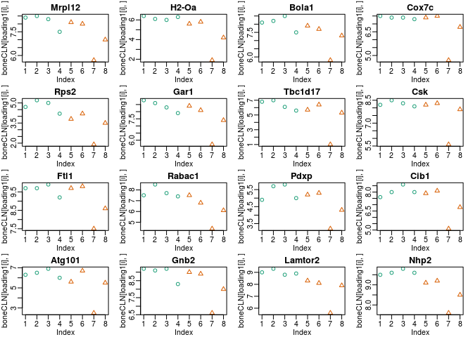

    ## [1] "LOADINGS PC 2"
    ## [1] "*************************Enriched Down for PC 2 *************************"


    ##                    pval
    ## GO:0050820 5.141139e-27
    ## GO:0031492 1.495594e-22
    ## GO:0006342 1.104275e-18
    ## GO:0042775 4.730700e-16
    ## GO:0008376 7.167746e-15
    ## GO:0001848 4.015287e-13
    ## GO:0005798 3.349770e-12
    ## GO:0043256 4.839155e-12
    ## GO:0006336 5.435259e-12
    ## GO:0034724 5.435259e-12
    ## GO:0003727 1.187831e-10
    ## GO:0002251 6.534908e-10
    ## GO:0035335 1.209878e-09
    ## GO:0045259 1.900510e-09
    ## GO:0034122 2.421363e-09
    ## GO:0045746 4.925256e-09
    ## GO:0036503 4.971826e-09
    ## GO:0070207 5.617687e-09
    ## GO:0061298 8.623451e-09
    ## GO:0001881 1.008699e-08
    ## GO:0090484 1.365810e-08
    ## GO:0030552 1.665551e-08
    ## GO:0060713 2.918809e-08
    ## GO:0031123 3.195090e-08
    ## GO:0019843 3.972289e-08
    ##                                                                   Term
    ## GO:0050820                          positive regulation of coagulation
    ## GO:0031492                                     nucleosomal DNA binding
    ## GO:0006342                                         chromatin silencing
    ## GO:0042775      mitochondrial ATP synthesis coupled electron transport
    ## GO:0008376                    acetylgalactosaminyltransferase activity
    ## GO:0001848                                          complement binding
    ## GO:0005798                                    Golgi-associated vesicle
    ## GO:0043256                                             laminin complex
    ## GO:0006336             DNA replication-independent nucleosome assembly
    ## GO:0034724         DNA replication-independent nucleosome organization
    ## GO:0003727                                 single-stranded RNA binding
    ## GO:0002251                    organ or tissue specific immune response
    ## GO:0035335                         peptidyl-tyrosine dephosphorylation
    ## GO:0045259                    proton-transporting ATP synthase complex
    ## GO:0034122 negative regulation of toll-like receptor signaling pathway
    ## GO:0045746              negative regulation of Notch signaling pathway
    ## GO:0036503                                                ERAD pathway
    ## GO:0070207                                   protein homotrimerization
    ## GO:0061298           retina vasculature development in camera-type eye
    ## GO:0001881                                          receptor recycling
    ## GO:0090484                                   drug transporter activity
    ## GO:0030552                                                cAMP binding
    ## GO:0060713                            labyrinthine layer morphogenesis
    ## GO:0031123                                       RNA 3'-end processing
    ## GO:0019843                                                rRNA binding
    ## [1] "*************************Enriched Up for PC 2 *************************"


    ##                    pval
    ## GO:0010800 0.000000e+00
    ## GO:0030101 0.000000e+00
    ## GO:0005771 0.000000e+00
    ## GO:0031646 4.440892e-16
    ## GO:0001191 3.301803e-13
    ## GO:0032182 7.376322e-13
    ## GO:0097546 1.492029e-11
    ## GO:0007212 1.649703e-11
    ## GO:0042403 2.605391e-10
    ## GO:0042147 5.541776e-10
    ## GO:0034113 8.356733e-10
    ## GO:0030968 1.058154e-09
    ## GO:0050853 2.381793e-09
    ## GO:0005200 2.791314e-08
    ## GO:0042481 3.803354e-08
    ## GO:0099622 4.522837e-08
    ## GO:0055072 4.732425e-08
    ## GO:0030497 8.086319e-08
    ## GO:0005793 8.443633e-08
    ## GO:0016836 9.285385e-08
    ## GO:0006509 1.248916e-07
    ## GO:1901071 1.851046e-07
    ## GO:0016891 4.430776e-07
    ## GO:0032355 2.823323e-06
    ## GO:0048305 5.739825e-06
    ##                                                                                          Term
    ## GO:0010800                          positive regulation of peptidyl-threonine phosphorylation
    ## GO:0030101                                                     natural killer cell activation
    ## GO:0005771                                                                multivesicular body
    ## GO:0031646                                 positive regulation of neurological system process
    ## GO:0001191 transcriptional repressor activity, RNA polymerase II transcription factor binding
    ## GO:0032182                                                     ubiquitin-like protein binding
    ## GO:0097546                                                                       ciliary base
    ## GO:0007212                                                dopamine receptor signaling pathway
    ## GO:0042403                                                  thyroid hormone metabolic process
    ## GO:0042147                                            retrograde transport, endosome to Golgi
    ## GO:0034113                                                     heterotypic cell-cell adhesion
    ## GO:0030968                                    endoplasmic reticulum unfolded protein response
    ## GO:0050853                                                  B cell receptor signaling pathway
    ## GO:0005200                                             structural constituent of cytoskeleton
    ## GO:0042481                                                        regulation of odontogenesis
    ## GO:0099622                                        cardiac muscle cell membrane repolarization
    ## GO:0055072                                                               iron ion homeostasis
    ## GO:0030497                                                              fatty acid elongation
    ## GO:0005793                               endoplasmic reticulum-Golgi intermediate compartment
    ## GO:0016836                                                               hydro-lyase activity
    ## GO:0006509                                            membrane protein ectodomain proteolysis
    ## GO:1901071                                  glucosamine-containing compound metabolic process
    ## GO:0016891                          endoribonuclease activity, producing 5'-phosphomonoesters
    ## GO:0032355                                                              response to estradiol
    ## GO:0048305                                                           immunoglobulin secretion

    ## Loading necessary libraries...

    ## Loaded Package org.Mm.eg.db

    ## Converting annotations to data.frames ...

    ## iteration 1 done; time  2.61 sec 
    ## iteration 2 done; time  1.69 sec 
    ## iteration 3 done; time  1.75 sec 
    ## iteration 4 done; time  1.72 sec 
    ## iteration 5 done; time  2.09 sec 
    ## iteration 6 done; time  1.85 sec 
    ## iteration 7 done; time  1.76 sec 
    ## iteration 8 done; time  2.04 sec 
    ## iteration 9 done; time  1.94 sec 
    ## iteration 10 done; time  1.86 sec

    ## Labeling output ...

    ## Loaded Package GO.db


    ## [1] "LOADINGS PC 3"
    ## [1] "*************************Enriched Down for PC 3 *************************"


    ##                    pval
    ## GO:0046885 2.338255e-27
    ## GO:0044062 5.350673e-16
    ## GO:0001881 6.910544e-15
    ## GO:0038065 7.110091e-15
    ## GO:0015026 3.566085e-12
    ## GO:0008376 8.644259e-12
    ## GO:0031312 1.121044e-11
    ## GO:0048024 1.142227e-11
    ## GO:0016646 1.282837e-11
    ## GO:0048488 2.044837e-07
    ## GO:0002021 2.058414e-07
    ## GO:0001958 2.573959e-07
    ## GO:0036075 2.573959e-07
    ## GO:0035456 6.718150e-07
    ## GO:0042056 1.143574e-06
    ## GO:0010765 1.834045e-06
    ## GO:0001191 2.602512e-06
    ## GO:0005385 5.315469e-06
    ## GO:0019748 6.478479e-06
    ## GO:0005583 1.014807e-05
    ## GO:0098643 1.014807e-05
    ## GO:0003730 1.946384e-05
    ## GO:0030971 3.816649e-05
    ## GO:0005112 4.700904e-05
    ## GO:0006888 7.439968e-05
    ##                                                                                             Term
    ## GO:0046885                                            regulation of hormone biosynthetic process
    ## GO:0044062                                                               regulation of excretion
    ## GO:0001881                                                                    receptor recycling
    ## GO:0038065                                                  collagen-activated signaling pathway
    ## GO:0015026                                                                   coreceptor activity
    ## GO:0008376                                              acetylgalactosaminyltransferase activity
    ## GO:0031312                                             extrinsic component of organelle membrane
    ## GO:0048024                                          regulation of mRNA splicing, via spliceosome
    ## GO:0016646 oxidoreductase activity, acting on the CH-NH group of donors, NAD or NADP as acceptor
    ## GO:0048488                                                          synaptic vesicle endocytosis
    ## GO:0002021                                                            response to dietary excess
    ## GO:0001958                                                             endochondral ossification
    ## GO:0036075                                                              replacement ossification
    ## GO:0035456                                                           response to interferon-beta
    ## GO:0042056                                                              chemoattractant activity
    ## GO:0010765                                           positive regulation of sodium ion transport
    ## GO:0001191    transcriptional repressor activity, RNA polymerase II transcription factor binding
    ## GO:0005385                                           zinc ion transmembrane transporter activity
    ## GO:0019748                                                           secondary metabolic process
    ## GO:0005583                                                             fibrillar collagen trimer
    ## GO:0098643                                                                banded collagen fibril
    ## GO:0003730                                                                   mRNA 3'-UTR binding
    ## GO:0030971                                                      receptor tyrosine kinase binding
    ## GO:0005112                                                                         Notch binding
    ## GO:0006888                                                ER to Golgi vesicle-mediated transport
    ## [1] "*************************Enriched Up for PC 3 *************************"


    ##                    pval
    ## GO:0017144 0.000000e+00
    ## GO:0008373 0.000000e+00
    ## GO:0016805 0.000000e+00
    ## GO:0008569 0.000000e+00
    ## GO:0035458 0.000000e+00
    ## GO:0045601 0.000000e+00
    ## GO:0061900 0.000000e+00
    ## GO:0070542 0.000000e+00
    ## GO:0060669 2.220446e-16
    ## GO:0001786 4.662937e-15
    ## GO:0006826 2.382539e-13
    ## GO:0031901 1.458389e-12
    ## GO:0004181 5.615286e-12
    ## GO:0005089 3.161094e-11
    ## GO:0034505 8.669820e-11
    ## GO:0006213 1.543847e-10
    ## GO:0042246 4.122191e-10
    ## GO:0031123 9.074974e-10
    ## GO:0005164 1.018907e-09
    ## GO:0042403 1.421206e-09
    ## GO:0007212 1.562438e-09
    ## GO:0035929 4.889881e-09
    ## GO:0032182 5.591791e-09
    ## GO:0016667 6.921822e-09
    ## GO:0031941 8.701504e-09
    ##                                                                    Term
    ## GO:0017144                                       drug metabolic process
    ## GO:0008373                                   sialyltransferase activity
    ## GO:0016805                                         dipeptidase activity
    ## GO:0008569 ATP-dependent microtubule motor activity, minus-end-directed
    ## GO:0035458                         cellular response to interferon-beta
    ## GO:0045601               regulation of endothelial cell differentiation
    ## GO:0061900                                        glial cell activation
    ## GO:0070542                                       response to fatty acid
    ## GO:0060669                             embryonic placenta morphogenesis
    ## GO:0001786                                   phosphatidylserine binding
    ## GO:0006826                                           iron ion transport
    ## GO:0031901                                      early endosome membrane
    ## GO:0004181                             metallocarboxypeptidase activity
    ## GO:0005089               Rho guanyl-nucleotide exchange factor activity
    ## GO:0034505                                         tooth mineralization
    ## GO:0006213                      pyrimidine nucleoside metabolic process
    ## GO:0042246                                          tissue regeneration
    ## GO:0031123                                        RNA 3'-end processing
    ## GO:0005164                       tumor necrosis factor receptor binding
    ## GO:0042403                            thyroid hormone metabolic process
    ## GO:0007212                          dopamine receptor signaling pathway
    ## GO:0035929                                    steroid hormone secretion
    ## GO:0032182                               ubiquitin-like protein binding
    ## GO:0016667  oxidoreductase activity, acting on a sulfur group of donors
    ## GO:0031941                                            filamentous actin

    ## Loading necessary libraries...

    ## Loaded Package org.Mm.eg.db

    ## Converting annotations to data.frames ...

    ## iteration 1 done; time  1.75 sec 
    ## iteration 2 done; time  1.95 sec 
    ## iteration 3 done; time  2.15 sec 
    ## iteration 4 done; time  2.91 sec 
    ## iteration 5 done; time  1.82 sec 
    ## iteration 6 done; time  1.71 sec 
    ## iteration 7 done; time  2.02 sec 
    ## iteration 8 done; time  1.71 sec 
    ## iteration 9 done; time  1.95 sec 
    ## iteration 10 done; time  2.73 sec

    ## Labeling output ...

    ## Loaded Package GO.db


    ## [1] "LOADINGS PC 4"
    ## [1] "*************************Enriched Down for PC 4 *************************"


    ##                    pval
    ## GO:0000049 1.675808e-31
    ## GO:0042278 8.004842e-16
    ## GO:0006024 1.078986e-09
    ## GO:0032590 5.407825e-09
    ## GO:0034644 5.605207e-09
    ## GO:0097150 1.928004e-08
    ## GO:0042181 1.304775e-06
    ## GO:0048305 7.250023e-06
    ## GO:0120033 7.854826e-06
    ## GO:1900077 1.110572e-05
    ## GO:0090501 2.942812e-05
    ## GO:0007098 5.335510e-05
    ## GO:0001540 6.084666e-05
    ## GO:0016234 2.313841e-04
    ## GO:0007140 6.794481e-04
    ## GO:0140030 8.034988e-04
    ## GO:0051028 8.829881e-04
    ## GO:0000922 1.105754e-03
    ## GO:0030544 1.129751e-03
    ## GO:0030662 1.839162e-03
    ## GO:0050853 1.882080e-03
    ## GO:0032592 1.980832e-03
    ## GO:0007130 2.565254e-03
    ## GO:0032892 2.701334e-03
    ## GO:2001258 3.551801e-03
    ##                                                                               Term
    ## GO:0000049                                                            tRNA binding
    ## GO:0042278                                     purine nucleoside metabolic process
    ## GO:0006024                                  glycosaminoglycan biosynthetic process
    ## GO:0032590                                                       dendrite membrane
    ## GO:0034644                                                 cellular response to UV
    ## GO:0097150                               neuronal stem cell population maintenance
    ## GO:0042181                                             ketone biosynthetic process
    ## GO:0048305                                                immunoglobulin secretion
    ## GO:0120033 negative regulation of plasma membrane bounded cell projection assembly
    ## GO:1900077            negative regulation of cellular response to insulin stimulus
    ## GO:0090501                                      RNA phosphodiester bond hydrolysis
    ## GO:0007098                                                        centrosome cycle
    ## GO:0001540                                                    amyloid-beta binding
    ## GO:0016234                                                          inclusion body
    ## GO:0007140                                           male meiotic nuclear division
    ## GO:0140030                                  modification-dependent protein binding
    ## GO:0051028                                                          mRNA transport
    ## GO:0000922                                                            spindle pole
    ## GO:0030544                                                   Hsp70 protein binding
    ## GO:0030662                                                 coated vesicle membrane
    ## GO:0050853                                       B cell receptor signaling pathway
    ## GO:0032592                            integral component of mitochondrial membrane
    ## GO:0007130                                           synaptonemal complex assembly
    ## GO:0032892                           positive regulation of organic acid transport
    ## GO:2001258                          negative regulation of cation channel activity
    ## [1] "*************************Enriched Up for PC 4 *************************"


    ##                    pval
    ## GO:0002026 0.000000e+00
    ## GO:0005859 0.000000e+00
    ## GO:0097546 0.000000e+00
    ## GO:0006352 0.000000e+00
    ## GO:0005811 0.000000e+00
    ## GO:0030574 0.000000e+00
    ## GO:0070830 0.000000e+00
    ## GO:0016339 0.000000e+00
    ## GO:0035458 1.909584e-14
    ## GO:0043236 2.020606e-14
    ## GO:0071277 2.442491e-14
    ## GO:2000249 8.393286e-14
    ## GO:0005326 1.065814e-13
    ## GO:0014888 1.985079e-13
    ## GO:0001541 3.543832e-13
    ## GO:0051489 3.760769e-12
    ## GO:0006826 6.657586e-11
    ## GO:0003727 1.502537e-09
    ## GO:0019835 2.364963e-09
    ## GO:0030145 4.038722e-09
    ## GO:0010765 6.622302e-09
    ## GO:0060143 6.970130e-09
    ## GO:0046875 1.481876e-08
    ## GO:0030968 1.810729e-08
    ## GO:0043395 2.775179e-08
    ##                                                                                        Term
    ## GO:0002026                                     regulation of the force of heart contraction
    ## GO:0005859                                                            muscle myosin complex
    ## GO:0097546                                                                     ciliary base
    ## GO:0006352                                          DNA-templated transcription, initiation
    ## GO:0005811                                                                    lipid droplet
    ## GO:0030574                                                       collagen catabolic process
    ## GO:0070830                                               bicellular tight junction assembly
    ## GO:0016339 calcium-dependent cell-cell adhesion via plasma membrane cell adhesion molecules
    ## GO:0035458                                             cellular response to interferon-beta
    ## GO:0043236                                                                  laminin binding
    ## GO:0071277                                                 cellular response to calcium ion
    ## GO:2000249                                  regulation of actin cytoskeleton reorganization
    ## GO:0005326                                            neurotransmitter transporter activity
    ## GO:0014888                                                       striated muscle adaptation
    ## GO:0001541                                                     ovarian follicle development
    ## GO:0051489                                                regulation of filopodium assembly
    ## GO:0006826                                                               iron ion transport
    ## GO:0003727                                                      single-stranded RNA binding
    ## GO:0019835                                                                        cytolysis
    ## GO:0030145                                                            manganese ion binding
    ## GO:0010765                                      positive regulation of sodium ion transport
    ## GO:0060143             positive regulation of syncytium formation by plasma membrane fusion
    ## GO:0046875                                                          ephrin receptor binding
    ## GO:0030968                                  endoplasmic reticulum unfolded protein response
    ## GO:0043395                                             heparan sulfate proteoglycan binding

### Differential expression of Candice's data

Use a DESeq2 False Discovery Rate of .1, breaking into up and down in KO groups.

``` r
cond <- as.factor(SampleNameMat[3,])
dds <- DESeqDataSetFromMatrix(round(boneMat),colData = DataFrame(cond),design = ~cond)
```

    ## converting counts to integer mode

``` r
DESeqOutput <-  DESeq(dds)
```

    ## estimating size factors

    ## estimating dispersions

    ## gene-wise dispersion estimates

    ## mean-dispersion relationship

    ## final dispersion estimates

    ## fitting model and testing

``` r
resCandice <-  results(DESeqOutput)
write.table(resCandice[order(resCandice$log2FoldChange,decreasing = F),],paste0("~/Desktop/DEG","Ingraham",".txt"),sep = "\t",quote=F)
res <- resCandice[!is.na(resCandice$padj),]
res <- res[res$log2FoldChange<0,]


std.heatmap(log(boneMatNorm[rownames(res[order(res$pvalue,decreasing = F),])[1:25],]+1,2),main="Most significant DE genes\ndown in KO\nlog2(NormalizedCounts+1)",cexRow=.5)
```


``` r
std.heatmap(log(boneMatNorm[rownames(res[order(res$pvalue,decreasing = F),])[1:25],]+1,2)-rowMeans(log(boneMatNorm[rownames(res[order(res$pvalue,decreasing = F),])[1:25],]+1,2)),main="Most significant DE genes\ndown in KO\nlog2(FC)",cexRow=.5,breaks=seq(-4, 4, length.out=51))
```


``` r
res <-  results(DESeqOutput)
res <- res[!is.na(res$padj),]
boneUpDown <- list(rownames(res[res$padj<.1&res$log2FoldChange>0,]),rownames(res[res$padj<.1&res$log2FoldChange<0,]))
res <- res[res$log2FoldChange>0,]
std.heatmap(log(boneMatNorm[rownames(res[order(res$pvalue,decreasing = F),])[1:25],]+1,2)-rowMeans(log(boneMatNorm[rownames(res[order(res$pvalue,decreasing = F),])[1:25],]+1,2)),main="Most significant DE genes\nup in KO\nlog2(FC)",cexRow=.5,breaks=seq(-4, 4, length.out=51))
```


``` r
std.heatmap(log(boneMatNorm[rownames(res[order(res$pvalue,decreasing = F),])[1:25],]+1,2),main="Most significant DE genes\nup in KO\nlog2(normalized counts + 1)",cexRow=.5)
```


``` r
res <-  results(DESeqOutput)
res <- res[!is.na(res$padj),]


hist(res$log2FoldChange,main = "Log2 Fold Changes Detected",breaks = 40)
```


``` r
plot(res$log2FoldChange,-log(res$padj),ylab="-logPadj",xlab="logFC",main="Volcano Plot")
```


``` r
#ESR1 not differentially expressed
barplot((boneMatNorm["Esr1",]),main="Esr1")
```


``` r
barplot((boneMatNorm["Gper1",]),main="Gper1")
```

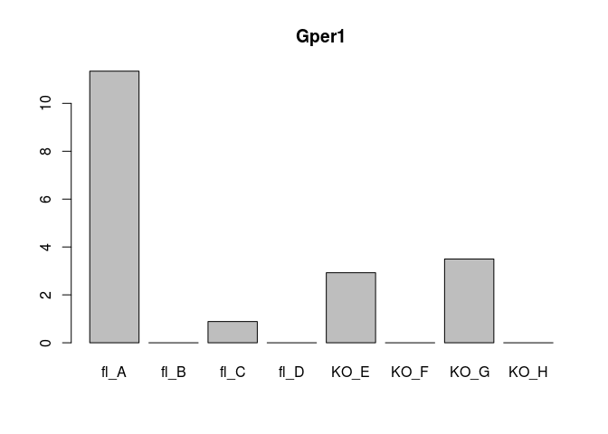

``` r
#Just a sanity Check
barplot(boneMatNorm["Ncoa1",],las=2,main="Ncoa1")
```

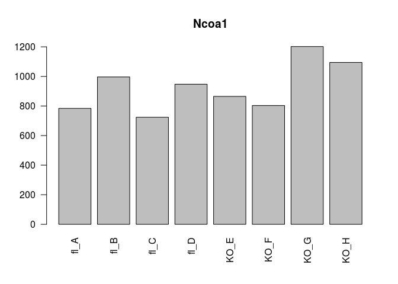

``` r
barplot(boneMatNorm["Ncoa2",],las=2,main="Ncoa2")
```

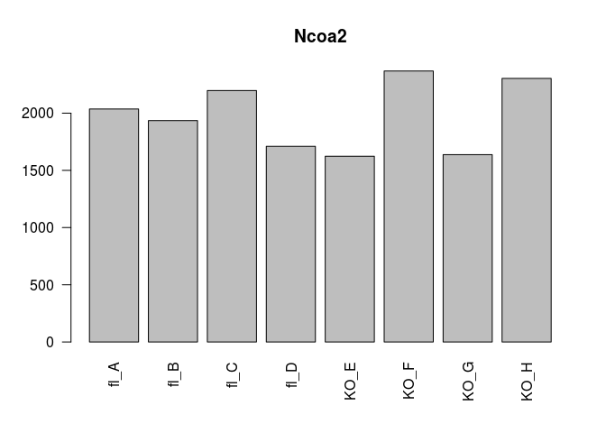

``` r
barplot(boneMatNorm["Ncoa3",],las=2,main="Ncoa3")
```


``` r
barplot((boneMatNorm["Kiss1",]),main="Kiss1")
```


``` r
#also a sanity check
std.heatmap(cor(ambrosiMatNorm,method = "spearman"))
```


``` r
# entrezmm <- getBM(attributes = c('mgi_symbol', "entrezgene"), filters = "mgi_symbol",
#                    values = rownames(res[res$padj<.1,]), mart = mart)
# eKG <- enrichKEGG(entrezmm$entrezgene[!is.na(entrezmm$entrezgene)],organism = "mmu",pvalueCutoff = .1)
# eKG
# eKG$Description
# eKG$geneID
```

``` r
library(ReactomePA)
getMatrixWithSelectedIds <- function(df, type, keys,db){
require("AnnotationDbi")
require(db,character.only = TRUE)
#library(AnnotationDbi)
#library(db,character.only = TRUE) 
db <- get(db)
geneSymbols <- mapIds(db, keys=rownames(df), column=type, keytype=keys, multiVals="first")
# get the entrez ids with gene symbols i.e. remove those with NA's for gene symbols
inds <- which(!is.na(geneSymbols))

found_genes <- geneSymbols[inds]
 
# subset your data frame based on the found_genes
df2 <- df[names(found_genes), ]
rownames(df2) <- found_genes
return(df2)
}

entrezres <- getMatrixWithSelectedIds(res,type = "ENTREZID","SYMBOL","org.Mm.eg.db")
```

    ## 'select()' returned 1:many mapping between keys and columns

``` r
as.data.frame(enrichPathway(rownames(entrezres)[entrezres$padj<.1],organism="mouse"))
```

    ##                          ID
    ## R-MMU-1799339 R-MMU-1799339
    ## R-MMU-975956   R-MMU-975956
    ## R-MMU-72689     R-MMU-72689
    ## R-MMU-156827   R-MMU-156827
    ## R-MMU-72706     R-MMU-72706
    ## R-MMU-927802   R-MMU-927802
    ## R-MMU-975957   R-MMU-975957
    ## R-MMU-72613     R-MMU-72613
    ## R-MMU-72737     R-MMU-72737
    ## R-MMU-1474244 R-MMU-1474244
    ## R-MMU-3000178 R-MMU-3000178
    ## R-MMU-2022090 R-MMU-2022090
    ## R-MMU-72695     R-MMU-72695
    ## R-MMU-1474290 R-MMU-1474290
    ## R-MMU-216083   R-MMU-216083
    ## R-MMU-72766     R-MMU-72766
    ## R-MMU-72649     R-MMU-72649
    ## R-MMU-72702     R-MMU-72702
    ## R-MMU-72662     R-MMU-72662
    ## R-MMU-1650814 R-MMU-1650814
    ## R-MMU-1474228 R-MMU-1474228
    ## R-MMU-8948216 R-MMU-8948216
    ##                                                                                                          Description
    ## R-MMU-1799339                                            SRP-dependent cotranslational protein targeting to membrane
    ## R-MMU-975956                            Nonsense Mediated Decay (NMD) independent of the Exon Junction Complex (EJC)
    ## R-MMU-72689                                                                 Formation of a pool of free 40S subunits
    ## R-MMU-156827                                       L13a-mediated translational silencing of Ceruloplasmin expression
    ## R-MMU-72706                                                  GTP hydrolysis and joining of the 60S ribosomal subunit
    ## R-MMU-927802                                                                           Nonsense-Mediated Decay (NMD)
    ## R-MMU-975957                               Nonsense Mediated Decay (NMD) enhanced by the Exon Junction Complex (EJC)
    ## R-MMU-72613                                                                        Eukaryotic Translation Initiation
    ## R-MMU-72737                                                                     Cap-dependent Translation Initiation
    ## R-MMU-1474244                                                                      Extracellular matrix organization
    ## R-MMU-3000178                                                                                      ECM proteoglycans
    ## R-MMU-2022090                                           Assembly of collagen fibrils and other multimeric structures
    ## R-MMU-72695                                      Formation of the ternary complex, and subsequently, the 43S complex
    ## R-MMU-1474290                                                                                     Collagen formation
    ## R-MMU-216083                                                                      Integrin cell surface interactions
    ## R-MMU-72766                                                                                              Translation
    ## R-MMU-72649                                                                 Translation initiation complex formation
    ## R-MMU-72702                                                           Ribosomal scanning and start codon recognition
    ## R-MMU-72662   Activation of the mRNA upon binding of the cap-binding complex and eIFs, and subsequent binding to 43S
    ## R-MMU-1650814                                                            Collagen biosynthesis and modifying enzymes
    ## R-MMU-1474228                                                                Degradation of the extracellular matrix
    ## R-MMU-8948216                                                                           Collagen chain trimerization
    ##               GeneRatio  BgRatio       pvalue     p.adjust       qvalue
    ## R-MMU-1799339     9/117  81/8657 1.274656e-06 0.0002090435 0.0001851605
    ## R-MMU-975956      9/117  81/8657 1.274656e-06 0.0002090435 0.0001851605
    ## R-MMU-72689       9/117  88/8657 2.579460e-06 0.0002820209 0.0002498003
    ## R-MMU-156827      9/117  98/8657 6.346482e-06 0.0003815006 0.0003379145
    ## R-MMU-72706       9/117  99/8657 6.902813e-06 0.0003815006 0.0003379145
    ## R-MMU-927802      9/117 101/8657 8.141781e-06 0.0003815006 0.0003379145
    ## R-MMU-975957      9/117 101/8657 8.141781e-06 0.0003815006 0.0003379145
    ## R-MMU-72613       9/117 106/8657 1.210079e-05 0.0004410067 0.0003906221
    ## R-MMU-72737       9/117 106/8657 1.210079e-05 0.0004410067 0.0003906221
    ## R-MMU-1474244    13/117 272/8657 7.282586e-05 0.0023886883 0.0021157829
    ## R-MMU-3000178     5/117  40/8657 1.866303e-04 0.0055649766 0.0049291834
    ## R-MMU-2022090     5/117  44/8657 2.950529e-04 0.0080647790 0.0071433858
    ## R-MMU-72695       5/117  47/8657 4.035283e-04 0.0101813294 0.0090181223
    ## R-MMU-1474290     6/117  74/8657 4.697276e-04 0.0110050459 0.0097477300
    ## R-MMU-216083      6/117  76/8657 5.423359e-04 0.0117021152 0.0103651598
    ## R-MMU-72766      10/117 212/8657 5.708349e-04 0.0117021152 0.0103651598
    ## R-MMU-72649       5/117  54/8657 7.717386e-04 0.0140627929 0.0124561324
    ## R-MMU-72702       5/117  54/8657 7.717386e-04 0.0140627929 0.0124561324
    ## R-MMU-72662       5/117  55/8657 8.398595e-04 0.0144986268 0.0128421727
    ## R-MMU-1650814     5/117  62/8657 1.449418e-03 0.0237704500 0.0210546990
    ## R-MMU-1474228     7/117 129/8657 1.768732e-03 0.0276259130 0.0244696790
    ## R-MMU-8948216     4/117  41/8657 2.182192e-03 0.0325345026 0.0288174670
    ##                                                                                        geneID
    ## R-MMU-1799339                          67115/19899/19951/11837/267019/66481/20088/27050/20103
    ## R-MMU-975956                           67115/19899/19951/11837/267019/66481/20088/27050/20103
    ## R-MMU-72689                            67115/19899/19951/11837/267019/66481/20088/27050/20103
    ## R-MMU-156827                           67115/19899/19951/11837/267019/66481/20088/27050/20103
    ## R-MMU-72706                            67115/19899/19951/11837/267019/66481/20088/27050/20103
    ## R-MMU-927802                           67115/19899/19951/11837/267019/66481/20088/27050/20103
    ## R-MMU-975957                           67115/19899/19951/11837/267019/66481/20088/27050/20103
    ## R-MMU-72613                            67115/19899/19951/11837/267019/66481/20088/27050/20103
    ## R-MMU-72737                            67115/19899/19951/11837/267019/66481/20088/27050/20103
    ## R-MMU-1474244 232345/12111/12159/12842/12824/12832/12837/13179/15891/319480/16613/16948/26433
    ## R-MMU-3000178                                                   12111/12842/12824/12832/13179
    ## R-MMU-2022090                                                   12842/12824/12832/12837/16948
    ## R-MMU-72695                                                    267019/66481/20088/27050/20103
    ## R-MMU-1474290                                             12842/12824/12832/12837/16948/26433
    ## R-MMU-216083                                             12842/12824/12832/12837/15891/319480
    ## R-MMU-72766                      66845/67115/19899/19951/11837/267019/66481/20088/27050/20103
    ## R-MMU-72649                                                    267019/66481/20088/27050/20103
    ## R-MMU-72702                                                    267019/66481/20088/27050/20103
    ## R-MMU-72662                                                    267019/66481/20088/27050/20103
    ## R-MMU-1650814                                                   12842/12824/12832/12837/26433
    ## R-MMU-1474228                                      232345/12842/12824/12832/12837/13179/16613
    ## R-MMU-8948216                                                         12842/12824/12832/12837
    ##               Count
    ## R-MMU-1799339     9
    ## R-MMU-975956      9
    ## R-MMU-72689       9
    ## R-MMU-156827      9
    ## R-MMU-72706       9
    ## R-MMU-927802      9
    ## R-MMU-975957      9
    ## R-MMU-72613       9
    ## R-MMU-72737       9
    ## R-MMU-1474244    13
    ## R-MMU-3000178     5
    ## R-MMU-2022090     5
    ## R-MMU-72695       5
    ## R-MMU-1474290     6
    ## R-MMU-216083      6
    ## R-MMU-72766      10
    ## R-MMU-72649       5
    ## R-MMU-72702       5
    ## R-MMU-72662       5
    ## R-MMU-1650814     5
    ## R-MMU-1474228     7
    ## R-MMU-8948216     4

``` r
eG <- enrichGO(rownames(res[res$padj<.1,]),OrgDb ='org.Mm.eg.db',keyType = "SYMBOL",ont = "BP")
dfGO <- as.data.frame(eG)
write.table(dfGO,file = "~/Desktop/CandiceGO.txt",quote = F,sep = "\t")
print(dfGO[1:30,])
```

    ##                    ID
    ## GO:0009615 GO:0009615
    ## GO:0051607 GO:0051607
    ## GO:0001649 GO:0001649
    ## GO:0030199 GO:0030199
    ## GO:0001503 GO:0001503
    ## GO:0042451 GO:0042451
    ## GO:0046129 GO:0046129
    ## GO:0048333 GO:0048333
    ## GO:0071346 GO:0071346
    ## GO:0006183 GO:0006183
    ## GO:0045992 GO:0045992
    ## GO:0001958 GO:0001958
    ## GO:0036075 GO:0036075
    ## GO:0072522 GO:0072522
    ## GO:0030198 GO:0030198
    ## GO:0043062 GO:0043062
    ## GO:1901070 GO:1901070
    ## GO:0042455 GO:0042455
    ## GO:0009148 GO:0009148
    ## GO:0034341 GO:0034341
    ## GO:0009163 GO:0009163
    ## GO:0044403 GO:0044403
    ## GO:0051216 GO:0051216
    ## GO:1901659 GO:1901659
    ## NA               <NA>
    ## NA.1             <NA>
    ## NA.2             <NA>
    ## NA.3             <NA>
    ## NA.4             <NA>
    ## NA.5             <NA>
    ##                                                        Description
    ## GO:0009615                                       response to virus
    ## GO:0051607                               defense response to virus
    ## GO:0001649                              osteoblast differentiation
    ## GO:0030199                            collagen fibril organization
    ## GO:0001503                                            ossification
    ## GO:0042451                  purine nucleoside biosynthetic process
    ## GO:0046129              purine ribonucleoside biosynthetic process
    ## GO:0048333                         mesodermal cell differentiation
    ## GO:0071346                   cellular response to interferon-gamma
    ## GO:0006183                                GTP biosynthetic process
    ## GO:0045992            negative regulation of embryonic development
    ## GO:0001958                               endochondral ossification
    ## GO:0036075                                replacement ossification
    ## GO:0072522         purine-containing compound biosynthetic process
    ## GO:0030198                       extracellular matrix organization
    ## GO:0043062                    extracellular structure organization
    ## GO:1901070      guanosine-containing compound biosynthetic process
    ## GO:0042455                     ribonucleoside biosynthetic process
    ## GO:0009148 pyrimidine nucleoside triphosphate biosynthetic process
    ## GO:0034341                            response to interferon-gamma
    ## GO:0009163                         nucleoside biosynthetic process
    ## GO:0044403    symbiosis, encompassing mutualism through parasitism
    ## GO:0051216                                   cartilage development
    ## GO:1901659                  glycosyl compound biosynthetic process
    ## NA                                                            <NA>
    ## NA.1                                                          <NA>
    ## NA.2                                                          <NA>
    ## NA.3                                                          <NA>
    ## NA.4                                                          <NA>
    ## NA.5                                                          <NA>
    ##            GeneRatio   BgRatio       pvalue     p.adjust       qvalue
    ## GO:0009615    16/226 246/23577 2.226839e-09 6.105993e-06 5.358478e-06
    ## GO:0051607    14/226 202/23577 1.027491e-08 1.408691e-05 1.236234e-05
    ## GO:0001649    12/226 224/23577 1.863234e-06 1.702996e-03 1.494510e-03
    ## GO:0030199     6/226  43/23577 3.290441e-06 2.255598e-03 1.979460e-03
    ## GO:0001503    14/226 395/23577 3.036210e-05 1.665058e-02 1.461216e-02
    ## GO:0042451     4/226  21/23577 4.328697e-05 1.695612e-02 1.488030e-02
    ## GO:0046129     4/226  21/23577 4.328697e-05 1.695612e-02 1.488030e-02
    ## GO:0048333     4/226  23/23577 6.308785e-05 2.162336e-02 1.897616e-02
    ## GO:0071346     6/226  75/23577 8.420468e-05 2.565436e-02 2.251367e-02
    ## GO:0006183     3/226  11/23577 1.354921e-04 3.411764e-02 2.994085e-02
    ## GO:0045992     4/226  28/23577 1.404942e-04 3.411764e-02 2.994085e-02
    ## GO:0001958     4/226  29/23577 1.617539e-04 3.411764e-02 2.994085e-02
    ## GO:0036075     4/226  29/23577 1.617539e-04 3.411764e-02 2.994085e-02
    ## GO:0072522    10/226 253/23577 1.752884e-04 3.433149e-02 3.012852e-02
    ## GO:0030198     9/226 209/23577 1.959074e-04 3.478969e-02 3.053063e-02
    ## GO:0043062     9/226 210/23577 2.030033e-04 3.478969e-02 3.053063e-02
    ## GO:1901070     3/226  13/23577 2.315448e-04 3.734682e-02 3.277471e-02
    ## GO:0042455     4/226  33/23577 2.704405e-04 4.014214e-02 3.522781e-02
    ## GO:0009148     3/226  14/23577 2.926120e-04 4.014214e-02 3.522781e-02
    ## GO:0034341     6/226  94/23577 2.927946e-04 4.014214e-02 3.522781e-02
    ## GO:0009163     4/226  35/23577 3.408971e-04 4.325393e-02 3.795865e-02
    ## GO:0044403    11/226 328/23577 3.470410e-04 4.325393e-02 3.795865e-02
    ## GO:0051216     8/226 182/23577 3.859822e-04 4.601579e-02 4.038240e-02
    ## GO:1901659     4/226  37/23577 4.235991e-04 4.839620e-02 4.247138e-02
    ## NA              <NA>      <NA>           NA           NA           NA
    ## NA.1            <NA>      <NA>           NA           NA           NA
    ## NA.2            <NA>      <NA>           NA           NA           NA
    ## NA.3            <NA>      <NA>           NA           NA           NA
    ## NA.4            <NA>      <NA>           NA           NA           NA
    ## NA.5            <NA>      <NA>           NA           NA           NA
    ##                                                                                                    geneID
    ## GO:0009615 Cxcl9/Ddx60/Eif2ak2/Gbp4/Ifih1/Ifit1/Isg15/Oas1a/Oas2/Oas3/Oasl2/Rps15a/Rtp4/Stat1/Tspan6/Zbp1
    ## GO:0051607              Cxcl9/Ddx60/Eif2ak2/Gbp4/Ifih1/Ifit1/Isg15/Oas2/Oas3/Oasl2/Rtp4/Stat1/Tspan6/Zbp1
    ## GO:0001649                            Bmp3/Bmp4/Bmpr1a/Cat/Col1a1/Ibsp/Id3/Itga11/Rack1/Runx2/Satb2/Sfrp2
    ## GO:0030199                                                           Col1a1/Col2a1/Col5a2/Lox/Plod3/Sfrp2
    ## GO:0001503               Bmp3/Bmp4/Bmpr1a/Cat/Col1a1/Col2a1/Ibsp/Id3/Isg15/Itga11/Rack1/Runx2/Satb2/Sfrp2
    ## GO:0042451                                                                             Aprt/Nme1/Nme6/Pnp
    ## GO:0046129                                                                             Aprt/Nme1/Nme6/Pnp
    ## GO:0048333                                                                        Bmp4/Bmpr1a/Inhba/Sfrp2
    ## GO:0071346                                                                Gbp10/Gbp4/Gbp7/Gbp8/Gbp9/Stat1
    ## GO:0006183                                                                                  Nme1/Nme6/Pnp
    ## GO:0045992                                                                         Bmp4/Col5a2/Fzd3/Sfrp2
    ## GO:0001958                                                                       Bmp4/Col1a1/Col2a1/Runx2
    ## GO:0036075                                                                       Bmp4/Col1a1/Col2a1/Runx2
    ## GO:0072522                                        Aprt/Atp5h/Gpr176/Nme1/Nme6/Oas1a/Oas2/Oasl2/Papss2/Pnp
    ## GO:0030198                                         Col1a1/Col2a1/Col5a2/Ibsp/Lox/Plod3/Postn/Sema5a/Sfrp2
    ## GO:0043062                                         Col1a1/Col2a1/Col5a2/Ibsp/Lox/Plod3/Postn/Sema5a/Sfrp2
    ## GO:1901070                                                                                  Nme1/Nme6/Pnp
    ## GO:0042455                                                                             Aprt/Nme1/Nme6/Pnp
    ## GO:0009148                                                                                Cmpk2/Nme1/Nme6
    ## GO:0034341                                                                Gbp10/Gbp4/Gbp7/Gbp8/Gbp9/Stat1
    ## GO:0009163                                                                             Aprt/Nme1/Nme6/Pnp
    ## GO:0044403                               Cul4a/Eif2ak2/Gbp7/Gbp9/Isg15/Oas1a/Oas3/Rab7/Stat1/Trim30a/Zbp1
    ## GO:0051216                                               Bmp3/Bmp4/Bmpr1a/Col1a1/Col2a1/Runx2/Satb2/Sfrp2
    ## GO:1901659                                                                             Aprt/Nme1/Nme6/Pnp
    ## NA                                                                                                   <NA>
    ## NA.1                                                                                                 <NA>
    ## NA.2                                                                                                 <NA>
    ## NA.3                                                                                                 <NA>
    ## NA.4                                                                                                 <NA>
    ## NA.5                                                                                                 <NA>
    ##            Count
    ## GO:0009615    16
    ## GO:0051607    14
    ## GO:0001649    12
    ## GO:0030199     6
    ## GO:0001503    14
    ## GO:0042451     4
    ## GO:0046129     4
    ## GO:0048333     4
    ## GO:0071346     6
    ## GO:0006183     3
    ## GO:0045992     4
    ## GO:0001958     4
    ## GO:0036075     4
    ## GO:0072522    10
    ## GO:0030198     9
    ## GO:0043062     9
    ## GO:1901070     3
    ## GO:0042455     4
    ## GO:0009148     3
    ## GO:0034341     6
    ## GO:0009163     4
    ## GO:0044403    11
    ## GO:0051216     8
    ## GO:1901659     4
    ## NA            NA
    ## NA.1          NA
    ## NA.2          NA
    ## NA.3          NA
    ## NA.4          NA
    ## NA.5          NA

``` r
ifnGenes <- Reduce(union,strsplit(dfGO[which(grepl(pattern = "defense|interferon|immune",dfGO[,2])),"geneID"],"/"))
repairGenes <- Reduce(union,strsplit(dfGO[which(grepl(pattern = "pyrimidine|repair",dfGO[,2])),"geneID"],"/"))
bmpGenes <- Reduce(union,strsplit(dfGO[which(grepl(pattern = "ossi|osteoblast|collagen|muscle",dfGO[,2])),"geneID"],"/"))
std.heatmap(log(boneMatNorm[ifnGenes,]+1,2)-rowMeans(log(boneMatNorm[ifnGenes,]+1,2)),main="IFN response\nLog2(FC) from mean",cexRow=.5,breaks=seq(-4, 4, length.out=51))
```

    ## Warning in heatmap.2(M, Rowv = F, Colv = F, trace = "none", col = cols, :
    ## Discrepancy: Rowv is FALSE, while dendrogram is `both'. Omitting row
    ## dendogram.

    ## Warning in heatmap.2(M, Rowv = F, Colv = F, trace = "none", col = cols, :
    ## Discrepancy: Colv is FALSE, while dendrogram is `column'. Omitting column
    ## dendogram.

    ## Warning in image.default(z = matrix(z, ncol = 1), col = col, breaks =
    ## tmpbreaks, : unsorted 'breaks' will be sorted before use


``` r
std.heatmap(log(boneMatNorm[repairGenes,]+1,2)-rowMeans(log(boneMatNorm[repairGenes,]+1,2)),main="DNA synth/repair\nLog2(FC) from mean",cexRow=.5,breaks=seq(-4, 4, length.out=51))
```

    ## Warning in heatmap.2(M, Rowv = F, Colv = F, trace = "none", col = cols, :
    ## Discrepancy: Rowv is FALSE, while dendrogram is `both'. Omitting row
    ## dendogram.

    ## Warning in heatmap.2(M, Rowv = F, Colv = F, trace = "none", col = cols, :
    ## Discrepancy: Colv is FALSE, while dendrogram is `column'. Omitting column
    ## dendogram.

    ## Warning in image.default(z = matrix(z, ncol = 1), col = col, breaks =
    ## tmpbreaks, : unsorted 'breaks' will be sorted before use


``` r
std.heatmap(log(boneMatNorm[bmpGenes,]+1,2)-rowMeans(log(boneMatNorm[bmpGenes,]+1,2)),main="BMP Related\nLog2(FC) from mean",cexRow=.5,breaks=seq(-4, 4, length.out=51))
```

    ## Warning in heatmap.2(M, Rowv = F, Colv = F, trace = "none", col = cols, :
    ## Discrepancy: Rowv is FALSE, while dendrogram is `both'. Omitting row
    ## dendogram.

    ## Warning in heatmap.2(M, Rowv = F, Colv = F, trace = "none", col = cols, :
    ## Discrepancy: Colv is FALSE, while dendrogram is `column'. Omitting column
    ## dendogram.

    ## Warning in image.default(z = matrix(z, ncol = 1), col = col, breaks =
    ## tmpbreaks, : unsorted 'breaks' will be sorted before use


``` r
std.heatmap(log(boneMatNorm[ifnGenes,]+1,2),main="IFN response\nLog2(normalized counts+1)",cexRow=.5)
```

    ## Warning in heatmap.2(M, Rowv = F, Colv = F, trace = "none", col = cols, :
    ## Discrepancy: Rowv is FALSE, while dendrogram is `both'. Omitting row
    ## dendogram.

    ## Warning in heatmap.2(M, Rowv = F, Colv = F, trace = "none", col = cols, :
    ## Discrepancy: Colv is FALSE, while dendrogram is `column'. Omitting column
    ## dendogram.


``` r
std.heatmap(log(boneMatNorm[repairGenes,]+1,2),main="DNA synth/repair\nLog2(normalized counts+1)",cexRow=.5)
```

    ## Warning in heatmap.2(M, Rowv = F, Colv = F, trace = "none", col = cols, :
    ## Discrepancy: Rowv is FALSE, while dendrogram is `both'. Omitting row
    ## dendogram.

    ## Warning in heatmap.2(M, Rowv = F, Colv = F, trace = "none", col = cols, :
    ## Discrepancy: Colv is FALSE, while dendrogram is `column'. Omitting column
    ## dendogram.

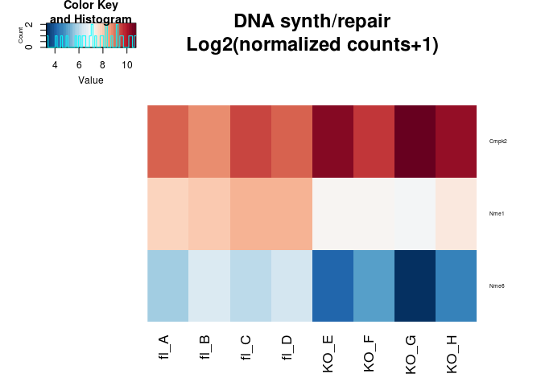

``` r
std.heatmap(log(boneMatNorm[bmpGenes,]+1,2),main="BMP Related\nLog2(normalized counts+1)",cexRow=.5)
```

    ## Warning in heatmap.2(M, Rowv = F, Colv = F, trace = "none", col = cols, :
    ## Discrepancy: Rowv is FALSE, while dendrogram is `both'. Omitting row
    ## dendogram.

    ## Warning in heatmap.2(M, Rowv = F, Colv = F, trace = "none", col = cols, :
    ## Discrepancy: Colv is FALSE, while dendrogram is `column'. Omitting column
    ## dendogram.

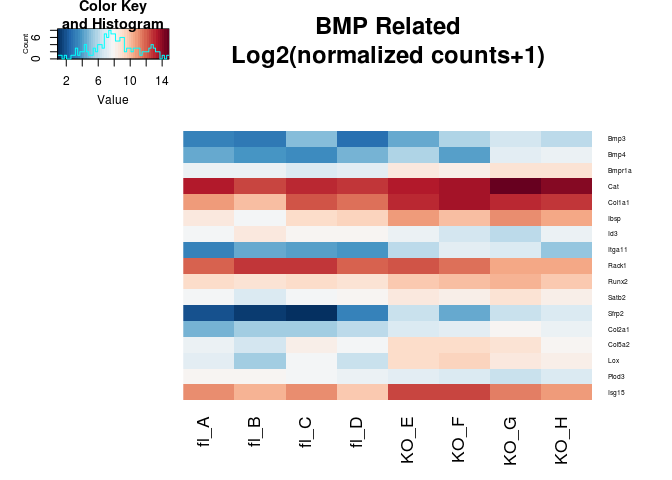

#### Candice DE in the Ambrosi

``` r
std.heatmap(log(ambrosiMatNorm[ifnGenes[ifnGenes%in%rownames(ambrosiMatNorm)],]+1,2)-rowMeans(log(ambrosiMatNorm[ifnGenes[ifnGenes%in%rownames(ambrosiMatNorm)],]+1,2)),main="IFN response\nLog2(FC) from mean",cexRow=.5)
```


``` r
std.heatmap(log(ambrosiMatNorm[bmpGenes[bmpGenes%in%rownames(ambrosiMatNorm)],]+1,2)-rowMeans(log(ambrosiMatNorm[bmpGenes[bmpGenes%in%rownames(ambrosiMatNorm)],]+1,2)),main="BMP Related\nLog2(FC) from mean",cexRow=.5)
```


``` r
std.heatmap(log(ambrosiMatNorm[repairGenes[repairGenes%in%rownames(ambrosiMatNorm)],]+1,2)-rowMeans(log(ambrosiMatNorm[repairGenes[repairGenes%in%rownames(ambrosiMatNorm)],]+1,2)),main="DNA synth/repair\nLog2(FC) from mean",cexRow=.5)
```

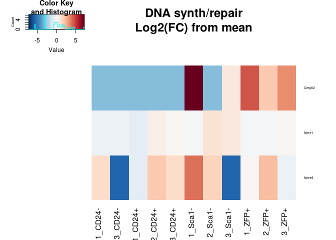

``` r
std.heatmap(log(ambrosiMatNorm[ifnGenes[ifnGenes%in%rownames(ambrosiMatNorm)],]+1,2),main="IFN response\nLog2(normalized counts+1)",cexRow=.5)
```


``` r
std.heatmap(log(ambrosiMatNorm[repairGenes[repairGenes%in%rownames(ambrosiMatNorm)],]+1,2),main="DNA synth/repair\nLog2(normalized counts+1)",cexRow=.5)
```

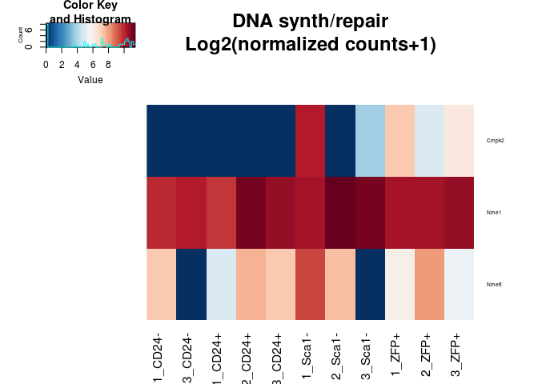

``` r
std.heatmap(log(ambrosiMatNorm[bmpGenes[bmpGenes%in%rownames(ambrosiMatNorm)],]+1,2),main="BMP Related\nLog2(normalized counts+1)",cexRow=.5)
```


Ncoa1/2/3, the Steroid receptor coactivators are equally expressed across the conditions as well.

Overlap
-------

So what overlaps in the up/down for each sorted cell type and the KO vs fl data?

Note: Sca1minus is osteo, ZFP (mature) and CD24- (less mature) are adipocytes, cd24+ is multipotent progenitor

``` r
overlaps <- lapply(1:2,function(u){
  a <- sapply(ambrosiUpDown,function(x){
    c("up"=sum(boneUpDown[[u]]%in%x[[1]]), "down"=sum(boneUpDown[[u]]%in%x[[2]]))
  })
  colnames(a) <- sort(unique(sapply(strsplit(colnames(ambrosiMatNorm),"_"),function(x)x[2])))
  a
})
#Up in KO
print(overlaps[[1]])
```

    ##      CD24- CD24+ Sca1- ZFP+
    ## up      11    14    14   10
    ## down     3    17    11   13

``` r
#Down in KO
print(overlaps[[2]])
```

    ##      CD24- CD24+ Sca1- ZFP+
    ## up       1     5     0    4
    ## down     2     3     2    1

Not much. If you get loose, maybe one could say that that are up in the new data are more likely to be up in the osteocytes and down in the preadipocytes. Which genes are they?

``` r
overlaps <- lapply(1:2,function(u){
  a <- sapply(ambrosiUpDown,function(x){
    c("up"=boneUpDown[[u]][boneUpDown[[u]]%in%x[[1]]], "down"=boneUpDown[[u]][boneUpDown[[u]]%in%x[[2]]])
  })
  names(a) <- sort(unique(sapply(strsplit(colnames(ambrosiMatNorm),"_"),function(x)x[2])))
  a
})
#Up in KO
print(overlaps[[1]])
```

    ## $`CD24-`
    ##        up1        up2        up3        up4        up5        up6 
    ##    "Cadm3" "Calcoco1"     "Ccr9"   "Clec4e"      "Dcn"    "Evi2b" 
    ##        up7        up8      down1      down2      down3      down4 
    ##   "Jchain"    "Pqlc3"    "Cmpk2"     "Myl1"    "Oasl2"   "Tceanc" 
    ## 
    ## $`CD24+`
    ##       up1       up2       up3       up4       up5       up6       up7 
    ##     "A2m"  "Col2a1"   "Evi2b"  "Fkbp1b"   "Gvin1"    "Ibsp"    "Lifr" 
    ##       up8       up9      up10      up11      up12      up13      up14 
    ##   "Lpin1" "mt-Cytb" "mt-Nd4l"  "mt-Nd5"  "mt-Nd6"   "Oasl2"  "Papss2" 
    ##      up15      up16      up17     down1     down2     down3     down4 
    ##    "Peg3"   "Satb2"     "Ttn"   "Cadm3"   "Chit1"   "Cmpk2"  "Col1a1" 
    ##     down5     down6     down7     down8     down9    down10    down11 
    ##  "Col5a2"     "Dcn"  "Fam78b"  "Ifi207"   "Ifit1"   "Inhba"     "Lox" 
    ##    down12    down13    down14    down15    down16    down17    down18 
    ##    "Mlip"    "Myl1"    "Oas3"   "Postn"   "Pqlc3"      "Xk" "Zscan29" 
    ## 
    ## $`Sca1-`
    ##        up1        up2        up3        up4        up5        up6 
    ##     "Bmp3"    "Chit1"     "Cir1"    "Cmpk2"   "Col1a1"   "Col2a1" 
    ##        up7        up8        up9       up10       up11       up12 
    ##   "Gm2810"     "Ibsp"     "Mlip"  "mt-Cytb"  "mt-Nd4l"   "mt-Nd5" 
    ##       up13       up14       up15       up16       up17       up18 
    ##   "mt-Nd6"     "Myl1"     "Oas3"    "Satb2"    "Smpd3"   "Tceanc" 
    ##       up19      down1      down2      down3      down4      down5 
    ##       "Xk" "Calcoco1"     "Ccr9"    "Cerkl"    "Ddx60"    "Evi2b" 
    ##      down6      down7      down8      down9     down10     down11 
    ##   "Fkbp1b"    "Gvin1"   "Jchain"     "Pi15"     "Zbp1"   "Zfp125" 
    ## 
    ## $`ZFP+`
    ##        up1        up2        up3        up4        up5        up6 
    ##    "Cadm3"    "Cmpk2"      "Dcn"   "Fam78b"   "Fkbp1b"     "Myl1" 
    ##        up7        up8        up9      down1      down2      down3 
    ##     "Oas2"    "Pcsk6"    "Pqlc3" "Cacna2d4"    "Cadm1"     "Ccr9" 
    ##      down4      down5      down6      down7      down8      down9 
    ##   "Col2a1"   "Dixdc1"     "Ibsp"     "Lifr"  "mt-Cytb"   "mt-Nd4" 
    ##     down10     down11     down12     down13     down14     down15 
    ##  "mt-Nd4l"   "mt-Nd5"   "mt-Nd6"   "Papss2"     "Peg3"    "Satb2" 
    ##     down16     down17 
    ##    "Smpd3"       "Xk"

``` r
#Down in KO
print(overlaps[[2]])
```

    ## $`CD24-`
    ##       up    down1    down2    down3 
    ##   "Ly6d" "Rpl35a"  "Rpl39" "Rps15a" 
    ## 
    ## $`CD24+`
    ##       up1       up2       up3       up4       up5       up6       up7 
    ## "Adamts1"    "Cst3" "Eif2ak4"   "Nop10"    "Scd2"  "Tspan6"  "Zfp108" 
    ##     down1     down2     down3     down4 
    ##   "Romo1" "S100a10"  "S100a4"   "Sap30" 
    ## 
    ## $`Sca1-`
    ##       up1       up2     down1     down2 
    ##    "Emg1" "Tmem147"    "Ly6d" "Rarres2" 
    ## 
    ## $`ZFP+`
    ##       up1       up2       up3       up4       up5       up6     down1 
    ##   "Atox1"  "Mrpl33" "Rarres2"   "Romo1" "S100a10"  "S100a4"    "Cst3" 
    ##     down2 
    ##  "Gemin6"

Nothing jumps out at me...

Receptor search
---------------

Let's check the expression of a list of hormone receptors I compiled:

``` r
save.image("~/code/IngrahamLab/BoneNotebook_cache/markdown_github/everything.RData")
load("~/code/IngrahamLab/BoneNotebook_cache/markdown_github/everything.RData")
#I looked through the literature and found what may be all the hormone receptors
receptors <- c("Esr1","Esr2","Gper1","Esrra","Esrrb","Pgr","Gnrhr","Trhr","Trhr2","Lhcgr","Ghrhr","Ghr","Ghsr","Nr4a1","Fshr","Prlhr","Pth1r","Pth2r","Prlr","Thra","Thrb","Trhr","Tshr","Crhr1","Crhr2","Mc2r",    "Mchr1","Trhr2","Mc1r","Znhit3","Kiss1r","Ar")
print(receptors)
```

    ##  [1] "Esr1"   "Esr2"   "Gper1"  "Esrra"  "Esrrb"  "Pgr"    "Gnrhr" 
    ##  [8] "Trhr"   "Trhr2"  "Lhcgr"  "Ghrhr"  "Ghr"    "Ghsr"   "Nr4a1" 
    ## [15] "Fshr"   "Prlhr"  "Pth1r"  "Pth2r"  "Prlr"   "Thra"   "Thrb"  
    ## [22] "Trhr"   "Tshr"   "Crhr1"  "Crhr2"  "Mc2r"   "Mchr1"  "Trhr2" 
    ## [29] "Mc1r"   "Znhit3" "Kiss1r" "Ar"

``` r
std.heatmap(log(boneMatNorm[receptors[receptors%in%rownames(boneMatNorm)],]+1,2))
```

    ## Warning in heatmap.2(M, Rowv = F, Colv = F, trace = "none", col = cols, :
    ## Discrepancy: Rowv is FALSE, while dendrogram is `both'. Omitting row
    ## dendogram.

    ## Warning in heatmap.2(M, Rowv = F, Colv = F, trace = "none", col = cols, :
    ## Discrepancy: Colv is FALSE, while dendrogram is `column'. Omitting column
    ## dendogram.

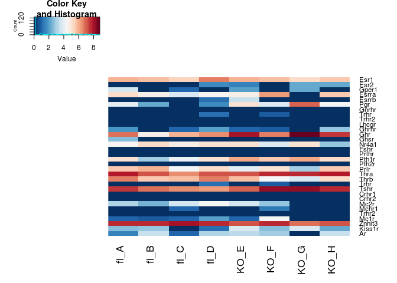

``` r
std.heatmap(log(ambrosiMatNorm[receptors[receptors%in%rownames(ambrosiMatNorm)],]+1,2))
```

    ## Warning in heatmap.2(M, Rowv = F, Colv = F, trace = "none", col = cols, :
    ## Discrepancy: Rowv is FALSE, while dendrogram is `both'. Omitting row
    ## dendogram.

    ## Warning in heatmap.2(M, Rowv = F, Colv = F, trace = "none", col = cols, :
    ## Discrepancy: Colv is FALSE, while dendrogram is `column'. Omitting column
    ## dendogram.


``` r
heatmap.2(boneMatNorm[rownames(boneMatNorm)[grepl("Wnt|Bmp|Tgf",rownames(boneMatNorm))],],trace = "none",col = cols,main="Wnt,TGFB Expression")
```


Now let's broaden the search to all the paracrine, autocrine etc receptors annotated!

``` r
descriptions <- getBM(c("mgi_symbol","mgi_description"),filters =c("mgi_symbol"),values=rownames(boneMat) ,mart = mart)
descriptions <- descriptions[!duplicated(descriptions$mgi_symbol),]
rownames(descriptions) <- descriptions$mgi_symbol
descriptions[descriptions$mgi_symbol %in% receptors,]
```

    ##        mgi_symbol                                 mgi_description
    ## Ar             Ar                                                
    ## Crhr1       Crhr1                                                
    ## Crhr2       Crhr2                                                
    ## Esr1         Esr1                                                
    ## Esr2         Esr2                                                
    ## Esrra       Esrra                                                
    ## Esrrb       Esrrb                                                
    ## Fshr         Fshr                                                
    ## Ghr           Ghr                                                
    ## Ghrhr       Ghrhr                                                
    ## Ghsr         Ghsr                                                
    ## Gnrhr       Gnrhr         gonadotropin releasing hormone receptor
    ## Gper1       Gper1           G protein-coupled estrogen receptor 1
    ## Kiss1r     Kiss1r                                                
    ## Lhcgr       Lhcgr                                                
    ## Mc1r         Mc1r                                                
    ## Mc2r         Mc2r                         melanocortin 2 receptor
    ## Mchr1       Mchr1                                                
    ## Nr4a1       Nr4a1 nuclear receptor subfamily 4, group A, member 1
    ## Pgr           Pgr                                                
    ## Prlhr       Prlhr                                                
    ## Prlr         Prlr                              prolactin receptor
    ## Pth1r       Pth1r                                                
    ## Pth2r       Pth2r                                                
    ## Thra         Thra                                                
    ## Thrb         Thrb                                                
    ## Trhr         Trhr          thyrotropin releasing hormone receptor
    ## Trhr2       Trhr2        thyrotropin releasing hormone receptor 2
    ## Tshr         Tshr            thyroid stimulating hormone receptor
    ## Znhit3     Znhit3                         zinc finger, HIT type 3

``` r
recdesc <- descriptions[grepl("receptor",descriptions$mgi_description),]
recdesc <- recdesc[!grepl("interactor|non-receptor|interacting|ligand|associated",recdesc$mgi_description),]

#There are lots of receptors expressed in the bone stromal cell populations
heatmap.2(log(ambrosiMatNorm[recdesc$mgi_symbol[recdesc$mgi_symbol%in%rownames(ambrosiMatNorm)],]+1,2),Rowv=T,Colv = F,trace = "none",col=cols)
```

    ## Warning in heatmap.2(log(ambrosiMatNorm[recdesc$mgi_symbol[recdesc
    ## $mgi_symbol %in% : Discrepancy: Colv is FALSE, while dendrogram is `both'.
    ## Omitting column dendogram.


``` r
hordesc <- descriptions[grepl("hormone",descriptions$mgi_description),]

resCandiceSub <- resCandice[!is.na(resCandice$padj),] 
resCandiceSub <- resCandiceSub[resCandiceSub$padj<.15,] 
resCandiceSub <-  resCandiceSub[order(resCandiceSub$log2FoldChange,decreasing = T),]

#DE receptors hard coded above
print(rownames(resCandiceSub)[rownames(resCandiceSub)%in%receptors])
```

    ## [1] "Pgr" "Ghr"

``` r
#From the list of all receptors
print(rownames(resCandiceSub)[rownames(resCandiceSub)%in%recdesc$mgi_symbol])
```

    ## [1] "Chrm3"  "Vldlr"  "Smo"    "Rara"   "Tlr7"   "Gpr176"

``` r
dereceptors <-  c(rownames(resCandiceSub)[rownames(resCandiceSub)%in%recdesc$mgi_symbol],rownames(resCandiceSub)[rownames(resCandiceSub)%in%receptors])
#reverse order
dereceptors <- rownames(resCandiceSub)[rownames(resCandiceSub)%in%dereceptors]

std.heatmap(log(boneMatNorm[dereceptors[dereceptors%in%rownames(boneMatNorm)],]+1,2)-rowMeans(log(boneMatNorm[dereceptors[dereceptors%in%rownames(boneMatNorm)],]+1,2)),main="Differentially expressed receptors\n Bone marrow (FDR .15)\nlog2FC from mean")
```

    ## Warning in heatmap.2(M, Rowv = F, Colv = F, trace = "none", col = cols, :
    ## Discrepancy: Rowv is FALSE, while dendrogram is `both'. Omitting row
    ## dendogram.

    ## Warning in heatmap.2(M, Rowv = F, Colv = F, trace = "none", col = cols, :
    ## Discrepancy: Colv is FALSE, while dendrogram is `column'. Omitting column
    ## dendogram.


``` r
std.heatmap(log(ambrosiMatNorm[dereceptors[dereceptors%in%rownames(ambrosiMatNorm)],]+1,2)-rowMeans(log(ambrosiMatNorm[dereceptors[dereceptors%in%rownames(ambrosiMatNorm)],]+1,2)),main="Differentially expressed receptors\n Ambrosi  (FDR .15)\nlog2FC from mean")
```

    ## Warning in heatmap.2(M, Rowv = F, Colv = F, trace = "none", col = cols, :
    ## Discrepancy: Rowv is FALSE, while dendrogram is `both'. Omitting row
    ## dendogram.

    ## Warning in heatmap.2(M, Rowv = F, Colv = F, trace = "none", col = cols, :
    ## Discrepancy: Colv is FALSE, while dendrogram is `column'. Omitting column
    ## dendogram.


``` r
print(descriptions[dereceptors,])
```

    ##        mgi_symbol                             mgi_description
    ## Pgr           Pgr                                            
    ## Chrm3       Chrm3 cholinergic receptor, muscarinic 3, cardiac
    ## Ghr           Ghr                                            
    ## Vldlr       Vldlr       very low density lipoprotein receptor
    ## Smo           Smo         smoothened, frizzled class receptor
    ## Rara         Rara               retinoic acid receptor, alpha
    ## Tlr7         Tlr7                        toll-like receptor 7
    ## Gpr176     Gpr176              G protein-coupled receptor 176

``` r
eacivector <- resCandiceSub$log2FoldChange
names(eacivector) <- rownames(resCandiceSub)


boneEACI <- eacitest(eacivector,"org.Mm.eg","SYMBOL",sets = "GO")
```

    ## Loading necessary libraries...

    ## Loaded Package org.Mm.eg.db

    ## Converting annotations to data.frames ...

    ## iteration 1 done; time  0.23 sec 
    ## iteration 2 done; time  0.49 sec 
    ## iteration 3 done; time  0.18 sec 
    ## iteration 4 done; time  0.49 sec 
    ## iteration 5 done; time  0.12 sec 
    ## iteration 6 done; time  0.12 sec 
    ## iteration 7 done; time  0.12 sec 
    ## iteration 8 done; time  0.12 sec 
    ## iteration 9 done; time  0.13 sec 
    ## iteration 10 done; time  0.14 sec

    ## Labeling output ...

    ## Loaded Package GO.db

``` r
print(boneEACI$setscores[1:30,])
```

    ##                                                                                      Term
    ## GO:0044456                                                                   synapse part
    ## GO:0070011                            peptidase activity, acting on L-amino acid peptides
    ## GO:0031589                                                        cell-substrate adhesion
    ## GO:0031346                            positive regulation of cell projection organization
    ## GO:0003725                                                    double-stranded RNA binding
    ## GO:0008289                                                                  lipid binding
    ## GO:0043292                                                              contractile fiber
    ## GO:0006897                                                                    endocytosis
    ## GO:0048511                                                               rhythmic process
    ## GO:0005126                                                      cytokine receptor binding
    ## GO:0004857                                                      enzyme inhibitor activity
    ## GO:0051020                                                                 GTPase binding
    ## GO:0048285                                                              organelle fission
    ## GO:0015934                                                        large ribosomal subunit
    ## GO:0006839                                                        mitochondrial transport
    ## GO:0003682                                                              chromatin binding
    ## GO:0070469                                                              respiratory chain
    ## GO:0007517                                                       muscle organ development
    ## GO:0051346                                      negative regulation of hydrolase activity
    ## GO:0044432                                                     endoplasmic reticulum part
    ## GO:1901615                                     organic hydroxy compound metabolic process
    ## GO:0005773                                                                        vacuole
    ## GO:0031226                                         intrinsic component of plasma membrane
    ## GO:0045121                                                                  membrane raft
    ## GO:0098857                                                           membrane microdomain
    ## GO:0007600                                                             sensory perception
    ## GO:0016829                                                                 lyase activity
    ## GO:0009152                                     purine ribonucleotide biosynthetic process
    ## GO:0000981 RNA polymerase II transcription factor activity, sequence-specific DNA binding
    ## GO:0006325                                                         chromatin organization
    ##            Ontology   set.mean    set.sd set.size         pval
    ## GO:0044456       CC  1.4021958 1.1535155       13 0.000000e+00
    ## GO:0070011       MF  1.1932907 1.0707763        4 0.000000e+00
    ## GO:0031589       BP  1.1796034 0.8807410       13 0.000000e+00
    ## GO:0031346       BP  1.0097962 0.8762130       11 2.220446e-15
    ## GO:0003725       MF  0.8836846 0.4521339       11 3.905321e-12
    ## GO:0008289       MF  0.7630567 0.9956575        9 2.099222e-09
    ## GO:0043292       CC  0.7434354 0.5832729        7 5.369112e-09
    ## GO:0006897       BP  0.6978860 0.7024761       14 4.341871e-08
    ## GO:0048511       BP -0.6847921 0.8612042        9 5.958651e-08
    ## GO:0005126       MF  0.6746831 0.4542752       11 1.199993e-07
    ## GO:0004857       MF  0.6692819 1.4068318        9 1.513317e-07
    ## GO:0051020       MF  0.6390920 0.5134720        9 5.358341e-07
    ## GO:0048285       BP  0.6283689 0.4026522       11 8.285866e-07
    ## GO:0015934       CC -0.5949243 0.3765945        7 2.455115e-06
    ## GO:0006839       BP -0.5888330 0.6144943        8 3.103944e-06
    ## GO:0003682       MF  0.5392705 0.3400453       11 2.375036e-05
    ## GO:0070469       CC -0.5067074 0.3429066        7 5.903980e-05
    ## GO:0007517       BP -0.4979733 0.3734811       11 7.887717e-05
    ## GO:0051346       BP  0.4970068 0.6027853       11 9.889216e-05
    ## GO:0044432       CC -0.4528897 0.6106888       12 3.275230e-04
    ## GO:1901615       BP -0.4456942 0.3241906       10 4.065527e-04
    ## GO:0005773       CC  0.4455356 0.4953795       10 4.872535e-04
    ## GO:0031226       CC  0.4422767 0.4906612       21 5.362058e-04
    ## GO:0045121       CC  0.4246746 0.7436941       10 8.896886e-04
    ## GO:0098857       CC  0.4246746 0.7436941       10 8.896886e-04
    ## GO:0007600       BP  0.3945984 0.3165507        9 2.026982e-03
    ## GO:0016829       MF -0.3796242 0.4090610        6 2.568782e-03
    ## GO:0009152       BP -0.3771328 0.7547641        9 2.740085e-03
    ## GO:0000981       MF  0.3362194 0.2375340       13 8.634765e-03
    ## GO:0006325       BP  0.3169518 1.2919026       10 1.334807e-02

``` r
print("done")
```

    ## [1] "done"

``` r
std.heatmap(cor.compare(boneMatNorm,ambrosiMatNorm,method="spearman"))
```

    ## [1] "Num Genes:"
    ## [1] 21553

    ## Warning in heatmap.2(M, Rowv = F, Colv = F, trace = "none", col = cols, :
    ## Discrepancy: Rowv is FALSE, while dendrogram is `both'. Omitting row
    ## dendogram.

    ## Warning in heatmap.2(M, Rowv = F, Colv = F, trace = "none", col = cols, :
    ## Discrepancy: Colv is FALSE, while dendrogram is `column'. Omitting column
    ## dendogram.


``` r
IngrahamMatLog <- log(boneMatNorm+1,2)
AmbrosiMatLog <- log(ambrosiMatNorm+1,2)

informativeList <- unlist(union(unlist(ambrosiUpDown),unlist(boneUpDown)))
std.heatmap(cor.compare(AmbrosiMatLog-rowMeans(AmbrosiMatLog),IngrahamMatLog-rowMeans(IngrahamMatLog),interest.set = informativeList,method="spearman"))
```

    ## [1] "Num Genes:"
    ## [1] 3713

    ## Warning in heatmap.2(M, Rowv = F, Colv = F, trace = "none", col = cols, :
    ## Discrepancy: Rowv is FALSE, while dendrogram is `both'. Omitting row
    ## dendogram.

    ## Warning in heatmap.2(M, Rowv = F, Colv = F, trace = "none", col = cols, :
    ## Discrepancy: Colv is FALSE, while dendrogram is `column'. Omitting column
    ## dendogram.


``` r
goresultsup <- getBM(attributes = c( 'mgi_symbol', 'go_id', 'name_1006'), filters = 'mgi_symbol',
                 values = rownames(resCandiceSub[resCandiceSub$log2FoldChange>0,]), mart = mart)

goresultsdown <- getBM(attributes = c( 'mgi_symbol', 'go_id', 'name_1006'), filters = 'mgi_symbol',
                 values = rownames(resCandiceSub[resCandiceSub$log2FoldChange<0,]), mart = mart)
```

``` r
sort(table(goresultsup$name_1006),decreasing = T)[15:50]
```

    ## 
    ##                                                          ATP binding 
    ##                                                                   28 
    ##                                                   biological_process 
    ##                                                                   28 
    ##                                                   cellular_component 
    ##                                                                   28 
    ##                                                        intracellular 
    ##                                                                   25 
    ##                                                        mitochondrion 
    ##                                                                   24 
    ##                                                 transferase activity 
    ##                                                                   24 
    ##                           regulation of transcription, DNA-templated 
    ##                                                                   23 
    ##                                            defense response to virus 
    ##                                                                   21 
    ##                                                          nucleoplasm 
    ##                                                                   21 
    ## positive regulation of transcription from RNA polymerase II promoter 
    ##                                                                   21 
    ##                                          oxidation-reduction process 
    ##                                                                   20 
    ##                                                            transport 
    ##                                                                   19 
    ##                                                endoplasmic reticulum 
    ##                                                                   18 
    ##                                               innate immune response 
    ##                                                                   18 
    ##                                              oxidoreductase activity 
    ##                                                                   18 
    ##                                    protein homodimerization activity 
    ##                                                                   18 
    ##                                                          RNA binding 
    ##                                                                   18 
    ##                                            identical protein binding 
    ##                                                                   17 
    ##                                                immune system process 
    ##                                                                   17 
    ## negative regulation of transcription from RNA polymerase II promoter 
    ##                                                                   17 
    ##                                                  signal transduction 
    ##                                                                   16 
    ##                                         transcription, DNA-templated 
    ##                                                                   16 
    ##                                                          DNA binding 
    ##                                                                   15 
    ##                                   multicellular organism development 
    ##                                                                   15 
    ##                                                 nucleic acid binding 
    ##                                                                   15 
    ##                                                   hydrolase activity 
    ##                                                                   14 
    ##         transcription factor activity, sequence-specific DNA binding 
    ##                                                                   14 
    ##                                                 cell differentiation 
    ##                                                                   13 
    ##                                                         cytoskeleton 
    ##                                                                   13 
    ##                                                          GTP binding 
    ##                                                                   13 
    ##                                                      immune response 
    ##                                                                   13 
    ##                  positive regulation of transcription, DNA-templated 
    ##                                                                   13 
    ##                                                 extracellular matrix 
    ##                                                                   11 
    ##                                                      Golgi apparatus 
    ##                                                                   11 
    ##                                integral component of plasma membrane 
    ##                                                                   11 
    ##                             intracellular membrane-bounded organelle 
    ##                                                                   11

``` r
sort(table(goresultsdown$name_1006),decreasing = T)[15:50]
```

    ## 
    ##                              intracellular 
    ##                                         37 
    ##                                nucleoplasm 
    ##                                         35 
    ##                          metal ion binding 
    ##                                         33 
    ##             integral component of membrane 
    ##                                         29 
    ##                         biological_process 
    ##                                         26 
    ##                            plasma membrane 
    ##                                         23 
    ##               mitochondrial inner membrane 
    ##                                         22 
    ##                                  nucleolus 
    ##                                         22 
    ##                      endoplasmic reticulum 
    ##                                         21 
    ##                             focal adhesion 
    ##                                         21 
    ## regulation of transcription, DNA-templated 
    ##                                         19 
    ##               transcription, DNA-templated 
    ##                                         18 
    ##          cytosolic large ribosomal subunit 
    ##                                         17 
    ##                                DNA binding 
    ##                                         17 
    ##                       extracellular matrix 
    ##                                         17 
    ##                       transferase activity 
    ##                                         17 
    ##                       extracellular region 
    ##                                         14 
    ##                         cellular_component 
    ##                                         13 
    ##          cytosolic small ribosomal subunit 
    ##                                         13 
    ##                         hydrolase activity 
    ##                                         13 
    ##                            rRNA processing 
    ##                                         13 
    ##                                  transport 
    ##                                         13 
    ##                  identical protein binding 
    ##                                         12 
    ##                oxidation-reduction process 
    ##                                         12 
    ##                         nucleotide binding 
    ##                                         11 
    ##          protein homodimerization activity 
    ##                                         11 
    ##                            mRNA processing 
    ##                                         10 
    ##                          apoptotic process 
    ##                                          9 
    ##             endoplasmic reticulum membrane 
    ##                                          9 
    ##                        extracellular space 
    ##                                          9 
    ##            perinuclear region of cytoplasm 
    ##                                          9 
    ##  positive regulation of cell proliferation 
    ##                                          9 
    ##                               RNA splicing 
    ##                                          9 
    ##                                ATP binding 
    ##                                          8 
    ##                               cytoskeleton 
    ##                                          8 
    ##                       nucleic acid binding 
    ##                                          8

``` r
library(GOsummaries)
gs = gosummaries(list(rownames(resCandiceSub[resCandiceSub$log2FoldChange>0,]),rownames(resCandiceSub[resCandiceSub$log2FoldChange<0,])),organism = "mmusculus")
plot(gs, fontsize = 8)
```


``` r
ind <- intersect(rownames(boneMatNorm),rownames(ambrosiMatNorm))

coefMat <- sapply(1:ncol(boneMatNorm),function(i)coef(lm(y~.+0,data=log(data.frame(y= boneMatNorm[ind,i],ambrosiMatNorm[ind,])+1,2))))

std.heatmap(coefMat)
```

    ## Warning in heatmap.2(M, Rowv = F, Colv = F, trace = "none", col = cols, :
    ## Discrepancy: Rowv is FALSE, while dendrogram is `both'. Omitting row
    ## dendogram.

    ## Warning in heatmap.2(M, Rowv = F, Colv = F, trace = "none", col = cols, :
    ## Discrepancy: Colv is FALSE, while dendrogram is `column'. Omitting column
    ## dendogram.


``` r
boneMatNormLog <- log(boneMatNorm+1,2)
ambrosiMatNormLog <- log(ambrosiMatNorm+1,2)


costF <- function(x,y, theta){
  (cor(t(y*mean(theta)),colSums(x*theta),method = "pearson")+1)/2
}

x=t(ambrosiMatNormLog[ind,])
y=t(boneMatNormLog[ind,1])
burnin <- 2000

if(!file.exists("~/Optimat.Rds")){
optiMat <- apply(boneMatNormLog[ind,],2,function(y){
paramtocost <- matrix(integer(0),nrow = 0,ncol=12)
for(i in 1:3000){
  if(i%%100 == 0)print(i)
  if(nrow(paramtocost)>burnin){
    currentParam <- sapply(1:nrow(x),function(j){
      p <- smooth.spline(paramtocost[,j] , paramtocost[,12])
      p <- predict(p,1:10000)
      py <- (p$y - min(p$y))/(max(p$y)-min(p$y))
      sample(1:10000,1,replace = T,prob = (py)/(sum(py)))
    })
  }else if(i==1)currentParam <- rep(1,nrow(x))
  else if(i==2)currentParam <- rep(10000,nrow(x))
  else{currentParam <- sample(1:10000,nrow(x),replace = T)}
  cost <- costF(t(ambrosiMatNormLog[ind,]),t(boneMatNormLog[ind,1]),currentParam)
  paramtocost <- rbind(paramtocost,c(currentParam,cost))
}
paramtocost <- paramtocost[order(paramtocost[,ncol(paramtocost)]),]
print(paramtocost[nrow(paramtocost),ncol(paramtocost)]*2-1)
print(cor(t(x),y))
paramtocost[nrow(paramtocost),]
})

saveRDS(optiMat,file = "~/Optimat.Rds")
}
optiMat <- readRDS("~/Optimat.Rds")
std.heatmap(cor.compare(ambrosiMatNormLog,boneMatNormLog,min = 1),method="pearson")
```

    ## [1] "Num Genes:"
    ## [1] 18791

    ## Warning in heatmap.2(M, Rowv = F, Colv = F, trace = "none", col = cols, :
    ## Discrepancy: Rowv is FALSE, while dendrogram is `both'. Omitting row
    ## dendogram.

    ## Warning in heatmap.2(M, Rowv = F, Colv = F, trace = "none", col = cols, :
    ## Discrepancy: Colv is FALSE, while dendrogram is `column'. Omitting column
    ## dendogram.

    ## Warning in plot.window(...): "method" is not a graphical parameter

    ## Warning in plot.xy(xy, type, ...): "method" is not a graphical parameter

    ## Warning in title(...): "method" is not a graphical parameter


``` r
normOptiMat <- sapply(1:ncol(optiMat),function(i) optiMat[-12,i]/sum(optiMat[-12,i]))
colnames(normOptiMat) <- colnames(optiMat)
rownames(normOptiMat) <- colnames(ambrosiMatNorm)
std.heatmap(normOptiMat)
```

    ## Warning in heatmap.2(M, Rowv = F, Colv = F, trace = "none", col = cols, :
    ## Discrepancy: Rowv is FALSE, while dendrogram is `both'. Omitting row
    ## dendogram.

    ## Warning in heatmap.2(M, Rowv = F, Colv = F, trace = "none", col = cols, :
    ## Discrepancy: Colv is FALSE, while dendrogram is `column'. Omitting column
    ## dendogram.


``` r
ARs <- read.table("~/code/IngrahamLabData/AR.csv",header = T,sep=",",stringsAsFactors = F)
PRs <- read.table("~/code/IngrahamLabData/PR.csv",header = T,sep=",",stringsAsFactors = F)
RARs <- read.table("~/code/IngrahamLabData/RARs.csv",header = T,sep=",",stringsAsFactors = F)
ERs <- read.table("~/code/IngrahamLabData/ERs.csv",header = T,sep=",",stringsAsFactors = F)


recList <- list(ARs,PRs,RARs,ERs)
names(recList) <- c("ARs","PRs","RARs","ERs")

OverlapNames <-  lapply(recList,function(x){
  x <- x[x$Gene%in%rownames(resCandice),]
  arvp <- cbind(resCandice[x$Gene,"padj"],x$LogCPValue)
  rownames(arvp) <- x$Gene
  arvp[is.na(arvp)] <- 1
  arvp[,1] <- log(arvp[,1])
  #cor(arvp,method = "spe")
  #plot(arvp,xlab="IngrahamLogPval",ylab="NursaLogPval")
  #abline(v =-2.31,col=2)
  #abline(h=-2.31,col=2)
  rownames(arvp)[arvp[,1]< -2.31&arvp[,2]< -2.31]
})

names(OverlapNames) <- names(recList)
venn(OverlapNames,names = names(recList))
```


``` r
ARs <- ARs[ARs$Gene%in%rownames(resCandice),]
arvp <- cbind(resCandice[ARs$Gene,"padj"],ARs$LogCPValue)
rownames(arvp) <- ARs$Gene
arvp[is.na(arvp)] <- 1
arvp[,1] <- log(arvp[,1])
cor(arvp,method = "spe")
```

    ##            [,1]       [,2]
    ## [1,] 1.00000000 0.09289192
    ## [2,] 0.09289192 1.00000000

``` r
plot(arvp,xlab="IngrahamLogPval",ylab="NursaLogPval",main="Androgen Receptor")
abline(v =-2.31,col=2)
abline(h=-2.31,col=2)
```


``` r
rownames(arvp)[arvp[,1]< -2.31&arvp[,2]< -2.31]
```

    ##  [1] "Smpdl3a"       "Zfp51"         "Tex15"         "Nme1"         
    ##  [5] "Plac8"         "Herpud1"       "Cir1"          "Ndrg2"        
    ##  [9] "Ifit1"         "Lpin1"         "Sfrp2"         "2010107E04Rik"
    ## [13] "Postn"         "Nme6"          "Vldlr"         "Ly6d"         
    ## [17] "Cd209g"        "Greb1"         "Tomm6"         "Mag"          
    ## [21] "Fbxw5"         "Gjb3"          "Tex2"          "Marc2"        
    ## [25] "Gbp7"          "Cxcl9"         "Trim30a"       "Samd5"        
    ## [29] "Calcoco1"      "Sv2b"          "Gpr176"        "Scn4b"        
    ## [33] "S100a4"        "Slc31a2"       "Amacr"         "Ifih1"        
    ## [37] "Zmynd10"       "Pi15"          "Cd33"          "Ccdc134"      
    ## [41] "Dixdc1"        "Il31ra"        "Gbp8"          "Timm10"       
    ## [45] "Cul4a"         "Slc4a5"        "H2afv"         "Mien1"        
    ## [49] "Bgn"           "Arpc5l"        "Scd2"          "Sowaha"       
    ## [53] "Stat1"         "Erp29"         "Sap30"         "Gbp4"         
    ## [57] "S100a10"       "Card6"         "Neb"           "Ndufa1"       
    ## [61] "Plod3"         "Aprt"          "Ptpre"         "1700021F05Rik"
    ## [65] "Isg15"         "Pcdhb18"       "Oasl2"         "Sec16b"       
    ## [69] "Trim30d"       "Cadm3"         "Oas3"          "Rpl14"        
    ## [73] "Cd3d"          "Frrs1"         "Commd4"        "Ugt8a"        
    ## [77] "Dcn"           "Krtcap2"       "Tspan6"        "Urm1"         
    ## [81] "Cat"           "Cox7a2l"       "Papss2"        "Id3"          
    ## [85] "Rps3"          "Ap2s1"         "Pnp"           "Cmah"         
    ## [89] "Col1a1"        "Inhba"         "Rock1"         "Bmp4"         
    ## [93] "Herc6"         "Gpx3"

``` r
PRs <- PRs[PRs$Gene%in%rownames(resCandice),]
prvp <- cbind(resCandice[PRs$Gene,"padj"],PRs$LogCPValue)
rownames(prvp) <- PRs$Gene
prvp[is.na(prvp)] <- 1
prvp[,1] <- log(prvp[,1])
plot(prvp,xlab="IngrahamLogPval",ylab="NursaLogPval",main="Progesterone Receptor")
abline(v =-2.31,col=2)
abline(h=-2.31,col=2)
```

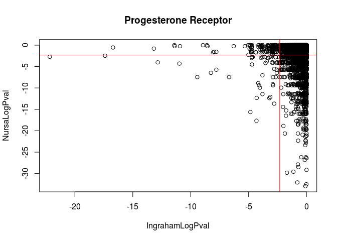

``` r
rownames(prvp)[prvp[,1]< -2.31&prvp[,2]< -2.31]
```

    ##  [1] "Lpin1"    "Gjb3"     "Cd3d"     "Plac8"    "Cd209g"   "Gpx3"    
    ##  [7] "Bex6"     "Gbp8"     "Smpdl3a"  "Ndrg2"    "Pgr"      "Col8a1"  
    ## [13] "Id3"      "Ly6d"     "Cox7a2l"  "Postn"    "Col5a2"   "Gngt2"   
    ## [19] "Calcoco1" "Zmynd10"  "Sec16b"   "Col1a1"   "Nap1l2"   "Sv2b"    
    ## [25] "Gbp4"     "Acadvl"   "Frrs1"    "Arpc5l"   "Marc2"    "H2afv"   
    ## [31] "Sfrp2"    "Scd2"     "Bgn"      "Tomm6"    "Stat1"    "Dennd2a" 
    ## [37] "Card6"    "Scn4b"    "Neb"      "Trim30a"  "Grcc10"   "Ndufb5"  
    ## [43] "Mag"      "S100a10"  "Zfp51"    "Ugt8a"    "Gbp7"     "Sap30"   
    ## [49] "Ifit1"    "Herpud1"  "Slc31a2"  "Pi15"

``` r
heatmap.2(log(boneMatNorm[rownames(prvp)[prvp[,1]< -3&prvp[,2]< -3],]+1,2)-rowMeans(log(boneMatNorm[rownames(prvp)[prvp[,1]< -3&prvp[,2]< -3],]+1,2)),main="PR Related\nLog2(FC) from mean",cexRow=.5,breaks=seq(-4, 4, length.out=51),Rowv = T,Colv = F,trace="none",col=cols)
```

    ## Warning in heatmap.2(log(boneMatNorm[rownames(prvp)[prvp[, 1] < -3 &
    ## prvp[, : Discrepancy: Colv is FALSE, while dendrogram is `both'. Omitting
    ## column dendogram.


``` r
RARs <- RARs[RARs$Gene%in%rownames(resCandice),]
rarvp <- cbind(resCandice[RARs$Gene,"padj"],RARs$LogCPValue)
rownames(rarvp) <- RARs$Gene
rarvp[is.na(rarvp)] <- 1
rarvp[,1] <- log(rarvp[,1])
plot(rarvp,xlab="IngrahamLogPval",ylab="NursaLogPval",main="RA Receptor")
abline(v =-2.31,col=2)
abline(h=-2.31,col=2)
```


``` r
rownames(rarvp)[rarvp[,1]< -2.31&rarvp[,2]< -2.31]
```

    ##  [1] "Lifr"          "Gpx3"          "Tmem176a"      "Id3"          
    ##  [5] "Gjb3"          "Smpdl3a"       "Postn"         "Ndrg2"        
    ##  [9] "1700021F05Rik" "A2m"           "Bmp4"          "Amacr"        
    ## [13] "Sap30"         "Marveld2"      "Ndc1"          "Cxcl9"        
    ## [17] "Fmo5"          "Timm10"        "Plac8"         "Pqlc3"        
    ## [21] "Pnp"           "Lpin1"         "Tor3a"         "Nap1l2"       
    ## [25] "Stat1"         "Bgn"           "Nop10"         "Herpud1"      
    ## [29] "Mzb1"          "Card6"         "Man1c1"        "Slco4c1"      
    ## [33] "4930447C04Rik" "Mtus1"         "Radil"         "L1cam"        
    ## [37] "Tex15"         "Kcnj10"        "Cir1"          "Rps21"        
    ## [41] "Zmynd10"       "Oas3"          "Oasl2"         "Atp5h"        
    ## [45] "Slc31a2"       "Oas2"          "Ddx60"         "Rps15a"       
    ## [49] "Mag"           "Acadvl"        "Nme1"          "Col2a1"       
    ## [53] "Sfrp2"         "Tspan6"        "Ugt8a"         "Eif2ak2"      
    ## [57] "Pcsk6"         "Col5a2"        "Dsg2"          "Frrs1"        
    ## [61] "Xrcc6"

``` r
ERs <- ERs[ERs$Gene%in%rownames(resCandice),]
ervp <- cbind(resCandice[ERs$Gene,"padj"],ERs$LogCPValue)
rownames(ervp) <- ERs$Gene
ervp[is.na(ervp)] <- 1
ervp[,1] <- log(ervp[,1])
plot(ervp,xlab="IngrahamLogPval",ylab="NursaLogPval",main="Estrogen Receptor")
abline(v =-2.31,col=2)
abline(h=-2.31,col=2)
```


``` r
rownames(ervp)[ervp[,1]< -2.31&ervp[,2]< -2.31]
```

    ##   [1] "Id3"           "Timm10"        "Tmem176a"      "Sfrp2"        
    ##   [5] "H2afv"         "Pqlc3"         "Smpdl3a"       "Ifit1"        
    ##   [9] "Ndrg2"         "Herpud1"       "Pnp"           "Dcn"          
    ##  [13] "Greb1"         "Mtus1"         "Bmp4"          "Marc2"        
    ##  [17] "Plac8"         "Cpt1a"         "Nme1"          "Pgr"          
    ##  [21] "Lpin1"         "Gpx3"          "Gjb3"          "Cox7a2l"      
    ##  [25] "Krtcap2"       "Rps21"         "Rps5"          "Col1a1"       
    ##  [29] "Mien1"         "Ghr"           "Nme6"          "Col5a2"       
    ##  [33] "Dennd2a"       "Slc31a2"       "Tomm6"         "Rtp4"         
    ##  [37] "Frrs1"         "Runx2"         "Snap23"        "Ly6d"         
    ##  [41] "S100a10"       "Amacr"         "Plod3"         "Chil5"        
    ##  [45] "Itga11"        "Vldlr"         "Dsg2"          "Sec16b"       
    ##  [49] "Rpl14"         "Rgmb"          "Col8a1"        "Ndufa1"       
    ##  [53] "Limch1"        "Ndufb5"        "Slfn4"         "Inhba"        
    ##  [57] "Ndc1"          "Marveld2"      "Grcc10"        "Nop10"        
    ##  [61] "Sema5a"        "Bgn"           "Oas1a"         "Commd4"       
    ##  [65] "D8Ertd738e"    "Pfdn5"         "Gbp7"          "Ppp1r35"      
    ##  [69] "2010107E04Rik" "Ifih1"         "Oas2"          "Urm1"         
    ##  [73] "Klf7"          "Tex2"          "Postn"         "Pcsk6"        
    ##  [77] "Calcoco1"      "Radil"         "Isg15"         "Cxcl9"        
    ##  [81] "Sap30"         "Col2a1"        "Ap2s1"         "Arpc5l"       
    ##  [85] "Scd2"          "Zfp108"        "2410015M20Rik" "Rab7"         
    ##  [89] "Fmo5"          "Gpr176"        "Zmynd10"       "Cir1"         
    ##  [93] "Ccdc134"       "Nrp2"          "Cat"           "Papss2"       
    ##  [97] "Acadvl"        "Gngt2"         "Sv2b"          "Xrcc6"        
    ## [101] "Klk1b11"       "1700021F05Rik" "Atp5h"         "L1cam"        
    ## [105] "Aprt"          "Oasl2"         "Il1f9"         "Card6"        
    ## [109] "Scn4b"         "Lox"           "Eif2ak2"       "Erp29"        
    ## [113] "S100a4"        "Terf2"         "Gbp9"          "Cd209g"       
    ## [117] "Gbp4"          "Vpreb1"        "Tspan6"        "Nap1l2"       
    ## [121] "Ccdc58"        "Rps24"         "Bmp3"          "Cadm3"        
    ## [125] "Oas3"          "Cmc2"          "Herc6"         "Tor3a"        
    ## [129] "Tomm7"         "Trim30b"       "Fam78b"        "Rps15a"       
    ## [133] "Cpa6"          "4930447C04Rik" "Bbs7"          "Tmem258"      
    ## [137] "Cd3d"          "Dhdh"          "Zbp1"          "Stat1"        
    ## [141] "Dgkg"          "Fgd4"          "Cmpk2"         "Rps3"         
    ## [145] "Cul4a"         "Sf3b5"         "Mag"           "Ppp1r3d"      
    ## [149] "Tceanc"        "Slco4c1"       "A2m"           "Chit1"        
    ## [153] "Pcif1"         "Tmem242"       "Ptpre"         "Tex15"        
    ## [157] "Dixdc1"        "Zfp458"        "Acp1"          "Evi2b"        
    ## [161] "Zscan29"       "Gdi1"          "Zfp51"         "Man1c1"       
    ## [165] "Trim30a"       "Olfm4"         "Pi15"          "Kcnj10"       
    ## [169] "Slc25a12"
