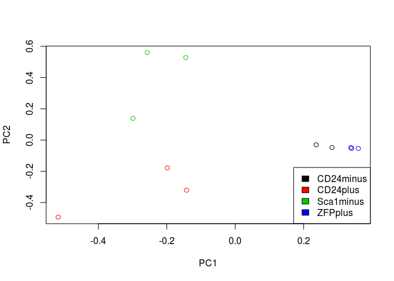
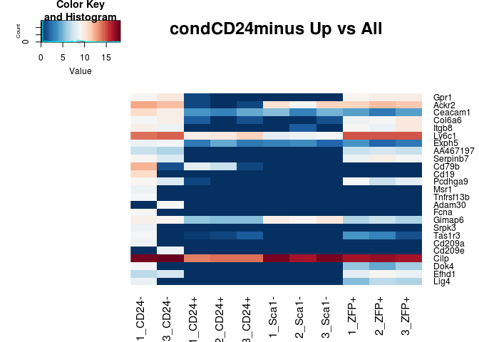
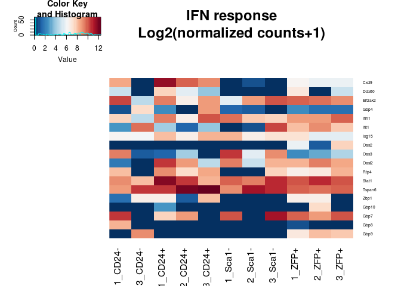

BoneNotebook
================
Matthew Schmitz
March 12, 2018

This is an analysis for Candice where we're going to compare the RNAseq data she has to the seq data from the Ambrosi et al data.

Ambrosi et al. Data Analysis
============================

This data was taken from ENA with accession number ERP013883 (<http://> www.ebi.ac.uk/ena). Following quality control, reads were quantified using Salmon.

First I'll load the libraries and functions I'll need for the analysis (skip this part).

``` r
library(DESeq2)
library(EBSeq)
library(matrixStats)
library(biomaRt)
library(gplots)
library(clusterProfiler)
library(RColorBrewer)
cols <-  colorRampPalette(rev(brewer.pal(11,"RdBu")))(50)

#see Github lengning
library(EACI)


median.normalize <- function(x){
  GetNormalizedMat(x,MedianNorm(x))
}

round.log <- function(s,base=2){
  round(log(s+1, base),digits = 1)
}

std.heatmap <- function(M,...){
  heatmap.2(M,Rowv = F,Colv = F,trace="none",col = cols,...)
}

rn.merge <- function(x,y,fill=0,simple.intersect=F){
  rn <- intersect(rownames(x),rownames(y))
  zerosx <- setdiff(rownames(x),rownames(y))
  zerosy <- setdiff(rownames(y),rownames(x))
  out <- cbind(x[rn,,drop=F],y[rn,,drop=F])
  if(simple.intersect){return(out)}
  else{
  if(length(zerosx)!=1  &length(zerosy)!=1){
    zx <- matrix(fill, nrow=length(zerosx), ncol =ncol(y), dimnames = list(zerosx,NULL))
    zy <- matrix(fill, nrow=length(zerosy), ncol =ncol(x), dimnames = list(zerosy,NULL))
    zx <- cbind(x[zerosx,],zx)
    zy <- cbind(zy,y[zerosy,])
  }else if(length(zerosx)==1){
    zx <- rep(fill, ncol(y))
    zy <- matrix(fill, nrow=length(zerosy), ncol =ncol(x), dimnames = list(zerosy,NULL))
    zx <- c(x[zerosx,],zx)
    zy <- cbind(zy,y[zerosy,])
  }else if(length(zerosy)==1){
    zx <- matrix(fill, nrow=length(zerosx), ncol =ncol(y), dimnames = list(zerosx,NULL))
    zy <- rep(fill, ncol(x))
    print(zx)
    print(zy)
    zx <- cbind(x[zerosx,],zx)
    zy <- c(zy,y[zerosy,])
  }
  out <- rbind(out,rbind(zx,zy))
  return(out)}
}
```

``` r
datapath <- "~/code/data/GEOData/seq/AmbrosiBone/out/"
fileList <- dir(datapath)
fileList <- paste0(datapath,"/",fileList,"/","quant.sf")
dsList <- lapply(fileList,read.csv2, sep="\t",header=T,row.names=1,stringsAsFactors=F)
allRownames <- Reduce(union,lapply(dsList,rownames))

#Use Biomart to get the 
mart <- useMart(biomart = "ENSEMBL_MART_ENSEMBL", dataset = "mmusculus_gene_ensembl", host="www.ensembl.org")
rnSymbol <- getBM(attributes = c("ensembl_transcript_id_version","mgi_symbol"),filters = c("ensembl_transcript_id_version"),values =allRownames ,mart = mart) 
rnSymbolGenes <- rnSymbol[rnSymbol$mgi_symbol!="",]

#Load the table from ENA with the names of each sample
sampleMat <- read.table(file = "~/code/data/GEOData/seq/AmbrosiBone/PRJEB12408.txt",sep="\t",header = T,stringsAsFactors = F)
print(sampleMat)
```

    ##    study_accession sample_accession secondary_sample_accession
    ## 1       PRJEB12408     SAMEA3724741                 ERS1031890
    ## 2       PRJEB12408     SAMEA3724742                 ERS1031891
    ## 3       PRJEB12408     SAMEA3724743                 ERS1031892
    ## 4       PRJEB12408     SAMEA3724744                 ERS1031893
    ## 5       PRJEB12408     SAMEA3724745                 ERS1031894
    ## 6       PRJEB12408     SAMEA3724746                 ERS1031895
    ## 7       PRJEB12408     SAMEA3724747                 ERS1031896
    ## 8       PRJEB12408     SAMEA3724748                 ERS1031897
    ## 9       PRJEB12408     SAMEA3724749                 ERS1031898
    ## 10      PRJEB12408     SAMEA3724750                 ERS1031899
    ## 11      PRJEB12408     SAMEA3724751                 ERS1031900
    ## 12      PRJEB12408     SAMEA3724752                 ERS1031901
    ## 13      PRJEB12408     SAMEA3724741                 ERS1031890
    ## 14      PRJEB12408     SAMEA3724742                 ERS1031891
    ## 15      PRJEB12408     SAMEA3724743                 ERS1031892
    ## 16      PRJEB12408     SAMEA3724744                 ERS1031893
    ## 17      PRJEB12408     SAMEA3724745                 ERS1031894
    ## 18      PRJEB12408     SAMEA3724746                 ERS1031895
    ## 19      PRJEB12408     SAMEA3724747                 ERS1031896
    ## 20      PRJEB12408     SAMEA3724748                 ERS1031897
    ## 21      PRJEB12408     SAMEA3724749                 ERS1031898
    ## 22      PRJEB12408     SAMEA3724750                 ERS1031899
    ## 23      PRJEB12408     SAMEA3724751                 ERS1031900
    ## 24      PRJEB12408     SAMEA3724752                 ERS1031901
    ##    experiment_accession run_accession tax_id scientific_name
    ## 1            ERX1425553    ERR1354078  10090    Mus musculus
    ## 2            ERX1425554    ERR1354079  10090    Mus musculus
    ## 3            ERX1425555    ERR1354080  10090    Mus musculus
    ## 4            ERX1425556    ERR1354081  10090    Mus musculus
    ## 5            ERX1425557    ERR1354082  10090    Mus musculus
    ## 6            ERX1425558    ERR1354083  10090    Mus musculus
    ## 7            ERX1425559    ERR1354084  10090    Mus musculus
    ## 8            ERX1425560    ERR1354085  10090    Mus musculus
    ## 9            ERX1425561    ERR1354086  10090    Mus musculus
    ## 10           ERX1425562    ERR1354087  10090    Mus musculus
    ## 11           ERX1425563    ERR1354088  10090    Mus musculus
    ## 12           ERX1425564    ERR1354089  10090    Mus musculus
    ## 13           ERX1425565    ERR1354090  10090    Mus musculus
    ## 14           ERX1425566    ERR1354091  10090    Mus musculus
    ## 15           ERX1425567    ERR1354092  10090    Mus musculus
    ## 16           ERX1425568    ERR1354093  10090    Mus musculus
    ## 17           ERX1425569    ERR1354094  10090    Mus musculus
    ## 18           ERX1425570    ERR1354095  10090    Mus musculus
    ## 19           ERX1425571    ERR1354096  10090    Mus musculus
    ## 20           ERX1425572    ERR1354097  10090    Mus musculus
    ## 21           ERX1425573    ERR1354098  10090    Mus musculus
    ## 22           ERX1425574    ERR1354099  10090    Mus musculus
    ## 23           ERX1425575    ERR1354100  10090    Mus musculus
    ## 24           ERX1425576    ERR1354101  10090    Mus musculus
    ##       instrument_model library_name library_layout
    ## 1  Illumina HiSeq 2500     15587394         PAIRED
    ## 2  Illumina HiSeq 2500     15587395         PAIRED
    ## 3  Illumina HiSeq 2500     15587396         PAIRED
    ## 4  Illumina HiSeq 2500     15587397         PAIRED
    ## 5  Illumina HiSeq 2500     15587398         PAIRED
    ## 6  Illumina HiSeq 2500     15587399         PAIRED
    ## 7  Illumina HiSeq 2500     15587400         PAIRED
    ## 8  Illumina HiSeq 2500     15587401         PAIRED
    ## 9  Illumina HiSeq 2500     15587402         PAIRED
    ## 10 Illumina HiSeq 2500     15587403         PAIRED
    ## 11 Illumina HiSeq 2500     15587404         PAIRED
    ## 12 Illumina HiSeq 2500     15587405         PAIRED
    ## 13 Illumina HiSeq 2500     15587394         PAIRED
    ## 14 Illumina HiSeq 2500     15587395         PAIRED
    ## 15 Illumina HiSeq 2500     15587396         PAIRED
    ## 16 Illumina HiSeq 2500     15587397         PAIRED
    ## 17 Illumina HiSeq 2500     15587398         PAIRED
    ## 18 Illumina HiSeq 2500     15587399         PAIRED
    ## 19 Illumina HiSeq 2500     15587400         PAIRED
    ## 20 Illumina HiSeq 2500     15587401         PAIRED
    ## 21 Illumina HiSeq 2500     15587402         PAIRED
    ## 22 Illumina HiSeq 2500     15587403         PAIRED
    ## 23 Illumina HiSeq 2500     15587404         PAIRED
    ## 24 Illumina HiSeq 2500     15587405         PAIRED
    ##                                                                                                                                            fastq_ftp
    ## 1  ftp.sra.ebi.ac.uk/vol1/fastq/ERR135/008/ERR1354078/ERR1354078_1.fastq.gz;ftp.sra.ebi.ac.uk/vol1/fastq/ERR135/008/ERR1354078/ERR1354078_2.fastq.gz
    ## 2  ftp.sra.ebi.ac.uk/vol1/fastq/ERR135/009/ERR1354079/ERR1354079_1.fastq.gz;ftp.sra.ebi.ac.uk/vol1/fastq/ERR135/009/ERR1354079/ERR1354079_2.fastq.gz
    ## 3  ftp.sra.ebi.ac.uk/vol1/fastq/ERR135/000/ERR1354080/ERR1354080_1.fastq.gz;ftp.sra.ebi.ac.uk/vol1/fastq/ERR135/000/ERR1354080/ERR1354080_2.fastq.gz
    ## 4  ftp.sra.ebi.ac.uk/vol1/fastq/ERR135/001/ERR1354081/ERR1354081_1.fastq.gz;ftp.sra.ebi.ac.uk/vol1/fastq/ERR135/001/ERR1354081/ERR1354081_2.fastq.gz
    ## 5  ftp.sra.ebi.ac.uk/vol1/fastq/ERR135/002/ERR1354082/ERR1354082_1.fastq.gz;ftp.sra.ebi.ac.uk/vol1/fastq/ERR135/002/ERR1354082/ERR1354082_2.fastq.gz
    ## 6  ftp.sra.ebi.ac.uk/vol1/fastq/ERR135/003/ERR1354083/ERR1354083_1.fastq.gz;ftp.sra.ebi.ac.uk/vol1/fastq/ERR135/003/ERR1354083/ERR1354083_2.fastq.gz
    ## 7  ftp.sra.ebi.ac.uk/vol1/fastq/ERR135/004/ERR1354084/ERR1354084_1.fastq.gz;ftp.sra.ebi.ac.uk/vol1/fastq/ERR135/004/ERR1354084/ERR1354084_2.fastq.gz
    ## 8  ftp.sra.ebi.ac.uk/vol1/fastq/ERR135/005/ERR1354085/ERR1354085_1.fastq.gz;ftp.sra.ebi.ac.uk/vol1/fastq/ERR135/005/ERR1354085/ERR1354085_2.fastq.gz
    ## 9  ftp.sra.ebi.ac.uk/vol1/fastq/ERR135/006/ERR1354086/ERR1354086_1.fastq.gz;ftp.sra.ebi.ac.uk/vol1/fastq/ERR135/006/ERR1354086/ERR1354086_2.fastq.gz
    ## 10 ftp.sra.ebi.ac.uk/vol1/fastq/ERR135/007/ERR1354087/ERR1354087_1.fastq.gz;ftp.sra.ebi.ac.uk/vol1/fastq/ERR135/007/ERR1354087/ERR1354087_2.fastq.gz
    ## 11 ftp.sra.ebi.ac.uk/vol1/fastq/ERR135/008/ERR1354088/ERR1354088_1.fastq.gz;ftp.sra.ebi.ac.uk/vol1/fastq/ERR135/008/ERR1354088/ERR1354088_2.fastq.gz
    ## 12 ftp.sra.ebi.ac.uk/vol1/fastq/ERR135/009/ERR1354089/ERR1354089_1.fastq.gz;ftp.sra.ebi.ac.uk/vol1/fastq/ERR135/009/ERR1354089/ERR1354089_2.fastq.gz
    ## 13 ftp.sra.ebi.ac.uk/vol1/fastq/ERR135/000/ERR1354090/ERR1354090_1.fastq.gz;ftp.sra.ebi.ac.uk/vol1/fastq/ERR135/000/ERR1354090/ERR1354090_2.fastq.gz
    ## 14 ftp.sra.ebi.ac.uk/vol1/fastq/ERR135/001/ERR1354091/ERR1354091_1.fastq.gz;ftp.sra.ebi.ac.uk/vol1/fastq/ERR135/001/ERR1354091/ERR1354091_2.fastq.gz
    ## 15 ftp.sra.ebi.ac.uk/vol1/fastq/ERR135/002/ERR1354092/ERR1354092_1.fastq.gz;ftp.sra.ebi.ac.uk/vol1/fastq/ERR135/002/ERR1354092/ERR1354092_2.fastq.gz
    ## 16 ftp.sra.ebi.ac.uk/vol1/fastq/ERR135/003/ERR1354093/ERR1354093_1.fastq.gz;ftp.sra.ebi.ac.uk/vol1/fastq/ERR135/003/ERR1354093/ERR1354093_2.fastq.gz
    ## 17 ftp.sra.ebi.ac.uk/vol1/fastq/ERR135/004/ERR1354094/ERR1354094_1.fastq.gz;ftp.sra.ebi.ac.uk/vol1/fastq/ERR135/004/ERR1354094/ERR1354094_2.fastq.gz
    ## 18 ftp.sra.ebi.ac.uk/vol1/fastq/ERR135/005/ERR1354095/ERR1354095_1.fastq.gz;ftp.sra.ebi.ac.uk/vol1/fastq/ERR135/005/ERR1354095/ERR1354095_2.fastq.gz
    ## 19 ftp.sra.ebi.ac.uk/vol1/fastq/ERR135/006/ERR1354096/ERR1354096_1.fastq.gz;ftp.sra.ebi.ac.uk/vol1/fastq/ERR135/006/ERR1354096/ERR1354096_2.fastq.gz
    ## 20 ftp.sra.ebi.ac.uk/vol1/fastq/ERR135/007/ERR1354097/ERR1354097_1.fastq.gz;ftp.sra.ebi.ac.uk/vol1/fastq/ERR135/007/ERR1354097/ERR1354097_2.fastq.gz
    ## 21 ftp.sra.ebi.ac.uk/vol1/fastq/ERR135/008/ERR1354098/ERR1354098_1.fastq.gz;ftp.sra.ebi.ac.uk/vol1/fastq/ERR135/008/ERR1354098/ERR1354098_2.fastq.gz
    ## 22 ftp.sra.ebi.ac.uk/vol1/fastq/ERR135/009/ERR1354099/ERR1354099_1.fastq.gz;ftp.sra.ebi.ac.uk/vol1/fastq/ERR135/009/ERR1354099/ERR1354099_2.fastq.gz
    ## 23 ftp.sra.ebi.ac.uk/vol1/fastq/ERR135/000/ERR1354100/ERR1354100_1.fastq.gz;ftp.sra.ebi.ac.uk/vol1/fastq/ERR135/000/ERR1354100/ERR1354100_2.fastq.gz
    ## 24 ftp.sra.ebi.ac.uk/vol1/fastq/ERR135/001/ERR1354101/ERR1354101_1.fastq.gz;ftp.sra.ebi.ac.uk/vol1/fastq/ERR135/001/ERR1354101/ERR1354101_2.fastq.gz
    ##    sra_ftp sample_title
    ## 1       NA       1_ZFP+
    ## 2       NA      1_CD24-
    ## 3       NA      1_CD24+
    ## 4       NA      1_Sca1-
    ## 5       NA       2_ZFP+
    ## 6       NA      2_CD24-
    ## 7       NA      2_CD24+
    ## 8       NA      2_Sca1-
    ## 9       NA       3_ZFP+
    ## 10      NA      3_CD24-
    ## 11      NA      3_CD24+
    ## 12      NA      3_Sca1-
    ## 13      NA       1_ZFP+
    ## 14      NA      1_CD24-
    ## 15      NA      1_CD24+
    ## 16      NA      1_Sca1-
    ## 17      NA       2_ZFP+
    ## 18      NA      2_CD24-
    ## 19      NA      2_CD24+
    ## 20      NA      2_Sca1-
    ## 21      NA       3_ZFP+
    ## 22      NA      3_CD24-
    ## 23      NA      3_CD24+
    ## 24      NA      3_Sca1-

``` r
dsAgList <-  lapply(dsList,function(x){
  rnsgs <-  rnSymbolGenes[rnSymbolGenes$ensembl_transcript_id_version %in% rownames(x),]
  x <- x[rnsgs$ensembl_transcript_id_version,]
  ret <- aggregate(as.integer(x$NumReads), by=list(rnsgs$mgi_symbol),sum)
  rownames(ret) <- ret[,1]
  ret[,-1,drop=F]
})

ambrosiMat <-  as.matrix(Reduce(rn.merge,dsAgList))
colnames(ambrosiMat) <- sampleMat$sample_title

#There's a failed sample in there
std.heatmap(cor(ambrosiMat,method="spearman"))
```

    ## Warning in heatmap.2(M, Rowv = F, Colv = F, trace = "none", col = cols, :
    ## Discrepancy: Rowv is FALSE, while dendrogram is `both'. Omitting row
    ## dendogram.

    ## Warning in heatmap.2(M, Rowv = F, Colv = F, trace = "none", col = cols, :
    ## Discrepancy: Colv is FALSE, while dendrogram is `column'. Omitting column
    ## dendogram.


``` r
#Correlation between tech replicates super high. Pool the reads from the technical replicates.
ambrosiMat <- ambrosiMat[,1:12]+ambrosiMat[,13:24]
#Get rid of failed sample
ambrosiMat <- ambrosiMat[,-which(colnames(ambrosiMat)=="2_CD24-")]
#Check failed sample removal
std.heatmap(cor(ambrosiMat,method = "spearman"))
```

    ## Warning in heatmap.2(M, Rowv = F, Colv = F, trace = "none", col = cols, :
    ## Discrepancy: Rowv is FALSE, while dendrogram is `both'. Omitting row
    ## dendogram.

    ## Warning in heatmap.2(M, Rowv = F, Colv = F, trace = "none", col = cols, :
    ## Discrepancy: Colv is FALSE, while dendrogram is `column'. Omitting column
    ## dendogram.


``` r
ambrosiMatNorm <-  median.normalize(ambrosiMat[rowMaxs(ambrosiMat)>2,])
condits <- sapply(strsplit(colnames(ambrosiMat),"_"),function(x)x[2])
ambrosiMat <- ambrosiMat[,order(condits)]
ambrosiMatNorm <- ambrosiMatNorm[,order(condits)]
condits <- condits[order(condits)]
condits <- gsub("\\+","plus",condits)
condits <- gsub("\\-","minus",condits)
```

Now we have normalized counts in "ambrosiMatNorm", the conditions in "condits", and the unnormalized counts for differential expression in "ambrosiMat."

### A few genes of interest

``` r
head(ambrosiMat)
```

    ##               1_CD24- 3_CD24- 1_CD24+ 2_CD24+ 3_CD24+ 1_Sca1- 2_Sca1-
    ## 0610009B22Rik     168     291     240     499     360     174     347
    ## 0610009O20Rik     499     784    1293     467    1054     575     663
    ## 0610010F05Rik       0     376       7     130       0     282     207
    ## 0610010K14Rik     688     113     270     553     225     170      95
    ## 0610012G03Rik      12      27      77      38      22      69       2
    ## 0610030E20Rik     177      83      55       4     565      34     872
    ##               3_Sca1- 1_ZFP+ 2_ZFP+ 3_ZFP+
    ## 0610009B22Rik     301    441    436    562
    ## 0610009O20Rik     219    520    982    744
    ## 0610010F05Rik     105    211     11      6
    ## 0610010K14Rik     147    590    956    441
    ## 0610012G03Rik       0     64     71     27
    ## 0610030E20Rik      17    367    387    434

``` r
head(ambrosiMatNorm)
```

    ##                 1_CD24-  3_CD24-     1_CD24+    2_CD24+   3_CD24+
    ## 0610009B22Rik 155.75224 351.9009  213.711565 397.571556  346.1890
    ## 0610009O20Rik 462.62122 948.0767 1151.371055 372.075985 1013.5645
    ## 0610010F05Rik   0.00000 454.6898    6.233254 103.575756    0.0000
    ## 0610010K14Rik 637.84249 136.6488  240.425510 440.595332  216.3681
    ## 0610012G03Rik  11.12516  32.6506   68.565794  30.275990   21.1560
    ## 0610030E20Rik 164.09611 100.3704   48.975567   3.186946  543.3244
    ##                 1_Sca1-    2_Sca1-   3_Sca1-    1_ZFP+     2_ZFP+
    ## 0610009B22Rik 236.77779 329.973453 392.32423 304.28535 296.780898
    ## 0610009O20Rik 782.45532 630.468010 285.44520 358.79451 668.437711
    ## 0610010F05Rik 383.74331 196.842953 136.85729 145.58777   7.487591
    ## 0610010K14Rik 231.33462  90.338553 191.60020 407.09377 650.739768
    ## 0610012G03Rik  93.89464   1.901864   0.00000  44.15932  48.328999
    ## 0610030E20Rik  46.26692 829.212827  22.15785 253.22613 263.427082
    ##                   3_ZFP+
    ## 0610009B22Rik 428.225695
    ## 0610009O20Rik 566.903767
    ## 0610010F05Rik   4.571805
    ## 0610010K14Rik 336.027636
    ## 0610012G03Rik  20.573121
    ## 0610030E20Rik 330.693864

``` r
print(condits)
```

    ##  [1] "CD24minus" "CD24minus" "CD24plus"  "CD24plus"  "CD24plus" 
    ##  [6] "Sca1minus" "Sca1minus" "Sca1minus" "ZFPplus"   "ZFPplus"  
    ## [11] "ZFPplus"

``` r
barplot(ambrosiMatNorm["Esr1",],las=2,main="Esr1")
```


``` r
barplot(ambrosiMatNorm["Esr2",],las=2,main="Esr2")
```


``` r
barplot(ambrosiMatNorm["Gper1",],las=2,main="Gper1")
```


### PCA

Let's redo the Principal component analysis (or singular value decomposition, svd) to check against figure 5 of the paper.

``` r
ambrosiCLN <- round.log(ambrosiMatNorm+1,2)
ambrosiCLN <- ambrosiCLN[rowSds(ambrosiCLN)>1,]
svAmbrosi <- svd((ambrosiCLN-rowMeans(ambrosiCLN))/rowSds(ambrosiCLN))

std.heatmap(cor(ambrosiMatNorm,method = "spearman"))
```

    ## Warning in heatmap.2(M, Rowv = F, Colv = F, trace = "none", col = cols, :
    ## Discrepancy: Rowv is FALSE, while dendrogram is `both'. Omitting row
    ## dendogram.

    ## Warning in heatmap.2(M, Rowv = F, Colv = F, trace = "none", col = cols, :
    ## Discrepancy: Colv is FALSE, while dendrogram is `column'. Omitting column
    ## dendogram.


``` r
conditNums <- sapply(condits,function(x)which(x==sort(unique(condits))))
#Sca1minus is osteo, ZFP (mature) and CD24- (less mature) are adipocytes, cd24+ is multipotent
plot(svAmbrosi$v[,1:2],col=conditNums,xlab="PC1",ylab="PC2")
legend("bottomright",legend = unique(names(conditNums)),col=1:4,fill = 1:4)
```



``` r
eaciout <- list()
l <- 1
eacivector <- svAmbrosi$u[,l]
names(eacivector) <- rownames(ambrosiCLN)
eaciout[[l]] <- eacitest(eacivector,"org.Mm.eg","SYMBOL",sets = "GO")$setscores
```

    ## Loading necessary libraries...

    ## Loaded Package org.Mm.eg.db

    ## Converting annotations to data.frames ...

    ## iteration 1 done; time  9.31 sec 
    ## iteration 2 done; time  6.61 sec 
    ## iteration 3 done; time  7.13 sec 
    ## iteration 4 done; time  8.37 sec 
    ## iteration 5 done; time  7.46 sec 
    ## iteration 6 done; time  7.69 sec 
    ## iteration 7 done; time  8.11 sec 
    ## iteration 8 done; time  7.61 sec 
    ## iteration 9 done; time  9.88 sec 
    ## iteration 10 done; time  6.46 sec

    ## Labeling output ...

    ## Loaded Package GO.db

``` r
l <- 2
eacivector <- svAmbrosi$u[,l]
names(eacivector) <- rownames(ambrosiCLN)
eaciout[[l]] <- eacitest(eacivector,"org.Mm.eg","SYMBOL",sets = "GO")$setscores
```

    ## Loading necessary libraries...

    ## Loaded Package org.Mm.eg.db

    ## Converting annotations to data.frames ...

    ## iteration 1 done; time  5.55 sec 
    ## iteration 2 done; time  7.7 sec 
    ## iteration 3 done; time  6.51 sec 
    ## iteration 4 done; time  7.12 sec 
    ## iteration 5 done; time  5.83 sec 
    ## iteration 6 done; time  6.68 sec 
    ## iteration 7 done; time  5.66 sec 
    ## iteration 8 done; time  7.37 sec 
    ## iteration 9 done; time  7.68 sec 
    ## iteration 10 done; time  6.99 sec

    ## Labeling output ...

    ## Loaded Package GO.db

### GO enrichment of Principal Components

So that reiterates the Ambrosi analysis. Now let's look at the continuous GO enrichment in the genes that contribute to PC1 (separates the osteocyte and progenitors from adipocytes)

``` r
#PC1 Positive
a <- eaciout[[1]][eaciout[[1]]$set.mean>0,]
print(a[1:25,])
```

    ##                                                               Term
    ## GO:1904181          positive regulation of membrane depolarization
    ## GO:0010935            regulation of macrophage cytokine production
    ## GO:0035455                            response to interferon-alpha
    ## GO:0035641                         locomotory exploration behavior
    ## GO:0070006                          metalloaminopeptidase activity
    ## GO:0097440                                         apical dendrite
    ## GO:0005161         platelet-derived growth factor receptor binding
    ## GO:0043034                                               costamere
    ## GO:0030742                           GTP-dependent protein binding
    ## GO:0051497            negative regulation of stress fiber assembly
    ## GO:0038191                                      neuropilin binding
    ## GO:0043649                     dicarboxylic acid catabolic process
    ## GO:0034312                               diol biosynthetic process
    ## GO:0060716             labyrinthine layer blood vessel development
    ## GO:0052744 phosphatidylinositol monophosphate phosphatase activity
    ## GO:0097320                              plasma membrane tubulation
    ## GO:2001212                            regulation of vasculogenesis
    ## GO:0051654             establishment of mitochondrion localization
    ## GO:0000062                                  fatty-acyl-CoA binding
    ## GO:0042581                                        specific granule
    ## GO:1990126       retrograde transport, endosome to plasma membrane
    ## GO:0004602                         glutathione peroxidase activity
    ## GO:0031579                              membrane raft organization
    ## GO:0070742                         C2H2 zinc finger domain binding
    ## GO:0030574                              collagen catabolic process
    ##            Ontology    set.mean      set.sd set.size         pval
    ## GO:1904181       BP 0.009540787 0.007417680       11 0.000000e+00
    ## GO:0010935       BP 0.008475386 0.004506944       10 0.000000e+00
    ## GO:0035455       BP 0.008179649 0.004484593       16 0.000000e+00
    ## GO:0035641       BP 0.008100013 0.003036715       12 0.000000e+00
    ## GO:0070006       MF 0.008029393 0.003411502        9 0.000000e+00
    ## GO:0097440       CC 0.007949549 0.007752464       16 0.000000e+00
    ## GO:0005161       MF 0.007456639 0.004110238       10 0.000000e+00
    ## GO:0043034       CC 0.007389192 0.003687449       12 0.000000e+00
    ## GO:0030742       MF 0.007069072 0.005912372       16 8.881784e-16
    ## GO:0051497       BP 0.006992098 0.004851236       19 1.776357e-15
    ## GO:0038191       MF 0.006893799 0.009470836       11 4.218847e-15
    ## GO:0043649       BP 0.006881281 0.004254370        9 4.884981e-15
    ## GO:0034312       BP 0.006841511 0.007135685       10 6.883383e-15
    ## GO:0060716       BP 0.006819999 0.003310984       13 8.437695e-15
    ## GO:0052744       MF 0.006663684 0.003078559        9 3.352874e-14
    ## GO:0097320       BP 0.006592918 0.004659027       11 6.239453e-14
    ## GO:2001212       BP 0.006488661 0.007587465       11 1.534328e-13
    ## GO:0051654       BP 0.006345124 0.003899079       10 5.182521e-13
    ## GO:0000062       MF 0.006270325 0.003657101       10 9.672263e-13
    ## GO:0042581       CC 0.006249306 0.008390978       11 1.151079e-12
    ## GO:1990126       BP 0.006207893 0.004112114       10 1.619149e-12
    ## GO:0004602       MF 0.006167700 0.005206195        9 2.250200e-12
    ## GO:0031579       BP 0.006133647 0.006401470        9 2.968958e-12
    ## GO:0070742       MF 0.006083792 0.003113963       10 4.443113e-12
    ## GO:0030574       BP 0.005978991 0.003841013       10 1.026201e-11

``` r
#PC1 Negative
a <- eaciout[[1]][eaciout[[1]]$set.mean<0,]
print(a[1:25,])
```

    ##                                                                              Term
    ## GO:0003417                                     growth plate cartilage development
    ## GO:0042555                                                            MCM complex
    ## GO:0006271                      DNA strand elongation involved in DNA replication
    ## GO:0050699                                                      WW domain binding
    ## GO:1904666                        regulation of ubiquitin protein ligase activity
    ## GO:0003688                                         DNA replication origin binding
    ## GO:0000940                                 condensed chromosome outer kinetochore
    ## GO:0043142                          single-stranded DNA-dependent ATPase activity
    ## GO:0018279                          protein N-linked glycosylation via asparagine
    ## GO:0051084                            'de novo' posttranslational protein folding
    ## GO:0030206                               chondroitin sulfate biosynthetic process
    ## GO:0005381                            iron ion transmembrane transporter activity
    ## GO:0050911 detection of chemical stimulus involved in sensory perception of smell
    ## GO:0000800                                                        lateral element
    ## GO:0005861                                                       troponin complex
    ## GO:0000796                                                      condensin complex
    ## GO:0010369                                                           chromocenter
    ## GO:0061436                                          establishment of skin barrier
    ## GO:0006198                                                 cAMP catabolic process
    ## GO:0034501                                    protein localization to kinetochore
    ## GO:0005251                           delayed rectifier potassium channel activity
    ## GO:0004936                                     alpha-adrenergic receptor activity
    ## GO:0002076                                                 osteoblast development
    ## GO:0000788                                                     nuclear nucleosome
    ## GO:0030660                                      Golgi-associated vesicle membrane
    ##            Ontology     set.mean      set.sd set.size         pval
    ## GO:0003417       BP -0.007967512 0.006352869        9 8.584292e-20
    ## GO:0042555       CC -0.007117453 0.005453724        9 4.088892e-16
    ## GO:0006271       BP -0.006729894 0.003356418       10 1.428011e-14
    ## GO:0050699       MF -0.006396089 0.003498829       16 2.611191e-13
    ## GO:1904666       BP -0.005958809 0.006240366       10 9.474176e-12
    ## GO:0003688       MF -0.005547820 0.003035995       11 2.217455e-10
    ## GO:0000940       CC -0.005490464 0.004229837       12 3.384681e-10
    ## GO:0043142       MF -0.005382783 0.003040660       14 7.403315e-10
    ## GO:0018279       BP -0.005111796 0.003613892       15 4.971787e-09
    ## GO:0051084       BP -0.005036021 0.007144489        9 8.328118e-09
    ## GO:0030206       BP -0.004959965 0.006360453        7 1.387495e-08
    ## GO:0005381       MF -0.004840068 0.005395183        7 3.056610e-08
    ## GO:0050911       BP -0.004585086 0.002184751       13 1.543337e-07
    ## GO:0000800       CC -0.004517803 0.006280772       14 2.333871e-07
    ## GO:0005861       CC -0.004391017 0.004463366        7 5.009579e-07
    ## GO:0000796       CC -0.004283040 0.004002026        7 9.448995e-07
    ## GO:0010369       CC -0.004168870 0.002691569       10 1.819085e-06
    ## GO:0061436       BP -0.004163811 0.003091336       15 1.871943e-06
    ## GO:0006198       BP -0.004158412 0.003669916       11 1.929993e-06
    ## GO:0034501       BP -0.004122025 0.002529116       17 2.368724e-06
    ## GO:0005251       MF -0.003957793 0.004980709       11 5.848861e-06
    ## GO:0004936       MF -0.003871622 0.004216625        4 9.272037e-06
    ## GO:0002076       BP -0.003861260 0.006792761       10 9.794147e-06
    ## GO:0000788       CC -0.003679761 0.003527436       15 2.501785e-05
    ## GO:0030660       CC -0.003433781 0.002415805       17 8.352381e-05

Interesting... Now PC2 (separates osteocytes from progenitors)

``` r
#PC2 Positive
a <- eaciout[[2]][eaciout[[2]]$set.mean>0,]
print(a[1:25,])
```

    ##                                                                           Term
    ## GO:0000076                                          DNA replication checkpoint
    ## GO:0019825                                                      oxygen binding
    ## GO:0042168                                              heme metabolic process
    ## GO:0042555                                                         MCM complex
    ## GO:0043034                                                           costamere
    ## GO:0035641                                     locomotory exploration behavior
    ## GO:0052744             phosphatidylinositol monophosphate phosphatase activity
    ## GO:0060004                                                              reflex
    ## GO:0000940                              condensed chromosome outer kinetochore
    ## GO:0048821                                             erythrocyte development
    ## GO:0007076                                     mitotic chromosome condensation
    ## GO:0002098                                    tRNA wobble uridine modification
    ## GO:0072576                                                 liver morphogenesis
    ## GO:0043142                       single-stranded DNA-dependent ATPase activity
    ## GO:0030539                                          male genitalia development
    ## GO:0043567 regulation of insulin-like growth factor receptor signaling pathway
    ## GO:0007064                                   mitotic sister chromatid cohesion
    ## GO:0008139                               nuclear localization sequence binding
    ## GO:0006271                   DNA strand elongation involved in DNA replication
    ## GO:0034508                                         centromere complex assembly
    ## GO:0071108                                 protein K48-linked deubiquitination
    ## GO:0003688                                      DNA replication origin binding
    ## GO:0042588                                                     zymogen granule
    ## GO:0001833                                  inner cell mass cell proliferation
    ## GO:0045047                                             protein targeting to ER
    ##            Ontology    set.mean      set.sd set.size         pval
    ## GO:0000076       BP 0.009615196 0.005016409       10 0.000000e+00
    ## GO:0019825       MF 0.008360877 0.004446153       13 0.000000e+00
    ## GO:0042168       BP 0.007882931 0.009897122       14 0.000000e+00
    ## GO:0042555       CC 0.007180768 0.005252514        9 0.000000e+00
    ## GO:0043034       CC 0.006840889 0.003487247       12 0.000000e+00
    ## GO:0035641       BP 0.006407021 0.002836283       12 6.661338e-16
    ## GO:0052744       MF 0.005673013 0.003687309        9 9.268142e-13
    ## GO:0060004       BP 0.005626890 0.003281712       14 1.411316e-12
    ## GO:0000940       CC 0.005521746 0.004888167       12 3.635092e-12
    ## GO:0048821       BP 0.005447644 0.010238490       21 7.008172e-12
    ## GO:0007076       BP 0.005226645 0.005956587        9 4.719292e-11
    ## GO:0002098       BP 0.005148514 0.003893779        9 9.095724e-11
    ## GO:0072576       BP 0.005012840 0.006779259       10 2.779141e-10
    ## GO:0043142       MF 0.004847823 0.002419726       14 1.040463e-09
    ## GO:0030539       BP 0.004834055 0.003078178       12 1.159404e-09
    ## GO:0043567       BP 0.004631164 0.002766449       16 5.523590e-09
    ## GO:0007064       BP 0.004542517 0.004914272       13 1.071005e-08
    ## GO:0008139       MF 0.004487473 0.002662749       10 1.605859e-08
    ## GO:0006271       BP 0.004446402 0.002178446       10 2.165933e-08
    ## GO:0034508       BP 0.004368292 0.003428045       17 3.798905e-08
    ## GO:0071108       BP 0.004277346 0.002371514       11 7.221574e-08
    ## GO:0003688       MF 0.004141285 0.002382171       11 1.843726e-07
    ## GO:0042588       CC 0.003986197 0.002123809       12 5.183815e-07
    ## GO:0001833       BP 0.003900993 0.004003917       11 9.005245e-07
    ## GO:0045047       BP 0.003875734 0.009257969        9 1.058447e-06

``` r
#PC2 Negative
a <- eaciout[[2]][eaciout[[2]]$set.mean<0,]
print(a[1:25,])
```

    ##                                                                     Term
    ## GO:0048845                             venous blood vessel morphogenesis
    ## GO:0042608                                       T cell receptor binding
    ## GO:0004745                                retinol dehydrogenase activity
    ## GO:0005779                    integral component of peroxisomal membrane
    ## GO:0070402                                                 NADPH binding
    ## GO:0016755          transferase activity, transferring amino-acyl groups
    ## GO:0045948               positive regulation of translational initiation
    ## GO:0030687                          preribosome, large subunit precursor
    ## GO:0035859                                       Seh1-associated complex
    ## GO:0032823             regulation of natural killer cell differentiation
    ## GO:0048875                          chemical homeostasis within a tissue
    ## GO:0006677                            glycosylceramide metabolic process
    ## GO:0090502           RNA phosphodiester bond hydrolysis, endonucleolytic
    ## GO:0008356                                      asymmetric cell division
    ## GO:0009931    calcium-dependent protein serine/threonine kinase activity
    ## GO:0007214                     gamma-aminobutyric acid signaling pathway
    ## GO:0050774                 negative regulation of dendrite morphogenesis
    ## GO:0036158                                     outer dynein arm assembly
    ## GO:0031624                          ubiquitin conjugating enzyme binding
    ## GO:0045236                               CXCR chemokine receptor binding
    ## GO:0031338                                  regulation of vesicle fusion
    ## GO:0051443 positive regulation of ubiquitin-protein transferase activity
    ## GO:0031902                                        late endosome membrane
    ## GO:0016922                     ligand-dependent nuclear receptor binding
    ## GO:0031588                   nucleotide-activated protein kinase complex
    ##            Ontology     set.mean      set.sd set.size         pval
    ## GO:0048845       BP -0.007359190 0.003754399       10 2.243250e-20
    ## GO:0042608       MF -0.007310068 0.002537374       12 3.991114e-20
    ## GO:0004745       MF -0.006907912 0.004696231       10 3.871873e-18
    ## GO:0005779       CC -0.006847480 0.003861627       11 7.533488e-18
    ## GO:0070402       MF -0.006843770 0.003351163       11 7.846286e-18
    ## GO:0016755       MF -0.006580065 0.006133792       13 1.337918e-16
    ## GO:0045948       BP -0.006498461 0.006216034       12 3.148132e-16
    ## GO:0030687       CC -0.006353456 0.002878246       13 1.403682e-15
    ## GO:0035859       CC -0.006059734 0.007981162       11 2.622416e-14
    ## GO:0032823       BP -0.006027126 0.006984531       12 3.599602e-14
    ## GO:0048875       BP -0.006012858 0.006183006       11 4.132506e-14
    ## GO:0006677       BP -0.006010684 0.005911558       11 4.220274e-14
    ## GO:0090502       BP -0.005770300 0.004635664       12 4.116323e-13
    ## GO:0008356       BP -0.005232414 0.004714601       11 4.859928e-11
    ## GO:0009931       MF -0.005099047 0.006776889        8 1.479980e-10
    ## GO:0007214       BP -0.004960674 0.002687077       12 4.564537e-10
    ## GO:0050774       BP -0.004775596 0.002723825       10 1.965784e-09
    ## GO:0036158       BP -0.004724579 0.003386423        9 2.912715e-09
    ## GO:0031624       MF -0.004710290 0.005188591       22 3.249448e-09
    ## GO:0045236       MF -0.004666287 0.004459990       10 4.542276e-09
    ## GO:0031338       BP -0.004597896 0.005462973       36 7.599441e-09
    ## GO:0051443       BP -0.004570007 0.002927050       17 9.354615e-09
    ## GO:0031902       CC -0.004512783 0.003300020       14 1.427461e-08
    ## GO:0016922       MF -0.004509303 0.003186444       11 1.464394e-08
    ## GO:0031588       CC -0.004476210 0.002646992       10 1.865186e-08

Sweet.

Time for some differential expression

``` r
cond <- as.factor(condits)
colnames(ambrosiMat) <- make.names(condits,unique = T)
dds <- DESeqDataSetFromMatrix(ambrosiMat,colData = DataFrame(cond),design = formula(~cond+0))
DESeqOutput <-  DESeq(dds)
```

    ## estimating size factors

    ## estimating dispersions

    ## gene-wise dispersion estimates

    ## mean-dispersion relationship

    ## final dispersion estimates

    ## fitting model and testing

``` r
resultsNames(DESeqOutput)
```

    ## [1] "condCD24minus" "condCD24plus"  "condSca1minus" "condZFPplus"

``` r
resList <-  list(results(DESeqOutput,contrast = c(1,-1/3,-1/3,-1/3 ),cooksCutoff=T),results(DESeqOutput,contrast = c(-1/3,1,-1/3,-1/3 ),cooksCutoff=T),results(DESeqOutput,contrast = c(-1/3,-1/3,1,-1/3 ),cooksCutoff=T),results(DESeqOutput,contrast = c(-1/3,-1/3,-1/3 ,1),cooksCutoff=T))

ambrosiUpDown <-lapply(resList,function(res){
  res <- res[!is.na(res$padj),]
  list(rownames(res[res$padj<.1&res$log2FoldChange>0,]),rownames(res[res$padj<.1&res$log2FoldChange<0,]))
})

print(str(ambrosiUpDown))
```

    ## List of 4
    ##  $ :List of 2
    ##   ..$ : chr [1:429] "1700066M21Rik" "5430403G16Rik" "6430548M08Rik" "8430408G22Rik" ...
    ##   ..$ : chr [1:613] "1110008L16Rik" "1700047I17Rik2" "1810041L15Rik" "2610008E11Rik" ...
    ##  $ :List of 2
    ##   ..$ : chr [1:899] "1190002N15Rik" "1700028J19Rik" "1700047I17Rik2" "1810013L24Rik" ...
    ##   ..$ : chr [1:806] "1700019D03Rik" "2200002D01Rik" "2310009B15Rik" "2310061I04Rik" ...
    ##  $ :List of 2
    ##   ..$ : chr [1:910] "1500015O10Rik" "1700008O03Rik" "1700047I17Rik2" "1810041L15Rik" ...
    ##   ..$ : chr [1:857] "0610040J01Rik" "1700029J07Rik" "1810043G02Rik" "2510039O18Rik" ...
    ##  $ :List of 2
    ##   ..$ : chr [1:689] "1700084J12Rik" "2200002D01Rik" "2810021J22Rik" "3830406C13Rik" ...
    ##   ..$ : chr [1:755] "1500015O10Rik" "1700028J19Rik" "1700047I17Rik2" "1700066M21Rik" ...
    ## NULL

So there's a bunch of genes differentially expressed up or down for each cell type compared to all the others.

``` r
for(i in 1:length(resList)){
  print(resultsNames(DESeqOutput)[i])
  res <- resList[[i]]
  res <- res[!is.na(res$padj),]
  res <- res[res$padj<.1&res$log2FoldChange>0,]
  mat <- log(ambrosiMatNorm+1,2)-rowMeans(log(ambrosiMatNorm+1,2))
  std.heatmap(mat[rownames(res[order(res$padj,decreasing = F),])[1:25],],main=paste(resultsNames(DESeqOutput)[i],"Up vs All\nLogFC vs mean"))
}
```

    ## [1] "condCD24minus"

    ## Warning in heatmap.2(M, Rowv = F, Colv = F, trace = "none", col = cols, :
    ## Discrepancy: Rowv is FALSE, while dendrogram is `both'. Omitting row
    ## dendogram.

    ## Warning in heatmap.2(M, Rowv = F, Colv = F, trace = "none", col = cols, :
    ## Discrepancy: Colv is FALSE, while dendrogram is `column'. Omitting column
    ## dendogram.

    ## [1] "condCD24plus"

    ## Warning in heatmap.2(M, Rowv = F, Colv = F, trace = "none", col = cols, :
    ## Discrepancy: Rowv is FALSE, while dendrogram is `both'. Omitting row
    ## dendogram.

    ## Warning in heatmap.2(M, Rowv = F, Colv = F, trace = "none", col = cols, :
    ## Discrepancy: Colv is FALSE, while dendrogram is `column'. Omitting column
    ## dendogram.


    ## [1] "condSca1minus"

    ## Warning in heatmap.2(M, Rowv = F, Colv = F, trace = "none", col = cols, :
    ## Discrepancy: Rowv is FALSE, while dendrogram is `both'. Omitting row
    ## dendogram.

    ## Warning in heatmap.2(M, Rowv = F, Colv = F, trace = "none", col = cols, :
    ## Discrepancy: Colv is FALSE, while dendrogram is `column'. Omitting column
    ## dendogram.


    ## [1] "condZFPplus"

    ## Warning in heatmap.2(M, Rowv = F, Colv = F, trace = "none", col = cols, :
    ## Discrepancy: Rowv is FALSE, while dendrogram is `both'. Omitting row
    ## dendogram.

    ## Warning in heatmap.2(M, Rowv = F, Colv = F, trace = "none", col = cols, :
    ## Discrepancy: Colv is FALSE, while dendrogram is `column'. Omitting column
    ## dendogram.


``` r
for(i in 1:length(resList)){
  print(resultsNames(DESeqOutput)[i])
  res <- resList[[i]]
  res <- res[!is.na(res$padj),]
  res <- res[res$padj<.1&res$log2FoldChange>0,]
  std.heatmap(log(ambrosiMatNorm[rownames(res[order(res$padj,decreasing = F),])[1:25],]+1,2),main=paste(resultsNames(DESeqOutput)[i],"Up vs All"))
}
```

    ## [1] "condCD24minus"

    ## Warning in heatmap.2(M, Rowv = F, Colv = F, trace = "none", col = cols, :
    ## Discrepancy: Rowv is FALSE, while dendrogram is `both'. Omitting row
    ## dendogram.

    ## Warning in heatmap.2(M, Rowv = F, Colv = F, trace = "none", col = cols, :
    ## Discrepancy: Colv is FALSE, while dendrogram is `column'. Omitting column
    ## dendogram.

    ## [1] "condCD24plus"

    ## Warning in heatmap.2(M, Rowv = F, Colv = F, trace = "none", col = cols, :
    ## Discrepancy: Rowv is FALSE, while dendrogram is `both'. Omitting row
    ## dendogram.

    ## Warning in heatmap.2(M, Rowv = F, Colv = F, trace = "none", col = cols, :
    ## Discrepancy: Colv is FALSE, while dendrogram is `column'. Omitting column
    ## dendogram.



    ## [1] "condSca1minus"

    ## Warning in heatmap.2(M, Rowv = F, Colv = F, trace = "none", col = cols, :
    ## Discrepancy: Rowv is FALSE, while dendrogram is `both'. Omitting row
    ## dendogram.

    ## Warning in heatmap.2(M, Rowv = F, Colv = F, trace = "none", col = cols, :
    ## Discrepancy: Colv is FALSE, while dendrogram is `column'. Omitting column
    ## dendogram.


    ## [1] "condZFPplus"

    ## Warning in heatmap.2(M, Rowv = F, Colv = F, trace = "none", col = cols, :
    ## Discrepancy: Rowv is FALSE, while dendrogram is `both'. Omitting row
    ## dendogram.

    ## Warning in heatmap.2(M, Rowv = F, Colv = F, trace = "none", col = cols, :
    ## Discrepancy: Colv is FALSE, while dendrogram is `column'. Omitting column
    ## dendogram.


Candice's Data
--------------

The data for the Ingraham lab RNAseq was also passed to Salmon after fastqc and trimming with trimgalore.

``` r
datapath <- "~/code/IngrahamLabData/BoneSalmonOutputs/"
fileList <- dir(datapath)
fileList <- fileList[!grepl("Gene|pdf",fileList)]
dsList <- lapply(paste0(datapath,fileList),read.csv2, sep="\t",header=T,row.names=1,stringsAsFactors=F)
allRownames <- Reduce(union,lapply(dsList,rownames))

mart <- useMart(biomart = "ENSEMBL_MART_ENSEMBL", dataset = "mmusculus_gene_ensembl", host="www.ensembl.org")
rnSymbol <- getBM(attributes = c("ensembl_transcript_id_version","mgi_symbol"),filters = c("ensembl_transcript_id_version"),values =allRownames ,mart = mart) 
rnSymbolGenes <- rnSymbol[rnSymbol$mgi_symbol!="",]

dsAgList <-  lapply(dsList,function(x){
  rnsgs <-  rnSymbolGenes[rnSymbolGenes$ensembl_transcript_id_version %in% rownames(x),]
  x <- x[rnsgs$ensembl_transcript_id_version,]
  ret <- aggregate(as.integer(x$NumReads), by=list(rnsgs$mgi_symbol),sum)
  rownames(ret) <- ret[,1]
  ret[,-1,drop=F]
})
sampleNames <- c("1807_BM_fl_A1","1810_BM_KO_E1","1811_BM_KO_G1","1815_BM_fl_B1","1818_BM_fl_C1","1825_BM_KO_F1","1984_BM_fl_D1","1985_BM_KO_H1")
SampleNameMat <- sapply(strsplit(sampleNames,"_"),function(i)i)
boneMat <-  as.matrix(Reduce(rn.merge,dsAgList))
colnames(boneMat) <- paste(SampleNameMat[3,],gsub("[[:digit:]]","",SampleNameMat[4,]),sep = "_")
boneMatNorm <-  median.normalize(boneMat)
boneMatNorm <- boneMatNorm[,order(colnames(boneMatNorm))]
heatmap.2(cor(boneMatNorm,method = "spe"),col=cols,trace="none")
```


``` r
std.heatmap(cor(rn.merge(boneMatNorm,ambrosiMatNorm),method = "spe"),main="Spearman Correlation\n Ambrosi vs Candice")
```

    ## Warning in heatmap.2(M, Rowv = F, Colv = F, trace = "none", col = cols, :
    ## Discrepancy: Rowv is FALSE, while dendrogram is `both'. Omitting row
    ## dendogram.

    ## Warning in heatmap.2(M, Rowv = F, Colv = F, trace = "none", col = cols, :
    ## Discrepancy: Colv is FALSE, while dendrogram is `column'. Omitting column
    ## dendogram.


### Differential expression of Candice's data

Use a DESeq2 False Discovery Rate of .1, breaking into up and down in KO groups.

``` r
cond <- as.factor(SampleNameMat[3,])
dds <- DESeqDataSetFromMatrix(boneMat,colData = DataFrame(cond),design = ~cond)
DESeqOutput <-  DESeq(dds)
```

    ## estimating size factors

    ## estimating dispersions

    ## gene-wise dispersion estimates

    ## mean-dispersion relationship

    ## final dispersion estimates

    ## fitting model and testing

``` r
resCandice <-  results(DESeqOutput)
res <- resCandice[!is.na(resCandice$padj),]
res <- res[res$log2FoldChange<0,]


std.heatmap(log(boneMatNorm[rownames(res[order(res$pvalue,decreasing = F),])[1:25],]+1,2),main="Most significant DE genes\ndown in KO\nlog2(NormalizedCounts+1)")
```


``` r
std.heatmap(log(boneMatNorm[rownames(res[order(res$pvalue,decreasing = F),])[1:25],]+1,2)-rowMeans(log(boneMatNorm[rownames(res[order(res$pvalue,decreasing = F),])[1:25],]+1,2)),main="Most significant DE genes\ndown in KO\nlog2(FC)")
```


``` r
res <-  results(DESeqOutput)
res <- res[!is.na(res$padj),]
boneUpDown <- list(rownames(res[res$padj<.1&res$log2FoldChange>0,]),rownames(res[res$padj<.1&res$log2FoldChange<0,]))
res <- res[res$log2FoldChange>0,]
std.heatmap(log(boneMatNorm[rownames(res[order(res$pvalue,decreasing = F),])[1:25],]+1,2)-rowMeans(log(boneMatNorm[rownames(res[order(res$pvalue,decreasing = F),])[1:25],]+1,2)),main="Most significant DE genes\nup in KO\nlog2(FC)")
```


``` r
std.heatmap(log(boneMatNorm[rownames(res[order(res$pvalue,decreasing = F),])[1:25],]+1,2),main="Most significant DE genes\nup in KO\nlog2(normalized counts + 1)")
```


``` r
res <-  results(DESeqOutput)
res <- res[!is.na(res$padj),]


hist(res$log2FoldChange,main = "Log2 Fold Changes Detected")
```


``` r
plot(res$log2FoldChange,-log(res$padj),ylab="-logPadj",xlab="logFC",main="Volcano Plot")
```


``` r
#ESR1 not differentially expressed
barplot((boneMatNorm["Esr1",]),main="Esr1")
```


``` r
barplot((boneMatNorm["Gper1",]),main="Gper1")
```


``` r
#Just a sanity Check
barplot(boneMatNorm["Ncoa1",],las=2,main="Ncoa1")
```


``` r
barplot(boneMatNorm["Ncoa2",],las=2,main="Ncoa2")
```


``` r
barplot(boneMatNorm["Ncoa3",],las=2,main="Ncoa3")
```


``` r
barplot((boneMatNorm["Kiss1",]),main="Kiss1")
```


``` r
#also a sanity check
std.heatmap(cor(ambrosiMatNorm,method = "spearman"))
```


``` r
eG <- enrichGO(rownames(res[res$padj<.1,]),OrgDb ='org.Mm.eg.db',keyType = "SYMBOL",ont = "BP")
dfGO <- as.data.frame(eG)
print(dfGO[1:30,])
```

    ##                    ID
    ## GO:0051607 GO:0051607
    ## GO:0009615 GO:0009615
    ## GO:0071346 GO:0071346
    ## GO:0001649 GO:0001649
    ## GO:0034341 GO:0034341
    ## GO:0006220 GO:0006220
    ## GO:0009147 GO:0009147
    ## GO:0006303 GO:0006303
    ## GO:0000726 GO:0000726
    ## GO:0030199 GO:0030199
    ## GO:0006221 GO:0006221
    ## GO:0048333 GO:0048333
    ## GO:0035282 GO:0035282
    ## GO:0002831 GO:0002831
    ## GO:0050688 GO:0050688
    ## GO:0072527 GO:0072527
    ## GO:0072528 GO:0072528
    ## GO:0001958 GO:0001958
    ## GO:0036075 GO:0036075
    ## GO:0001503 GO:0001503
    ## GO:0002697 GO:0002697
    ## GO:0042832 GO:0042832
    ## GO:0042455 GO:0042455
    ## GO:0009148 GO:0009148
    ## GO:0009163 GO:0009163
    ## GO:0009220 GO:0009220
    ## GO:0046132 GO:0046132
    ## GO:0001562 GO:0001562
    ## GO:0014812 GO:0014812
    ## GO:0043900 GO:0043900
    ##                                                         Description
    ## GO:0051607                                defense response to virus
    ## GO:0009615                                        response to virus
    ## GO:0071346                    cellular response to interferon-gamma
    ## GO:0001649                               osteoblast differentiation
    ## GO:0034341                             response to interferon-gamma
    ## GO:0006220                  pyrimidine nucleotide metabolic process
    ## GO:0009147     pyrimidine nucleoside triphosphate metabolic process
    ## GO:0006303 double-strand break repair via nonhomologous end joining
    ## GO:0000726                               non-recombinational repair
    ## GO:0030199                             collagen fibril organization
    ## GO:0006221               pyrimidine nucleotide biosynthetic process
    ## GO:0048333                          mesodermal cell differentiation
    ## GO:0035282                                             segmentation
    ## GO:0002831                regulation of response to biotic stimulus
    ## GO:0050688                  regulation of defense response to virus
    ## GO:0072527         pyrimidine-containing compound metabolic process
    ## GO:0072528      pyrimidine-containing compound biosynthetic process
    ## GO:0001958                                endochondral ossification
    ## GO:0036075                                 replacement ossification
    ## GO:0001503                                             ossification
    ## GO:0002697                    regulation of immune effector process
    ## GO:0042832                            defense response to protozoan
    ## GO:0042455                      ribonucleoside biosynthetic process
    ## GO:0009148  pyrimidine nucleoside triphosphate biosynthetic process
    ## GO:0009163                          nucleoside biosynthetic process
    ## GO:0009220           pyrimidine ribonucleotide biosynthetic process
    ## GO:0046132           pyrimidine ribonucleoside biosynthetic process
    ## GO:0001562                                    response to protozoan
    ## GO:0014812                                    muscle cell migration
    ## GO:0043900                     regulation of multi-organism process
    ##            GeneRatio   BgRatio       pvalue     p.adjust       qvalue
    ## GO:0051607    14/237 202/23577 1.876966e-08 5.345598e-05 4.712172e-05
    ## GO:0009615    14/237 246/23577 2.181504e-07 3.106461e-04 2.738361e-04
    ## GO:0071346     8/237  75/23577 8.751948e-07 8.308516e-04 7.323999e-04
    ## GO:0001649    12/237 224/23577 3.050370e-06 2.171864e-03 1.914509e-03
    ## GO:0034341     8/237  94/23577 4.901902e-06 2.792123e-03 2.461271e-03
    ## GO:0006220     5/237  29/23577 9.595202e-06 4.554523e-03 4.014835e-03
    ## GO:0009147     4/237  17/23577 2.137653e-05 8.697193e-03 7.666619e-03
    ## GO:0006303     5/237  38/23577 3.767488e-05 1.341226e-02 1.182297e-02
    ## GO:0000726     5/237  43/23577 6.935699e-05 1.650936e-02 1.455309e-02
    ## GO:0030199     5/237  43/23577 6.935699e-05 1.650936e-02 1.455309e-02
    ## GO:0006221     4/237  23/23577 7.585063e-05 1.650936e-02 1.455309e-02
    ## GO:0048333     4/237  23/23577 7.585063e-05 1.650936e-02 1.455309e-02
    ## GO:0035282     7/237 103/23577 8.291434e-05 1.650936e-02 1.455309e-02
    ## GO:0002831     8/237 139/23577 8.419185e-05 1.650936e-02 1.455309e-02
    ## GO:0050688     6/237  72/23577 8.695240e-05 1.650936e-02 1.455309e-02
    ## GO:0072527     5/237  48/23577 1.184384e-04 2.108203e-02 1.858392e-02
    ## GO:0072528     4/237  28/23577 1.686032e-04 2.796792e-02 2.465386e-02
    ## GO:0001958     4/237  29/23577 1.940445e-04 2.796792e-02 2.465386e-02
    ## GO:0036075     4/237  29/23577 1.940445e-04 2.796792e-02 2.465386e-02
    ## GO:0001503    13/237 395/23577 1.964039e-04 2.796792e-02 2.465386e-02
    ## GO:0002697    12/237 349/23577 2.317765e-04 3.143331e-02 2.770862e-02
    ## GO:0042832     4/237  32/23577 2.869314e-04 3.714457e-02 3.274313e-02
    ## GO:0042455     4/237  33/23577 3.239484e-04 3.991481e-02 3.518511e-02
    ## GO:0009148     3/237  14/23577 3.363608e-04 3.991481e-02 3.518511e-02
    ## GO:0009163     4/237  35/23577 4.080438e-04 4.402133e-02 3.880503e-02
    ## GO:0009220     3/237  15/23577 4.173371e-04 4.402133e-02 3.880503e-02
    ## GO:0046132     3/237  15/23577 4.173371e-04 4.402133e-02 3.880503e-02
    ## GO:0001562     4/237  36/23577 4.554539e-04 4.513475e-02 3.978651e-02
    ## GO:0014812     6/237  98/23577 4.716855e-04 4.513475e-02 3.978651e-02
    ## GO:0043900    12/237 378/23577 4.754363e-04 4.513475e-02 3.978651e-02
    ##                                                                                         geneID
    ## GO:0051607 Ddx60/Eif2ak2/Eif2ak4/Gbp4/Ifih1/Ifit1/Oas2/Oas3/Oasl2/Parp9/Rtp4/Stat1/Tspan6/Zbp1
    ## GO:0009615 Ddx60/Eif2ak2/Eif2ak4/Gbp4/Ifih1/Ifit1/Oas2/Oas3/Oasl2/Parp9/Rtp4/Stat1/Tspan6/Zbp1
    ## GO:0071346                                          Gbp10/Gbp4/Gbp6/Gbp7/Gbp8/Irf8/Parp9/Stat1
    ## GO:0001649                  Bmp3/Bmp4/Bmpr1a/Cat/Col1a1/Ibsp/Id3/Igf2/Itga11/Runx2/Satb2/Sfrp2
    ## GO:0034341                                          Gbp10/Gbp4/Gbp6/Gbp7/Gbp8/Irf8/Parp9/Stat1
    ## GO:0006220                                                         Cmpk2/Dctpp1/Nme1/Nme6/Uprt
    ## GO:0009147                                                              Cmpk2/Dctpp1/Nme1/Nme6
    ## GO:0006303                                                    Dclre1c/Ercc1/Parp9/Prpf19/Xrcc6
    ## GO:0000726                                                    Dclre1c/Ercc1/Parp9/Prpf19/Xrcc6
    ## GO:0030199                                                      Col1a1/Col2a1/Col5a2/Lox/Sfrp2
    ## GO:0006221                                                                Cmpk2/Nme1/Nme6/Uprt
    ## GO:0048333                                                             Bmp4/Bmpr1a/Inhba/Sfrp2
    ## GO:0035282                                               Bmp4/Bmpr1a/Mafb/Nrp2/Pcsk6/Sfrp2/Ttn
    ## GO:0002831                                     Ddx60/Eif2ak4/Gbp4/Mif/Parp9/Stat1/Trib1/Tspan6
    ## GO:0050688                                               Ddx60/Eif2ak4/Gbp4/Parp9/Stat1/Tspan6
    ## GO:0072527                                                         Cmpk2/Dctpp1/Nme1/Nme6/Uprt
    ## GO:0072528                                                                Cmpk2/Nme1/Nme6/Uprt
    ## GO:0001958                                                            Bmp4/Col1a1/Col2a1/Runx2
    ## GO:0036075                                                            Bmp4/Col1a1/Col2a1/Runx2
    ## GO:0001503           Bmp3/Bmp4/Bmpr1a/Cat/Col1a1/Col2a1/Ibsp/Id3/Igf2/Itga11/Runx2/Satb2/Sfrp2
    ## GO:0002697                A2m/Cadm1/Ddx60/Eif2ak4/Exosc6/Gbp4/Igf2/Mif/Mzb1/Parp9/Stat1/Tspan6
    ## GO:0042832                                                                Gbp10/Gbp6/Gbp7/Irf8
    ## GO:0042455                                                                 Aprt/Nme1/Nme6/Uprt
    ## GO:0009148                                                                     Cmpk2/Nme1/Nme6
    ## GO:0009163                                                                 Aprt/Nme1/Nme6/Uprt
    ## GO:0009220                                                                      Nme1/Nme6/Uprt
    ## GO:0046132                                                                      Nme1/Nme6/Uprt
    ## GO:0001562                                                                Gbp10/Gbp6/Gbp7/Irf8
    ## GO:0014812                                                    Bmpr1a/Mif/Pgr/Postn/Rock1/Trib1
    ## GO:0043900             Ddx60/Eif2ak2/Eif2ak4/Gbp4/Inhba/Irf8/Mif/Oas3/Parp9/Stat1/Trib1/Tspan6
    ##            Count
    ## GO:0051607    14
    ## GO:0009615    14
    ## GO:0071346     8
    ## GO:0001649    12
    ## GO:0034341     8
    ## GO:0006220     5
    ## GO:0009147     4
    ## GO:0006303     5
    ## GO:0000726     5
    ## GO:0030199     5
    ## GO:0006221     4
    ## GO:0048333     4
    ## GO:0035282     7
    ## GO:0002831     8
    ## GO:0050688     6
    ## GO:0072527     5
    ## GO:0072528     4
    ## GO:0001958     4
    ## GO:0036075     4
    ## GO:0001503    13
    ## GO:0002697    12
    ## GO:0042832     4
    ## GO:0042455     4
    ## GO:0009148     3
    ## GO:0009163     4
    ## GO:0009220     3
    ## GO:0046132     3
    ## GO:0001562     4
    ## GO:0014812     6
    ## GO:0043900    12

``` r
ifnGenes <- Reduce(union,strsplit(dfGO[which(grepl(pattern = "defense|interferon|immune",dfGO[,2])),"geneID"],"/"))
repairGenes <- Reduce(union,strsplit(dfGO[which(grepl(pattern = "pyrimidine|repair",dfGO[,2])),"geneID"],"/"))
bmpGenes <- Reduce(union,strsplit(dfGO[which(grepl(pattern = "ossi|osteoblast|collagen|muscle",dfGO[,2])),"geneID"],"/"))
std.heatmap(log(boneMatNorm[ifnGenes,]+1,2)-rowMeans(log(boneMatNorm[ifnGenes,]+1,2)),main="IFN response\nLog2(FC) from mean")
```


``` r
std.heatmap(log(boneMatNorm[repairGenes,]+1,2)-rowMeans(log(boneMatNorm[repairGenes,]+1,2)),main="DNA synth/repair\nLog2(FC) from mean")
```


``` r
std.heatmap(log(boneMatNorm[bmpGenes,]+1,2)-rowMeans(log(boneMatNorm[bmpGenes,]+1,2)),main="BMP Related\nLog2(FC) from mean")
```


``` r
std.heatmap(log(boneMatNorm[ifnGenes,]+1,2),main="IFN response\nLog2(normalized counts+1)")
```


``` r
std.heatmap(log(boneMatNorm[repairGenes,]+1,2),main="DNA synth/repair\nLog2(normalized counts+1)")
```


``` r
std.heatmap(log(boneMatNorm[bmpGenes,]+1,2),main="BMP Related\nLog2(normalized counts+1)")
```


#### Candice DE in the Ambrosi

``` r
std.heatmap(log(ambrosiMatNorm[ifnGenes,]+1,2)-rowMeans(log(ambrosiMatNorm[ifnGenes,]+1,2)),main="IFN response\nLog2(FC) from mean")
```


``` r
std.heatmap(log(ambrosiMatNorm[repairGenes,]+1,2)-rowMeans(log(ambrosiMatNorm[repairGenes,]+1,2)),main="DNA synth/repair\nLog2(FC) from mean")
```


``` r
std.heatmap(log(ambrosiMatNorm[bmpGenes,]+1,2)-rowMeans(log(ambrosiMatNorm[bmpGenes,]+1,2)),main="BMP Related\nLog2(FC) from mean")
```


``` r
std.heatmap(log(ambrosiMatNorm[ifnGenes,]+1,2),main="IFN response\nLog2(normalized counts+1)")
```



``` r
std.heatmap(log(ambrosiMatNorm[repairGenes,]+1,2),main="DNA synth/repair\nLog2(normalized counts+1)")
```


``` r
std.heatmap(log(ambrosiMatNorm[bmpGenes,]+1,2),main="BMP Related\nLog2(normalized counts+1)")
```


Ncoa1/2/3, the Steroid receptor coactivators are equally expressed across the conditions as well.

Overlap
-------

So what overlaps in the up/down for each sorted cell type and the KO vs fl data?

Note: Sca1minus is osteo, ZFP (mature) and CD24- (less mature) are adipocytes, cd24+ is multipotent progenitor

``` r
overlaps <- lapply(1:2,function(u){
  a <- sapply(ambrosiUpDown,function(x){
    c("up"=sum(boneUpDown[[u]]%in%x[[1]]), "down"=sum(boneUpDown[[u]]%in%x[[2]]))
  })
  colnames(a) <- sort(unique(sapply(strsplit(colnames(ambrosiMatNorm),"_"),function(x)x[2])))
  a
})
#Up in KO
print(overlaps[[1]])
```

    ##      CD24- CD24+ Sca1- ZFP+
    ## up       8    17    19    9
    ## down     5    18    11   17

``` r
#Down in KO
print(overlaps[[2]])
```

    ##      CD24- CD24+ Sca1- ZFP+
    ## up       2    10     2    6
    ## down     3     3     3    2

Not much. If you get loose, maybe one could say that that are up in the new data are more likely to be up in the osteocytes and down in the preadipocytes. Which genes are they?

``` r
overlaps <- lapply(1:2,function(u){
  a <- sapply(ambrosiUpDown,function(x){
    c("up"=boneUpDown[[u]][boneUpDown[[u]]%in%x[[1]]], "down"=boneUpDown[[u]][boneUpDown[[u]]%in%x[[2]]])
  })
  names(a) <- sort(unique(sapply(strsplit(colnames(ambrosiMatNorm),"_"),function(x)x[2])))
  a
})
#Up in KO
print(overlaps[[1]])
```

    ## $`CD24-`
    ##        up1        up2        up3        up4        up5        up6 
    ##    "Cadm3" "Calcoco1"     "Ccr9"      "Dcn"    "Evi2b"    "Gvin1" 
    ##        up7        up8      down1      down2      down3      down4 
    ##   "Jchain"    "Pqlc3"    "Cmpk2"  "Gm10925"     "Myl1"    "Oasl2" 
    ##      down5 
    ##   "Tceanc" 
    ## 
    ## $`CD24+`
    ##       up1       up2       up3       up4       up5       up6       up7 
    ##     "A2m"  "Col2a1"   "Evi2b"  "Gm4070"   "Gvin1"    "Ibsp"    "Lifr" 
    ##       up8       up9      up10      up11      up12      up13      up14 
    ##   "Lpin1" "mt-Cytb" "mt-Nd4l"  "mt-Nd5"  "mt-Nd6"   "Oasl2"  "Papss2" 
    ##      up15      up16      up17     down1     down2     down3     down4 
    ##    "Peg3"   "Satb2"     "Ttn"   "Cadm3"   "Chit1"   "Cmpk2"  "Col1a1" 
    ##     down5     down6     down7     down8     down9    down10    down11 
    ##  "Col5a2"     "Dcn"  "Fam78b"  "Ifi207"   "Ifit1"   "Inhba"     "Lox" 
    ##    down12    down13    down14    down15    down16    down17    down18 
    ##    "Mlip"    "Myl1"    "Oas3"   "Postn"   "Pqlc3"      "Xk" "Zscan29" 
    ## 
    ## $`Sca1-`
    ##        up1        up2        up3        up4        up5        up6 
    ##     "Bmp3"    "Chit1"     "Cir1"    "Cmpk2"   "Col1a1"   "Col2a1" 
    ##        up7        up8        up9       up10       up11       up12 
    ##  "Gm10925"     "Ibsp"     "Mlip"  "mt-Cytb"  "mt-Nd4l"   "mt-Nd5" 
    ##       up13       up14       up15       up16       up17       up18 
    ##   "mt-Nd6"     "Myl1"     "Oas3"    "Satb2"    "Smpd3"   "Tceanc" 
    ##       up19      down1      down2      down3      down4      down5 
    ##       "Xk" "Calcoco1"     "Ccr9"    "Cerkl"    "Ddx60"    "Evi2b" 
    ##      down6      down7      down8      down9     down10     down11 
    ##   "Gm4070"    "Gvin1"   "Jchain"     "Pi15"     "Zbp1"   "Zfp125" 
    ## 
    ## $`ZFP+`
    ##        up1        up2        up3        up4        up5        up6 
    ##    "Cadm3"    "Cmpk2"      "Dcn"   "Fam78b"    "Gvin1"     "Myl1" 
    ##        up7        up8        up9      down1      down2      down3 
    ##     "Oas2"    "Pcsk6"    "Pqlc3" "Cacna2d4"    "Cadm1"     "Ccr9" 
    ##      down4      down5      down6      down7      down8      down9 
    ##   "Col2a1"   "Dixdc1"     "Ibsp"     "Lifr"  "mt-Cytb"   "mt-Nd4" 
    ##     down10     down11     down12     down13     down14     down15 
    ##  "mt-Nd4l"   "mt-Nd5"   "mt-Nd6"   "Papss2"     "Peg3"    "Satb2" 
    ##     down16     down17 
    ##    "Smpd3"       "Xk"

``` r
#Down in KO
print(overlaps[[2]])
```

    ## $`CD24-`
    ##       up1       up2     down1     down2     down3 
    ##    "Ly6d"  "Zfp768" "Ankrd35"  "Gm2000"  "Rpl35a" 
    ## 
    ## $`CD24+`
    ##       up1       up2       up3       up4       up5       up6       up7 
    ## "Adamts1"    "Cst3" "Eif2ak4"   "Gm128"  "Gm2000"   "Nop10"    "Scd2" 
    ##       up8       up9      up10     down1     down2     down3 
    ##  "Tspan6"  "Zfp108"  "Zfp768" "S100a10"  "S100a4"   "Sap30" 
    ## 
    ## $`Sca1-`
    ##       up1       up2     down1     down2     down3 
    ##    "Emg1" "Tmem147"    "Ly6d" "Rarres2"  "Zfp768" 
    ## 
    ## $`ZFP+`
    ##       up1       up2       up3       up4       up5       up6     down1 
    ##  "Gm2000"  "Mrpl33" "Rarres2" "S100a10"  "S100a4"  "Zfp768"    "Cst3" 
    ##     down2 
    ##  "Gemin6"

Nothing jumps out at me...

Receptor search
---------------

Let's check the expression of a list of hormone receptors I compiled:

``` r
save.image("~/code/IngrahamLab/BoneNotebook_cache/markdown_github/everything.RData")
#load("~/code/IngrahamLab/BoneNotebook_cache/markdown_github/everything.RData")
#I looked through the literature and found what may be all the hormone receptors
receptors <- c("Esr1","Esr2","Gper1","Esrra","Esrrb","Pgr","Gnrhr","Trhr","Trhr2","Lhcgr","Ghrhr","Ghr","Ghsr","Nr4a1","Fshr","Prlhr","Pth1r","Pth2r","Prlr","Thra","Thrb","Trhr","Tshr","Crhr1","Crhr2","Mc2r",    "Mchr1","Trhr2","Mc1r","Znhit3","Kiss1r","Ar")
print(receptors)
```

    ##  [1] "Esr1"   "Esr2"   "Gper1"  "Esrra"  "Esrrb"  "Pgr"    "Gnrhr" 
    ##  [8] "Trhr"   "Trhr2"  "Lhcgr"  "Ghrhr"  "Ghr"    "Ghsr"   "Nr4a1" 
    ## [15] "Fshr"   "Prlhr"  "Pth1r"  "Pth2r"  "Prlr"   "Thra"   "Thrb"  
    ## [22] "Trhr"   "Tshr"   "Crhr1"  "Crhr2"  "Mc2r"   "Mchr1"  "Trhr2" 
    ## [29] "Mc1r"   "Znhit3" "Kiss1r" "Ar"

``` r
std.heatmap(log(ambrosiMatNorm[receptors[receptors%in%rownames(ambrosiMatNorm)],]+1,2))
```

    ## Warning in heatmap.2(M, Rowv = F, Colv = F, trace = "none", col = cols, :
    ## Discrepancy: Rowv is FALSE, while dendrogram is `both'. Omitting row
    ## dendogram.

    ## Warning in heatmap.2(M, Rowv = F, Colv = F, trace = "none", col = cols, :
    ## Discrepancy: Colv is FALSE, while dendrogram is `column'. Omitting column
    ## dendogram.


Now let's broaden the search to all the paracrine, autocrine etc receptors annotated!

``` r
descriptions <- getBM(c("mgi_symbol","mgi_description"),filters =c("mgi_symbol"),values=rownames(boneMat) ,mart = mart)
rownames(descriptions) <- descriptions$mgi_symbol
descriptions[descriptions$mgi_symbol %in% receptors,]
```

    ##        mgi_symbol                                 mgi_description
    ## Ar             Ar                               androgen receptor
    ## Crhr1       Crhr1      corticotropin releasing hormone receptor 1
    ## Crhr2       Crhr2      corticotropin releasing hormone receptor 2
    ## Esr1         Esr1                     estrogen receptor 1 (alpha)
    ## Esr2         Esr2                      estrogen receptor 2 (beta)
    ## Esrra       Esrra                estrogen related receptor, alpha
    ## Esrrb       Esrrb                 estrogen related receptor, beta
    ## Fshr         Fshr           follicle stimulating hormone receptor
    ## Ghr           Ghr                         growth hormone receptor
    ## Ghrhr       Ghrhr       growth hormone releasing hormone receptor
    ## Ghsr         Ghsr            growth hormone secretagogue receptor
    ## Gnrhr       Gnrhr         gonadotropin releasing hormone receptor
    ## Gper1       Gper1           G protein-coupled estrogen receptor 1
    ## Kiss1r     Kiss1r                                  KISS1 receptor
    ## Lhcgr       Lhcgr luteinizing hormone/choriogonadotropin receptor
    ## Mc1r         Mc1r                         melanocortin 1 receptor
    ## Mc2r         Mc2r                         melanocortin 2 receptor
    ## Mchr1       Mchr1        melanin-concentrating hormone receptor 1
    ## Nr4a1       Nr4a1 nuclear receptor subfamily 4, group A, member 1
    ## Pgr           Pgr                           progesterone receptor
    ## Prlhr       Prlhr            prolactin releasing hormone receptor
    ## Prlr         Prlr                              prolactin receptor
    ## Pth1r       Pth1r                  parathyroid hormone 1 receptor
    ## Pth2r       Pth2r                  parathyroid hormone 2 receptor
    ## Thra         Thra                  thyroid hormone receptor alpha
    ## Trhr         Trhr          thyrotropin releasing hormone receptor
    ## Trhr2       Trhr2        thyrotropin releasing hormone receptor 2
    ## Tshr         Tshr            thyroid stimulating hormone receptor
    ## Znhit3     Znhit3                         zinc finger, HIT type 3

``` r
recdesc <- descriptions[grepl("receptor",descriptions$mgi_description),]
recdesc <- recdesc[!grepl("interactor|non-receptor|interacting|ligand|associated",recdesc$mgi_description),]

#There are lots of receptors expressed in the bone stromal cell populations
heatmap.2(log(ambrosiMatNorm[recdesc$mgi_symbol[recdesc$mgi_symbol%in%rownames(ambrosiMatNorm)],]+1,2),Rowv=T,Colv = F,trace = "none",col=cols)
```

    ## Warning in heatmap.2(log(ambrosiMatNorm[recdesc$mgi_symbol[recdesc
    ## $mgi_symbol %in% : Discrepancy: Colv is FALSE, while dendrogram is `both'.
    ## Omitting column dendogram.


``` r
hordesc <- descriptions[grepl("hormone",descriptions$mgi_description),]

resCandiceSub <- resCandice[!is.na(resCandice$padj),] 
resCandiceSub <- resCandiceSub[resCandiceSub$padj<.15,] 
resCandiceSub <-  resCandiceSub[order(resCandiceSub$log2FoldChange,decreasing = T),]

#DE receptors hard coded above
print(rownames(resCandiceSub)[rownames(resCandiceSub)%in%receptors])
```

    ## [1] "Pgr" "Ghr"

``` r
#From the list of all receptors
print(rownames(resCandiceSub)[rownames(resCandiceSub)%in%recdesc$mgi_symbol])
```

    ##  [1] "Pgr"      "Ryr3"     "Ghr"      "Csf2ra"   "Vldlr"    "Epha7"   
    ##  [7] "Bmpr1a"   "Olfr419"  "Acvr1"    "Ccr9"     "Lilr4b"   "Lilrb4a" 
    ## [13] "Rtp4"     "Klri2"    "Ptpre"    "Adgrg7"   "Lifr"     "Ptger4"  
    ## [19] "Tlr7"     "Il18rap"  "Ifnar2"   "Tnfrsf22" "Rack1"    "Rarres2"

``` r
dereceptors <-  c(rownames(resCandiceSub)[rownames(resCandiceSub)%in%recdesc$mgi_symbol],rownames(resCandiceSub)[rownames(resCandiceSub)%in%receptors])
#reverse order
dereceptors <- rownames(resCandiceSub)[rownames(resCandiceSub)%in%dereceptors]

std.heatmap(log(boneMatNorm[dereceptors[dereceptors%in%rownames(boneMatNorm)],]+1,2)-rowMeans(log(boneMatNorm[dereceptors[dereceptors%in%rownames(boneMatNorm)],]+1,2)),main="Differentially expressed receptors\n Bone marrow (FDR .15)\nlog2FC from mean")
```

    ## Warning in heatmap.2(M, Rowv = F, Colv = F, trace = "none", col = cols, :
    ## Discrepancy: Rowv is FALSE, while dendrogram is `both'. Omitting row
    ## dendogram.

    ## Warning in heatmap.2(M, Rowv = F, Colv = F, trace = "none", col = cols, :
    ## Discrepancy: Colv is FALSE, while dendrogram is `column'. Omitting column
    ## dendogram.


``` r
std.heatmap(log(ambrosiMatNorm[dereceptors[dereceptors%in%rownames(ambrosiMatNorm)],]+1,2)-rowMeans(log(ambrosiMatNorm[dereceptors[dereceptors%in%rownames(ambrosiMatNorm)],]+1,2)),main="Differentially expressed receptors\n Ambrosi  (FDR .15)\nlog2FC from mean")
```

    ## Warning in heatmap.2(M, Rowv = F, Colv = F, trace = "none", col = cols, :
    ## Discrepancy: Rowv is FALSE, while dendrogram is `both'. Omitting row
    ## dendogram.

    ## Warning in heatmap.2(M, Rowv = F, Colv = F, trace = "none", col = cols, :
    ## Discrepancy: Colv is FALSE, while dendrogram is `column'. Omitting column
    ## dendogram.


``` r
print(descriptions[dereceptors,])
```

    ##          mgi_symbol
    ## Pgr             Pgr
    ## Ryr3           Ryr3
    ## Ghr             Ghr
    ## Csf2ra       Csf2ra
    ## Vldlr         Vldlr
    ## Epha7         Epha7
    ## Bmpr1a       Bmpr1a
    ## Olfr419     Olfr419
    ## Acvr1         Acvr1
    ## Ccr9           Ccr9
    ## Lilr4b       Lilr4b
    ## Lilrb4a     Lilrb4a
    ## Rtp4           Rtp4
    ## Klri2         Klri2
    ## Ptpre         Ptpre
    ## Adgrg7       Adgrg7
    ## Lifr           Lifr
    ## Ptger4       Ptger4
    ## Tlr7           Tlr7
    ## Il18rap     Il18rap
    ## Ifnar2       Ifnar2
    ## Tnfrsf22   Tnfrsf22
    ## Rack1         Rack1
    ## Rarres2     Rarres2
    ##                                                                             mgi_description
    ## Pgr                                                                   progesterone receptor
    ## Ryr3                                                                   ryanodine receptor 3
    ## Ghr                                                                 growth hormone receptor
    ## Csf2ra   colony stimulating factor 2 receptor, alpha, low-affinity (granulocyte-macrophage)
    ## Vldlr                                                 very low density lipoprotein receptor
    ## Epha7                                                                       Eph receptor A7
    ## Bmpr1a                                         bone morphogenetic protein receptor, type 1A
    ## Olfr419                                                              olfactory receptor 419
    ## Acvr1                                                            activin A receptor, type 1
    ## Ccr9                                                       chemokine (C-C motif) receptor 9
    ## Lilr4b                       leukocyte immunoglobulin-like receptor, subfamily B, member 4B
    ## Lilrb4a                      leukocyte immunoglobulin-like receptor, subfamily B, member 4A
    ## Rtp4                                                         receptor transporter protein 4
    ## Klri2                                    killer cell lectin-like receptor family I member 2
    ## Ptpre                                        protein tyrosine phosphatase, receptor type, E
    ## Adgrg7                                               adhesion G protein-coupled receptor G7
    ## Lifr                                                    leukemia inhibitory factor receptor
    ## Ptger4                                             prostaglandin E receptor 4 (subtype EP4)
    ## Tlr7                                                                   toll-like receptor 7
    ## Il18rap                                           interleukin 18 receptor accessory protein
    ## Ifnar2                                               interferon (alpha and beta) receptor 2
    ## Tnfrsf22                              tumor necrosis factor receptor superfamily, member 22
    ## Rack1                                                     receptor for activated C kinase 1
    ## Rarres2                             retinoic acid receptor responder (tazarotene induced) 2

``` r
eacivector <- resCandiceSub$log2FoldChange
names(eacivector) <- rownames(resCandiceSub)


boneEACI <- eacitest(eacivector,"org.Mm.eg","SYMBOL",sets = "GO")
```

    ## Loading necessary libraries...

    ## Loaded Package org.Mm.eg.db

    ## Converting annotations to data.frames ...

    ## iteration 1 done; time  0.13 sec 
    ## iteration 2 done; time  0.11 sec 
    ## iteration 3 done; time  0.12 sec 
    ## iteration 4 done; time  0.12 sec 
    ## iteration 5 done; time  0.22 sec 
    ## iteration 6 done; time  0.12 sec 
    ## iteration 7 done; time  0.13 sec 
    ## iteration 8 done; time  0.22 sec 
    ## iteration 9 done; time  0.14 sec 
    ## iteration 10 done; time  0.13 sec

    ## Labeling output ...

    ## Loaded Package GO.db

``` r
print(boneEACI$setscores[1:30,])
```

    ##                                                                                      Term
    ## GO:0098589                                                                membrane region
    ## GO:0030016                                                                      myofibril
    ## GO:0003725                                                    double-stranded RNA binding
    ## GO:0008289                                                                  lipid binding
    ## GO:0006310                                                              DNA recombination
    ## GO:0005581                                                                collagen trimer
    ## GO:0042578                                            phosphoric ester hydrolase activity
    ## GO:0007600                                                             sensory perception
    ## GO:0004857                                                      enzyme inhibitor activity
    ## GO:0005509                                                            calcium ion binding
    ## GO:0098803                                                      respiratory chain complex
    ## GO:0007517                                                       muscle organ development
    ## GO:0006959                                                        humoral immune response
    ## GO:0000981 RNA polymerase II transcription factor activity, sequence-specific DNA binding
    ## GO:0034341                                                   response to interferon-gamma
    ## GO:0071346                                          cellular response to interferon-gamma
    ## GO:0048285                                                              organelle fission
    ## GO:0070011                            peptidase activity, acting on L-amino acid peptides
    ## GO:0070925                                                             organelle assembly
    ## GO:0005911                                                             cell-cell junction
    ## GO:0042113                                                              B cell activation
    ## GO:0004896                                                     cytokine receptor activity
    ## GO:0051346                                      negative regulation of hydrolase activity
    ## GO:0005768                                                                       endosome
    ## GO:0061695                 transferase complex, transferring phosphorus-containing groups
    ## GO:0005125                                                              cytokine activity
    ## GO:0006364                                                                rRNA processing
    ## GO:0016072                                                         rRNA metabolic process
    ## GO:0061024                                                          membrane organization
    ## GO:0110053                                      regulation of actin filament organization
    ##            Ontology   set.mean    set.sd set.size         pval
    ## GO:0098589       CC  1.1417777 0.6345951        9 0.000000e+00
    ## GO:0030016       CC  0.8808677 0.5985175        8 2.220446e-16
    ## GO:0003725       MF  0.8443588 0.5347318       10 4.218847e-15
    ## GO:0008289       MF  0.8164468 0.7047133       10 3.241851e-14
    ## GO:0006310       BP -0.7976905 1.1273195        8 1.004607e-13
    ## GO:0005581       CC  0.7738845 0.5514743        6 6.390444e-13
    ## GO:0042578       MF  0.7132789 0.9057416        8 3.411404e-11
    ## GO:0007600       BP  0.7037376 0.3964610        9 6.202017e-11
    ## GO:0004857       MF  0.7026524 1.3360505       10 6.635048e-11
    ## GO:0005509       MF  0.6819946 1.7011065       12 2.352751e-10
    ## GO:0098803       CC -0.6071392 0.3043756        8 1.460309e-08
    ## GO:0007517       BP -0.5832722 0.5646709       10 5.211220e-08
    ## GO:0006959       BP -0.5603598 0.2857874       10 1.689403e-07
    ## GO:0000981       MF  0.5414719 0.2841491       13 4.956026e-07
    ## GO:0034341       BP  0.5195084 0.4763865        9 1.410495e-06
    ## GO:0071346       BP  0.5195084 0.4763865        9 1.410495e-06
    ## GO:0048285       BP  0.4970212 0.8359452       11 3.947094e-06
    ## GO:0070011       MF  0.4848701 1.7677915        7 6.762967e-06
    ## GO:0070925       BP -0.4603655 0.8047180       11 1.710891e-05
    ## GO:0005911       CC -0.4544254 1.6709171        9 2.192600e-05
    ## GO:0042113       BP -0.4450806 0.6814534       10 3.220131e-05
    ## GO:0004896       MF  0.3772351 0.3099029        6 4.672216e-04
    ## GO:0051346       BP  0.3747251 0.4962448       11 5.098874e-04
    ## GO:0005768       CC  0.3383463 1.1939109       10 1.708014e-03
    ## GO:0061695       CC -0.2841826 0.2426887        9 7.831061e-03
    ## GO:0005125       MF  0.2777417 0.2610850        6 1.009547e-02
    ## GO:0006364       BP -0.2703104 0.3200235       13 1.140266e-02
    ## GO:0016072       BP -0.2703104 0.3200235       13 1.140266e-02
    ## GO:0061024       BP -0.2661001 0.2170975       15 1.274162e-02
    ## GO:0110053       BP  0.2659554 0.2418588       10 1.378548e-02

``` r
print("done")
```

    ## [1] "done"
