BoneNotebook
================
Matthew Schmitz
March 12, 2018

This is an analysis for Candice where we're going to compare the RNAseq data she has to the seq data from the Ambrosi et al data.

Ambrosi et al. Data Analysis
============================

This data was taken from ENA with accession number ERP013883 (<http://> www.ebi.ac.uk/ena). Following quality control, reads were quantified using Salmon.

First I'll load the libraries and functions I'll need for the analysis (skip this part).

``` r
library(DESeq2)
library(EBSeq)
library(matrixStats)
library(biomaRt)
library(gplots)
library(clusterProfiler)
library(RColorBrewer)
library(tximport)
cols <-  colorRampPalette(rev(brewer.pal(11,"RdBu")))(50)

#see Github lengning
library(EACI)


median.normalize <- function(x){
  GetNormalizedMat(x,MedianNorm(x))
}

round.log <- function(s,base=2){
  round(log(s+1, base),digits = 1)
}

std.heatmap <- function(M,...){
  heatmap.2(M,Rowv = F,Colv = F,trace="none",col = cols,...)
}

rn.merge <- function(x,y,fill=0,simple.intersect=F){
  rn <- intersect(rownames(x),rownames(y))
  zerosx <- setdiff(rownames(x),rownames(y))
  zerosy <- setdiff(rownames(y),rownames(x))
  out <- cbind(x[rn,,drop=F],y[rn,,drop=F])
  if(simple.intersect){return(out)}
  else{
  if(length(zerosx)!=1  &length(zerosy)!=1){
    zx <- matrix(fill, nrow=length(zerosx), ncol =ncol(y), dimnames = list(zerosx,NULL))
    zy <- matrix(fill, nrow=length(zerosy), ncol =ncol(x), dimnames = list(zerosy,NULL))
    zx <- cbind(x[zerosx,],zx)
    zy <- cbind(zy,y[zerosy,])
  }else if(length(zerosx)==1){
    zx <- rep(fill, ncol(y))
    zy <- matrix(fill, nrow=length(zerosy), ncol =ncol(x), dimnames = list(zerosy,NULL))
    zx <- c(x[zerosx,],zx)
    zy <- cbind(zy,y[zerosy,])
  }else if(length(zerosy)==1){
    zx <- matrix(fill, nrow=length(zerosx), ncol =ncol(y), dimnames = list(zerosx,NULL))
    zy <- rep(fill, ncol(x))
    print(zx)
    print(zy)
    zx <- cbind(x[zerosx,],zx)
    zy <- c(zy,y[zerosy,])
  }
  out <- rbind(out,rbind(zx,zy))
  return(out)}
}

cor.compare <- function(x,y,min=0, varX=NULL ,interest.set =NULL, ...){
  d <- rn.compare(x,y)
  x <- d[[1]]
  y <- d[[2]]
  i = intersect(rownames(x), rownames(y))
  i = i[rowMaxs(x[i,],na.rm = T)>=min | rowMaxs(y[i,],na.rm = )>=min]
  if(!is.null(interest.set)){
    i = interest.set[interest.set%in%i]
  }
  if(!is.null(varX)){
    i = i[order(rowMeans(cbind(rowSds(x[i,]), rowSds(y[i,]))),decreasing = T)]
    i = i[1:ifelse(varX>length(i),length(i),varX)]
  }
  print("Num Genes:")
  print(length(i))
  return(cor(as.matrix(x[i,]),as.matrix(y[i,]), ...))
}

rn.compare <- function(x,y,fill=0){
  rn <- as.character(intersect(rownames(x),rownames(y)))
  zerosx <- setdiff(rownames(x),rownames(y))
  zerosy <- setdiff(rownames(y),rownames(x))
  zx <- matrix(fill, nrow=length(zerosx), ncol =ncol(y), dimnames = list(zerosx,NULL))
  zy <- matrix(fill, nrow=length(zerosy), ncol =ncol(x), dimnames = list(zerosy,NULL))
  nx <- rbind(x,zy)
  ny <- rbind(y,zx)
  return(list(nx[rownames(ny),,drop=F],ny[rownames(nx),,drop=F]))
}
mypar <- function (a = 1, b = 1, brewer.n = 8, brewer.name = "Dark2", 
          cex.lab = 1, cex.main = 1.2, cex.axis = 1, mar = c(2.5, 2.5, 
                                                             1.6, 1.1), mgp = c(1.5, 0.5, 0), ...) 
{
  par(mar = mar, mgp = mgp, cex.lab = cex.lab, cex.main = cex.main, 
      cex.axis = cex.axis)
  par(mfrow = c(a, b), ...)
  palette(RColorBrewer::brewer.pal(brewer.n, brewer.name))
}
```

``` r
datapath <- "~/code/data/GEOData/seq/AmbrosiBone/out/"
fileList <- dir(datapath)
fileList <- paste0(datapath,"/",fileList,"/","quant.sf")

dsList <- lapply(fileList,read.csv2, sep="\t",header=T,row.names=1,stringsAsFactors=F)
allRownames <- Reduce(union,lapply(dsList,rownames))

#Use Biomart to get the 
mart <- useMart(biomart = "ENSEMBL_MART_ENSEMBL", dataset = "mmusculus_gene_ensembl", host="www.ensembl.org")
rnSymbol <- getBM(attributes = c("ensembl_transcript_id_version","mgi_symbol","description"),filters = c("ensembl_transcript_id_version"),values =allRownames ,mart = mart) 
rnSymbolGenes <- rnSymbol[rnSymbol$mgi_symbol!="",]
rnSymbolGenes <- rnSymbol[rnSymbol$mgi_symbol!=""& !grepl("predicted gene", rnSymbol$description),]

#Load the table from ENA with the names of each sample
sampleMat <- read.table(file = "~/code/data/GEOData/seq/AmbrosiBone/PRJEB12408.txt",sep="\t",header = T,stringsAsFactors = F)
print(sampleMat)
```

    ##    study_accession sample_accession secondary_sample_accession
    ## 1       PRJEB12408     SAMEA3724741                 ERS1031890
    ## 2       PRJEB12408     SAMEA3724742                 ERS1031891
    ## 3       PRJEB12408     SAMEA3724743                 ERS1031892
    ## 4       PRJEB12408     SAMEA3724744                 ERS1031893
    ## 5       PRJEB12408     SAMEA3724745                 ERS1031894
    ## 6       PRJEB12408     SAMEA3724746                 ERS1031895
    ## 7       PRJEB12408     SAMEA3724747                 ERS1031896
    ## 8       PRJEB12408     SAMEA3724748                 ERS1031897
    ## 9       PRJEB12408     SAMEA3724749                 ERS1031898
    ## 10      PRJEB12408     SAMEA3724750                 ERS1031899
    ## 11      PRJEB12408     SAMEA3724751                 ERS1031900
    ## 12      PRJEB12408     SAMEA3724752                 ERS1031901
    ## 13      PRJEB12408     SAMEA3724741                 ERS1031890
    ## 14      PRJEB12408     SAMEA3724742                 ERS1031891
    ## 15      PRJEB12408     SAMEA3724743                 ERS1031892
    ## 16      PRJEB12408     SAMEA3724744                 ERS1031893
    ## 17      PRJEB12408     SAMEA3724745                 ERS1031894
    ## 18      PRJEB12408     SAMEA3724746                 ERS1031895
    ## 19      PRJEB12408     SAMEA3724747                 ERS1031896
    ## 20      PRJEB12408     SAMEA3724748                 ERS1031897
    ## 21      PRJEB12408     SAMEA3724749                 ERS1031898
    ## 22      PRJEB12408     SAMEA3724750                 ERS1031899
    ## 23      PRJEB12408     SAMEA3724751                 ERS1031900
    ## 24      PRJEB12408     SAMEA3724752                 ERS1031901
    ##    experiment_accession run_accession tax_id scientific_name
    ## 1            ERX1425553    ERR1354078  10090    Mus musculus
    ## 2            ERX1425554    ERR1354079  10090    Mus musculus
    ## 3            ERX1425555    ERR1354080  10090    Mus musculus
    ## 4            ERX1425556    ERR1354081  10090    Mus musculus
    ## 5            ERX1425557    ERR1354082  10090    Mus musculus
    ## 6            ERX1425558    ERR1354083  10090    Mus musculus
    ## 7            ERX1425559    ERR1354084  10090    Mus musculus
    ## 8            ERX1425560    ERR1354085  10090    Mus musculus
    ## 9            ERX1425561    ERR1354086  10090    Mus musculus
    ## 10           ERX1425562    ERR1354087  10090    Mus musculus
    ## 11           ERX1425563    ERR1354088  10090    Mus musculus
    ## 12           ERX1425564    ERR1354089  10090    Mus musculus
    ## 13           ERX1425565    ERR1354090  10090    Mus musculus
    ## 14           ERX1425566    ERR1354091  10090    Mus musculus
    ## 15           ERX1425567    ERR1354092  10090    Mus musculus
    ## 16           ERX1425568    ERR1354093  10090    Mus musculus
    ## 17           ERX1425569    ERR1354094  10090    Mus musculus
    ## 18           ERX1425570    ERR1354095  10090    Mus musculus
    ## 19           ERX1425571    ERR1354096  10090    Mus musculus
    ## 20           ERX1425572    ERR1354097  10090    Mus musculus
    ## 21           ERX1425573    ERR1354098  10090    Mus musculus
    ## 22           ERX1425574    ERR1354099  10090    Mus musculus
    ## 23           ERX1425575    ERR1354100  10090    Mus musculus
    ## 24           ERX1425576    ERR1354101  10090    Mus musculus
    ##       instrument_model library_name library_layout
    ## 1  Illumina HiSeq 2500     15587394         PAIRED
    ## 2  Illumina HiSeq 2500     15587395         PAIRED
    ## 3  Illumina HiSeq 2500     15587396         PAIRED
    ## 4  Illumina HiSeq 2500     15587397         PAIRED
    ## 5  Illumina HiSeq 2500     15587398         PAIRED
    ## 6  Illumina HiSeq 2500     15587399         PAIRED
    ## 7  Illumina HiSeq 2500     15587400         PAIRED
    ## 8  Illumina HiSeq 2500     15587401         PAIRED
    ## 9  Illumina HiSeq 2500     15587402         PAIRED
    ## 10 Illumina HiSeq 2500     15587403         PAIRED
    ## 11 Illumina HiSeq 2500     15587404         PAIRED
    ## 12 Illumina HiSeq 2500     15587405         PAIRED
    ## 13 Illumina HiSeq 2500     15587394         PAIRED
    ## 14 Illumina HiSeq 2500     15587395         PAIRED
    ## 15 Illumina HiSeq 2500     15587396         PAIRED
    ## 16 Illumina HiSeq 2500     15587397         PAIRED
    ## 17 Illumina HiSeq 2500     15587398         PAIRED
    ## 18 Illumina HiSeq 2500     15587399         PAIRED
    ## 19 Illumina HiSeq 2500     15587400         PAIRED
    ## 20 Illumina HiSeq 2500     15587401         PAIRED
    ## 21 Illumina HiSeq 2500     15587402         PAIRED
    ## 22 Illumina HiSeq 2500     15587403         PAIRED
    ## 23 Illumina HiSeq 2500     15587404         PAIRED
    ## 24 Illumina HiSeq 2500     15587405         PAIRED
    ##                                                                                                                                            fastq_ftp
    ## 1  ftp.sra.ebi.ac.uk/vol1/fastq/ERR135/008/ERR1354078/ERR1354078_1.fastq.gz;ftp.sra.ebi.ac.uk/vol1/fastq/ERR135/008/ERR1354078/ERR1354078_2.fastq.gz
    ## 2  ftp.sra.ebi.ac.uk/vol1/fastq/ERR135/009/ERR1354079/ERR1354079_1.fastq.gz;ftp.sra.ebi.ac.uk/vol1/fastq/ERR135/009/ERR1354079/ERR1354079_2.fastq.gz
    ## 3  ftp.sra.ebi.ac.uk/vol1/fastq/ERR135/000/ERR1354080/ERR1354080_1.fastq.gz;ftp.sra.ebi.ac.uk/vol1/fastq/ERR135/000/ERR1354080/ERR1354080_2.fastq.gz
    ## 4  ftp.sra.ebi.ac.uk/vol1/fastq/ERR135/001/ERR1354081/ERR1354081_1.fastq.gz;ftp.sra.ebi.ac.uk/vol1/fastq/ERR135/001/ERR1354081/ERR1354081_2.fastq.gz
    ## 5  ftp.sra.ebi.ac.uk/vol1/fastq/ERR135/002/ERR1354082/ERR1354082_1.fastq.gz;ftp.sra.ebi.ac.uk/vol1/fastq/ERR135/002/ERR1354082/ERR1354082_2.fastq.gz
    ## 6  ftp.sra.ebi.ac.uk/vol1/fastq/ERR135/003/ERR1354083/ERR1354083_1.fastq.gz;ftp.sra.ebi.ac.uk/vol1/fastq/ERR135/003/ERR1354083/ERR1354083_2.fastq.gz
    ## 7  ftp.sra.ebi.ac.uk/vol1/fastq/ERR135/004/ERR1354084/ERR1354084_1.fastq.gz;ftp.sra.ebi.ac.uk/vol1/fastq/ERR135/004/ERR1354084/ERR1354084_2.fastq.gz
    ## 8  ftp.sra.ebi.ac.uk/vol1/fastq/ERR135/005/ERR1354085/ERR1354085_1.fastq.gz;ftp.sra.ebi.ac.uk/vol1/fastq/ERR135/005/ERR1354085/ERR1354085_2.fastq.gz
    ## 9  ftp.sra.ebi.ac.uk/vol1/fastq/ERR135/006/ERR1354086/ERR1354086_1.fastq.gz;ftp.sra.ebi.ac.uk/vol1/fastq/ERR135/006/ERR1354086/ERR1354086_2.fastq.gz
    ## 10 ftp.sra.ebi.ac.uk/vol1/fastq/ERR135/007/ERR1354087/ERR1354087_1.fastq.gz;ftp.sra.ebi.ac.uk/vol1/fastq/ERR135/007/ERR1354087/ERR1354087_2.fastq.gz
    ## 11 ftp.sra.ebi.ac.uk/vol1/fastq/ERR135/008/ERR1354088/ERR1354088_1.fastq.gz;ftp.sra.ebi.ac.uk/vol1/fastq/ERR135/008/ERR1354088/ERR1354088_2.fastq.gz
    ## 12 ftp.sra.ebi.ac.uk/vol1/fastq/ERR135/009/ERR1354089/ERR1354089_1.fastq.gz;ftp.sra.ebi.ac.uk/vol1/fastq/ERR135/009/ERR1354089/ERR1354089_2.fastq.gz
    ## 13 ftp.sra.ebi.ac.uk/vol1/fastq/ERR135/000/ERR1354090/ERR1354090_1.fastq.gz;ftp.sra.ebi.ac.uk/vol1/fastq/ERR135/000/ERR1354090/ERR1354090_2.fastq.gz
    ## 14 ftp.sra.ebi.ac.uk/vol1/fastq/ERR135/001/ERR1354091/ERR1354091_1.fastq.gz;ftp.sra.ebi.ac.uk/vol1/fastq/ERR135/001/ERR1354091/ERR1354091_2.fastq.gz
    ## 15 ftp.sra.ebi.ac.uk/vol1/fastq/ERR135/002/ERR1354092/ERR1354092_1.fastq.gz;ftp.sra.ebi.ac.uk/vol1/fastq/ERR135/002/ERR1354092/ERR1354092_2.fastq.gz
    ## 16 ftp.sra.ebi.ac.uk/vol1/fastq/ERR135/003/ERR1354093/ERR1354093_1.fastq.gz;ftp.sra.ebi.ac.uk/vol1/fastq/ERR135/003/ERR1354093/ERR1354093_2.fastq.gz
    ## 17 ftp.sra.ebi.ac.uk/vol1/fastq/ERR135/004/ERR1354094/ERR1354094_1.fastq.gz;ftp.sra.ebi.ac.uk/vol1/fastq/ERR135/004/ERR1354094/ERR1354094_2.fastq.gz
    ## 18 ftp.sra.ebi.ac.uk/vol1/fastq/ERR135/005/ERR1354095/ERR1354095_1.fastq.gz;ftp.sra.ebi.ac.uk/vol1/fastq/ERR135/005/ERR1354095/ERR1354095_2.fastq.gz
    ## 19 ftp.sra.ebi.ac.uk/vol1/fastq/ERR135/006/ERR1354096/ERR1354096_1.fastq.gz;ftp.sra.ebi.ac.uk/vol1/fastq/ERR135/006/ERR1354096/ERR1354096_2.fastq.gz
    ## 20 ftp.sra.ebi.ac.uk/vol1/fastq/ERR135/007/ERR1354097/ERR1354097_1.fastq.gz;ftp.sra.ebi.ac.uk/vol1/fastq/ERR135/007/ERR1354097/ERR1354097_2.fastq.gz
    ## 21 ftp.sra.ebi.ac.uk/vol1/fastq/ERR135/008/ERR1354098/ERR1354098_1.fastq.gz;ftp.sra.ebi.ac.uk/vol1/fastq/ERR135/008/ERR1354098/ERR1354098_2.fastq.gz
    ## 22 ftp.sra.ebi.ac.uk/vol1/fastq/ERR135/009/ERR1354099/ERR1354099_1.fastq.gz;ftp.sra.ebi.ac.uk/vol1/fastq/ERR135/009/ERR1354099/ERR1354099_2.fastq.gz
    ## 23 ftp.sra.ebi.ac.uk/vol1/fastq/ERR135/000/ERR1354100/ERR1354100_1.fastq.gz;ftp.sra.ebi.ac.uk/vol1/fastq/ERR135/000/ERR1354100/ERR1354100_2.fastq.gz
    ## 24 ftp.sra.ebi.ac.uk/vol1/fastq/ERR135/001/ERR1354101/ERR1354101_1.fastq.gz;ftp.sra.ebi.ac.uk/vol1/fastq/ERR135/001/ERR1354101/ERR1354101_2.fastq.gz
    ##    sra_ftp sample_title
    ## 1       NA       1_ZFP+
    ## 2       NA      1_CD24-
    ## 3       NA      1_CD24+
    ## 4       NA      1_Sca1-
    ## 5       NA       2_ZFP+
    ## 6       NA      2_CD24-
    ## 7       NA      2_CD24+
    ## 8       NA      2_Sca1-
    ## 9       NA       3_ZFP+
    ## 10      NA      3_CD24-
    ## 11      NA      3_CD24+
    ## 12      NA      3_Sca1-
    ## 13      NA       1_ZFP+
    ## 14      NA      1_CD24-
    ## 15      NA      1_CD24+
    ## 16      NA      1_Sca1-
    ## 17      NA       2_ZFP+
    ## 18      NA      2_CD24-
    ## 19      NA      2_CD24+
    ## 20      NA      2_Sca1-
    ## 21      NA       3_ZFP+
    ## 22      NA      3_CD24-
    ## 23      NA      3_CD24+
    ## 24      NA      3_Sca1-

``` r
# dsAgList <-  lapply(dsList,function(x){
#   rnsgs <-  rnSymbolGenes[rnSymbolGenes$ensembl_transcript_id_version %in% rownames(x),]
#   x - x[rnsgs$ensembl_transcript_id_version,]
#   ret <- aggregate(as.integer(x$NumReads), by=list(rnsgs$mgi_symbol),sum)
#   rownames(ret) <- ret[,1]
#   ret[,-1,drop=F]
# })
#
#ambrosiMat <-  as.matrix(Reduce(rn.merge,dsAgList))
txList <-  tximport(fileList,type="salmon",txOut = T)
```

    ## reading in files with read_tsv

    ## 1 2 3 4 5 6 7 8 9 10 11 12 13 14 15 16 17 18 19 20 21 22 23 24

``` r
ambrosiMat <-  summarizeToGene(txList,rnSymbolGenes)$counts[-1,]
```

    ## removing duplicated transcript rows from tx2gene
    ## transcripts missing from tx2gene: 12967
    ## summarizing abundance
    ## summarizing counts
    ## summarizing length

``` r
colnames(ambrosiMat) <- sampleMat$sample_title

#There's a failed sample in there
std.heatmap(cor(ambrosiMat,method="spearman"))
```

    ## Warning in heatmap.2(M, Rowv = F, Colv = F, trace = "none", col = cols, :
    ## Discrepancy: Rowv is FALSE, while dendrogram is `both'. Omitting row
    ## dendogram.

    ## Warning in heatmap.2(M, Rowv = F, Colv = F, trace = "none", col = cols, :
    ## Discrepancy: Colv is FALSE, while dendrogram is `column'. Omitting column
    ## dendogram.


``` r
#Correlation between tech replicates super high. Pool the reads from the technical replicates.
ambrosiMat <- ambrosiMat[,1:12]+ambrosiMat[,13:24]
#Get rid of failed sample
ambrosiMat <- ambrosiMat[,-which(colnames(ambrosiMat)=="2_CD24-")]
#Check failed sample removal
std.heatmap(cor(ambrosiMat,method = "spearman"))
```

    ## Warning in heatmap.2(M, Rowv = F, Colv = F, trace = "none", col = cols, :
    ## Discrepancy: Rowv is FALSE, while dendrogram is `both'. Omitting row
    ## dendogram.

    ## Warning in heatmap.2(M, Rowv = F, Colv = F, trace = "none", col = cols, :
    ## Discrepancy: Colv is FALSE, while dendrogram is `column'. Omitting column
    ## dendogram.


``` r
ambrosiMatNorm <-  median.normalize(ambrosiMat[rowMaxs(ambrosiMat)>2,])
condits <- sapply(strsplit(colnames(ambrosiMat),"_"),function(x)x[2])
ambrosiMat <- ambrosiMat[,order(condits)]
ambrosiMatNorm <- ambrosiMatNorm[,order(condits)]
condits <- condits[order(condits)]
condits <- gsub("\\+","plus",condits)
condits <- gsub("\\-","minus",condits)
```

Now we have normalized counts in "ambrosiMatNorm", the conditions in "condits", and the unnormalized counts for differential expression in "ambrosiMat."

### A few genes of interest

``` r
head(ambrosiMat)
```

    ##                 1_CD24-   3_CD24-    1_CD24+    2_CD24+    3_CD24+
    ## 0610009B22Rik 168.00000 291.00000  240.00000 499.000000  360.00000
    ## 0610009O20Rik 499.00000 784.00000 1293.00000 467.000000 1054.00000
    ## 0610010F05Rik   0.00000 379.00000    7.00000 132.000000    0.00000
    ## 0610010K14Rik 697.63399 117.73001  273.36182 561.736115  226.69839
    ## 0610012G03Rik  12.02473  27.97399   77.97179  39.534603   22.93296
    ## 0610030E20Rik 181.16982  83.18100   60.10451   5.043553  565.96365
    ##                 1_Sca1-    2_Sca1-  3_Sca1-    1_ZFP+   2_ZFP+    3_ZFP+
    ## 0610009B22Rik 174.00000 347.000000 301.5604 441.00000 437.0000 562.00000
    ## 0610009O20Rik 575.00000 663.000000 219.0000 520.00000 982.0000 744.00000
    ## 0610010F05Rik 284.00000 209.000001 107.0000 216.00000  11.0000   7.00000
    ## 0610010K14Rik 177.14379  99.160890 151.7189 598.96206 967.5398 448.18364
    ## 0610012G03Rik  69.56521   2.412995   0.0000  64.76743  71.5059  28.75185
    ## 0610030E20Rik  34.00000 873.346671  19.0000 368.30748 390.3008 438.34378

``` r
head(ambrosiMatNorm)
```

    ##                 1_CD24-   3_CD24-    1_CD24+    2_CD24+    3_CD24+
    ## 0610009B22Rik 155.31431 352.25089  212.88925 397.418205  347.91985
    ## 0610009O20Rik 461.32047 949.01959 1146.94084 371.932468 1018.63200
    ## 0610010F05Rik   0.00000 458.77350    6.20927 105.128663    0.00000
    ## 0610010K14Rik 644.95558 142.51031  242.48247 447.383083  219.09131
    ## 0610012G03Rik  11.11674  33.86208   69.16398  31.486515   22.16342
    ## 0610030E20Rik 167.48967 100.68929   53.31502   4.016833  546.97218
    ##                 1_Sca1-    2_Sca1-   3_Sca1-    1_ZFP+     2_ZFP+
    ## 0610009B22Rik 235.30292 329.986313 393.85481 303.75905 297.504949
    ## 0610009O20Rik 777.58148 630.492581 286.02629 358.17393 668.535147
    ## 0610010F05Rik 384.05764 198.752564 139.74801 148.77994   7.488683
    ## 0610010K14Rik 239.55431  94.298952 198.15342 412.56269 658.690778
    ## 0610012G03Rik  94.07412   2.294684   0.00000  44.61155  48.680458
    ## 0610030E20Rik  45.97873 830.525787  24.81507 253.68873 265.712629
    ##                   3_ZFP+
    ## 0610009B22Rik 426.661806
    ## 0610009O20Rik 564.833423
    ## 0610010F05Rik   5.314293
    ## 0610010K14Rik 340.254163
    ## 0610012G03Rik  21.827964
    ## 0610030E20Rik 332.783894

``` r
print(condits)
```

    ##  [1] "CD24minus" "CD24minus" "CD24plus"  "CD24plus"  "CD24plus" 
    ##  [6] "Sca1minus" "Sca1minus" "Sca1minus" "ZFPplus"   "ZFPplus"  
    ## [11] "ZFPplus"

``` r
barplot(ambrosiMatNorm["Esr1",],las=2,main="Esr1")
```


``` r
barplot(ambrosiMatNorm["Esr2",],las=2,main="Esr2")
```

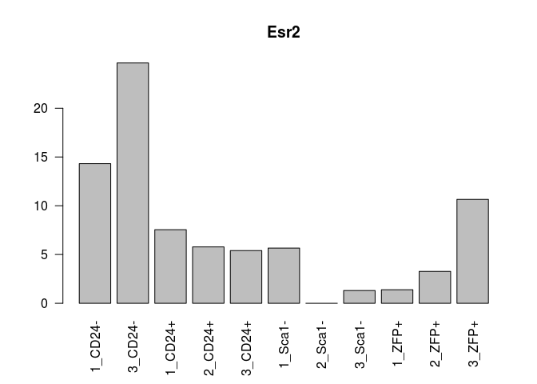

``` r
barplot(ambrosiMatNorm["Gper1",],las=2,main="Gper1")
```


### PCA

Let's redo the Principal component analysis (or singular value decomposition, svd) to check against figure 5 of the paper.

``` r
ambrosiCLN <- round.log(ambrosiMatNorm+1,2)
ambrosiCLN <- ambrosiCLN[rowSds(ambrosiCLN)>1,]
svAmbrosi <- svd((ambrosiCLN-rowMeans(ambrosiCLN))/rowSds(ambrosiCLN))

std.heatmap(cor(ambrosiMatNorm,method = "spearman"))
```

    ## Warning in heatmap.2(M, Rowv = F, Colv = F, trace = "none", col = cols, :
    ## Discrepancy: Rowv is FALSE, while dendrogram is `both'. Omitting row
    ## dendogram.

    ## Warning in heatmap.2(M, Rowv = F, Colv = F, trace = "none", col = cols, :
    ## Discrepancy: Colv is FALSE, while dendrogram is `column'. Omitting column
    ## dendogram.


``` r
conditNums <- sapply(condits,function(x)which(x==sort(unique(condits))))
#Sca1minus is osteo, ZFP (mature) and CD24- (less mature) are adipocytes, cd24+ is multipotent
plot(svAmbrosi$v[,1:2],col=conditNums,xlab="PC1",ylab="PC2")
legend("bottomright",legend = unique(names(conditNums)),col=1:4,fill = 1:4)
```


``` r
eaciout <- list()
l <- 1
eacivector <- svAmbrosi$u[,l]
names(eacivector) <- rownames(ambrosiCLN)
eaciout[[l]] <- eacitest(eacivector,"org.Mm.eg","SYMBOL",sets = "GO")$setscores
```

    ## Loading necessary libraries...

    ## Loaded Package org.Mm.eg.db

    ## Converting annotations to data.frames ...

    ## iteration 1 done; time  9.51 sec 
    ## iteration 2 done; time  7.51 sec 
    ## iteration 3 done; time  7.78 sec 
    ## iteration 4 done; time  8.01 sec 
    ## iteration 5 done; time  7.24 sec 
    ## iteration 6 done; time  7.81 sec 
    ## iteration 7 done; time  7.58 sec 
    ## iteration 8 done; time  7.77 sec 
    ## iteration 9 done; time  7.83 sec 
    ## iteration 10 done; time  8.03 sec

    ## Labeling output ...

    ## Loaded Package GO.db

``` r
l <- 2
eacivector <- svAmbrosi$u[,l]
names(eacivector) <- rownames(ambrosiCLN)
eaciout[[l]] <- eacitest(eacivector,"org.Mm.eg","SYMBOL",sets = "GO")$setscores
```

    ## Loading necessary libraries...

    ## Loaded Package org.Mm.eg.db

    ## Converting annotations to data.frames ...

    ## iteration 1 done; time  5.94 sec 
    ## iteration 2 done; time  7.86 sec 
    ## iteration 3 done; time  9.61 sec 
    ## iteration 4 done; time  7.36 sec 
    ## iteration 5 done; time  7.45 sec 
    ## iteration 6 done; time  7.24 sec 
    ## iteration 7 done; time  5.73 sec 
    ## iteration 8 done; time  8.26 sec 
    ## iteration 9 done; time  9.45 sec 
    ## iteration 10 done; time  8.23 sec

    ## Labeling output ...

    ## Loaded Package GO.db

### GO enrichment of Principal Components

So that reiterates the Ambrosi analysis. Now let's look at the continuous GO enrichment in the genes that contribute to PC1 (separates the osteocyte and progenitors from adipocytes)

``` r
#PC1 Positive
a <- eaciout[[1]][eaciout[[1]]$set.mean>0,]
print(a[1:25,])
```

    ##                                                               Term
    ## GO:1904181          positive regulation of membrane depolarization
    ## GO:0010935            regulation of macrophage cytokine production
    ## GO:0035455                            response to interferon-alpha
    ## GO:0035641                         locomotory exploration behavior
    ## GO:0070006                          metalloaminopeptidase activity
    ## GO:0043034                                               costamere
    ## GO:0005161         platelet-derived growth factor receptor binding
    ## GO:0030742                           GTP-dependent protein binding
    ## GO:0043649                     dicarboxylic acid catabolic process
    ## GO:0051497            negative regulation of stress fiber assembly
    ## GO:0097440                                         apical dendrite
    ## GO:0038191                                      neuropilin binding
    ## GO:0060716             labyrinthine layer blood vessel development
    ## GO:0034312                               diol biosynthetic process
    ## GO:0052744 phosphatidylinositol monophosphate phosphatase activity
    ## GO:0097320                              plasma membrane tubulation
    ## GO:2001212                            regulation of vasculogenesis
    ## GO:0000062                                  fatty-acyl-CoA binding
    ## GO:0042581                                        specific granule
    ## GO:1990126       retrograde transport, endosome to plasma membrane
    ## GO:0051654             establishment of mitochondrion localization
    ## GO:0031579                              membrane raft organization
    ## GO:0004602                         glutathione peroxidase activity
    ## GO:0030574                              collagen catabolic process
    ## GO:0021846                         cell proliferation in forebrain
    ##            Ontology    set.mean      set.sd set.size         pval
    ## GO:1904181       BP 0.009550961 0.007362549       11 0.000000e+00
    ## GO:0010935       BP 0.008480568 0.004542898       10 0.000000e+00
    ## GO:0035455       BP 0.008176674 0.004452738       16 0.000000e+00
    ## GO:0035641       BP 0.008128965 0.003041400       12 0.000000e+00
    ## GO:0070006       MF 0.008062144 0.003396604        9 0.000000e+00
    ## GO:0043034       CC 0.007416668 0.003652416       12 0.000000e+00
    ## GO:0005161       MF 0.007303739 0.004115494       10 0.000000e+00
    ## GO:0030742       MF 0.007236354 0.005686460       16 0.000000e+00
    ## GO:0043649       BP 0.007048522 0.004348495        9 6.661338e-16
    ## GO:0051497       BP 0.006929356 0.004769006       19 1.998401e-15
    ## GO:0097440       CC 0.006927306 0.008652274       17 1.998401e-15
    ## GO:0038191       MF 0.006925863 0.009478934       11 1.998401e-15
    ## GO:0060716       BP 0.006921120 0.003255819       13 1.998401e-15
    ## GO:0034312       BP 0.006855821 0.007104589       10 3.774758e-15
    ## GO:0052744       MF 0.006738662 0.002955610        9 1.110223e-14
    ## GO:0097320       BP 0.006549348 0.004641722       11 5.995204e-14
    ## GO:2001212       BP 0.006467521 0.007580034       11 1.225686e-13
    ## GO:0000062       MF 0.006281751 0.003783333       10 5.995204e-13
    ## GO:0042581       CC 0.006236637 0.008351424       11 8.757439e-13
    ## GO:1990126       BP 0.006187573 0.004099407       10 1.318279e-12
    ## GO:0051654       BP 0.006159705 0.003921547       10 1.660672e-12
    ## GO:0031579       BP 0.006144897 0.006097797        9 1.876721e-12
    ## GO:0004602       MF 0.006067209 0.005298084        9 3.548717e-12
    ## GO:0030574       BP 0.005944741 0.003864840       10 9.534373e-12
    ## GO:0021846       BP 0.005903418 0.007465946       18 1.325007e-11

``` r
#PC1 Negative
a <- eaciout[[1]][eaciout[[1]]$set.mean<0,]
print(a[1:25,])
```

    ##                                                                              Term
    ## GO:0003417                                     growth plate cartilage development
    ## GO:0042555                                                            MCM complex
    ## GO:0006271                      DNA strand elongation involved in DNA replication
    ## GO:0050699                                                      WW domain binding
    ## GO:0000940                                 condensed chromosome outer kinetochore
    ## GO:0031643                                     positive regulation of myelination
    ## GO:0003688                                         DNA replication origin binding
    ## GO:0043142                          single-stranded DNA-dependent ATPase activity
    ## GO:0051084                            'de novo' posttranslational protein folding
    ## GO:0030206                               chondroitin sulfate biosynthetic process
    ## GO:1904666                        regulation of ubiquitin protein ligase activity
    ## GO:0050911 detection of chemical stimulus involved in sensory perception of smell
    ## GO:0000800                                                        lateral element
    ## GO:0005861                                                       troponin complex
    ## GO:0002076                                                 osteoblast development
    ## GO:0061436                                          establishment of skin barrier
    ## GO:0000796                                                      condensin complex
    ## GO:0006198                                                 cAMP catabolic process
    ## GO:0010369                                                           chromocenter
    ## GO:0034501                                    protein localization to kinetochore
    ## GO:0018279                          protein N-linked glycosylation via asparagine
    ## GO:0005251                           delayed rectifier potassium channel activity
    ## GO:0004936                                     alpha-adrenergic receptor activity
    ## GO:0030033                                                   microvillus assembly
    ## GO:0045120                                                             pronucleus
    ##            Ontology     set.mean      set.sd set.size         pval
    ## GO:0003417       BP -0.007913482 0.006350914        9 8.242433e-20
    ## GO:0042555       CC -0.007165374 0.005537788        9 1.579214e-16
    ## GO:0006271       BP -0.006697905 0.003346225       10 1.226746e-14
    ## GO:0050699       MF -0.006399908 0.003496455       16 1.695746e-13
    ## GO:0000940       CC -0.006360513 0.004464935       12 2.379024e-13
    ## GO:0031643       BP -0.005818542 0.003866918       12 2.044247e-11
    ## GO:0003688       MF -0.005554578 0.003062234       11 1.558571e-10
    ## GO:0043142       MF -0.005363276 0.003052580       14 6.421543e-10
    ## GO:0051084       BP -0.005140655 0.007101077        9 3.143476e-09
    ## GO:0030206       BP -0.004989020 0.006338731        7 8.940523e-09
    ## GO:1904666       BP -0.004803296 0.007399239       11 3.089380e-08
    ## GO:0050911       BP -0.004620843 0.002097693       13 1.000393e-07
    ## GO:0000800       CC -0.004529402 0.006367887       14 1.773971e-07
    ## GO:0005861       CC -0.004385660 0.004648931        7 4.271912e-07
    ## GO:0002076       BP -0.004371176 0.006836826       10 4.660641e-07
    ## GO:0061436       BP -0.004240701 0.003095505       15 1.009057e-06
    ## GO:0000796       CC -0.004222971 0.003853109        7 1.118854e-06
    ## GO:0006198       BP -0.004200151 0.003667048       11 1.277187e-06
    ## GO:0010369       CC -0.004170686 0.002705810       10 1.513719e-06
    ## GO:0034501       BP -0.004121958 0.002540034       17 1.999980e-06
    ## GO:0018279       BP -0.003973351 0.005387521       15 4.590650e-06
    ## GO:0005251       MF -0.003906662 0.004965269       11 6.604611e-06
    ## GO:0004936       MF -0.003844353 0.004192067        4 9.230585e-06
    ## GO:0030033       BP -0.003498827 0.009998889       10 5.403767e-05
    ## GO:0045120       CC -0.003392271 0.007256207       13 9.040247e-05

Interesting... Now PC2 (separates osteocytes from progenitors)

``` r
#PC2 Positive
a <- eaciout[[2]][eaciout[[2]]$set.mean>0,]
print(a[1:25,])
```

    ##                                                                           Term
    ## GO:0000076                                          DNA replication checkpoint
    ## GO:0042168                                              heme metabolic process
    ## GO:0019825                                                      oxygen binding
    ## GO:0042555                                                         MCM complex
    ## GO:0043034                                                           costamere
    ## GO:0060004                                                              reflex
    ## GO:0035641                                     locomotory exploration behavior
    ## GO:0048821                                             erythrocyte development
    ## GO:0052744             phosphatidylinositol monophosphate phosphatase activity
    ## GO:0000940                              condensed chromosome outer kinetochore
    ## GO:0006271                   DNA strand elongation involved in DNA replication
    ## GO:0007076                                     mitotic chromosome condensation
    ## GO:0002098                                    tRNA wobble uridine modification
    ## GO:0043142                       single-stranded DNA-dependent ATPase activity
    ## GO:0030539                                          male genitalia development
    ## GO:0043567 regulation of insulin-like growth factor receptor signaling pathway
    ## GO:0008139                               nuclear localization sequence binding
    ## GO:0007064                                   mitotic sister chromatid cohesion
    ## GO:0034508                                         centromere complex assembly
    ## GO:0005847        mRNA cleavage and polyadenylation specificity factor complex
    ## GO:0071108                                 protein K48-linked deubiquitination
    ## GO:0003688                                      DNA replication origin binding
    ## GO:0042588                                                     zymogen granule
    ## GO:0032769                       negative regulation of monooxygenase activity
    ## GO:0043240                                     Fanconi anaemia nuclear complex
    ##            Ontology    set.mean      set.sd set.size         pval
    ## GO:0000076       BP 0.009693135 0.004932242       10 0.000000e+00
    ## GO:0042168       BP 0.007914790 0.009950480       14 0.000000e+00
    ## GO:0019825       MF 0.007654870 0.004611019       13 0.000000e+00
    ## GO:0042555       CC 0.007441273 0.004535643        9 0.000000e+00
    ## GO:0043034       CC 0.006902043 0.003410221       12 0.000000e+00
    ## GO:0060004       BP 0.006565326 0.003320756       13 2.220446e-16
    ## GO:0035641       BP 0.006333117 0.002822265       12 1.776357e-15
    ## GO:0048821       BP 0.005632202 0.010486405       21 1.544986e-12
    ## GO:0052744       MF 0.005609784 0.003603374        9 1.891154e-12
    ## GO:0000940       CC 0.005590678 0.004938136       12 2.245759e-12
    ## GO:0006271       BP 0.005444022 0.002063442       10 8.237189e-12
    ## GO:0007076       BP 0.005298614 0.006001636        9 2.891776e-11
    ## GO:0002098       BP 0.005133174 0.003917011        9 1.160048e-10
    ## GO:0043142       MF 0.004823193 0.002418823       14 1.398381e-09
    ## GO:0030539       BP 0.004799560 0.003085027       12 1.680430e-09
    ## GO:0043567       BP 0.004590763 0.002749857       16 8.207849e-09
    ## GO:0008139       MF 0.004501030 0.002706107       10 1.589782e-08
    ## GO:0007064       BP 0.004474369 0.004951665       13 1.930226e-08
    ## GO:0034508       BP 0.004467597 0.003425169       17 2.027394e-08
    ## GO:0005847       CC 0.004274121 0.002753735        8 8.006887e-08
    ## GO:0071108       BP 0.004062983 0.002363101       11 3.358228e-07
    ## GO:0003688       MF 0.004058608 0.002412097       11 3.456995e-07
    ## GO:0042588       CC 0.004049460 0.002115837       12 3.672673e-07
    ## GO:0032769       BP 0.004039837 0.002196960       12 3.913548e-07
    ## GO:0043240       CC 0.003699106 0.006487035       12 3.388582e-06

``` r
#PC2 Negative
a <- eaciout[[2]][eaciout[[2]]$set.mean<0,]
print(a[1:25,])
```

    ##                                                                  Term
    ## GO:0042608                                    T cell receptor binding
    ## GO:0004745                             retinol dehydrogenase activity
    ## GO:0005779                 integral component of peroxisomal membrane
    ## GO:0070402                                              NADPH binding
    ## GO:0016755       transferase activity, transferring amino-acyl groups
    ## GO:0045948            positive regulation of translational initiation
    ## GO:0030687                       preribosome, large subunit precursor
    ## GO:0048845                          venous blood vessel morphogenesis
    ## GO:1904424                                  regulation of GTP binding
    ## GO:0048875                       chemical homeostasis within a tissue
    ## GO:0032823          regulation of natural killer cell differentiation
    ## GO:0035859                                    Seh1-associated complex
    ## GO:0006677                         glycosylceramide metabolic process
    ## GO:0090502        RNA phosphodiester bond hydrolysis, endonucleolytic
    ## GO:0004467                  long-chain fatty acid-CoA ligase activity
    ## GO:0008356                                   asymmetric cell division
    ## GO:0009931 calcium-dependent protein serine/threonine kinase activity
    ## GO:0031902                                     late endosome membrane
    ## GO:0007214                  gamma-aminobutyric acid signaling pathway
    ## GO:0004115                3',5'-cyclic-AMP phosphodiesterase activity
    ## GO:0046966                           thyroid hormone receptor binding
    ## GO:0097546                                               ciliary base
    ## GO:0036158                                  outer dynein arm assembly
    ## GO:0045236                            CXCR chemokine receptor binding
    ## GO:0050774              negative regulation of dendrite morphogenesis
    ##            Ontology     set.mean      set.sd set.size         pval
    ## GO:0042608       MF -0.007225827 0.002514962       12 1.338052e-19
    ## GO:0004745       MF -0.006967215 0.004736985       10 2.483191e-18
    ## GO:0005779       CC -0.006921376 0.003991866       11 4.122337e-18
    ## GO:0070402       MF -0.006843526 0.003357262       11 9.677517e-18
    ## GO:0016755       MF -0.006644089 0.006152538       13 8.252173e-17
    ## GO:0045948       BP -0.006520814 0.006213942       12 3.009541e-16
    ## GO:0030687       CC -0.006427968 0.002866980       13 7.851767e-16
    ## GO:0048845       BP -0.006133401 0.003886870       10 1.506047e-14
    ## GO:1904424       BP -0.006115307 0.002902614       10 1.797771e-14
    ## GO:0048875       BP -0.006060489 0.006105307       11 3.064503e-14
    ## GO:0032823       BP -0.006047297 0.006936837       12 3.481768e-14
    ## GO:0035859       CC -0.006046898 0.008022817       11 3.495241e-14
    ## GO:0006677       BP -0.005997180 0.005862817       11 5.640960e-14
    ## GO:0090502       BP -0.005861337 0.004638792       12 2.045740e-13
    ## GO:0004467       MF -0.005442840 0.004942386        8 9.049884e-12
    ## GO:0008356       BP -0.005246803 0.004761979       11 4.866223e-11
    ## GO:0009931       MF -0.005184949 0.006868003        8 8.172605e-11
    ## GO:0031902       CC -0.004992897 0.003392507       13 3.937092e-10
    ## GO:0007214       BP -0.004960321 0.002685419       12 5.111538e-10
    ## GO:0004115       MF -0.004908306 0.003028564       11 7.728744e-10
    ## GO:0046966       MF -0.004798493 0.005462973       12 1.824991e-09
    ## GO:0097546       CC -0.004753170 0.005377825       19 2.587775e-09
    ## GO:0036158       BP -0.004745586 0.003401511        9 2.742657e-09
    ## GO:0045236       MF -0.004722545 0.004456333       10 3.270645e-09
    ## GO:0050774       BP -0.004630942 0.002674785       10 6.533070e-09

Sweet.

Time for some differential expression

``` r
cond <- as.factor(condits)
colnames(ambrosiMat) <- make.names(condits,unique = T)
dds <- DESeqDataSetFromMatrix(round(ambrosiMat),colData = DataFrame(cond),design = formula(~cond+0))
```

    ## converting counts to integer mode

``` r
DESeqOutput <-  DESeq(dds)
```

    ## estimating size factors

    ## estimating dispersions

    ## gene-wise dispersion estimates

    ## mean-dispersion relationship

    ## final dispersion estimates

    ## fitting model and testing

``` r
resultsNames(DESeqOutput)
```

    ## [1] "condCD24minus" "condCD24plus"  "condSca1minus" "condZFPplus"

``` r
resList <-  list(results(DESeqOutput,contrast = c(1,-1/3,-1/3,-1/3 ),cooksCutoff=T),results(DESeqOutput,contrast = c(-1/3,1,-1/3,-1/3 ),cooksCutoff=T),results(DESeqOutput,contrast = c(-1/3,-1/3,1,-1/3 ),cooksCutoff=T),results(DESeqOutput,contrast = c(-1/3,-1/3,-1/3 ,1),cooksCutoff=T))

ambrosiUpDown <-lapply(resList,function(res){
  res <- res[!is.na(res$padj),]
  list(rownames(res[res$padj<.1&res$log2FoldChange>0,]),rownames(res[res$padj<.1&res$log2FoldChange<0,]))
})

print(str(ambrosiUpDown))
```

    ## List of 4
    ##  $ :List of 2
    ##   ..$ : chr [1:419] "1700066M21Rik" "5430403G16Rik" "6430548M08Rik" "8430408G22Rik" ...
    ##   ..$ : chr [1:591] "1110008L16Rik" "1810041L15Rik" "2610008E11Rik" "3110062M04Rik" ...
    ##  $ :List of 2
    ##   ..$ : chr [1:896] "1190002N15Rik" "1700028J19Rik" "1700047I17Rik2" "1810013L24Rik" ...
    ##   ..$ : chr [1:800] "1700019D03Rik" "2200002D01Rik" "2310009B15Rik" "2310061I04Rik" ...
    ##  $ :List of 2
    ##   ..$ : chr [1:894] "1500015O10Rik" "1700008O03Rik" "1700047I17Rik2" "1810041L15Rik" ...
    ##   ..$ : chr [1:853] "0610040J01Rik" "1700029J07Rik" "1810043G02Rik" "2510039O18Rik" ...
    ##  $ :List of 2
    ##   ..$ : chr [1:689] "2200002D01Rik" "2810021J22Rik" "3830406C13Rik" "4930432E11Rik" ...
    ##   ..$ : chr [1:765] "1500015O10Rik" "1700028J19Rik" "1700047I17Rik2" "1700066M21Rik" ...
    ## NULL

So there's a bunch of genes differentially expressed up or down for each cell type compared to all the others.

``` r
for(i in 1:length(resList)){
  print(resultsNames(DESeqOutput)[i])
  res <- resList[[i]]
    write.table(res[order(res$log2FoldChange,decreasing = T),],paste0("~/Desktop/DEG_",resultsNames(DESeqOutput)[i],".txt"),sep = "\t",quote = F)
  res <- res[!is.na(res$padj),]
  res <- res[res$padj<.1&res$log2FoldChange>0,]
  mat <- log(ambrosiMatNorm+1,2)-rowMeans(log(ambrosiMatNorm+1,2))
  std.heatmap(mat[rownames(res[order(res$padj,decreasing = F),])[1:25],],main=paste(resultsNames(DESeqOutput)[i],"Up vs All\nLogFC vs mean"))
}
```

    ## [1] "condCD24minus"

    ## Warning in heatmap.2(M, Rowv = F, Colv = F, trace = "none", col = cols, :
    ## Discrepancy: Rowv is FALSE, while dendrogram is `both'. Omitting row
    ## dendogram.

    ## Warning in heatmap.2(M, Rowv = F, Colv = F, trace = "none", col = cols, :
    ## Discrepancy: Colv is FALSE, while dendrogram is `column'. Omitting column
    ## dendogram.

    ## [1] "condCD24plus"

    ## Warning in heatmap.2(M, Rowv = F, Colv = F, trace = "none", col = cols, :
    ## Discrepancy: Rowv is FALSE, while dendrogram is `both'. Omitting row
    ## dendogram.

    ## Warning in heatmap.2(M, Rowv = F, Colv = F, trace = "none", col = cols, :
    ## Discrepancy: Colv is FALSE, while dendrogram is `column'. Omitting column
    ## dendogram.


    ## [1] "condSca1minus"

    ## Warning in heatmap.2(M, Rowv = F, Colv = F, trace = "none", col = cols, :
    ## Discrepancy: Rowv is FALSE, while dendrogram is `both'. Omitting row
    ## dendogram.

    ## Warning in heatmap.2(M, Rowv = F, Colv = F, trace = "none", col = cols, :
    ## Discrepancy: Colv is FALSE, while dendrogram is `column'. Omitting column
    ## dendogram.


    ## [1] "condZFPplus"

    ## Warning in heatmap.2(M, Rowv = F, Colv = F, trace = "none", col = cols, :
    ## Discrepancy: Rowv is FALSE, while dendrogram is `both'. Omitting row
    ## dendogram.

    ## Warning in heatmap.2(M, Rowv = F, Colv = F, trace = "none", col = cols, :
    ## Discrepancy: Colv is FALSE, while dendrogram is `column'. Omitting column
    ## dendogram.


``` r
for(i in 1:length(resList)){
  print(resultsNames(DESeqOutput)[i])
  res <- resList[[i]]
  res <- res[!is.na(res$padj),]
  res <- res[res$padj<.1&res$log2FoldChange>0,]
  std.heatmap(log(ambrosiMatNorm[rownames(res[order(res$padj,decreasing = F),])[1:25],]+1,2),main=paste(resultsNames(DESeqOutput)[i],"Up vs All"))
}
```

    ## [1] "condCD24minus"

    ## Warning in heatmap.2(M, Rowv = F, Colv = F, trace = "none", col = cols, :
    ## Discrepancy: Rowv is FALSE, while dendrogram is `both'. Omitting row
    ## dendogram.

    ## Warning in heatmap.2(M, Rowv = F, Colv = F, trace = "none", col = cols, :
    ## Discrepancy: Colv is FALSE, while dendrogram is `column'. Omitting column
    ## dendogram.

    ## [1] "condCD24plus"

    ## Warning in heatmap.2(M, Rowv = F, Colv = F, trace = "none", col = cols, :
    ## Discrepancy: Rowv is FALSE, while dendrogram is `both'. Omitting row
    ## dendogram.

    ## Warning in heatmap.2(M, Rowv = F, Colv = F, trace = "none", col = cols, :
    ## Discrepancy: Colv is FALSE, while dendrogram is `column'. Omitting column
    ## dendogram.


    ## [1] "condSca1minus"

    ## Warning in heatmap.2(M, Rowv = F, Colv = F, trace = "none", col = cols, :
    ## Discrepancy: Rowv is FALSE, while dendrogram is `both'. Omitting row
    ## dendogram.

    ## Warning in heatmap.2(M, Rowv = F, Colv = F, trace = "none", col = cols, :
    ## Discrepancy: Colv is FALSE, while dendrogram is `column'. Omitting column
    ## dendogram.


    ## [1] "condZFPplus"

    ## Warning in heatmap.2(M, Rowv = F, Colv = F, trace = "none", col = cols, :
    ## Discrepancy: Rowv is FALSE, while dendrogram is `both'. Omitting row
    ## dendogram.

    ## Warning in heatmap.2(M, Rowv = F, Colv = F, trace = "none", col = cols, :
    ## Discrepancy: Colv is FALSE, while dendrogram is `column'. Omitting column
    ## dendogram.


Candice's Data
--------------

The data for the Ingraham lab RNAseq was also passed to Salmon after fastqc and trimming with trimgalore as suggested by the NuGen Prep.

``` r
datapath <- "~/code/IngrahamLabData/BoneSalmonOutputs/"
fileList <- dir(datapath)
fileList <- fileList[!grepl("Gene|pdf",fileList)]
dsList <- lapply(paste0(datapath,fileList),read.csv2, sep="\t",header=T,row.names=1,stringsAsFactors=F)
allRownames <- Reduce(union,lapply(dsList,rownames))

mart <- useMart(biomart = "ENSEMBL_MART_ENSEMBL", dataset = "mmusculus_gene_ensembl", host="www.ensembl.org")
rnSymbol <- getBM(attributes = c("ensembl_transcript_id_version","mgi_symbol",'description'),filters = c("ensembl_transcript_id_version"),values =allRownames ,mart = mart) 
rnSymbolGenes <- rnSymbol[rnSymbol$mgi_symbol!=""& !grepl("predicted gene", rnSymbol$description),]
```

``` r
# dsAgList <-  lapply(dsList,function(x){
#   rnsgs <-  rnSymbolGenes[rnSymbolGenes$ensembl_transcript_id_version %in% rownames(x),]
#   x <- x[rnsgs$ensembl_transcript_id_version,]
#   ret <- aggregate(as.integer(x$NumReads), by=list(rnsgs$mgi_symbol),sum)
#   rownames(ret) <- ret[,1]
#   ret[,-1,drop=F]
# })

dsAgList <- lapply(colnames(dsList[[1]]),function(n){
  Reduce(cbind,lapply(dsList,function(x)x[,n,drop=F]))
  })
names(dsAgList) <- names(txList)[c(3,4,1,2)]
dsAgList <- lapply(dsAgList,function(x){
  x <- as.matrix(x)
  storage.mode(x) <- "numeric"
  x
  })
boneMat <- summarizeToGene(dsAgList,rnSymbolGenes)$counts[-1,]
```

    ## removing duplicated transcript rows from tx2gene

    ## transcripts missing from tx2gene: 13832

    ## summarizing abundance

    ## summarizing counts

    ## summarizing length

``` r
sampleNames <- c("1807_BM_fl_A1","1810_BM_KO_E1","1811_BM_KO_G1","1815_BM_fl_B1","1818_BM_fl_C1","1825_BM_KO_F1","1984_BM_fl_D1","1985_BM_KO_H1")
SampleNameMat <- sapply(strsplit(sampleNames,"_"),function(i)i)
#boneMat <-  as.matrix(Reduce(rn.merge,dsAgList))
colnames(boneMat) <- paste(SampleNameMat[3,],gsub("[[:digit:]]","",SampleNameMat[4,]),sep = "_")
boneMatNorm <-  median.normalize(boneMat)
boneMatNorm <- boneMatNorm[,order(colnames(boneMatNorm))]
heatmap.2(cor(boneMatNorm,method = "spe"),col=cols,trace="none")
```


``` r
std.heatmap(cor(rn.merge(boneMatNorm,ambrosiMatNorm),method = "spe"),main="Spearman Correlation\n Ambrosi vs Candice")
```

    ## Warning in heatmap.2(M, Rowv = F, Colv = F, trace = "none", col = cols, :
    ## Discrepancy: Rowv is FALSE, while dendrogram is `both'. Omitting row
    ## dendogram.

    ## Warning in heatmap.2(M, Rowv = F, Colv = F, trace = "none", col = cols, :
    ## Discrepancy: Colv is FALSE, while dendrogram is `column'. Omitting column
    ## dendogram.


### PCA Candice

``` r
boneCLN <- round.log(boneMatNorm+1,2)
boneCLN <- boneCLN[rowSds(boneCLN)>1,]
svbone <- svd((boneCLN-rowMeans(boneCLN))/rowSds(boneCLN))

condits <- sapply(strsplit(colnames(boneMatNorm),"_"),function(i) i[1])
conditNums <- sapply(condits,function(x)which(x==sort(unique(condits))))
#Sca1minus is osteo, ZFP (mature) and CD24- (less mature) are adipocytes, cd24+ is multipotent

plot(svbone$v[,1:2],col=conditNums,xlab="PC1",ylab="PC2")
legend("bottomright",legend = unique(names(conditNums)),col=1:2,fill = 1:2)
```


``` r
library(EACI)
for(l in 1:4){
  eacivector <- svbone$u[,l]
  names(eacivector) <- rownames(boneCLN)
  eaciout[[l]] <- eacitest(eacivector,"org.Mm.eg","SYMBOL",sets = "GO")$setscores

  mypar(1,1)
  plot(svbone$v[,l],svbone$v[,l+1],pch=conditNums,col=conditNums,main=paste("PC",l,"vs",l+1))
  print(paste("LOADINGS PC",l))
  print(paste("*************************Enriched Down for PC",l,"*************************"))
  loading1 <- rownames(boneCLN)[order(svbone$u[,l])]
  mypar(4,4)
  for(i in 1:32)plot(boneCLN[loading1[i],],pch=conditNums,col=conditNums,main=loading1[i])
  print(eaciout[[l]][order(eaciout[[l]]$set.mean,decreasing = F)[1:25],c("pval","Term")])

  print(paste("*************************Enriched Up for PC",l,"*************************"))
  loading1 <- rownames(boneCLN)[order(svbone$u[,l],decreasing = T)]
  mypar(4,4)
  for(i in 1:32)plot(boneCLN[loading1[i],],pch=conditNums,col=conditNums,main=loading1[i])
  print(eaciout[[l]][order(eaciout[[l]]$set.mean,decreasing = T)[1:25],c("pval","Term")])

}
```

    ## Loading necessary libraries...

    ## Loaded Package org.Mm.eg.db

    ## Converting annotations to data.frames ...

    ## iteration 1 done; time  0.66 sec 
    ## iteration 2 done; time  0.6 sec 
    ## iteration 3 done; time  0.59 sec 
    ## iteration 4 done; time  0.71 sec 
    ## iteration 5 done; time  0.77 sec 
    ## iteration 6 done; time  0.63 sec 
    ## iteration 7 done; time  0.75 sec 
    ## iteration 8 done; time  0.71 sec 
    ## iteration 9 done; time  0.77 sec 
    ## iteration 10 done; time  1.14 sec

    ## Labeling output ...

    ## Loaded Package GO.db


    ## [1] "LOADINGS PC 1"
    ## [1] "*************************Enriched Down for PC 1 *************************"

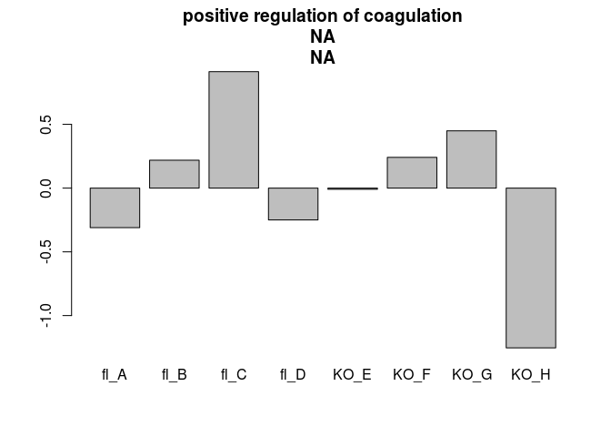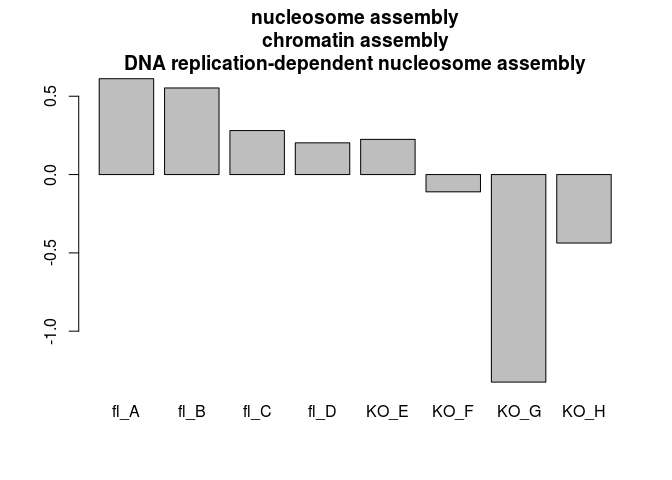

    ##                    pval
    ## GO:0000784 3.647966e-67
    ## GO:0005759 2.760104e-28
    ## GO:0003735 9.499767e-28
    ## GO:0003823 1.684502e-24
    ## GO:0007006 3.862506e-19
    ## GO:0006342 1.603197e-18
    ## GO:0045814 1.603197e-18
    ## GO:0045746 1.443393e-16
    ## GO:0015931 9.341810e-15
    ## GO:0045333 3.658173e-14
    ## GO:0017137 7.136554e-10
    ## GO:0044450 1.616629e-09
    ## GO:0002377 1.727998e-09
    ## GO:0005496 2.729222e-07
    ## GO:0008033 5.894054e-07
    ## GO:0030838 1.759249e-06
    ## GO:1990939 3.981807e-06
    ## GO:0019228 4.353179e-06
    ## GO:0030258 5.861163e-06
    ## GO:0016811 9.953691e-06
    ## GO:0006302 2.652326e-05
    ## GO:0018958 3.881669e-05
    ## GO:0008038 4.569886e-05
    ## GO:0043200 9.168930e-05
    ## GO:0070286 1.105458e-04
    ##                                                                                               Term
    ## GO:0000784                                                    nuclear chromosome, telomeric region
    ## GO:0005759                                                                    mitochondrial matrix
    ## GO:0003735                                                      structural constituent of ribosome
    ## GO:0003823                                                                         antigen binding
    ## GO:0007006                                                     mitochondrial membrane organization
    ## GO:0006342                                                                     chromatin silencing
    ## GO:0045814                                      negative regulation of gene expression, epigenetic
    ## GO:0045746                                          negative regulation of Notch signaling pathway
    ## GO:0015931                                                nucleobase-containing compound transport
    ## GO:0045333                                                                    cellular respiration
    ## GO:0017137                                                                      Rab GTPase binding
    ## GO:0044450                                                      microtubule organizing center part
    ## GO:0002377                                                               immunoglobulin production
    ## GO:0005496                                                                         steroid binding
    ## GO:0008033                                                                         tRNA processing
    ## GO:0030838                                    positive regulation of actin filament polymerization
    ## GO:1990939                                                ATP-dependent microtubule motor activity
    ## GO:0019228                                                               neuronal action potential
    ## GO:0030258                                                                      lipid modification
    ## GO:0016811 hydrolase activity, acting on carbon-nitrogen (but not peptide) bonds, in linear amides
    ## GO:0006302                                                              double-strand break repair
    ## GO:0018958                                            phenol-containing compound metabolic process
    ## GO:0008038                                                                      neuron recognition
    ## GO:0043200                                                                  response to amino acid
    ## GO:0070286                                                        axonemal dynein complex assembly
    ## [1] "*************************Enriched Up for PC 1 *************************"


    ##                    pval
    ## GO:0050907 0.000000e+00
    ## GO:0051453 1.363354e-13
    ## GO:0060395 1.492717e-11
    ## GO:0030199 2.810825e-08
    ## GO:0007565 4.030166e-08
    ## GO:0042734 1.557591e-07
    ## GO:0042641 2.773135e-07
    ## GO:0051015 1.755583e-06
    ## GO:0019902 3.804549e-06
    ## GO:0001952 5.606859e-06
    ## GO:0022600 6.483939e-06
    ## GO:0031234 7.596977e-06
    ## GO:0046165 4.134425e-05
    ## GO:0015296 3.244905e-04
    ## GO:0051607 4.525466e-04
    ## GO:0051705 6.139598e-04
    ## GO:0002244 6.443296e-04
    ## GO:0050771 7.471947e-04
    ## GO:0003009 1.223735e-03
    ## GO:0099094 1.319309e-03
    ## GO:0000795 1.561030e-03
    ## GO:0099086 1.561030e-03
    ## GO:0008080 2.471286e-03
    ## GO:0061337 2.631329e-03
    ## GO:0061005 3.150520e-03
    ##                                                                     Term
    ## GO:0050907 detection of chemical stimulus involved in sensory perception
    ## GO:0051453                                regulation of intracellular pH
    ## GO:0060395                              SMAD protein signal transduction
    ## GO:0030199                                  collagen fibril organization
    ## GO:0007565                                              female pregnancy
    ## GO:0042734                                          presynaptic membrane
    ## GO:0042641                                                    actomyosin
    ## GO:0051015                                        actin filament binding
    ## GO:0019902                                           phosphatase binding
    ## GO:0001952                            regulation of cell-matrix adhesion
    ## GO:0022600                                      digestive system process
    ## GO:0031234    extrinsic component of cytoplasmic side of plasma membrane
    ## GO:0046165                                  alcohol biosynthetic process
    ## GO:0015296                               anion:cation symporter activity
    ## GO:0051607                                     defense response to virus
    ## GO:0051705                                       multi-organism behavior
    ## GO:0002244                 hematopoietic progenitor cell differentiation
    ## GO:0050771                           negative regulation of axonogenesis
    ## GO:0003009                                   skeletal muscle contraction
    ## GO:0099094                          ligand-gated cation channel activity
    ## GO:0000795                                          synaptonemal complex
    ## GO:0099086                                        synaptonemal structure
    ## GO:0008080                                  N-acetyltransferase activity
    ## GO:0061337                                            cardiac conduction
    ## GO:0061005           cell differentiation involved in kidney development

    ## Loading necessary libraries...

    ## Loaded Package org.Mm.eg.db

    ## Converting annotations to data.frames ...

    ## iteration 1 done; time  0.73 sec 
    ## iteration 2 done; time  0.69 sec 
    ## iteration 3 done; time  0.77 sec 
    ## iteration 4 done; time  0.8 sec 
    ## iteration 5 done; time  1.24 sec 
    ## iteration 6 done; time  0.82 sec 
    ## iteration 7 done; time  1.3 sec 
    ## iteration 8 done; time  0.86 sec 
    ## iteration 9 done; time  1.28 sec 
    ## iteration 10 done; time  1.16 sec

    ## Labeling output ...

    ## Loaded Package GO.db

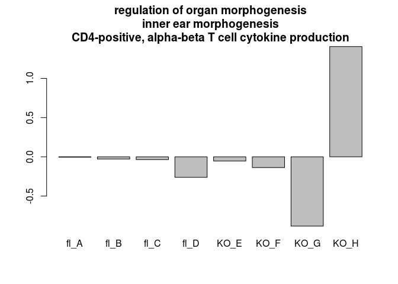

    ## [1] "LOADINGS PC 2"
    ## [1] "*************************Enriched Down for PC 2 *************************"

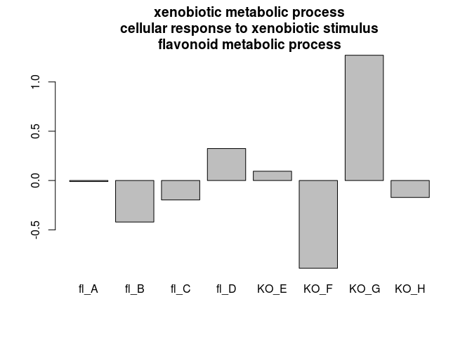

    ##                    pval                                               Term
    ## GO:0051290 7.307539e-82                      protein heterotetramerization
    ## GO:0001669 6.822807e-17                                  acrosomal vesicle
    ## GO:0022627 4.632372e-14                  cytosolic small ribosomal subunit
    ## GO:0006342 8.470617e-13                                chromatin silencing
    ## GO:0045814 8.470617e-13 negative regulation of gene expression, epigenetic
    ## GO:0019825 9.436965e-13                                     oxygen binding
    ## GO:0030135 1.072745e-11                                     coated vesicle
    ## GO:0004867 7.821462e-11       serine-type endopeptidase inhibitor activity
    ## GO:0006302 2.599255e-10                         double-strand break repair
    ## GO:0045746 1.647406e-09     negative regulation of Notch signaling pathway
    ## GO:0005179 5.189281e-09                                   hormone activity
    ## GO:0044325 9.221732e-09                                ion channel binding
    ## GO:0007612 1.916246e-08                                           learning
    ## GO:0005520 2.119385e-08                 insulin-like growth factor binding
    ## GO:0007050 3.207450e-08                                  cell cycle arrest
    ## GO:0004725 1.051561e-07              protein tyrosine phosphatase activity
    ## GO:0016607 7.074191e-07                                      nuclear speck
    ## GO:0007608 1.859478e-06                        sensory perception of smell
    ## GO:0010506 2.039872e-06                            regulation of autophagy
    ## GO:0019218 2.337556e-06            regulation of steroid metabolic process
    ## GO:0001046 2.839857e-06        core promoter sequence-specific DNA binding
    ## GO:0046068 8.925275e-06                             cGMP metabolic process
    ## GO:0022839 5.893398e-05                         ion gated channel activity
    ## GO:0005518 6.727777e-05                                   collagen binding
    ## GO:0050919 8.606400e-05                                negative chemotaxis
    ## [1] "*************************Enriched Up for PC 2 *************************"


    ##                    pval
    ## GO:0003823 0.000000e+00
    ## GO:0005882 8.548717e-14
    ## GO:0002377 8.659740e-14
    ## GO:0051783 5.835488e-11
    ## GO:0016811 1.482892e-10
    ## GO:0006081 1.082206e-09
    ## GO:0021543 2.077551e-09
    ## GO:0006304 5.426667e-08
    ## GO:0015931 2.176660e-07
    ## GO:0004252 3.441386e-07
    ## GO:0071901 6.487250e-07
    ## GO:0060359 1.259760e-06
    ## GO:0004222 1.785226e-06
    ## GO:0004984 2.350654e-06
    ## GO:0016459 3.734440e-05
    ## GO:0008081 5.547060e-05
    ## GO:1990939 6.055621e-05
    ## GO:0034704 7.381673e-05
    ## GO:0005813 9.448805e-05
    ## GO:0002028 2.108274e-04
    ## GO:0002027 2.621599e-04
    ## GO:0030246 7.487776e-04
    ## GO:0009408 7.782523e-04
    ## GO:0070664 9.991749e-04
    ## GO:0008022 1.405299e-03
    ##                                                                                               Term
    ## GO:0003823                                                                         antigen binding
    ## GO:0005882                                                                   intermediate filament
    ## GO:0002377                                                               immunoglobulin production
    ## GO:0051783                                                          regulation of nuclear division
    ## GO:0016811 hydrolase activity, acting on carbon-nitrogen (but not peptide) bonds, in linear amides
    ## GO:0006081                                                     cellular aldehyde metabolic process
    ## GO:0021543                                                                     pallium development
    ## GO:0006304                                                                        DNA modification
    ## GO:0015931                                                nucleobase-containing compound transport
    ## GO:0004252                                                      serine-type endopeptidase activity
    ## GO:0071901                         negative regulation of protein serine/threonine kinase activity
    ## GO:0060359                                                                response to ammonium ion
    ## GO:0004222                                                           metalloendopeptidase activity
    ## GO:0004984                                                             olfactory receptor activity
    ## GO:0016459                                                                          myosin complex
    ## GO:0008081                                                   phosphoric diester hydrolase activity
    ## GO:1990939                                                ATP-dependent microtubule motor activity
    ## GO:0034704                                                                 calcium channel complex
    ## GO:0005813                                                                              centrosome
    ## GO:0002028                                                      regulation of sodium ion transport
    ## GO:0002027                                                                regulation of heart rate
    ## GO:0030246                                                                    carbohydrate binding
    ## GO:0009408                                                                        response to heat
    ## GO:0070664                                          negative regulation of leukocyte proliferation
    ## GO:0008022                                                              protein C-terminus binding

    ## Loading necessary libraries...

    ## Loaded Package org.Mm.eg.db

    ## Converting annotations to data.frames ...

    ## iteration 1 done; time  1.69 sec 
    ## iteration 2 done; time  1.05 sec 
    ## iteration 3 done; time  0.97 sec 
    ## iteration 4 done; time  0.77 sec 
    ## iteration 5 done; time  0.72 sec 
    ## iteration 6 done; time  1.07 sec 
    ## iteration 7 done; time  0.97 sec 
    ## iteration 8 done; time  1.62 sec 
    ## iteration 9 done; time  1.11 sec 
    ## iteration 10 done; time  1.56 sec

    ## Labeling output ...

    ## Loaded Package GO.db

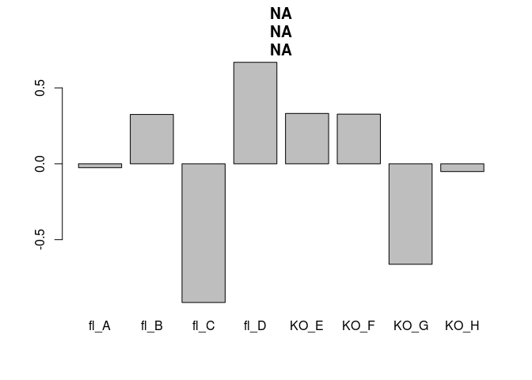

    ## [1] "LOADINGS PC 3"
    ## [1] "*************************Enriched Down for PC 3 *************************"


    ##                    pval
    ## GO:0038024 2.976365e-39
    ## GO:0005179 2.466970e-23
    ## GO:0010811 2.330227e-11
    ## GO:0098644 1.453797e-10
    ## GO:0016811 4.273135e-10
    ## GO:0034704 3.616582e-09
    ## GO:0001076 1.807864e-08
    ## GO:0048020 3.080003e-08
    ## GO:0021536 3.677141e-08
    ## GO:0030674 9.585132e-07
    ## GO:0046849 1.253063e-05
    ## GO:0004683 1.570869e-05
    ## GO:0045773 2.031144e-05
    ## GO:0001676 2.398625e-05
    ## GO:0015370 3.237325e-05
    ## GO:0010633 7.000053e-05
    ## GO:0005770 1.453302e-04
    ## GO:0005759 2.049949e-04
    ## GO:0009064 3.087111e-04
    ## GO:0099094 4.833708e-04
    ## GO:0014704 5.201631e-04
    ## GO:0046434 7.838631e-04
    ## GO:0008235 1.473427e-03
    ## GO:0007009 1.679861e-03
    ## GO:0007050 1.900410e-03
    ##                                                                                               Term
    ## GO:0038024                                                                 cargo receptor activity
    ## GO:0005179                                                                        hormone activity
    ## GO:0010811                                          positive regulation of cell-substrate adhesion
    ## GO:0098644                                                             complex of collagen trimers
    ## GO:0016811 hydrolase activity, acting on carbon-nitrogen (but not peptide) bonds, in linear amides
    ## GO:0034704                                                                 calcium channel complex
    ## GO:0001076           transcription factor activity, RNA polymerase II transcription factor binding
    ## GO:0048020                                                          CCR chemokine receptor binding
    ## GO:0021536                                                                diencephalon development
    ## GO:0030674                                                               protein binding, bridging
    ## GO:0046849                                                                         bone remodeling
    ## GO:0004683                                            calmodulin-dependent protein kinase activity
    ## GO:0045773                                                   positive regulation of axon extension
    ## GO:0001676                                                 long-chain fatty acid metabolic process
    ## GO:0015370                                                        solute:sodium symporter activity
    ## GO:0010633                                        negative regulation of epithelial cell migration
    ## GO:0005770                                                                           late endosome
    ## GO:0005759                                                                    mitochondrial matrix
    ## GO:0009064                                           glutamine family amino acid metabolic process
    ## GO:0099094                                                    ligand-gated cation channel activity
    ## GO:0014704                                                                       intercalated disc
    ## GO:0046434                                                       organophosphate catabolic process
    ## GO:0008235                                                            metalloexopeptidase activity
    ## GO:0007009                                                            plasma membrane organization
    ## GO:0007050                                                                       cell cycle arrest
    ## [1] "*************************Enriched Up for PC 3 *************************"

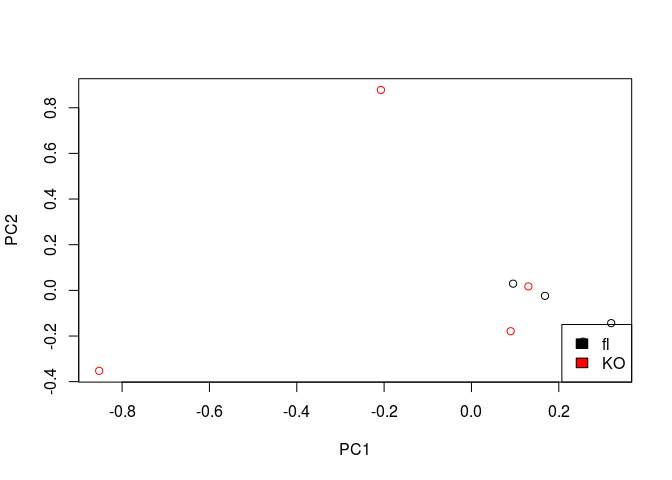

    ##                    pval
    ## GO:2000177 0.000000e+00
    ## GO:0000287 0.000000e+00
    ## GO:0050982 0.000000e+00
    ## GO:0005088 0.000000e+00
    ## GO:1901987 0.000000e+00
    ## GO:0051453 0.000000e+00
    ## GO:0008589 5.107026e-15
    ## GO:0006733 3.974598e-14
    ## GO:0031234 3.688161e-13
    ## GO:0005201 9.083845e-13
    ## GO:0001952 4.730882e-12
    ## GO:0008277 6.821468e-10
    ## GO:0002040 2.221871e-09
    ## GO:0002377 1.976827e-08
    ## GO:0007043 2.436302e-08
    ## GO:0034446 6.562894e-08
    ## GO:1990939 1.021562e-07
    ## GO:0007218 4.484521e-07
    ## GO:0008081 5.841736e-07
    ## GO:0051592 2.979361e-06
    ## GO:0005546 2.989073e-06
    ## GO:0001570 4.890835e-06
    ## GO:0031965 1.777283e-05
    ## GO:0098797 2.196586e-05
    ## GO:0019228 2.776519e-05
    ##                                                                          Term
    ## GO:2000177                  regulation of neural precursor cell proliferation
    ## GO:0000287                                              magnesium ion binding
    ## GO:0050982                                   detection of mechanical stimulus
    ## GO:0005088                     Ras guanyl-nucleotide exchange factor activity
    ## GO:1901987                          regulation of cell cycle phase transition
    ## GO:0051453                                     regulation of intracellular pH
    ## GO:0008589                         regulation of smoothened signaling pathway
    ## GO:0006733                          oxidoreduction coenzyme metabolic process
    ## GO:0031234         extrinsic component of cytoplasmic side of plasma membrane
    ## GO:0005201                        extracellular matrix structural constituent
    ## GO:0001952                                 regulation of cell-matrix adhesion
    ## GO:0008277 regulation of G-protein coupled receptor protein signaling pathway
    ## GO:0002040                                             sprouting angiogenesis
    ## GO:0002377                                          immunoglobulin production
    ## GO:0007043                                        cell-cell junction assembly
    ## GO:0034446                        substrate adhesion-dependent cell spreading
    ## GO:1990939                           ATP-dependent microtubule motor activity
    ## GO:0007218                                     neuropeptide signaling pathway
    ## GO:0008081                              phosphoric diester hydrolase activity
    ## GO:0051592                                            response to calcium ion
    ## GO:0005546                      phosphatidylinositol-4,5-bisphosphate binding
    ## GO:0001570                                                     vasculogenesis
    ## GO:0031965                                                   nuclear membrane
    ## GO:0098797                                    plasma membrane protein complex
    ## GO:0019228                                          neuronal action potential

    ## Loading necessary libraries...

    ## Loaded Package org.Mm.eg.db

    ## Converting annotations to data.frames ...

    ## iteration 1 done; time  0.62 sec 
    ## iteration 2 done; time  0.72 sec 
    ## iteration 3 done; time  0.64 sec 
    ## iteration 4 done; time  1.17 sec 
    ## iteration 5 done; time  0.66 sec 
    ## iteration 6 done; time  0.74 sec 
    ## iteration 7 done; time  0.75 sec 
    ## iteration 8 done; time  0.77 sec 
    ## iteration 9 done; time  1.31 sec 
    ## iteration 10 done; time  0.73 sec

    ## Labeling output ...

    ## Loaded Package GO.db


    ## [1] "LOADINGS PC 4"
    ## [1] "*************************Enriched Down for PC 4 *************************"


    ##                    pval
    ## GO:0019825 8.944932e-12
    ## GO:0002377 9.687255e-11
    ## GO:0072331 1.628375e-10
    ## GO:0003823 1.808584e-10
    ## GO:0050771 1.555369e-09
    ## GO:0007157 1.643315e-09
    ## GO:0015370 1.270301e-08
    ## GO:0005179 1.321492e-08
    ## GO:0031301 1.401150e-08
    ## GO:0070988 5.784360e-08
    ## GO:0086010 8.283098e-07
    ## GO:0015837 1.368209e-05
    ## GO:0004222 1.614177e-05
    ## GO:2000177 1.854142e-05
    ## GO:0008080 6.949656e-05
    ## GO:0003341 7.311360e-05
    ## GO:0007565 1.551840e-04
    ## GO:0032886 1.629041e-04
    ## GO:0018958 3.569682e-04
    ## GO:0006402 5.542298e-04
    ## GO:0044448 1.634880e-03
    ## GO:1990823 1.755529e-03
    ## GO:1990830 1.755529e-03
    ## GO:0008344 3.280867e-03
    ## GO:0044450 3.648869e-03
    ##                                                                                   Term
    ## GO:0019825                                                              oxygen binding
    ## GO:0002377                                                   immunoglobulin production
    ## GO:0072331                                   signal transduction by p53 class mediator
    ## GO:0003823                                                             antigen binding
    ## GO:0050771                                         negative regulation of axonogenesis
    ## GO:0007157 heterophilic cell-cell adhesion via plasma membrane cell adhesion molecules
    ## GO:0015370                                            solute:sodium symporter activity
    ## GO:0005179                                                            hormone activity
    ## GO:0031301                                    integral component of organelle membrane
    ## GO:0070988                                                               demethylation
    ## GO:0086010                             membrane depolarization during action potential
    ## GO:0015837                                                             amine transport
    ## GO:0004222                                               metalloendopeptidase activity
    ## GO:2000177                           regulation of neural precursor cell proliferation
    ## GO:0008080                                                N-acetyltransferase activity
    ## GO:0003341                                                             cilium movement
    ## GO:0007565                                                            female pregnancy
    ## GO:0032886                                     regulation of microtubule-based process
    ## GO:0018958                                phenol-containing compound metabolic process
    ## GO:0006402                                                      mRNA catabolic process
    ## GO:0044448                                                            cell cortex part
    ## GO:1990823                                      response to leukemia inhibitory factor
    ## GO:1990830                             cellular response to leukemia inhibitory factor
    ## GO:0008344                                                   adult locomotory behavior
    ## GO:0044450                                          microtubule organizing center part
    ## [1] "*************************Enriched Up for PC 4 *************************"

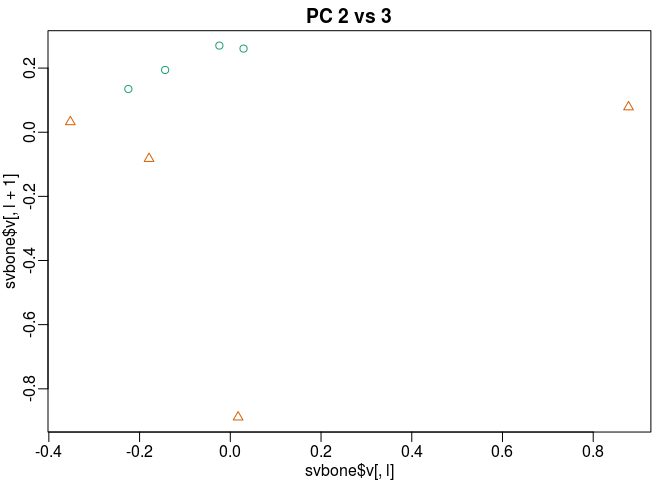

    ##                    pval
    ## GO:0005201 0.000000e+00
    ## GO:0005865 0.000000e+00
    ## GO:0048477 0.000000e+00
    ## GO:0005882 0.000000e+00
    ## GO:0005791 4.440892e-16
    ## GO:0099094 6.661338e-16
    ## GO:0072329 7.847722e-12
    ## GO:0043433 2.585843e-11
    ## GO:0046849 1.413043e-09
    ## GO:0003407 2.948983e-09
    ## GO:0005518 3.607401e-09
    ## GO:0006457 9.033564e-09
    ## GO:0031330 1.537172e-08
    ## GO:0004725 2.288043e-08
    ## GO:0021536 2.404396e-08
    ## GO:0016459 2.630267e-08
    ## GO:0038024 2.955799e-08
    ## GO:0044447 4.739889e-08
    ## GO:0007528 5.812392e-08
    ## GO:0022839 1.009165e-07
    ## GO:0061025 1.244124e-07
    ## GO:0070167 1.295244e-07
    ## GO:0005520 3.034041e-07
    ## GO:0030246 5.171963e-07
    ## GO:0060359 2.014904e-06
    ##                                                                        Term
    ## GO:0005201                      extracellular matrix structural constituent
    ## GO:0005865                                    striated muscle thin filament
    ## GO:0048477                                                        oogenesis
    ## GO:0005882                                            intermediate filament
    ## GO:0005791                                      rough endoplasmic reticulum
    ## GO:0099094                             ligand-gated cation channel activity
    ## GO:0072329                            monocarboxylic acid catabolic process
    ## GO:0043433 negative regulation of DNA binding transcription factor activity
    ## GO:0046849                                                  bone remodeling
    ## GO:0003407                                        neural retina development
    ## GO:0005518                                                 collagen binding
    ## GO:0006457                                                  protein folding
    ## GO:0031330                negative regulation of cellular catabolic process
    ## GO:0004725                            protein tyrosine phosphatase activity
    ## GO:0021536                                         diencephalon development
    ## GO:0016459                                                   myosin complex
    ## GO:0038024                                          cargo receptor activity
    ## GO:0044447                                                     axoneme part
    ## GO:0007528                               neuromuscular junction development
    ## GO:0022839                                       ion gated channel activity
    ## GO:0061025                                                  membrane fusion
    ## GO:0070167                      regulation of biomineral tissue development
    ## GO:0005520                               insulin-like growth factor binding
    ## GO:0030246                                             carbohydrate binding
    ## GO:0060359                                         response to ammonium ion

### Differential expression of Candice's data

Use a DESeq2 False Discovery Rate of .1, breaking into up and down in KO groups.

``` r
cond <- as.factor(SampleNameMat[3,])
dds <- DESeqDataSetFromMatrix(round(boneMat),colData = DataFrame(cond),design = ~cond)
```

    ## converting counts to integer mode

``` r
DESeqOutput <-  DESeq(dds)
```

    ## estimating size factors

    ## estimating dispersions

    ## gene-wise dispersion estimates

    ## mean-dispersion relationship

    ## final dispersion estimates

    ## fitting model and testing

``` r
resCandice <-  results(DESeqOutput)
write.table(resCandice[order(resCandice$log2FoldChange,decreasing = F),],paste0("~/Desktop/DEG","Ingraham",".txt"),sep = "\t",quote=F)
res <- resCandice[!is.na(resCandice$padj),]
res <- res[res$log2FoldChange<0,]


std.heatmap(log(boneMatNorm[rownames(res[order(res$pvalue,decreasing = F),])[1:25],]+1,2),main="Most significant DE genes\ndown in KO\nlog2(NormalizedCounts+1)",cexRow=.5)
```


``` r
std.heatmap(log(boneMatNorm[rownames(res[order(res$pvalue,decreasing = F),])[1:25],]+1,2)-rowMeans(log(boneMatNorm[rownames(res[order(res$pvalue,decreasing = F),])[1:25],]+1,2)),main="Most significant DE genes\ndown in KO\nlog2(FC)",cexRow=.5)
```


``` r
res <-  results(DESeqOutput)
res <- res[!is.na(res$padj),]
boneUpDown <- list(rownames(res[res$padj<.1&res$log2FoldChange>0,]),rownames(res[res$padj<.1&res$log2FoldChange<0,]))
res <- res[res$log2FoldChange>0,]
std.heatmap(log(boneMatNorm[rownames(res[order(res$pvalue,decreasing = F),])[1:25],]+1,2)-rowMeans(log(boneMatNorm[rownames(res[order(res$pvalue,decreasing = F),])[1:25],]+1,2)),main="Most significant DE genes\nup in KO\nlog2(FC)",cexRow=.5)
```

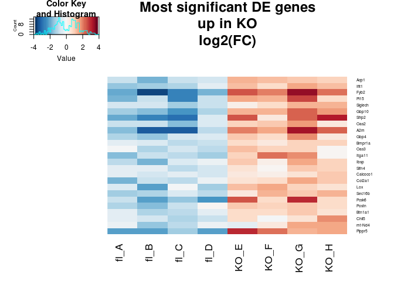

``` r
std.heatmap(log(boneMatNorm[rownames(res[order(res$pvalue,decreasing = F),])[1:25],]+1,2),main="Most significant DE genes\nup in KO\nlog2(normalized counts + 1)",cexRow=.5)
```

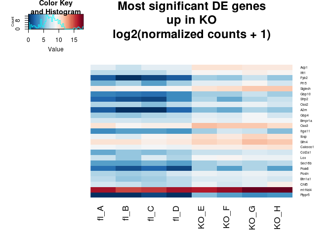

``` r
res <-  results(DESeqOutput)
res <- res[!is.na(res$padj),]


hist(res$log2FoldChange,main = "Log2 Fold Changes Detected",breaks = 40)
```


``` r
plot(res$log2FoldChange,-log(res$padj),ylab="-logPadj",xlab="logFC",main="Volcano Plot")
```


``` r
#ESR1 not differentially expressed
barplot((boneMatNorm["Esr1",]),main="Esr1")
```


``` r
barplot((boneMatNorm["Gper1",]),main="Gper1")
```


``` r
#Just a sanity Check
barplot(boneMatNorm["Ncoa1",],las=2,main="Ncoa1")
```


``` r
barplot(boneMatNorm["Ncoa2",],las=2,main="Ncoa2")
```


``` r
barplot(boneMatNorm["Ncoa3",],las=2,main="Ncoa3")
```


``` r
barplot((boneMatNorm["Kiss1",]),main="Kiss1")
```


``` r
#also a sanity check
std.heatmap(cor(ambrosiMatNorm,method = "spearman"))
```


``` r
entrezmm <- getBM(attributes = c('mgi_symbol', "entrezgene"), filters = "mgi_symbol",
                   values = rownames(res[res$padj<.1,]), mart = mart)
eKG <- enrichKEGG(entrezmm$entrezgene[!is.na(entrezmm$entrezgene)],organism = "mmu",pvalueCutoff = .1)
eKG
```

    ## #
    ## # over-representation test
    ## #
    ## #...@organism     mmu 
    ## #...@ontology     KEGG 
    ## #...@keytype      kegg 
    ## #...@gene     chr [1:258] "67851" "668661" "224904" "232345" "11370" "11504" ...
    ## #...pvalues adjusted by 'BH' with cutoff <0.1 
    ## #...9 enriched terms found
    ## 'data.frame':    9 obs. of  9 variables:
    ##  $ ID         : chr  "mmu03010" "mmu00190" "mmu05012" "mmu04714" ...
    ##  $ Description: chr  "Ribosome" "Oxidative phosphorylation" "Parkinson's disease" "Thermogenesis" ...
    ##  $ GeneRatio  : chr  "14/134" "12/134" "12/134" "13/134" ...
    ##  $ BgRatio    : chr  "177/8204" "134/8204" "144/8204" "230/8204" ...
    ##  $ pvalue     : num  1.01e-06 1.70e-06 3.64e-06 9.23e-05 7.51e-04 ...
    ##  $ p.adjust   : num  0.00014 0.00014 0.0002 0.00381 0.02478 ...
    ##  $ qvalue     : num  0.000132 0.000132 0.000189 0.003595 0.023397 ...
    ##  $ geneID     : chr  "66845/68565/19896/19899/19921/19951/57808/67248/11837/68052/267019/57294/27050/20102" "12859/20463/17706/17711/17716/17717/17719/17720/17721/17722/54405/104130" "12859/20463/17706/17711/17716/17717/17719/17720/17721/17722/54405/104130" "12859/20463/12894/17706/17711/17716/17717/17719/17720/17721/17722/54405/104130" ...
    ##  $ Count      : int  14 12 12 13 9 3 7 8 6
    ## #...Citation
    ##   Guangchuang Yu, Li-Gen Wang, Yanyan Han and Qing-Yu He.
    ##   clusterProfiler: an R package for comparing biological themes among
    ##   gene clusters. OMICS: A Journal of Integrative Biology
    ##   2012, 16(5):284-287

``` r
eKG$Description
```

    ## [1] "Ribosome"                            
    ## [2] "Oxidative phosphorylation"           
    ## [3] "Parkinson's disease"                 
    ## [4] "Thermogenesis"                       
    ## [5] "Retrograde endocannabinoid signaling"
    ## [6] "Non-homologous end-joining"          
    ## [7] "Pyrimidine metabolism"               
    ## [8] "Measles"                             
    ## [9] "TGF-beta signaling pathway"

``` r
eKG$geneID
```

    ## [1] "66845/68565/19896/19899/19921/19951/57808/67248/11837/68052/267019/57294/27050/20102"
    ## [2] "12859/20463/17706/17711/17716/17717/17719/17720/17721/17722/54405/104130"            
    ## [3] "12859/20463/17706/17711/17716/17717/17719/17720/17721/17722/54405/104130"            
    ## [4] "12859/20463/12894/17706/17711/17716/17717/17719/17720/17721/17722/54405/104130"      
    ## [5] "14710/17716/17717/17719/17720/17721/17722/54405/104130"                              
    ## [6] "227525/21673/14375"                                                                  
    ## [7] "22169/66422/18102/54369/66420/20022/331487"                                          
    ## [8] "70192/19106/27103/71586/23960/246728/246727/20846"                                   
    ## [9] "12159/12166/13179/15903/16323/19877"

``` r
library(ReactomePA)
getMatrixWithSelectedIds <- function(df, type, keys,db){
require("AnnotationDbi")
require(db,character.only = TRUE)
#library(AnnotationDbi)
#library(db,character.only = TRUE) 
db <- get(db)
geneSymbols <- mapIds(db, keys=rownames(df), column=type, keytype=keys, multiVals="first")
# get the entrez ids with gene symbols i.e. remove those with NA's for gene symbols
inds <- which(!is.na(geneSymbols))

found_genes <- geneSymbols[inds]
 
# subset your data frame based on the found_genes
df2 <- df[names(found_genes), ]
rownames(df2) <- found_genes
return(df2)
}

entrezres <- getMatrixWithSelectedIds(res,type = "ENTREZID","SYMBOL","org.Mm.eg.db")
```

    ## 'select()' returned 1:many mapping between keys and columns

``` r
as.data.frame(enrichPathway(rownames(entrezres)[entrezres$padj<.1],organism="mouse"))
```

    ##                          ID
    ## R-MMU-72689     R-MMU-72689
    ## R-MMU-156827   R-MMU-156827
    ## R-MMU-72706     R-MMU-72706
    ## R-MMU-1799339 R-MMU-1799339
    ## R-MMU-975956   R-MMU-975956
    ## R-MMU-72613     R-MMU-72613
    ## R-MMU-72737     R-MMU-72737
    ## R-MMU-927802   R-MMU-927802
    ## R-MMU-975957   R-MMU-975957
    ## R-MMU-72766     R-MMU-72766
    ## R-MMU-72695     R-MMU-72695
    ## R-MMU-6791226 R-MMU-6791226
    ## R-MMU-72312     R-MMU-72312
    ## R-MMU-8868773 R-MMU-8868773
    ## R-MMU-72649     R-MMU-72649
    ## R-MMU-72702     R-MMU-72702
    ## R-MMU-72662     R-MMU-72662
    ## R-MMU-3000178 R-MMU-3000178
    ## R-MMU-2022090 R-MMU-2022090
    ## R-MMU-1474244 R-MMU-1474244
    ## R-MMU-216083   R-MMU-216083
    ## R-MMU-1474228 R-MMU-1474228
    ## R-MMU-8948216 R-MMU-8948216
    ##                                                                                                          Description
    ## R-MMU-72689                                                                 Formation of a pool of free 40S subunits
    ## R-MMU-156827                                       L13a-mediated translational silencing of Ceruloplasmin expression
    ## R-MMU-72706                                                  GTP hydrolysis and joining of the 60S ribosomal subunit
    ## R-MMU-1799339                                            SRP-dependent cotranslational protein targeting to membrane
    ## R-MMU-975956                            Nonsense Mediated Decay (NMD) independent of the Exon Junction Complex (EJC)
    ## R-MMU-72613                                                                        Eukaryotic Translation Initiation
    ## R-MMU-72737                                                                     Cap-dependent Translation Initiation
    ## R-MMU-927802                                                                           Nonsense-Mediated Decay (NMD)
    ## R-MMU-975957                               Nonsense Mediated Decay (NMD) enhanced by the Exon Junction Complex (EJC)
    ## R-MMU-72766                                                                                              Translation
    ## R-MMU-72695                                      Formation of the ternary complex, and subsequently, the 43S complex
    ## R-MMU-6791226                                          Major pathway of rRNA processing in the nucleolus and cytosol
    ## R-MMU-72312                                                                                          rRNA processing
    ## R-MMU-8868773                                                             rRNA processing in the nucleus and cytosol
    ## R-MMU-72649                                                                 Translation initiation complex formation
    ## R-MMU-72702                                                           Ribosomal scanning and start codon recognition
    ## R-MMU-72662   Activation of the mRNA upon binding of the cap-binding complex and eIFs, and subsequent binding to 43S
    ## R-MMU-3000178                                                                                      ECM proteoglycans
    ## R-MMU-2022090                                           Assembly of collagen fibrils and other multimeric structures
    ## R-MMU-1474244                                                                      Extracellular matrix organization
    ## R-MMU-216083                                                                      Integrin cell surface interactions
    ## R-MMU-1474228                                                                Degradation of the extracellular matrix
    ## R-MMU-8948216                                                                           Collagen chain trimerization
    ##               GeneRatio  BgRatio       pvalue     p.adjust       qvalue
    ## R-MMU-72689      12/121  88/8657 2.686592e-09 9.056897e-07 8.071199e-07
    ## R-MMU-156827     12/121  98/8657 9.449668e-09 9.056897e-07 8.071199e-07
    ## R-MMU-72706      12/121  99/8657 1.062758e-08 9.056897e-07 8.071199e-07
    ## R-MMU-1799339    11/121  81/8657 1.335826e-08 9.056897e-07 8.071199e-07
    ## R-MMU-975956     11/121  81/8657 1.335826e-08 9.056897e-07 8.071199e-07
    ## R-MMU-72613      12/121 106/8657 2.330642e-08 1.128697e-06 1.005856e-06
    ## R-MMU-72737      12/121 106/8657 2.330642e-08 1.128697e-06 1.005856e-06
    ## R-MMU-927802     11/121 101/8657 1.384501e-07 5.214955e-06 4.647390e-06
    ## R-MMU-975957     11/121 101/8657 1.384501e-07 5.214955e-06 4.647390e-06
    ## R-MMU-72766      14/121 212/8657 1.362494e-06 4.618856e-05 4.116167e-05
    ## R-MMU-72695       6/121  47/8657 4.426370e-05 1.111058e-03 9.901367e-04
    ## R-MMU-6791226     9/121 121/8657 4.588438e-05 1.111058e-03 9.901367e-04
    ## R-MMU-72312       9/121 121/8657 4.588438e-05 1.111058e-03 9.901367e-04
    ## R-MMU-8868773     9/121 121/8657 4.588438e-05 1.111058e-03 9.901367e-04
    ## R-MMU-72649       6/121  54/8657 9.831420e-05 2.083032e-03 1.856327e-03
    ## R-MMU-72702       6/121  54/8657 9.831420e-05 2.083032e-03 1.856327e-03
    ## R-MMU-72662       6/121  55/8657 1.091046e-04 2.175674e-03 1.938887e-03
    ## R-MMU-3000178     5/121  40/8657 2.184614e-04 4.114357e-03 3.666575e-03
    ## R-MMU-2022090     5/121  44/8657 3.448500e-04 6.152850e-03 5.483210e-03
    ## R-MMU-1474244    12/121 272/8657 4.026846e-04 6.825504e-03 6.082657e-03
    ## R-MMU-216083      6/121  76/8657 6.482689e-04 1.046491e-02 9.325973e-03
    ## R-MMU-1474228     7/121 129/8657 2.144219e-03 3.304047e-02 2.944454e-02
    ## R-MMU-8948216     4/121  41/8657 2.466764e-03 3.635796e-02 3.240098e-02
    ##                                                                                             geneID
    ## R-MMU-72689               53356/19896/19899/19921/19951/57808/11837/68052/267019/57294/27050/20102
    ## R-MMU-156827              53356/19896/19899/19921/19951/57808/11837/68052/267019/57294/27050/20102
    ## R-MMU-72706               53356/19896/19899/19921/19951/57808/11837/68052/267019/57294/27050/20102
    ## R-MMU-1799339                   19896/19899/19921/19951/57808/11837/68052/267019/57294/27050/20102
    ## R-MMU-975956                    19896/19899/19921/19951/57808/11837/68052/267019/57294/27050/20102
    ## R-MMU-72613               53356/19896/19899/19921/19951/57808/11837/68052/267019/57294/27050/20102
    ## R-MMU-72737               53356/19896/19899/19921/19951/57808/11837/68052/267019/57294/27050/20102
    ## R-MMU-927802                    19896/19899/19921/19951/57808/11837/68052/267019/57294/27050/20102
    ## R-MMU-975957                    19896/19899/19921/19951/57808/11837/68052/267019/57294/27050/20102
    ## R-MMU-72766   53356/66845/68565/19896/19899/19921/19951/57808/11837/68052/267019/57294/27050/20102
    ## R-MMU-72695                                                   53356/68052/267019/57294/27050/20102
    ## R-MMU-6791226                                14791/72544/19896/19899/19921/19951/57808/11837/20826
    ## R-MMU-72312                                  14791/72544/19896/19899/19921/19951/57808/11837/20826
    ## R-MMU-8868773                                14791/72544/19896/19899/19921/19951/57808/11837/20826
    ## R-MMU-72649                                                   53356/68052/267019/57294/27050/20102
    ## R-MMU-72702                                                   53356/68052/267019/57294/27050/20102
    ## R-MMU-72662                                                   53356/68052/267019/57294/27050/20102
    ## R-MMU-3000178                                                        12111/12842/12824/12832/13179
    ## R-MMU-2022090                                                        12842/12824/12832/12837/16948
    ## R-MMU-1474244            232345/12111/12159/12842/12824/12832/12837/13179/15891/319480/16613/16948
    ## R-MMU-216083                                                  12842/12824/12832/12837/15891/319480
    ## R-MMU-1474228                                           232345/12842/12824/12832/12837/13179/16613
    ## R-MMU-8948216                                                              12842/12824/12832/12837
    ##               Count
    ## R-MMU-72689      12
    ## R-MMU-156827     12
    ## R-MMU-72706      12
    ## R-MMU-1799339    11
    ## R-MMU-975956     11
    ## R-MMU-72613      12
    ## R-MMU-72737      12
    ## R-MMU-927802     11
    ## R-MMU-975957     11
    ## R-MMU-72766      14
    ## R-MMU-72695       6
    ## R-MMU-6791226     9
    ## R-MMU-72312       9
    ## R-MMU-8868773     9
    ## R-MMU-72649       6
    ## R-MMU-72702       6
    ## R-MMU-72662       6
    ## R-MMU-3000178     5
    ## R-MMU-2022090     5
    ## R-MMU-1474244    12
    ## R-MMU-216083      6
    ## R-MMU-1474228     7
    ## R-MMU-8948216     4

``` r
eG <- enrichGO(rownames(res[res$padj<.1,]),OrgDb ='org.Mm.eg.db',keyType = "SYMBOL",ont = "BP")
dfGO <- as.data.frame(eG)
print(dfGO[1:30,])
```

    ##                    ID
    ## GO:0051607 GO:0051607
    ## GO:0009615 GO:0009615
    ## GO:0071346 GO:0071346
    ## GO:0034341 GO:0034341
    ## GO:0006220 GO:0006220
    ## GO:0001649 GO:0001649
    ## GO:0009147 GO:0009147
    ## GO:0006303 GO:0006303
    ## GO:0000726 GO:0000726
    ## GO:0030199 GO:0030199
    ## GO:0006221 GO:0006221
    ## GO:0048333 GO:0048333
    ## GO:0035282 GO:0035282
    ## GO:0050688 GO:0050688
    ## GO:0002831 GO:0002831
    ## GO:0072527 GO:0072527
    ## GO:0043900 GO:0043900
    ## GO:0072528 GO:0072528
    ## GO:0001958 GO:0001958
    ## GO:0036075 GO:0036075
    ## GO:0044419 GO:0044419
    ## GO:0042832 GO:0042832
    ## GO:0050830 GO:0050830
    ## GO:0043901 GO:0043901
    ## GO:0042455 GO:0042455
    ## GO:0009148 GO:0009148
    ## GO:0009163 GO:0009163
    ## GO:0009220 GO:0009220
    ## GO:0046132 GO:0046132
    ## GO:0001562 GO:0001562
    ##                                                         Description
    ## GO:0051607                                defense response to virus
    ## GO:0009615                                        response to virus
    ## GO:0071346                    cellular response to interferon-gamma
    ## GO:0034341                             response to interferon-gamma
    ## GO:0006220                  pyrimidine nucleotide metabolic process
    ## GO:0001649                               osteoblast differentiation
    ## GO:0009147     pyrimidine nucleoside triphosphate metabolic process
    ## GO:0006303 double-strand break repair via nonhomologous end joining
    ## GO:0000726                               non-recombinational repair
    ## GO:0030199                             collagen fibril organization
    ## GO:0006221               pyrimidine nucleotide biosynthetic process
    ## GO:0048333                          mesodermal cell differentiation
    ## GO:0035282                                             segmentation
    ## GO:0050688                  regulation of defense response to virus
    ## GO:0002831                regulation of response to biotic stimulus
    ## GO:0072527         pyrimidine-containing compound metabolic process
    ## GO:0043900                     regulation of multi-organism process
    ## GO:0072528      pyrimidine-containing compound biosynthetic process
    ## GO:0001958                                endochondral ossification
    ## GO:0036075                                 replacement ossification
    ## GO:0044419               interspecies interaction between organisms
    ## GO:0042832                            defense response to protozoan
    ## GO:0050830              defense response to Gram-positive bacterium
    ## GO:0043901            negative regulation of multi-organism process
    ## GO:0042455                      ribonucleoside biosynthetic process
    ## GO:0009148  pyrimidine nucleoside triphosphate biosynthetic process
    ## GO:0009163                          nucleoside biosynthetic process
    ## GO:0009220           pyrimidine ribonucleotide biosynthetic process
    ## GO:0046132           pyrimidine ribonucleoside biosynthetic process
    ## GO:0001562                                    response to protozoan
    ##            GeneRatio   BgRatio       pvalue     p.adjust       qvalue
    ## GO:0051607    15/243 202/23577 3.157935e-09 9.152741e-06 8.009334e-06
    ## GO:0009615    16/243 246/23577 6.314413e-09 9.152741e-06 8.009334e-06
    ## GO:0071346     8/243  75/23577 1.055996e-06 1.020445e-03 8.929654e-04
    ## GO:0034341     8/243  94/23577 5.889357e-06 4.268312e-03 3.735092e-03
    ## GO:0006220     5/243  29/23577 1.082890e-05 6.278595e-03 5.494240e-03
    ## GO:0001649    11/243 224/23577 2.254231e-05 9.764248e-03 8.544448e-03
    ## GO:0009147     4/243  17/23577 2.357700e-05 9.764248e-03 8.544448e-03
    ## GO:0006303     5/243  38/23577 4.243819e-05 1.537854e-02 1.345737e-02
    ## GO:0000726     5/243  43/23577 7.804379e-05 1.935407e-02 1.693626e-02
    ## GO:0030199     5/243  43/23577 7.804379e-05 1.935407e-02 1.693626e-02
    ## GO:0006221     4/243  23/23577 8.355669e-05 1.935407e-02 1.693626e-02
    ## GO:0048333     4/243  23/23577 8.355669e-05 1.935407e-02 1.693626e-02
    ## GO:0035282     7/243 103/23577 9.690644e-05 1.935407e-02 1.693626e-02
    ## GO:0050688     6/243  72/23577 9.974272e-05 1.935407e-02 1.693626e-02
    ## GO:0002831     8/243 139/23577 1.001418e-04 1.935407e-02 1.693626e-02
    ## GO:0072527     5/243  48/23577 1.331328e-04 2.412199e-02 2.110855e-02
    ## GO:0043900    13/243 378/23577 1.634455e-04 2.787227e-02 2.439032e-02
    ## GO:0072528     4/243  28/23577 1.855446e-04 2.988299e-02 2.614985e-02
    ## GO:0001958     4/243  29/23577 2.134991e-04 3.094670e-02 2.708068e-02
    ## GO:0036075     4/243  29/23577 2.134991e-04 3.094670e-02 2.708068e-02
    ## GO:0044419    12/243 350/23577 2.989092e-04 3.921132e-02 3.431284e-02
    ## GO:0042832     4/243  32/23577 3.155078e-04 3.921132e-02 3.431284e-02
    ## GO:0050830     6/243  89/23577 3.207643e-04 3.921132e-02 3.431284e-02
    ## GO:0043901     8/243 165/23577 3.246194e-04 3.921132e-02 3.431284e-02
    ## GO:0042455     4/243  33/23577 3.561396e-04 4.035305e-02 3.531194e-02
    ## GO:0009148     3/243  14/23577 3.619108e-04 4.035305e-02 3.531194e-02
    ## GO:0009163     4/243  35/23577 4.484112e-04 4.487979e-02 3.927317e-02
    ## GO:0009220     3/243  15/23577 4.489527e-04 4.487979e-02 3.927317e-02
    ## GO:0046132     3/243  15/23577 4.489527e-04 4.487979e-02 3.927317e-02
    ## GO:0001562     4/243  36/23577 5.004110e-04 4.679650e-02 4.095044e-02
    ##                                                                                                      geneID
    ## GO:0051607        Ddx60/Eif2ak2/Eif2ak4/Gbp4/Ifih1/Ifit1/Oas2/Oas3/Oasl1/Oasl2/Parp9/Rtp4/Stat1/Tspan6/Zbp1
    ## GO:0009615 Ddx60/Eif2ak2/Eif2ak4/Gbp4/Ifih1/Ifit1/Oas2/Oas3/Oasl1/Oasl2/Parp9/Rps15a/Rtp4/Stat1/Tspan6/Zbp1
    ## GO:0071346                                                       Gbp10/Gbp4/Gbp6/Gbp7/Gbp8/Irf8/Parp9/Stat1
    ## GO:0034341                                                       Gbp10/Gbp4/Gbp6/Gbp7/Gbp8/Irf8/Parp9/Stat1
    ## GO:0006220                                                                      Cmpk2/Dctpp1/Nme1/Nme6/Uprt
    ## GO:0001649                                    Bmp3/Bmp4/Bmpr1a/Cat/Col1a1/Ibsp/Id3/Itga11/Runx2/Satb2/Sfrp2
    ## GO:0009147                                                                           Cmpk2/Dctpp1/Nme1/Nme6
    ## GO:0006303                                                                 Dclre1c/Ercc1/Parp9/Prpf19/Xrcc6
    ## GO:0000726                                                                 Dclre1c/Ercc1/Parp9/Prpf19/Xrcc6
    ## GO:0030199                                                                   Col1a1/Col2a1/Col5a2/Lox/Sfrp2
    ## GO:0006221                                                                             Cmpk2/Nme1/Nme6/Uprt
    ## GO:0048333                                                                          Bmp4/Bmpr1a/Inhba/Sfrp2
    ## GO:0035282                                                            Bmp4/Bmpr1a/Mafb/Nrp2/Pcsk6/Sfrp2/Ttn
    ## GO:0050688                                                            Ddx60/Eif2ak4/Gbp4/Parp9/Stat1/Tspan6
    ## GO:0002831                                                  Ddx60/Eif2ak4/Gbp4/Mif/Parp9/Stat1/Trib1/Tspan6
    ## GO:0072527                                                                      Cmpk2/Dctpp1/Nme1/Nme6/Uprt
    ## GO:0043900                    Ddx60/Eif2ak2/Eif2ak4/Gbp4/Inhba/Irf8/Mif/Oas3/Oasl1/Parp9/Stat1/Trib1/Tspan6
    ## GO:0072528                                                                             Cmpk2/Nme1/Nme6/Uprt
    ## GO:0001958                                                                         Bmp4/Col1a1/Col2a1/Runx2
    ## GO:0036075                                                                         Bmp4/Col1a1/Col2a1/Runx2
    ## GO:0044419                           Cul4a/Eif2ak2/Eif2ak4/Eif3g/Gbp6/Gbp7/Irf8/Oas3/Oasl1/Romo1/Stat1/Zbp1
    ## GO:0042832                                                                             Gbp10/Gbp6/Gbp7/Irf8
    ## GO:0050830                                                              Gbp10/Gbp6/Gbp7/Rarres2/Romo1/Rpl39
    ## GO:0043901                                               Eif2ak2/Eif2ak4/Irf8/Oas3/Oasl1/Stat1/Trib1/Tspan6
    ## GO:0042455                                                                              Aprt/Nme1/Nme6/Uprt
    ## GO:0009148                                                                                  Cmpk2/Nme1/Nme6
    ## GO:0009163                                                                              Aprt/Nme1/Nme6/Uprt
    ## GO:0009220                                                                                   Nme1/Nme6/Uprt
    ## GO:0046132                                                                                   Nme1/Nme6/Uprt
    ## GO:0001562                                                                             Gbp10/Gbp6/Gbp7/Irf8
    ##            Count
    ## GO:0051607    15
    ## GO:0009615    16
    ## GO:0071346     8
    ## GO:0034341     8
    ## GO:0006220     5
    ## GO:0001649    11
    ## GO:0009147     4
    ## GO:0006303     5
    ## GO:0000726     5
    ## GO:0030199     5
    ## GO:0006221     4
    ## GO:0048333     4
    ## GO:0035282     7
    ## GO:0050688     6
    ## GO:0002831     8
    ## GO:0072527     5
    ## GO:0043900    13
    ## GO:0072528     4
    ## GO:0001958     4
    ## GO:0036075     4
    ## GO:0044419    12
    ## GO:0042832     4
    ## GO:0050830     6
    ## GO:0043901     8
    ## GO:0042455     4
    ## GO:0009148     3
    ## GO:0009163     4
    ## GO:0009220     3
    ## GO:0046132     3
    ## GO:0001562     4

``` r
ifnGenes <- Reduce(union,strsplit(dfGO[which(grepl(pattern = "defense|interferon|immune",dfGO[,2])),"geneID"],"/"))
repairGenes <- Reduce(union,strsplit(dfGO[which(grepl(pattern = "pyrimidine|repair",dfGO[,2])),"geneID"],"/"))
bmpGenes <- Reduce(union,strsplit(dfGO[which(grepl(pattern = "ossi|osteoblast|collagen|muscle",dfGO[,2])),"geneID"],"/"))
std.heatmap(log(boneMatNorm[ifnGenes,]+1,2)-rowMeans(log(boneMatNorm[ifnGenes,]+1,2)),main="IFN response\nLog2(FC) from mean",cexRow=.5,breaks=seq(-4, 4, length.out=51))
```

    ## Warning in heatmap.2(M, Rowv = F, Colv = F, trace = "none", col = cols, :
    ## Discrepancy: Rowv is FALSE, while dendrogram is `both'. Omitting row
    ## dendogram.

    ## Warning in heatmap.2(M, Rowv = F, Colv = F, trace = "none", col = cols, :
    ## Discrepancy: Colv is FALSE, while dendrogram is `column'. Omitting column
    ## dendogram.


``` r
std.heatmap(log(boneMatNorm[repairGenes,]+1,2)-rowMeans(log(boneMatNorm[repairGenes,]+1,2)),main="DNA synth/repair\nLog2(FC) from mean",cexRow=.5,breaks=seq(-4, 4, length.out=51))
```

    ## Warning in heatmap.2(M, Rowv = F, Colv = F, trace = "none", col = cols, :
    ## Discrepancy: Rowv is FALSE, while dendrogram is `both'. Omitting row
    ## dendogram.

    ## Warning in heatmap.2(M, Rowv = F, Colv = F, trace = "none", col = cols, :
    ## Discrepancy: Colv is FALSE, while dendrogram is `column'. Omitting column
    ## dendogram.

    ## Warning in image.default(z = matrix(z, ncol = 1), col = col, breaks =
    ## tmpbreaks, : unsorted 'breaks' will be sorted before use

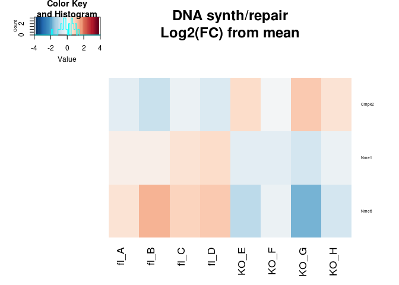

``` r
std.heatmap(log(boneMatNorm[bmpGenes,]+1,2)-rowMeans(log(boneMatNorm[bmpGenes,]+1,2)),main="BMP Related\nLog2(FC) from mean",cexRow=.5,breaks=seq(-4, 4, length.out=51))
```

    ## Warning in heatmap.2(M, Rowv = F, Colv = F, trace = "none", col = cols, :
    ## Discrepancy: Rowv is FALSE, while dendrogram is `both'. Omitting row
    ## dendogram.

    ## Warning in heatmap.2(M, Rowv = F, Colv = F, trace = "none", col = cols, :
    ## Discrepancy: Colv is FALSE, while dendrogram is `column'. Omitting column
    ## dendogram.

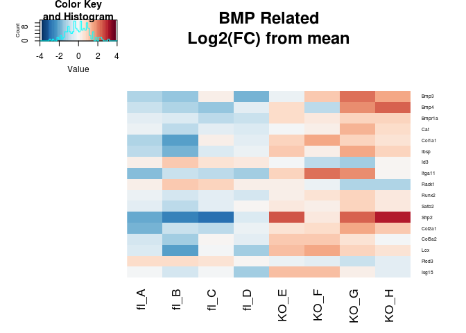

``` r
std.heatmap(log(boneMatNorm[ifnGenes,]+1,2),main="IFN response\nLog2(normalized counts+1)",cexRow=.5)
```

    ## Warning in heatmap.2(M, Rowv = F, Colv = F, trace = "none", col = cols, :
    ## Discrepancy: Rowv is FALSE, while dendrogram is `both'. Omitting row
    ## dendogram.

    ## Warning in heatmap.2(M, Rowv = F, Colv = F, trace = "none", col = cols, :
    ## Discrepancy: Colv is FALSE, while dendrogram is `column'. Omitting column
    ## dendogram.

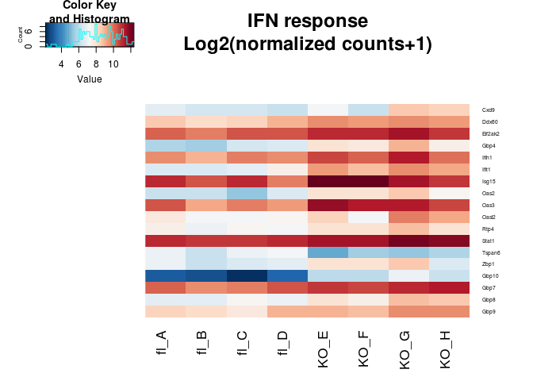

``` r
std.heatmap(log(boneMatNorm[repairGenes,]+1,2),main="DNA synth/repair\nLog2(normalized counts+1)",cexRow=.5)
```

    ## Warning in heatmap.2(M, Rowv = F, Colv = F, trace = "none", col = cols, :
    ## Discrepancy: Rowv is FALSE, while dendrogram is `both'. Omitting row
    ## dendogram.

    ## Warning in heatmap.2(M, Rowv = F, Colv = F, trace = "none", col = cols, :
    ## Discrepancy: Colv is FALSE, while dendrogram is `column'. Omitting column
    ## dendogram.


``` r
std.heatmap(log(boneMatNorm[bmpGenes,]+1,2),main="BMP Related\nLog2(normalized counts+1)",cexRow=.5)
```

    ## Warning in heatmap.2(M, Rowv = F, Colv = F, trace = "none", col = cols, :
    ## Discrepancy: Rowv is FALSE, while dendrogram is `both'. Omitting row
    ## dendogram.

    ## Warning in heatmap.2(M, Rowv = F, Colv = F, trace = "none", col = cols, :
    ## Discrepancy: Colv is FALSE, while dendrogram is `column'. Omitting column
    ## dendogram.


#### Candice DE in the Ambrosi

``` r
std.heatmap(log(ambrosiMatNorm[ifnGenes[ifnGenes%in%rownames(ambrosiMatNorm)],]+1,2)-rowMeans(log(ambrosiMatNorm[ifnGenes[ifnGenes%in%rownames(ambrosiMatNorm)],]+1,2)),main="IFN response\nLog2(FC) from mean",cexRow=.5)
```


``` r
std.heatmap(log(ambrosiMatNorm[bmpGenes[bmpGenes%in%rownames(ambrosiMatNorm)],]+1,2)-rowMeans(log(ambrosiMatNorm[bmpGenes[bmpGenes%in%rownames(ambrosiMatNorm)],]+1,2)),main="BMP Related\nLog2(FC) from mean",cexRow=.5)
```

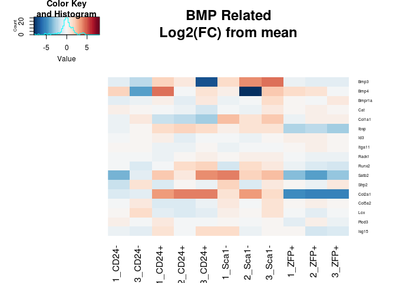

``` r
std.heatmap(log(ambrosiMatNorm[repairGenes[repairGenes%in%rownames(ambrosiMatNorm)],]+1,2)-rowMeans(log(ambrosiMatNorm[repairGenes[repairGenes%in%rownames(ambrosiMatNorm)],]+1,2)),main="DNA synth/repair\nLog2(FC) from mean",cexRow=.5)
```


``` r
std.heatmap(log(ambrosiMatNorm[ifnGenes[ifnGenes%in%rownames(ambrosiMatNorm)],]+1,2),main="IFN response\nLog2(normalized counts+1)",cexRow=.5)
```


``` r
std.heatmap(log(ambrosiMatNorm[repairGenes[repairGenes%in%rownames(ambrosiMatNorm)],]+1,2),main="DNA synth/repair\nLog2(normalized counts+1)",cexRow=.5)
```


``` r
std.heatmap(log(ambrosiMatNorm[bmpGenes[bmpGenes%in%rownames(ambrosiMatNorm)],]+1,2),main="BMP Related\nLog2(normalized counts+1)",cexRow=.5)
```

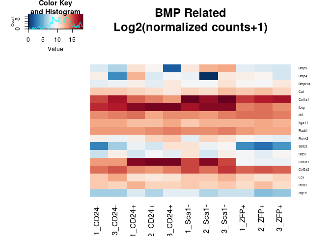

Ncoa1/2/3, the Steroid receptor coactivators are equally expressed across the conditions as well.

Overlap
-------

So what overlaps in the up/down for each sorted cell type and the KO vs fl data?

Note: Sca1minus is osteo, ZFP (mature) and CD24- (less mature) are adipocytes, cd24+ is multipotent progenitor

``` r
overlaps <- lapply(1:2,function(u){
  a <- sapply(ambrosiUpDown,function(x){
    c("up"=sum(boneUpDown[[u]]%in%x[[1]]), "down"=sum(boneUpDown[[u]]%in%x[[2]]))
  })
  colnames(a) <- sort(unique(sapply(strsplit(colnames(ambrosiMatNorm),"_"),function(x)x[2])))
  a
})
#Up in KO
print(overlaps[[1]])
```

    ##      CD24- CD24+ Sca1- ZFP+
    ## up       8    17    19    9
    ## down     4    18    11   17

``` r
#Down in KO
print(overlaps[[2]])
```

    ##      CD24- CD24+ Sca1- ZFP+
    ## up       1     7     2    6
    ## down     3     4     2    2

Not much. If you get loose, maybe one could say that that are up in the new data are more likely to be up in the osteocytes and down in the preadipocytes. Which genes are they?

``` r
overlaps <- lapply(1:2,function(u){
  a <- sapply(ambrosiUpDown,function(x){
    c("up"=boneUpDown[[u]][boneUpDown[[u]]%in%x[[1]]], "down"=boneUpDown[[u]][boneUpDown[[u]]%in%x[[2]]])
  })
  names(a) <- sort(unique(sapply(strsplit(colnames(ambrosiMatNorm),"_"),function(x)x[2])))
  a
})
#Up in KO
print(overlaps[[1]])
```

    ## $`CD24-`
    ##        up1        up2        up3        up4        up5        up6 
    ##    "Cadm3" "Calcoco1"     "Ccr9"   "Clec4e"      "Dcn"    "Evi2b" 
    ##        up7        up8      down1      down2      down3      down4 
    ##   "Jchain"    "Pqlc3"    "Cmpk2"     "Myl1"    "Oasl2"   "Tceanc" 
    ## 
    ## $`CD24+`
    ##       up1       up2       up3       up4       up5       up6       up7 
    ##     "A2m"  "Col2a1"   "Evi2b"  "Fkbp1b"   "Gvin1"    "Ibsp"    "Lifr" 
    ##       up8       up9      up10      up11      up12      up13      up14 
    ##   "Lpin1" "mt-Cytb" "mt-Nd4l"  "mt-Nd5"  "mt-Nd6"   "Oasl2"  "Papss2" 
    ##      up15      up16      up17     down1     down2     down3     down4 
    ##    "Peg3"   "Satb2"     "Ttn"   "Cadm3"   "Chit1"   "Cmpk2"  "Col1a1" 
    ##     down5     down6     down7     down8     down9    down10    down11 
    ##  "Col5a2"     "Dcn"  "Fam78b"  "Ifi207"   "Ifit1"   "Inhba"     "Lox" 
    ##    down12    down13    down14    down15    down16    down17    down18 
    ##    "Mlip"    "Myl1"    "Oas3"   "Postn"   "Pqlc3"      "Xk" "Zscan29" 
    ## 
    ## $`Sca1-`
    ##        up1        up2        up3        up4        up5        up6 
    ##     "Bmp3"    "Chit1"     "Cir1"    "Cmpk2"   "Col1a1"   "Col2a1" 
    ##        up7        up8        up9       up10       up11       up12 
    ##   "Gm2810"     "Ibsp"     "Mlip"  "mt-Cytb"  "mt-Nd4l"   "mt-Nd5" 
    ##       up13       up14       up15       up16       up17       up18 
    ##   "mt-Nd6"     "Myl1"     "Oas3"    "Satb2"    "Smpd3"   "Tceanc" 
    ##       up19      down1      down2      down3      down4      down5 
    ##       "Xk" "Calcoco1"     "Ccr9"    "Cerkl"    "Ddx60"    "Evi2b" 
    ##      down6      down7      down8      down9     down10     down11 
    ##   "Fkbp1b"    "Gvin1"   "Jchain"     "Pi15"     "Zbp1"   "Zfp125" 
    ## 
    ## $`ZFP+`
    ##        up1        up2        up3        up4        up5        up6 
    ##    "Cadm3"    "Cmpk2"      "Dcn"   "Fam78b"   "Fkbp1b"     "Myl1" 
    ##        up7        up8        up9      down1      down2      down3 
    ##     "Oas2"    "Pcsk6"    "Pqlc3" "Cacna2d4"    "Cadm1"     "Ccr9" 
    ##      down4      down5      down6      down7      down8      down9 
    ##   "Col2a1"   "Dixdc1"     "Ibsp"     "Lifr"  "mt-Cytb"   "mt-Nd4" 
    ##     down10     down11     down12     down13     down14     down15 
    ##  "mt-Nd4l"   "mt-Nd5"   "mt-Nd6"   "Papss2"     "Peg3"    "Satb2" 
    ##     down16     down17 
    ##    "Smpd3"       "Xk"

``` r
#Down in KO
print(overlaps[[2]])
```

    ## $`CD24-`
    ##       up    down1    down2    down3 
    ##   "Ly6d" "Rpl35a"  "Rpl39" "Rps15a" 
    ## 
    ## $`CD24+`
    ##       up1       up2       up3       up4       up5       up6       up7 
    ## "Adamts1"    "Cst3" "Eif2ak4"   "Nop10"    "Scd2"  "Tspan6"  "Zfp108" 
    ##     down1     down2     down3     down4 
    ##   "Romo1" "S100a10"  "S100a4"   "Sap30" 
    ## 
    ## $`Sca1-`
    ##       up1       up2     down1     down2 
    ##    "Emg1" "Tmem147"    "Ly6d" "Rarres2" 
    ## 
    ## $`ZFP+`
    ##       up1       up2       up3       up4       up5       up6     down1 
    ##   "Atox1"  "Mrpl33" "Rarres2"   "Romo1" "S100a10"  "S100a4"    "Cst3" 
    ##     down2 
    ##  "Gemin6"

Nothing jumps out at me...

Receptor search
---------------

Let's check the expression of a list of hormone receptors I compiled:

``` r
save.image("~/code/IngrahamLab/BoneNotebook_cache/markdown_github/everything.RData")
#load("~/code/IngrahamLab/BoneNotebook_cache/markdown_github/everything.RData")
#I looked through the literature and found what may be all the hormone receptors
receptors <- c("Esr1","Esr2","Gper1","Esrra","Esrrb","Pgr","Gnrhr","Trhr","Trhr2","Lhcgr","Ghrhr","Ghr","Ghsr","Nr4a1","Fshr","Prlhr","Pth1r","Pth2r","Prlr","Thra","Thrb","Trhr","Tshr","Crhr1","Crhr2","Mc2r",    "Mchr1","Trhr2","Mc1r","Znhit3","Kiss1r","Ar")
print(receptors)
```

    ##  [1] "Esr1"   "Esr2"   "Gper1"  "Esrra"  "Esrrb"  "Pgr"    "Gnrhr" 
    ##  [8] "Trhr"   "Trhr2"  "Lhcgr"  "Ghrhr"  "Ghr"    "Ghsr"   "Nr4a1" 
    ## [15] "Fshr"   "Prlhr"  "Pth1r"  "Pth2r"  "Prlr"   "Thra"   "Thrb"  
    ## [22] "Trhr"   "Tshr"   "Crhr1"  "Crhr2"  "Mc2r"   "Mchr1"  "Trhr2" 
    ## [29] "Mc1r"   "Znhit3" "Kiss1r" "Ar"

``` r
std.heatmap(log(ambrosiMatNorm[receptors[receptors%in%rownames(ambrosiMatNorm)],]+1,2))
```

    ## Warning in heatmap.2(M, Rowv = F, Colv = F, trace = "none", col = cols, :
    ## Discrepancy: Rowv is FALSE, while dendrogram is `both'. Omitting row
    ## dendogram.

    ## Warning in heatmap.2(M, Rowv = F, Colv = F, trace = "none", col = cols, :
    ## Discrepancy: Colv is FALSE, while dendrogram is `column'. Omitting column
    ## dendogram.


Now let's broaden the search to all the paracrine, autocrine etc receptors annotated!

``` r
descriptions <- getBM(c("mgi_symbol","mgi_description"),filters =c("mgi_symbol"),values=rownames(boneMat) ,mart = mart)
rownames(descriptions) <- descriptions$mgi_symbol
descriptions[descriptions$mgi_symbol %in% receptors,]
```

    ##        mgi_symbol                                 mgi_description
    ## Ar             Ar                               androgen receptor
    ## Crhr1       Crhr1      corticotropin releasing hormone receptor 1
    ## Crhr2       Crhr2      corticotropin releasing hormone receptor 2
    ## Esr1         Esr1                     estrogen receptor 1 (alpha)
    ## Esr2         Esr2                      estrogen receptor 2 (beta)
    ## Esrra       Esrra                estrogen related receptor, alpha
    ## Esrrb       Esrrb                 estrogen related receptor, beta
    ## Fshr         Fshr           follicle stimulating hormone receptor
    ## Ghr           Ghr                         growth hormone receptor
    ## Ghrhr       Ghrhr       growth hormone releasing hormone receptor
    ## Ghsr         Ghsr            growth hormone secretagogue receptor
    ## Gnrhr       Gnrhr         gonadotropin releasing hormone receptor
    ## Gper1       Gper1           G protein-coupled estrogen receptor 1
    ## Kiss1r     Kiss1r                                  KISS1 receptor
    ## Lhcgr       Lhcgr luteinizing hormone/choriogonadotropin receptor
    ## Mc1r         Mc1r                         melanocortin 1 receptor
    ## Mc2r         Mc2r                         melanocortin 2 receptor
    ## Mchr1       Mchr1        melanin-concentrating hormone receptor 1
    ## Nr4a1       Nr4a1 nuclear receptor subfamily 4, group A, member 1
    ## Pgr           Pgr                           progesterone receptor
    ## Prlhr       Prlhr            prolactin releasing hormone receptor
    ## Prlr         Prlr                              prolactin receptor
    ## Pth1r       Pth1r                  parathyroid hormone 1 receptor
    ## Pth2r       Pth2r                  parathyroid hormone 2 receptor
    ## Thra         Thra                  thyroid hormone receptor alpha
    ## Trhr         Trhr          thyrotropin releasing hormone receptor
    ## Trhr2       Trhr2        thyrotropin releasing hormone receptor 2
    ## Tshr         Tshr            thyroid stimulating hormone receptor
    ## Znhit3     Znhit3                         zinc finger, HIT type 3

``` r
recdesc <- descriptions[grepl("receptor",descriptions$mgi_description),]
recdesc <- recdesc[!grepl("interactor|non-receptor|interacting|ligand|associated",recdesc$mgi_description),]

#There are lots of receptors expressed in the bone stromal cell populations
heatmap.2(log(ambrosiMatNorm[recdesc$mgi_symbol[recdesc$mgi_symbol%in%rownames(ambrosiMatNorm)],]+1,2),Rowv=T,Colv = F,trace = "none",col=cols)
```

    ## Warning in heatmap.2(log(ambrosiMatNorm[recdesc$mgi_symbol[recdesc
    ## $mgi_symbol %in% : Discrepancy: Colv is FALSE, while dendrogram is `both'.
    ## Omitting column dendogram.


``` r
hordesc <- descriptions[grepl("hormone",descriptions$mgi_description),]

resCandiceSub <- resCandice[!is.na(resCandice$padj),] 
resCandiceSub <- resCandiceSub[resCandiceSub$padj<.15,] 
resCandiceSub <-  resCandiceSub[order(resCandiceSub$log2FoldChange,decreasing = T),]

#DE receptors hard coded above
print(rownames(resCandiceSub)[rownames(resCandiceSub)%in%receptors])
```

    ## [1] "Pgr" "Ghr"

``` r
#From the list of all receptors
print(rownames(resCandiceSub)[rownames(resCandiceSub)%in%recdesc$mgi_symbol])
```

    ##  [1] "Pgr"      "Ryr3"     "Ghr"      "Csf2ra"   "Vldlr"    "Epha7"   
    ##  [7] "Bmpr1a"   "Olfr419"  "Ccr9"     "Acvr1"    "Lilr4b"   "Lilrb4a" 
    ## [13] "Rtp4"     "Rara"     "Klri2"    "Ptpre"    "Klrk1"    "Adgrg7"  
    ## [19] "Lifr"     "Ptger4"   "Tlr7"     "Il18rap"  "Tnfrsf22" "Rack1"   
    ## [25] "Rarres2"

``` r
dereceptors <-  c(rownames(resCandiceSub)[rownames(resCandiceSub)%in%recdesc$mgi_symbol],rownames(resCandiceSub)[rownames(resCandiceSub)%in%receptors])
#reverse order
dereceptors <- rownames(resCandiceSub)[rownames(resCandiceSub)%in%dereceptors]

std.heatmap(log(boneMatNorm[dereceptors[dereceptors%in%rownames(boneMatNorm)],]+1,2)-rowMeans(log(boneMatNorm[dereceptors[dereceptors%in%rownames(boneMatNorm)],]+1,2)),main="Differentially expressed receptors\n Bone marrow (FDR .15)\nlog2FC from mean")
```

    ## Warning in heatmap.2(M, Rowv = F, Colv = F, trace = "none", col = cols, :
    ## Discrepancy: Rowv is FALSE, while dendrogram is `both'. Omitting row
    ## dendogram.

    ## Warning in heatmap.2(M, Rowv = F, Colv = F, trace = "none", col = cols, :
    ## Discrepancy: Colv is FALSE, while dendrogram is `column'. Omitting column
    ## dendogram.

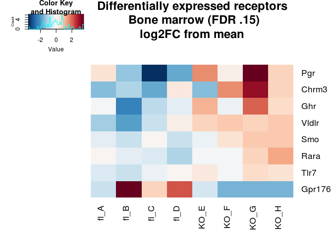

``` r
std.heatmap(log(ambrosiMatNorm[dereceptors[dereceptors%in%rownames(ambrosiMatNorm)],]+1,2)-rowMeans(log(ambrosiMatNorm[dereceptors[dereceptors%in%rownames(ambrosiMatNorm)],]+1,2)),main="Differentially expressed receptors\n Ambrosi  (FDR .15)\nlog2FC from mean")
```

    ## Warning in heatmap.2(M, Rowv = F, Colv = F, trace = "none", col = cols, :
    ## Discrepancy: Rowv is FALSE, while dendrogram is `both'. Omitting row
    ## dendogram.

    ## Warning in heatmap.2(M, Rowv = F, Colv = F, trace = "none", col = cols, :
    ## Discrepancy: Colv is FALSE, while dendrogram is `column'. Omitting column
    ## dendogram.

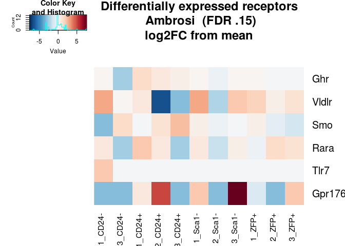

``` r
print(descriptions[dereceptors,])
```

    ##          mgi_symbol
    ## Pgr             Pgr
    ## Ryr3           Ryr3
    ## Ghr             Ghr
    ## Csf2ra       Csf2ra
    ## Vldlr         Vldlr
    ## Epha7         Epha7
    ## Bmpr1a       Bmpr1a
    ## Olfr419     Olfr419
    ## Ccr9           Ccr9
    ## Acvr1         Acvr1
    ## Lilr4b       Lilr4b
    ## Lilrb4a     Lilrb4a
    ## Rtp4           Rtp4
    ## Rara           Rara
    ## Klri2         Klri2
    ## Ptpre         Ptpre
    ## Klrk1         Klrk1
    ## Adgrg7       Adgrg7
    ## Lifr           Lifr
    ## Ptger4       Ptger4
    ## Tlr7           Tlr7
    ## Il18rap     Il18rap
    ## Tnfrsf22   Tnfrsf22
    ## Rack1         Rack1
    ## Rarres2     Rarres2
    ##                                                                             mgi_description
    ## Pgr                                                                   progesterone receptor
    ## Ryr3                                                                   ryanodine receptor 3
    ## Ghr                                                                 growth hormone receptor
    ## Csf2ra   colony stimulating factor 2 receptor, alpha, low-affinity (granulocyte-macrophage)
    ## Vldlr                                                 very low density lipoprotein receptor
    ## Epha7                                                                       Eph receptor A7
    ## Bmpr1a                                         bone morphogenetic protein receptor, type 1A
    ## Olfr419                                                              olfactory receptor 419
    ## Ccr9                                                       chemokine (C-C motif) receptor 9
    ## Acvr1                                                            activin A receptor, type 1
    ## Lilr4b                       leukocyte immunoglobulin-like receptor, subfamily B, member 4B
    ## Lilrb4a                      leukocyte immunoglobulin-like receptor, subfamily B, member 4A
    ## Rtp4                                                         receptor transporter protein 4
    ## Rara                                                          retinoic acid receptor, alpha
    ## Klri2                                    killer cell lectin-like receptor family I member 2
    ## Ptpre                                        protein tyrosine phosphatase, receptor type, E
    ## Klrk1                                killer cell lectin-like receptor subfamily K, member 1
    ## Adgrg7                                               adhesion G protein-coupled receptor G7
    ## Lifr                                                    leukemia inhibitory factor receptor
    ## Ptger4                                             prostaglandin E receptor 4 (subtype EP4)
    ## Tlr7                                                                   toll-like receptor 7
    ## Il18rap                                           interleukin 18 receptor accessory protein
    ## Tnfrsf22                              tumor necrosis factor receptor superfamily, member 22
    ## Rack1                                                     receptor for activated C kinase 1
    ## Rarres2                             retinoic acid receptor responder (tazarotene induced) 2

``` r
eacivector <- resCandiceSub$log2FoldChange
names(eacivector) <- rownames(resCandiceSub)


boneEACI <- eacitest(eacivector,"org.Mm.eg","SYMBOL",sets = "GO")
```

    ## Loading necessary libraries...

    ## Loaded Package org.Mm.eg.db

    ## Converting annotations to data.frames ...

    ## iteration 1 done; time  1.35 sec 
    ## iteration 2 done; time  0.14 sec 
    ## iteration 3 done; time  0.12 sec 
    ## iteration 4 done; time  0.12 sec 
    ## iteration 5 done; time  0.13 sec 
    ## iteration 6 done; time  0.13 sec 
    ## iteration 7 done; time  0.13 sec 
    ## iteration 8 done; time  0.13 sec 
    ## iteration 9 done; time  0.28 sec 
    ## iteration 10 done; time  0.13 sec

    ## Labeling output ...

    ## Loaded Package GO.db

``` r
print(boneEACI$setscores[1:30,])
```

    ##                                                                                                             Term
    ## GO:0098589                                                                                       membrane region
    ## GO:0005509                                                                                   calcium ion binding
    ## GO:0003725                                                                           double-stranded RNA binding
    ## GO:0005581                                                                                       collagen trimer
    ## GO:0030016                                                                                             myofibril
    ## GO:0015078                                                       hydrogen ion transmembrane transporter activity
    ## GO:0019843                                                                                          rRNA binding
    ## GO:0002449                                                                          lymphocyte mediated immunity
    ## GO:0048285                                                                                     organelle fission
    ## GO:0034341                                                                          response to interferon-gamma
    ## GO:0071346                                                                 cellular response to interferon-gamma
    ## GO:0007600                                                                                    sensory perception
    ## GO:0008289                                                                                         lipid binding
    ## GO:0005681                                                                                  spliceosomal complex
    ## GO:0000981                        RNA polymerase II transcription factor activity, sequence-specific DNA binding
    ## GO:0005911                                                                                    cell-cell junction
    ## GO:1990204                                                                                oxidoreductase complex
    ## GO:0110053                                                             regulation of actin filament organization
    ## GO:0010769                                          regulation of cell morphogenesis involved in differentiation
    ## GO:0000785                                                                                             chromatin
    ## GO:0070011                                                   peptidase activity, acting on L-amino acid peptides
    ## GO:0061695                                        transferase complex, transferring phosphorus-containing groups
    ## GO:0042113                                                                                     B cell activation
    ## GO:0016705 oxidoreductase activity, acting on paired donors, with incorporation or reduction of molecular oxygen
    ## GO:0001654                                                                                       eye development
    ## GO:0051301                                                                                         cell division
    ## GO:0043467                                          regulation of generation of precursor metabolites and energy
    ## GO:0042578                                                                   phosphoric ester hydrolase activity
    ## GO:0016055                                                                                 Wnt signaling pathway
    ## GO:0198738                                                                            cell-cell signaling by wnt
    ##            Ontology   set.mean    set.sd set.size         pval
    ## GO:0098589       CC  1.1974654 0.6277870        9 0.000000e+00
    ## GO:0005509       MF  1.1497516 1.1351717       12 0.000000e+00
    ## GO:0003725       MF  0.8704810 0.5197230       10 0.000000e+00
    ## GO:0005581       CC  0.8574391 0.5255333        6 2.220446e-16
    ## GO:0030016       CC  0.8458390 0.5763350        8 4.440892e-16
    ## GO:0015078       MF -0.8006743 0.2144011        9 1.449466e-14
    ## GO:0019843       MF -0.7558211 0.1986168       11 3.823360e-13
    ## GO:0002449       BP -0.5898845 1.2793780        8 1.428357e-08
    ## GO:0048285       BP  0.5833068 0.8816670       13 2.354918e-08
    ## GO:0034341       BP  0.5460414 0.4676675        9 1.730189e-07
    ## GO:0071346       BP  0.5460414 0.4676675        9 1.730189e-07
    ## GO:0007600       BP  0.5240520 0.3683686        9 5.295603e-07
    ## GO:0008289       MF  0.4912054 0.7669608       11 2.598986e-06
    ## GO:0005681       CC -0.4907059 0.3476755        7 2.374721e-06
    ## GO:0000981       MF  0.4729394 0.2945684       13 6.039757e-06
    ## GO:0005911       CC -0.4543680 1.6562069        9 1.242261e-05
    ## GO:1990204       CC -0.4054323 0.2838993        8 9.594303e-05
    ## GO:0110053       BP  0.3972824 0.2889531       10 1.451251e-04
    ## GO:0010769       BP  0.3918799 0.2843453       13 1.786456e-04
    ## GO:0000785       CC -0.3585742 0.3936405       13 5.581995e-04
    ## GO:0070011       MF  0.3450697 1.7231954        6 9.722858e-04
    ## GO:0061695       CC -0.3336838 0.2622644        9 1.316335e-03
    ## GO:0042113       BP -0.3320844 0.6587143       10 1.388396e-03
    ## GO:0016705       MF  0.3188707 0.3514336        5 2.310484e-03
    ## GO:0001654       BP  0.3042500 0.2518834       10 3.650647e-03
    ## GO:0051301       BP  0.3034110 0.1987903       11 3.745675e-03
    ## GO:0043467       BP -0.2898783 0.2357221        9 5.235120e-03
    ## GO:0042578       MF  0.2788441 0.6169008        8 7.740857e-03
    ## GO:0016055       BP  0.2777861 0.8015413        8 7.977514e-03
    ## GO:0198738       BP  0.2777861 0.8015413        8 7.977514e-03

``` r
print("done")
```

    ## [1] "done"

``` r
std.heatmap(cor.compare(boneMatNorm,ambrosiMatNorm,method="spearman"))
```

    ## [1] "Num Genes:"
    ## [1] 22492

    ## Warning in heatmap.2(M, Rowv = F, Colv = F, trace = "none", col = cols, :
    ## Discrepancy: Rowv is FALSE, while dendrogram is `both'. Omitting row
    ## dendogram.

    ## Warning in heatmap.2(M, Rowv = F, Colv = F, trace = "none", col = cols, :
    ## Discrepancy: Colv is FALSE, while dendrogram is `column'. Omitting column
    ## dendogram.

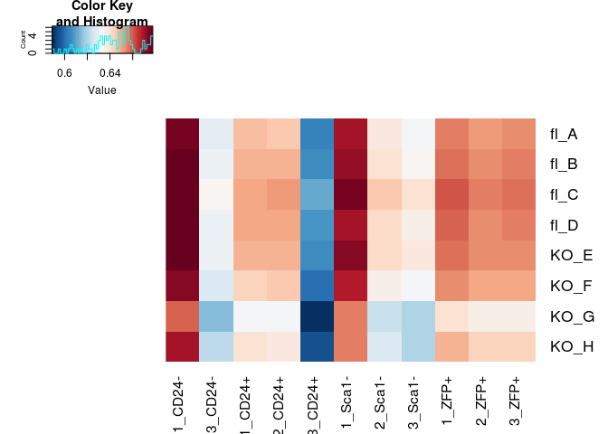

``` r
IngrahamMatLog <- log(boneMatNorm+1,2)
AmbrosiMatLog <- log(ambrosiMatNorm+1,2)

informativeList <- unlist(union(unlist(ambrosiUpDown),unlist(boneUpDown)))
std.heatmap(cor.compare(AmbrosiMatLog-rowMeans(AmbrosiMatLog),IngrahamMatLog-rowMeans(IngrahamMatLog),interest.set = informativeList,method="spearman"))
```

    ## [1] "Num Genes:"
    ## [1] 3718

    ## Warning in heatmap.2(M, Rowv = F, Colv = F, trace = "none", col = cols, :
    ## Discrepancy: Rowv is FALSE, while dendrogram is `both'. Omitting row
    ## dendogram.

    ## Warning in heatmap.2(M, Rowv = F, Colv = F, trace = "none", col = cols, :
    ## Discrepancy: Colv is FALSE, while dendrogram is `column'. Omitting column
    ## dendogram.


``` r
goresultsup <- getBM(attributes = c( 'mgi_symbol', 'go_id', 'name_1006'), filters = 'mgi_symbol',
                 values = rownames(resCandiceSub[resCandiceSub$log2FoldChange>0,]), mart = mart)

goresultsdown <- getBM(attributes = c( 'mgi_symbol', 'go_id', 'name_1006'), filters = 'mgi_symbol',
                 values = rownames(resCandiceSub[resCandiceSub$log2FoldChange<0,]), mart = mart)
```

``` r
sort(table(goresultsup$name_1006),decreasing = T)[15:50]
```

    ## 
    ##                                                          ATP binding 
    ##                                                                   28 
    ##                                                   biological_process 
    ##                                                                   28 
    ##                                                   cellular_component 
    ##                                                                   28 
    ##                                                        intracellular 
    ##                                                                   25 
    ##                                                        mitochondrion 
    ##                                                                   24 
    ##                                                 transferase activity 
    ##                                                                   24 
    ##                           regulation of transcription, DNA-templated 
    ##                                                                   23 
    ##                                            defense response to virus 
    ##                                                                   21 
    ##                                                          nucleoplasm 
    ##                                                                   21 
    ## positive regulation of transcription from RNA polymerase II promoter 
    ##                                                                   21 
    ##                                          oxidation-reduction process 
    ##                                                                   20 
    ##                                                            transport 
    ##                                                                   19 
    ##                                                endoplasmic reticulum 
    ##                                                                   18 
    ##                                               innate immune response 
    ##                                                                   18 
    ##                                              oxidoreductase activity 
    ##                                                                   18 
    ##                                    protein homodimerization activity 
    ##                                                                   18 
    ##                                                          RNA binding 
    ##                                                                   18 
    ##                                            identical protein binding 
    ##                                                                   17 
    ##                                                immune system process 
    ##                                                                   17 
    ## negative regulation of transcription from RNA polymerase II promoter 
    ##                                                                   17 
    ##                                                  signal transduction 
    ##                                                                   16 
    ##                                         transcription, DNA-templated 
    ##                                                                   16 
    ##                                                          DNA binding 
    ##                                                                   15 
    ##                                   multicellular organism development 
    ##                                                                   15 
    ##                                                 nucleic acid binding 
    ##                                                                   15 
    ##                                                   hydrolase activity 
    ##                                                                   14 
    ##         transcription factor activity, sequence-specific DNA binding 
    ##                                                                   14 
    ##                                                 cell differentiation 
    ##                                                                   13 
    ##                                                         cytoskeleton 
    ##                                                                   13 
    ##                                                          GTP binding 
    ##                                                                   13 
    ##                                                      immune response 
    ##                                                                   13 
    ##                  positive regulation of transcription, DNA-templated 
    ##                                                                   13 
    ##                                                 extracellular matrix 
    ##                                                                   11 
    ##                                                      Golgi apparatus 
    ##                                                                   11 
    ##                                integral component of plasma membrane 
    ##                                                                   11 
    ##                             intracellular membrane-bounded organelle 
    ##                                                                   11

``` r
sort(table(goresultsdown$name_1006),decreasing = T)[15:50]
```

    ## 
    ##                              intracellular 
    ##                                         37 
    ##                                nucleoplasm 
    ##                                         35 
    ##                          metal ion binding 
    ##                                         33 
    ##             integral component of membrane 
    ##                                         29 
    ##                         biological_process 
    ##                                         26 
    ##                            plasma membrane 
    ##                                         23 
    ##               mitochondrial inner membrane 
    ##                                         22 
    ##                                  nucleolus 
    ##                                         22 
    ##                      endoplasmic reticulum 
    ##                                         21 
    ##                             focal adhesion 
    ##                                         21 
    ## regulation of transcription, DNA-templated 
    ##                                         19 
    ##               transcription, DNA-templated 
    ##                                         18 
    ##          cytosolic large ribosomal subunit 
    ##                                         17 
    ##                                DNA binding 
    ##                                         17 
    ##                       extracellular matrix 
    ##                                         17 
    ##                       transferase activity 
    ##                                         17 
    ##                       extracellular region 
    ##                                         14 
    ##                         cellular_component 
    ##                                         13 
    ##          cytosolic small ribosomal subunit 
    ##                                         13 
    ##                         hydrolase activity 
    ##                                         13 
    ##                            rRNA processing 
    ##                                         13 
    ##                                  transport 
    ##                                         13 
    ##                  identical protein binding 
    ##                                         12 
    ##                oxidation-reduction process 
    ##                                         12 
    ##                         nucleotide binding 
    ##                                         11 
    ##          protein homodimerization activity 
    ##                                         11 
    ##                            mRNA processing 
    ##                                         10 
    ##                          apoptotic process 
    ##                                          9 
    ##             endoplasmic reticulum membrane 
    ##                                          9 
    ##                        extracellular space 
    ##                                          9 
    ##            perinuclear region of cytoplasm 
    ##                                          9 
    ##  positive regulation of cell proliferation 
    ##                                          9 
    ##                               RNA splicing 
    ##                                          9 
    ##                                ATP binding 
    ##                                          8 
    ##                               cytoskeleton 
    ##                                          8 
    ##                       nucleic acid binding 
    ##                                          8

``` r
library(GOsummaries)
gs = gosummaries(list(rownames(resCandiceSub[resCandiceSub$log2FoldChange>0,]),rownames(resCandiceSub[resCandiceSub$log2FoldChange<0,])),organism = "mmusculus")
plot(gs, fontsize = 8)
```

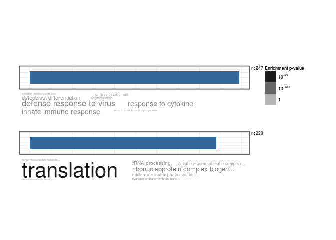

``` r
ind <- intersect(rownames(boneMatNorm),rownames(ambrosiMatNorm))

coefMat <- sapply(1:ncol(boneMatNorm),function(i)coef(lm(y~.+0,data=log(data.frame(y= boneMatNorm[ind,i],ambrosiMatNorm[ind,])+1,2))))

std.heatmap(coefMat)
```

    ## Warning in heatmap.2(M, Rowv = F, Colv = F, trace = "none", col = cols, :
    ## Discrepancy: Rowv is FALSE, while dendrogram is `both'. Omitting row
    ## dendogram.

    ## Warning in heatmap.2(M, Rowv = F, Colv = F, trace = "none", col = cols, :
    ## Discrepancy: Colv is FALSE, while dendrogram is `column'. Omitting column
    ## dendogram.


``` r
boneMatNormLog <- log(boneMatNorm+1,2)
ambrosiMatNormLog <- log(ambrosiMatNorm+1,2)


costF <- function(x,y, theta){
  (cor(t(y*mean(theta)),colSums(x*theta),method = "pearson")+1)/2
}

x=t(ambrosiMatNormLog[ind,])
y=t(boneMatNormLog[ind,1])
burnin <- 2000

if(!file.exists("~/Optimat.Rds")){
optiMat <- apply(boneMatNormLog[ind,],2,function(y){
paramtocost <- matrix(integer(0),nrow = 0,ncol=12)
for(i in 1:3000){
  if(i%%100 == 0)print(i)
  if(nrow(paramtocost)>burnin){
    currentParam <- sapply(1:nrow(x),function(j){
      p <- smooth.spline(paramtocost[,j] , paramtocost[,12])
      p <- predict(p,1:10000)
      py <- (p$y - min(p$y))/(max(p$y)-min(p$y))
      sample(1:10000,1,replace = T,prob = (py)/(sum(py)))
    })
  }else if(i==1)currentParam <- rep(1,nrow(x))
  else if(i==2)currentParam <- rep(10000,nrow(x))
  else{currentParam <- sample(1:10000,nrow(x),replace = T)}
  cost <- costF(t(ambrosiMatNormLog[ind,]),t(boneMatNormLog[ind,1]),currentParam)
  paramtocost <- rbind(paramtocost,c(currentParam,cost))
}
paramtocost <- paramtocost[order(paramtocost[,ncol(paramtocost)]),]
print(paramtocost[nrow(paramtocost),ncol(paramtocost)]*2-1)
print(cor(t(x),y))
paramtocost[nrow(paramtocost),]
})

saveRDS(optiMat,file = "~/Optimat.Rds")
}
optiMat <- readRDS("~/Optimat.Rds")
std.heatmap(cor.compare(ambrosiMatNormLog,boneMatNormLog,min = 1),method="pearson")
```

    ## [1] "Num Genes:"
    ## [1] 18791

    ## Warning in heatmap.2(M, Rowv = F, Colv = F, trace = "none", col = cols, :
    ## Discrepancy: Rowv is FALSE, while dendrogram is `both'. Omitting row
    ## dendogram.

    ## Warning in heatmap.2(M, Rowv = F, Colv = F, trace = "none", col = cols, :
    ## Discrepancy: Colv is FALSE, while dendrogram is `column'. Omitting column
    ## dendogram.

    ## Warning in plot.window(...): "method" is not a graphical parameter

    ## Warning in plot.xy(xy, type, ...): "method" is not a graphical parameter

    ## Warning in title(...): "method" is not a graphical parameter


``` r
normOptiMat <- sapply(1:ncol(optiMat),function(i) optiMat[-12,i]/sum(optiMat[-12,i]))
colnames(normOptiMat) <- colnames(optiMat)
rownames(normOptiMat) <- colnames(ambrosiMatNorm)
std.heatmap(normOptiMat)
```

    ## Warning in heatmap.2(M, Rowv = F, Colv = F, trace = "none", col = cols, :
    ## Discrepancy: Rowv is FALSE, while dendrogram is `both'. Omitting row
    ## dendogram.

    ## Warning in heatmap.2(M, Rowv = F, Colv = F, trace = "none", col = cols, :
    ## Discrepancy: Colv is FALSE, while dendrogram is `column'. Omitting column
    ## dendogram.


``` r
ARs <- read.table("~/code/IngrahamLabData/AR.csv",header = T,sep=",",stringsAsFactors = F)
PRs <- read.table("~/code/IngrahamLabData/PR.csv",header = T,sep=",",stringsAsFactors = F)
RARs <- read.table("~/code/IngrahamLabData/RARs.csv",header = T,sep=",",stringsAsFactors = F)
ERs <- read.table("~/code/IngrahamLabData/ERs.csv",header = T,sep=",",stringsAsFactors = F)


recList <- list(ARs,PRs,RARs,ERs)
names(recList) <- c("ARs","PRs","RARs","ERs")

OverlapNames <-  lapply(recList,function(x){
  x <- x[x$Gene%in%rownames(resCandice),]
  arvp <- cbind(resCandice[x$Gene,"padj"],x$LogCPValue)
  rownames(arvp) <- x$Gene
  arvp[is.na(arvp)] <- 1
  arvp[,1] <- log(arvp[,1])
  #cor(arvp,method = "spe")
  #plot(arvp,xlab="IngrahamLogPval",ylab="NursaLogPval")
  #abline(v =-2.31,col=2)
  #abline(h=-2.31,col=2)
  rownames(arvp)[arvp[,1]< -2.31&arvp[,2]< -2.31]
})

names(OverlapNames) <- names(recList)
venn(OverlapNames,names = names(recList))
```


``` r
ARs <- ARs[ARs$Gene%in%rownames(resCandice),]
arvp <- cbind(resCandice[ARs$Gene,"padj"],ARs$LogCPValue)
rownames(arvp) <- ARs$Gene
arvp[is.na(arvp)] <- 1
arvp[,1] <- log(arvp[,1])
cor(arvp,method = "spe")
```

    ##            [,1]       [,2]
    ## [1,] 1.00000000 0.08818878
    ## [2,] 0.08818878 1.00000000

``` r
plot(arvp,xlab="IngrahamLogPval",ylab="NursaLogPval",main="Androgen Receptor")
abline(v =-2.31,col=2)
abline(h=-2.31,col=2)
```

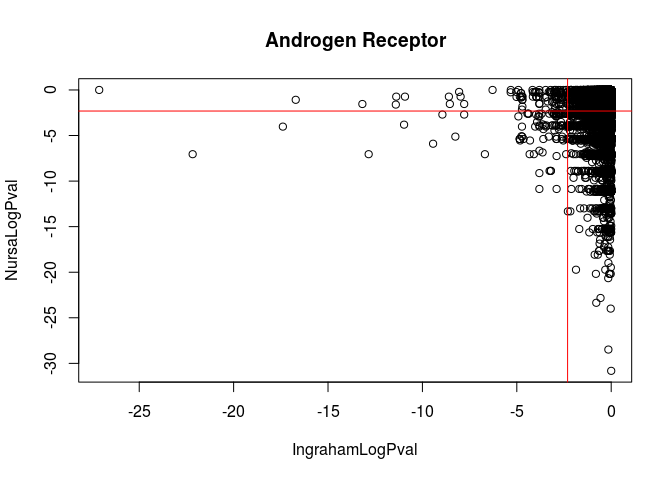

``` r
rownames(arvp)[arvp[,1]< -2.31&arvp[,2]< -2.31]
```

    ##  [1] "Cadm1"         "Zfp51"         "Tex15"         "Nme1"         
    ##  [5] "Plac8"         "Herpud1"       "Adamts1"       "Csrp2"        
    ##  [9] "Cir1"          "Ifit1"         "Lpin1"         "Sfrp2"        
    ## [13] "Tmem147"       "Postn"         "Irf8"          "Nme6"         
    ## [17] "Vldlr"         "Ly6d"          "Ifi44"         "Cd209g"       
    ## [21] "Greb1"         "Tomm6"         "Gjb3"          "Lsm7"         
    ## [25] "Tex2"          "Romo1"         "Emg1"          "Gbp7"         
    ## [29] "Samd5"         "Cdyl2"         "Calcoco1"      "Mlip"         
    ## [33] "Scn4b"         "S100a4"        "Slc31a2"       "Ifih1"        
    ## [37] "Zmynd10"       "Pi15"          "Bicc1"         "Parp9"        
    ## [41] "Ccdc134"       "Dixdc1"        "Rep15"         "Gbp8"         
    ## [45] "Exosc6"        "Mrps18a"       "Cst3"          "Cul4a"        
    ## [49] "Eif3g"         "Slc4a5"        "Csf2ra"        "H2afv"        
    ## [53] "Mien1"         "Arpc5l"        "Scd2"          "Sowaha"       
    ## [57] "Stat1"         "Sap30"         "Gbp4"          "S100a10"      
    ## [61] "Zfp874a"       "Card6"         "Slc35g1"       "Cacna2d4"     
    ## [65] "Zfp125"        "Ndufa1"        "Aprt"          "Ptpre"        
    ## [69] "1700021F05Rik" "Gbp6"          "Oasl2"         "Sec16b"       
    ## [73] "Dph1"          "Gemin6"        "Cadm3"         "Rtn4ip1"      
    ## [77] "Oas3"          "Oasl1"         "Frrs1"         "Fam136a"      
    ## [81] "Commd4"        "Ugt8a"         "Dcn"           "Dctpp1"       
    ## [85] "Tspan6"        "Urm1"          "Cat"           "Cox7a2l"      
    ## [89] "Papss2"        "Rps4x"         "Id3"           "Rpl39"        
    ## [93] "Cmah"          "Col1a1"        "Inhba"         "Rock1"        
    ## [97] "Bmp4"          "Ankrd10"       "Gpx3"

``` r
PRs <- PRs[PRs$Gene%in%rownames(resCandice),]
prvp <- cbind(resCandice[PRs$Gene,"padj"],PRs$LogCPValue)
rownames(prvp) <- PRs$Gene
prvp[is.na(prvp)] <- 1
prvp[,1] <- log(prvp[,1])
plot(prvp,xlab="IngrahamLogPval",ylab="NursaLogPval",main="Progesterone Receptor")
abline(v =-2.31,col=2)
abline(h=-2.31,col=2)
```


``` r
rownames(prvp)[prvp[,1]< -2.31&prvp[,2]< -2.31]
```

    ##  [1] "Lpin1"         "Gjb3"          "Adamts1"       "Plac8"        
    ##  [5] "Cd209g"        "Gpx3"          "Bex6"          "Cadm1"        
    ##  [9] "Gbp8"          "Pgr"           "Col8a1"        "Tenm4"        
    ## [13] "Id3"           "Ly6d"          "Cox7a2l"       "Postn"        
    ## [17] "Col5a2"        "Gngt2"         "Calcoco1"      "Oasl1"        
    ## [21] "Zmynd10"       "Rep15"         "Sec16b"        "Col1a1"       
    ## [25] "Mid1"          "Ifi44"         "Exosc6"        "Mlip"         
    ## [29] "Gbp4"          "Acadvl"        "Frrs1"         "2410002F23Rik"
    ## [33] "Arpc5l"        "Eif3g"         "Irf8"          "H2afv"        
    ## [37] "Csrp2"         "Sfrp2"         "Scd2"          "Gbp6"         
    ## [41] "Gemin6"        "Tomm6"         "Stat1"         "Zfp874a"      
    ## [45] "Card6"         "Scn4b"         "Tmem147"       "Dctpp1"       
    ## [49] "Tmem205"       "Romo1"         "Fam136a"       "Eif2ak4"      
    ## [53] "S100a10"       "Zfp51"         "Ugt8a"         "Gbp7"         
    ## [57] "Sap30"         "Ifit1"         "Herpud1"       "Bicc1"        
    ## [61] "Rtn4ip1"       "Dph1"          "Slc31a2"       "Pi15"

``` r
heatmap.2(log(boneMatNorm[rownames(prvp)[prvp[,1]< -3&prvp[,2]< -3],]+1,2)-rowMeans(log(boneMatNorm[rownames(prvp)[prvp[,1]< -3&prvp[,2]< -3],]+1,2)),main="PR Related\nLog2(FC) from mean",cexRow=.5,breaks=seq(-4, 4, length.out=51),Rowv = T,Colv = F,trace="none",col=cols)
```

    ## Warning in heatmap.2(log(boneMatNorm[rownames(prvp)[prvp[, 1] < -3 &
    ## prvp[, : Discrepancy: Colv is FALSE, while dendrogram is `both'. Omitting
    ## column dendogram.


``` r
RARs <- RARs[RARs$Gene%in%rownames(resCandice),]
rarvp <- cbind(resCandice[RARs$Gene,"padj"],RARs$LogCPValue)
rownames(rarvp) <- RARs$Gene
rarvp[is.na(rarvp)] <- 1
rarvp[,1] <- log(rarvp[,1])
plot(rarvp,xlab="IngrahamLogPval",ylab="NursaLogPval",main="RA Receptor")
abline(v =-2.31,col=2)
abline(h=-2.31,col=2)
```

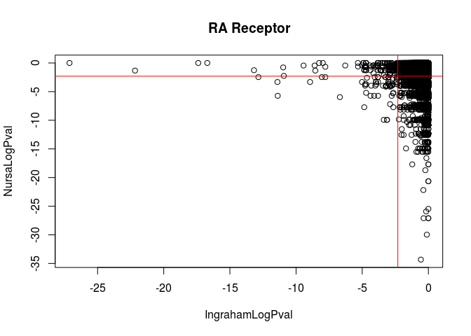

``` r
rownames(rarvp)[rarvp[,1]< -2.31&rarvp[,2]< -2.31]
```

    ##  [1] "Lifr"          "Gpx3"          "Parp9"         "Dctpp1"       
    ##  [5] "Id3"           "Gjb3"          "Postn"         "1700021F05Rik"
    ##  [9] "Csrp2"         "A2m"           "2410002F23Rik" "Bmp4"         
    ## [13] "Cst3"          "Sap30"         "Fmo5"          "Plac8"        
    ## [17] "Pqlc3"         "Lpin1"         "Tor3a"         "Mif"          
    ## [21] "Stat1"         "Nop10"         "Herpud1"       "Mzb1"         
    ## [25] "Card6"         "Man1c1"        "Zfp874a"       "Slco4c1"      
    ## [29] "Mtus1"         "Ifi44"         "Tex15"         "Gemin6"       
    ## [33] "Kcnj10"        "Cir1"          "Zmynd10"       "Oas3"         
    ## [37] "Oasl2"         "Bicc1"         "Slc31a2"       "Oas2"         
    ## [41] "Ddx60"         "Rps15a"        "Myl1"          "Tmem147"      
    ## [45] "Acadvl"        "Tmem205"       "Nme1"          "Col2a1"       
    ## [49] "Sfrp2"         "Tspan6"        "Ugt8a"         "Eif2ak2"      
    ## [53] "Pcsk6"         "Col5a2"        "Fkbp1b"        "Frrs1"        
    ## [57] "Xrcc6"         "Romo1"

``` r
ERs <- ERs[ERs$Gene%in%rownames(resCandice),]
ervp <- cbind(resCandice[ERs$Gene,"padj"],ERs$LogCPValue)
rownames(ervp) <- ERs$Gene
ervp[is.na(ervp)] <- 1
ervp[,1] <- log(ervp[,1])
plot(ervp,xlab="IngrahamLogPval",ylab="NursaLogPval",main="Estrogen Receptor")
abline(v =-2.31,col=2)
abline(h=-2.31,col=2)
```


``` r
rownames(ervp)[ervp[,1]< -2.31&ervp[,2]< -2.31]
```

    ##   [1] "Id3"           "Sfrp2"         "H2afv"         "Pqlc3"        
    ##   [5] "Adamts1"       "Rarres2"       "Slc35g1"       "Ifit1"        
    ##   [9] "Cst3"          "Herpud1"       "Dcn"           "Greb1"        
    ##  [13] "Mtus1"         "Bmp4"          "Plac8"         "Peg3"         
    ##  [17] "Cpt1a"         "Nme1"          "Emg1"          "Mrps18a"      
    ##  [21] "Pgr"           "Lpin1"         "Gpx3"          "Gjb3"         
    ##  [25] "Cox7a2l"       "Fam136a"       "Cadm1"         "Dph1"         
    ##  [29] "Romo1"         "Mif"           "Col1a1"        "Mien1"        
    ##  [33] "Ghr"           "Ankrd10"       "Nme6"          "Col5a2"       
    ##  [37] "Slc31a2"       "Tomm6"         "Rtp4"          "Rep15"        
    ##  [41] "Dctpp1"        "Frrs1"         "Runx2"         "Snap23"       
    ##  [45] "Tenm4"         "Ly6d"          "S100a10"       "Tmem147"      
    ##  [49] "Zfp874a"       "Chil5"         "Itga11"        "Csrp2"        
    ##  [53] "Vldlr"         "Sec16b"        "Bicc1"         "Smpd3"        
    ##  [57] "Col8a1"        "Ndufa1"        "Limch1"        "Slfn4"        
    ##  [61] "Inhba"         "Nop10"         "Sema5a"        "Commd4"       
    ##  [65] "D8Ertd738e"    "Pfdn5"         "Gbp7"          "Ppp1r35"      
    ##  [69] "Gvin1"         "Gxylt2"        "Ifih1"         "Oas2"         
    ##  [73] "Gemin6"        "Urm1"          "Klf7"          "Lsm7"         
    ##  [77] "Tex2"          "Tmem205"       "Postn"         "Pcsk6"        
    ##  [81] "Rps13"         "Calcoco1"      "Sap30"         "Col2a1"       
    ##  [85] "Baiap2"        "Arpc5l"        "Scd2"          "Zfp108"       
    ##  [89] "Cox5b"         "Rpl35a"        "2410015M20Rik" "Fmo5"         
    ##  [93] "Zmynd10"       "Cir1"          "Ccdc134"       "Nrp2"         
    ##  [97] "Eif3g"         "Exosc6"        "Mlip"          "Rps27"        
    ## [101] "Csf2ra"        "Cat"           "Irf8"          "Sac3d1"       
    ## [105] "Papss2"        "Acadvl"        "Gngt2"         "Xrcc6"        
    ## [109] "Klk1b11"       "1700021F05Rik" "Eif2ak4"       "Fkbp1b"       
    ## [113] "2410002F23Rik" "Skiv2l"        "Hmgn1"         "Parp9"        
    ## [117] "Aprt"          "Oasl2"         "Card6"         "Scn4b"        
    ## [121] "Lox"           "Eif2ak2"       "S100a4"        "Prpf19"       
    ## [125] "Ndufb11"       "Mafb"          "Cdyl2"         "Cd209g"       
    ## [129] "Gbp4"          "Vpreb1"        "Tspan6"        "Ccdc58"       
    ## [133] "Bmp3"          "Cadm3"         "Oas3"          "Oasl1"        
    ## [137] "Cmc2"          "Myl1"          "Tor3a"         "Tomm7"        
    ## [141] "Fam78b"        "Rps15a"        "Bbs7"          "Tmem258"      
    ## [145] "Adprhl2"       "Zbp1"          "Stat1"         "Rtn4ip1"      
    ## [149] "Dgkg"          "Fgd4"          "Trappc2"       "Cmpk2"        
    ## [153] "Rps4x"         "Cul4a"         "Sf3b5"         "Rpl39"        
    ## [157] "Gbp6"          "Ppp1r3d"       "Tceanc"        "Slco4c1"      
    ## [161] "A2m"           "Chit1"         "Trib1"         "Ercc1"        
    ## [165] "Tmem242"       "Epsti1"        "Ifi44"         "Ptpre"        
    ## [169] "Tex15"         "Dixdc1"        "Evi2b"         "Zscan29"      
    ## [173] "Gdi1"          "Zfp51"         "Man1c1"        "Efcab1"       
    ## [177] "Olfm4"         "Pi15"          "Kcnj10"        "Slc25a12"
