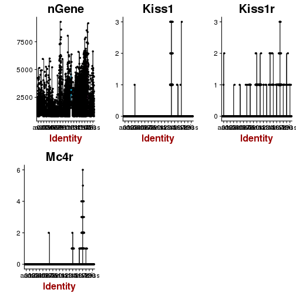

%\VignetteEngine{knitr::knitr}
---
title: "HypothalamusSingleCell"
author: "mtvector"
date: "March 20, 2018"
output: github_document
---


```r
library(dplyr)
library(rmarkdown)
library(Seurat)
library(RColorBrewer)
cols <-  colorRampPalette(rev(brewer.pal(11,"RdBu")))(50)
```


```r
gnz <- c("Kiss1","Kiss1r","Mc4r")
#gnz <- c("1700021F07Rik","1700020L24Rik")

#system("~/code/other/scRNA.seq.datasets/bash/campbell.sh")
#setwd("~/code/other/scRNA.seq.datasets/R/")

### DATA
d <- read.table("GSE93374_Merged_all_020816_DGE.txt",nrows = 200000)
d <- d[,order(colnames(d))]

### ANNOTATIONS
ann <- read.table("GSE93374_cell_metadata.txt", sep = "\t", header = T)
ann <- ann[order(ann[,1]), ]
rownames(ann) <- ann[,1]
ann <- ann[,2:ncol(ann)]
colnames(ann)[9] <- "cell_type1"


#file.remove("./GSE93374_Merged_all_020816_DGE.txt")
#file.remove("./GSE93374_cell_metadata.txt")

library(Seurat)
campbell<-Seurat::CreateSeuratObject(d, min.cells=3,min.genes=10,project="ORG",meta.data = ann)
#FilterCells(campbell,"Kiss1",low.thresholds = .5)# -> campbell 
campbell<-SetAllIdent(campbell,"X7.clust_all")
VlnPlot(campbell,features.plot =  c("nGene",gnz))
```



```r
campbell <- NormalizeData(campbell)
campbell <- ScaleData(campbell)
```

```
## [1] "Scaling data matrix"
## 
  |                                                                       
  |                                                                 |   0%
  |                                                                       
  |===                                                              |   4%
  |                                                                       
  |======                                                           |   9%
  |                                                                       
  |========                                                         |  13%
  |                                                                       
  |===========                                                      |  17%
  |                                                                       
  |==============                                                   |  22%
  |                                                                       
  |=================                                                |  26%
  |                                                                       
  |====================                                             |  30%
  |                                                                       
  |=======================                                          |  35%
  |                                                                       
  |=========================                                        |  39%
  |                                                                       
  |============================                                     |  43%
  |                                                                       
  |===============================                                  |  48%
  |                                                                       
  |==================================                               |  52%
  |                                                                       
  |=====================================                            |  57%
  |                                                                       
  |========================================                         |  61%
  |                                                                       
  |==========================================                       |  65%
  |                                                                       
  |=============================================                    |  70%
  |                                                                       
  |================================================                 |  74%
  |                                                                       
  |===================================================              |  78%
  |                                                                       
  |======================================================           |  83%
  |                                                                       
  |=========================================================        |  87%
  |                                                                       
  |===========================================================      |  91%
  |                                                                       
  |==============================================================   |  96%
  |                                                                       
  |=================================================================| 100%
```

```r
campbell <- FindVariableGenes(campbell)
```


```r
campbell <-  RunPCA(campbell,pcs.compute = 30,pc.genes = campbell@var.genes)
```

```
## [1] "PC1"
##  [1] "Dbi"       "Sparc"     "Mt2"       "Sox9"      "Vim"      
##  [6] "Gja1"      "S100a6"    "Mlc1"      "Hes1"      "Gstm1"    
## [11] "Zfp36l1"   "Slc1a3"    "Hist1h2bc" "Cd9"       "Anxa2"    
## [16] "Mgst1"     "Cnn3"      "S100a1"    "Col23a1"   "Timp3"    
## [21] "Mia"       "Fxyd1"     "Ptn"       "Anxa5"     "Dynlrb2"  
## [26] "Sdc4"      "Ttyh1"     "Gpm6b"     "Rarres2"   "Nfib"     
## [1] ""
##  [1] "Chgb"     "Syt4"     "Syt1"     "Meg3"     "Aplp1"    "Pcp4"    
##  [7] "Chga"     "Gad2"     "Dlk1"     "Arhgap36" "Tmem35"   "Ecel1"   
## [13] "Gabra1"   "Calb2"    "Cacna2d1" "Vgf"      "Gpr101"   "Cited1"  
## [19] "Gda"      "Calb1"    "Slc17a6"  "Rnf128"   "Prlr"     "Ly6e"    
## [25] "Grm5"     "Cartpt"   "Otp"      "Cspg5"    "Nrgn"     "Tubb4a"  
## [1] ""
## [1] ""
## [1] "PC2"
##  [1] "Gatm"    "Trf"     "Arpc1b"  "Srgn"    "Anxa3"   "C1qb"    "C1qa"   
##  [8] "Ctss"    "C1qc"    "Sepp1"   "Mal"     "Tyrobp"  "Laptm5"  "Fcer1g" 
## [15] "Csf1r"   "Cx3cr1"  "Evi2a"   "Ly86"    "Trem2"   "Aif1"    "Fcgr3"  
## [22] "Rasgrp3" "Fcrls"   "Siglech" "Cd34"    "Mpeg1"   "Pllp"    "Apod"   
## [29] "Ly6c1"   "Lgals9" 
## [1] ""
##  [1] "Sox9"    "Mt3"     "Meg3"    "Tmem47"  "Mlc1"    "Col23a1" "Mia"    
##  [8] "Dynlrb2" "Gstm1"   "Cfap126" "Gja1"    "S100a6"  "Gpr50"   "Mt2"    
## [15] "Fos"     "Sox2"    "Rsph1"   "Slc1a3"  "Enkur"   "Fxyd1"   "Cfap45" 
## [22] "Crym"    "Rax"     "Mgst1"   "Riiad1"  "Anxa5"   "Thrsp"   "Nkain4" 
## [29] "Cyr61"   "Tiparp" 
## [1] ""
## [1] ""
## [1] "PC3"
##  [1] "Cldn11"   "Mog"      "Ermn"     "Plp1"     "Ugt8a"    "Mag"     
##  [7] "Opalin"   "Cryab"    "Fa2h"     "Mobp"     "Cnp"      "Tmem88b" 
## [13] "Olig1"    "Pllp"     "Enpp2"    "Gjc3"     "Cmtm5"    "Bcas1"   
## [19] "Car2"     "Gm21984"  "Mbp"      "Ppp1r14a" "Mal"      "Tspan2"  
## [25] "Aspa"     "Sept4"    "Ptgds"    "Pdlim2"   "Kcna1"    "Gjb1"    
## [1] ""
##  [1] "C1qa"    "C1qc"    "C1qb"    "Fcer1g"  "Tyrobp"  "Ctss"    "Laptm5" 
##  [8] "Cx3cr1"  "Trem2"   "Csf1r"   "Ly86"    "Aif1"    "Anxa3"   "Fcrls"  
## [15] "Fcgr3"   "Siglech" "Mpeg1"   "Srgn"    "Ly6e"    "P2ry12"  "Selplg" 
## [22] "Itgam"   "Cd52"    "Cd53"    "Pld4"    "Lgals9"  "Arhgdib" "Cd34"   
## [29] "Hexb"    "Tmem119"
## [1] ""
## [1] ""
## [1] "PC4"
##  [1] "Ly6c1"         "Abcb1a"        "Cldn5"         "Slco1a4"      
##  [5] "Adgrf5"        "Ptprb"         "Slco1c1"       "Adgrl4"       
##  [9] "Ly6a"          "9430020K01Rik" "Esam"          "Pecam1"       
## [13] "Flt1"          "Car4"          "Nostrin"       "Cxcl12"       
## [17] "Fn1"           "Ctla2a"        "Epas1"         "Igfbp7"       
## [21] "Ramp2"         "Emcn"          "Kdr"           "Itm2a"        
## [25] "Wfdc1"         "Abcg2"         "Kitl"          "Sdpr"         
## [29] "Fxyd5"         "Id1"          
## [1] ""
##  [1] "C1qc"    "C1qa"    "Ctss"    "C1qb"    "Csf1r"   "Tyrobp"  "Cx3cr1" 
##  [8] "Fcer1g"  "Ly86"    "Trem2"   "Laptm5"  "Aif1"    "Siglech" "Fcrls"  
## [15] "Fcgr3"   "Mpeg1"   "P2ry12"  "Selplg"  "Itgam"   "Cd53"    "Cd52"   
## [22] "Pld4"    "Gpr34"   "Tmem119" "Fyb"     "Hexb"    "Lyz2"    "Lair1"  
## [29] "Unc93b1" "Ptgs1"  
## [1] ""
## [1] ""
## [1] "PC5"
##  [1] "Cldn10"  "Col25a1" "Fndc3c1" "Scn7a"   "Dio2"    "Mest"    "Deptor" 
##  [8] "Trpm3"   "Fzd5"    "Gpc3"    "Zfand6"  "Hes1"    "Abca8a"  "Col23a1"
## [15] "Ptn"     "A2m"     "Fstl1"   "Ppp1r1b" "Adm"     "Fbln5"   "Rax"    
## [22] "Rgcc"    "Fbxo2"   "Ctgf"    "Tiparp"  "Six3os1" "Igfbp4"  "Sntb2"  
## [29] "Cyr61"   "Fos"    
## [1] ""
##  [1] "Tmem212"       "Ccdc153"       "Fam216b"       "Sntn"         
##  [5] "Odf3b"         "Ak7"           "Spag17"        "Tm4sf1"       
##  [9] "Aebp1"         "Pcp4l1"        "Cd24a"         "Gm10714"      
## [13] "1700001C02Rik" "Pltp"          "Hdc"           "S100b"        
## [17] "Iqca"          "Rarres2"       "1110017D15Rik" "Dnah12"       
## [21] "Aqp4"          "Gm973"         "Ascc1"         "Ramp1"        
## [25] "Sparcl1"       "Dnah5"         "Cfap54"        "Serpine2"     
## [29] "3300002A11Rik" "Dnah6"        
## [1] ""
## [1] ""
```

```r
campbell <- RunTSNE(campbell,check_duplicates = FALSE )
```


```r
#system("~/code/other/scRNA.seq.datasets/bash/chen.sh")
### DATA
d <- read.table("GSE87544_Merged_17samples_14437cells_count.txt", header = TRUE,nrows = 200000)
rownames(d) <- d[,1]
d <- d[,2:ncol(d)]
d <- d[,order(colnames(d))]

### ANNOTATIONS
ann <- read.csv("GSE87544_1443737Cells.SVM.cluster.identity.renamed.csv")
rownames(ann) <- ann[,2]
colnames(ann)[3] <- "cell_type1"
ann <- ann[,3,drop = FALSE]
ann <- ann[order(rownames(ann)), , drop = FALSE]

#file.copy("./GSE87544_Merged_17samples_14437cells_count.txt","~/code/data/GEOData/seq/SCsets/")
#file.remove("./GSE87544_Merged_17samples_14437cells_count.txt")
#file.copy("./GSE87544_1443737Cells.SVM.cluster.identity.renamed.csv","~/code/data/GEOData/seq/SCsets/")
#file.remove("./GSE87544_1443737Cells.SVM.cluster.identity.renamed.csv")

chen<-Seurat::CreateSeuratObject(d, min.cells=3,min.genes=10,project="ORG",meta.data = ann)
#FilterCells(chen,"Kiss1",low.thresholds = .5)# -> chen 
chen <- NormalizeData(chen)
chen <- ScaleData(chen)
```

```
## [1] "Scaling data matrix"
## 
  |                                                                       
  |                                                                 |   0%
  |                                                                       
  |====                                                             |   6%
  |                                                                       
  |=======                                                          |  11%
  |                                                                       
  |===========                                                      |  17%
  |                                                                       
  |==============                                                   |  22%
  |                                                                       
  |==================                                               |  28%
  |                                                                       
  |======================                                           |  33%
  |                                                                       
  |=========================                                        |  39%
  |                                                                       
  |=============================                                    |  44%
  |                                                                       
  |================================                                 |  50%
  |                                                                       
  |====================================                             |  56%
  |                                                                       
  |========================================                         |  61%
  |                                                                       
  |===========================================                      |  67%
  |                                                                       
  |===============================================                  |  72%
  |                                                                       
  |===================================================              |  78%
  |                                                                       
  |======================================================           |  83%
  |                                                                       
  |==========================================================       |  89%
  |                                                                       
  |=============================================================    |  94%
  |                                                                       
  |=================================================================| 100%
```

```r
chen <- FindVariableGenes(chen)
```


```r
chen <-  RunPCA(chen,pcs.compute = 30,pc.genes = chen@var.genes)
```

```
## [1] "PC1"
##  [1] "Cpe"     "Olig1"   "Snhg11"  "Resp18"  "Chgb"    "Scg2"    "Enpp2"  
##  [8] "Clu"     "Nnat"    "Atp1a3"  "Cspg5"   "Mobp"    "Aldoc"   "Chga"   
## [15] "Pcp4"    "Mt3"     "Dbndd2"  "Syt1"    "Opalin"  "Thy1"    "Nrxn3"  
## [22] "Gpr37l1" "S100b"   "Bcas1"   "Cadm2"   "Hapln2"  "Gad1"    "Lhfpl3" 
## [29] "Ptgds"   "Nefl"   
## [1] ""
##  [1] "Srgn"    "B2m"     "Ly6c1"   "Ly6a"    "Slco1a4" "H2-D1"   "Flt1"   
##  [8] "Igfbp7"  "Itm2a"   "Gpr116"  "Abcb1a"  "Apold1"  "Cldn5"   "Esam"   
## [15] "Ly6e"    "Nfkbia"  "H2-K1"   "Ifitm3"  "Pltp"    "Hspb1"   "Slco1c1"
## [22] "Id1"     "Cd34"    "Anxa3"   "Klf2"    "Ptprb"   "Ramp2"   "Cxcl12" 
## [29] "Car4"    "Eltd1"  
## [1] ""
## [1] ""
## [1] "PC2"
##  [1] "Ly6c1"   "Ly6a"    "Igfbp7"  "Flt1"    "Slco1a4" "Itm2a"   "Gpr116" 
##  [8] "Pltp"    "Abcb1a"  "Slco1c1" "Esam"    "Cldn5"   "Ramp2"   "Id1"    
## [15] "Apold1"  "Slc2a1"  "Tm4sf1"  "Cxcl12"  "Pcp4l1"  "Hspb1"   "Car4"   
## [22] "Sdpr"    "Rgs5"    "Eltd1"   "Id3"     "Wfdc1"   "Ptprb"   "Ifitm3" 
## [29] "Egfl7"   "Ctla2a" 
## [1] ""
##  [1] "C1qa"    "C1qb"    "Ctss"    "C1qc"    "Csf1r"   "Tyrobp"  "Fcer1g" 
##  [8] "Laptm5"  "Cx3cr1"  "Trem2"   "Siglech" "Ly86"    "Ccl3"    "Ccl4"   
## [15] "Plek"    "Cd14"    "Il1a"    "Selplg"  "P2ry12"  "Bcl2a1b" "Hexb"   
## [22] "Aif1"    "Cd83"    "Cd53"    "Fcgr3"   "C3ar1"   "Fcrls"   "Itgam"  
## [29] "Pld4"    "Sfpi1"  
## [1] ""
## [1] ""
## [1] "PC3"
##  [1] "Enpp2"   "Mobp"    "Apod"    "Snhg11"  "Resp18"  "Dbndd2"  "Opalin" 
##  [8] "Scg2"    "Chgb"    "Atp1a3"  "Syt1"    "Spock2"  "Ptgds"   "Hapln2" 
## [15] "Sgk1"    "Chga"    "Chn2"    "Ly6e"    "Olig1"   "Anln"    "Egfl7"  
## [22] "Pcp4"    "Slc24a2" "Slco1a4" "Ly6c1"   "Thy1"    "Abcb1a"  "Nefl"   
## [29] "Gpr116"  "Gad1"   
## [1] ""
##  [1] "Dynlrb2"       "Ccdc153"       "Tmem212"       "Sox9"         
##  [5] "Mlc1"          "1700009P17Rik" "Ak7"           "Calml4"       
##  [9] "Mia1"          "Rarres2"       "Rsph1"         "1700016K19Rik"
## [13] "Gja1"          "1700094D03Rik" "Iqca"          "Enkur"        
## [17] "Ccdc146"       "Ccdc19"        "Mns1"          "Gm10714"      
## [21] "Odf3b"         "AU021034"      "1700012B09Rik" "1700001C02Rik"
## [25] "Tctex1d4"      "Sdc4"          "Ppp1r36"       "Wdr96"        
## [29] "Mt2"           "1110017D15Rik"
## [1] ""
## [1] ""
## [1] "PC4"
##  [1] "Ccdc153"       "Tmem212"       "Rsph1"         "1110017D15Rik"
##  [5] "Fam183b"       "Ak7"           "1700016K19Rik" "1700012B09Rik"
##  [9] "Calml4"        "Dynlrb2"       "Tctex1d4"      "Iqca"         
## [13] "1700001C02Rik" "Odf3b"         "AU021034"      "Gm10714"      
## [17] "Sntn"          "Efcab10"       "Rsph4a"        "Meig1"        
## [21] "1700009P17Rik" "Ccdc146"       "Cdhr3"         "Spag17"       
## [25] "1700026D08Rik" "1700094D03Rik" "Enkur"         "E230008N13Rik"
## [29] "Ccdc33"        "Hdc"          
## [1] ""
##  [1] "Ntsr2"    "Agt"      "Atp1a2"   "Gjb6"     "Slc1a2"   "Ppap2b"  
##  [7] "Slc7a10"  "Gpr37l1"  "Slc6a11"  "Slc4a4"   "Cldn10"   "Ednrb"   
## [13] "F3"       "Aldoc"    "Pla2g7"   "Fgfr3"    "Mmd2"     "Acsbg1"  
## [19] "Tril"     "Itih3"    "Slc1a3"   "Ndrg2"    "Atp1b2"   "Cxcl14"  
## [25] "Mfge8"    "Gja1"     "Btbd17"   "Nkain4"   "Slc39a12" "Acsl6"   
## [1] ""
## [1] ""
## [1] "PC5"
##  [1] "Snhg11"   "Scg2"     "Resp18"   "Chgb"     "Atp1a3"   "Syt1"    
##  [7] "Chga"     "Thy1"     "Pcp4"     "Nefl"     "Nrxn3"    "Disp2"   
## [13] "Gabra1"   "Gad1"     "Slc17a6"  "Calb1"    "Hpca"     "Cpe"     
## [19] "Rgs4"     "Dlk1"     "Vgf"      "Chl1"     "Cacna2d1" "Odz2"    
## [25] "Gabrb2"   "Rgs2"     "Serpini1" "Ppp1r1a"  "Calb2"    "Npas4"   
## [1] ""
##  [1] "Enpp2"         "Mobp"          "Apod"          "Dbndd2"       
##  [5] "Opalin"        "Ptgds"         "Gsn"           "Olig1"        
##  [9] "Hapln2"        "Sgk1"          "Il33"          "Anln"         
## [13] "Bcas1"         "Plin3"         "Chn2"          "Sepp1"        
## [17] "Enpp6"         "Klk6"          "S100b"         "Rasgrp3"      
## [21] "Lims2"         "Foxj1"         "Slc24a2"       "Rell1"        
## [25] "Aebp1"         "Mpzl1"         "2610017I09Rik" "Csf1"         
## [29] "Arc"           "Hist1h4h"     
## [1] ""
## [1] ""
```

```r
chen <- RunTSNE(chen,check_duplicates = FALSE)
```


