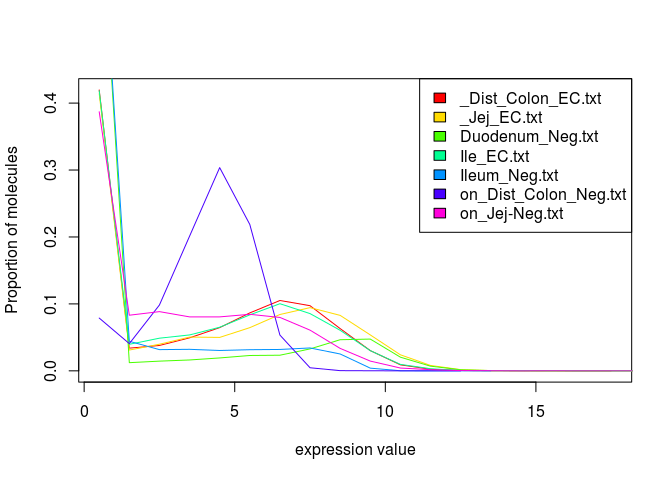
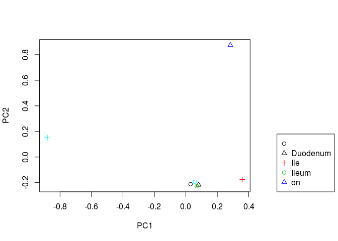
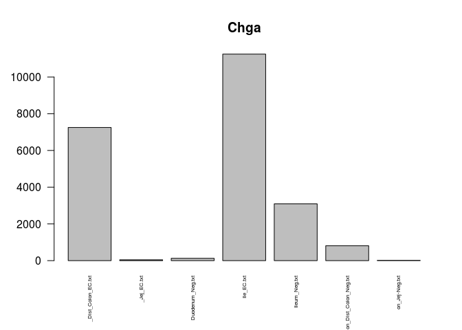
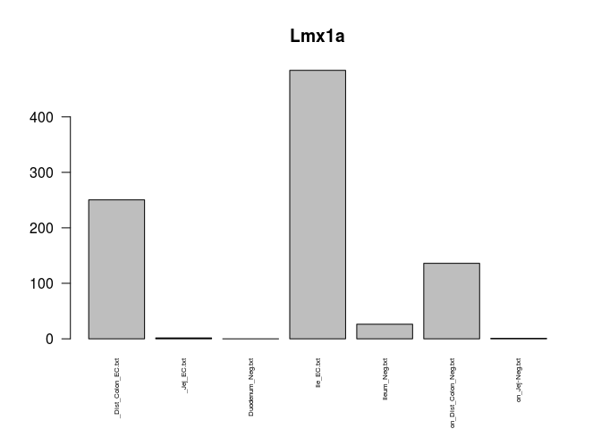
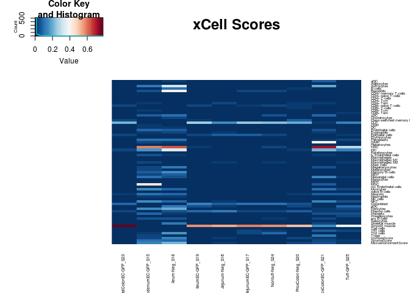

Enterochromaffin Cells
================
mtvector
March 21, 2018

A quick look at Jim's Data \# Loading Data

Following quality control, untrimmed paired-end reads were quantified using Salmon.

First I'll load the libraries and functions I'll need for the analysis (skip this part).

``` r
library(DESeq2)
library(EBSeq)
library(matrixStats)
library(biomaRt)
library(gplots)
library(clusterProfiler)
library(RColorBrewer)
library(tximport)
cols <-  colorRampPalette(rev(brewer.pal(11,"RdBu")))(50)

#see Github lengning
library(EACI)


median.normalize <- function(x){
  GetNormalizedMat(x,MedianNorm(x))
}

round.log <- function(s,base=2){
  round(log(s+1, base),digits = 1)
}

std.heatmap <- function(M,...){
  heatmap.2(M,Rowv = F,Colv = F,trace="none",col = cols,...)
}

rn.merge <- function(x,y,fill=0,simple.intersect=F){
  rn <- intersect(rownames(x),rownames(y))
  zerosx <- setdiff(rownames(x),rownames(y))
  zerosy <- setdiff(rownames(y),rownames(x))
  out <- cbind(x[rn,,drop=F],y[rn,,drop=F])
  if(simple.intersect){return(out)}
  else{
  if(length(zerosx)!=1  &length(zerosy)!=1){
    zx <- matrix(fill, nrow=length(zerosx), ncol =ncol(y), dimnames = list(zerosx,NULL))
    zy <- matrix(fill, nrow=length(zerosy), ncol =ncol(x), dimnames = list(zerosy,NULL))
    zx <- cbind(x[zerosx,],zx)
    zy <- cbind(zy,y[zerosy,])
  }else if(length(zerosx)==1){
    zx <- rep(fill, ncol(y))
    zy <- matrix(fill, nrow=length(zerosy), ncol =ncol(x), dimnames = list(zerosy,NULL))
    zx <- c(x[zerosx,],zx)
    zy <- cbind(zy,y[zerosy,])
  }else if(length(zerosy)==1){
    zx <- matrix(fill, nrow=length(zerosx), ncol =ncol(y), dimnames = list(zerosx,NULL))
    zy <- rep(fill, ncol(x))
    print(zx)
    print(zy)
    zx <- cbind(x[zerosx,],zx)
    zy <- c(zy,y[zerosy,])
  }
  out <- rbind(out,rbind(zx,zy))
  return(out)}
}

cor.compare <- function(x,y,min=0, varX=NULL ,interest.set =NULL, ...){
  d <- rn.compare(x,y)
  x <- d[[1]]
  y <- d[[2]]
  i = intersect(rownames(x), rownames(y))
  i = i[rowMaxs(x[i,],na.rm = T)>=min | rowMaxs(y[i,],na.rm = )>=min]
  if(!is.null(interest.set)){
    i = interest.set[interest.set%in%i]
  }
  if(!is.null(varX)){
    i = i[order(rowMeans(cbind(rowSds(x[i,]), rowSds(y[i,]))),decreasing = T)]
    i = i[1:ifelse(varX>length(i),length(i),varX)]
  }
  print("Num Genes:")
  print(length(i))
  return(cor(as.matrix(x[i,]),as.matrix(y[i,]), ...))
}

rn.compare <- function(x,y,fill=0){
  rn <- as.character(intersect(rownames(x),rownames(y)))
  zerosx <- setdiff(rownames(x),rownames(y))
  zerosy <- setdiff(rownames(y),rownames(x))
  zx <- matrix(fill, nrow=length(zerosx), ncol =ncol(y), dimnames = list(zerosx,NULL))
  zy <- matrix(fill, nrow=length(zerosy), ncol =ncol(x), dimnames = list(zerosy,NULL))
  nx <- rbind(x,zy)
  ny <- rbind(y,zx)
  return(list(nx[rownames(ny),,drop=F],ny[rownames(nx),,drop=F]))
}


hist.normalized <- function(x){
  nsamp <- dim(x)[2]
  h <- hist(x[,1], plot=FALSE)
  plot(h$mids, h$density, type="l", col=rainbow(nsamp)[1], main="",
       xlab="expression value", ylab="Proportion of molecules")
  for(i in 2:nsamp){
    h <- hist(x[,i], plot=FALSE)
    lines(h$mids, h$density, col=rainbow(nsamp)[i])
  }
}
```

``` r
# datapath <- "~/code/IngrahamLabData/JimGalaxy/"
# fileList <- dir(datapath,full.names = T)
# dsList <- lapply(fileList,read.csv2, sep="\t",header=T,row.names=1,stringsAsFactors=F)
# dsList <- list(dsList[[1]],Reduce(cbind, dsList[-1]))
# JimData <- rn.merge(dsList[[1]],dsList[[2]],simple.intersect = T)
# JimData <- apply(JimData,2,type.convert)
# colnames(JimData)[6:ncol(JimData)] <- sapply(strsplit(fileList[-1],"\\[|\\]"),"[",2)
# std.heatmap(cor(JimData,method = "spearman"))
# JimDataNorm <- median.normalize(JimData)
# barplot(JimDataNorm["Chga",],las=2,cex.names = .5)
# barplot(gutMatNorm["Chga",],las=2,cex.names = .5)
#std.heatmap(cor.compare(JimDataNorm,gutMatNorm,method = "spearman"))
datapath <- "~/code/IngrahamLabData/JimGalaxy/counts"
fileList <- dir(datapath,full.names = T)
dsList <- lapply(fileList,read.csv2, sep="\t",header=T,row.names=1,stringsAsFactors=F)
gutMat <- Reduce(rn.merge,dsList)
colnames(gutMat) <- sapply(strsplit(fileList,"Counts_"),"[",2)
gutMat <- gutMat[,colSums(gutMat)>500000]
gutMatNorm <- median.normalize(gutMat)
#gutMat <- JimData
#gutMatNorm <- JimDataNorm
#sort(JimDataNorm[,1],decreasing = T)
#sort(gutMatNorm[,1],decreasing = T)


# datapath <- "~/code/IngrahamLabData/JimSalmonOutputs"
# fileList <- dir(datapath)
# fileList <- paste0(datapath,"/",fileList,"/","quant.sf")
# 
# dsList <- lapply(fileList,read.csv2, sep="\t",header=T,row.names=1,stringsAsFactors=F)
# allRownames <- Reduce(union,lapply(dsList,rownames))
# 
# #Use Biomart to get the 
# mart <- useMart(biomart = "ENSEMBL_MART_ENSEMBL", dataset = "mmusculus_gene_ensembl", host="www.ensembl.org")
# rnSymbol <- getBM(attributes = c("ensembl_transcript_id_version","mgi_symbol","description"),filters = c("ensembl_transcript_id_version"),values =allRownames ,mart = mart) 
# rnSymbolGenes <- rnSymbol[rnSymbol$mgi_symbol!="",]
# rnSymbolGenes <- rnSymbol[rnSymbol$mgi_symbol!=""& !grepl("predicted gene", rnSymbol$description),]
# 
# txList <-  tximport(fileList,type="salmon",txOut = T)
# gutMat <-  summarizeToGene(txList,rnSymbolGenes)$counts[-1,]
# 
# colnames(gutMat) <- gsub("_L003_Rout","",lapply(strsplit(fileList,split = "/"),"[",5))
# 
# std.heatmap(cor(gutMat,method="spearman"),cexCol=.5,cexRow=.5)
# 
# gutMatNorm <-  median.normalize(gutMat[rowMaxs(gutMat)>2,])
condits <- sapply(strsplit(colnames(gutMatNorm),"_"),function(x)x[1])
```

``` r
barplot(colSums(gutMat),main = "Number of reads",las=3,cex.names = .6)
```


``` r
barplot(MedianNorm(gutMat),main = "Size Factors",las=3,cex.names = .6)
```


``` r
hist.normalized(log(gutMat+1,2))
legend("topright",fill = rainbow(ncol(gutMat)),col=rainbow(ncol(gutMat)),legend = colnames(gutMat))
```



``` r
barplot(colSums(gutMatNorm),main = "PostNorm Reads",las=3,cex.names = .6)
```


``` r
hist.normalized(log(gutMatNorm+1,2))
legend("topright",fill = rainbow(ncol(gutMatNorm)),col=rainbow(ncol(gutMatNorm)),legend = colnames(gutMatNorm))
```


``` r
#gutMat <- gutMat[,c(-1,-3)]
#gutMatNorm <-  median.normalize(gutMat[rowMaxs(gutMat)>2,])
condits <- sapply(strsplit(colnames(gutMat),"_"),function(x)x[1])
hist.normalized(log(gutMatNorm+1,2))
legend("topright",fill = rainbow(ncol(gutMatNorm)),col=rainbow(ncol(gutMatNorm)),legend = colnames(gutMatNorm))
```


``` r
barplot(colMaxs(gutMatNorm),las=2,cex.names = .5,main="Max Expression Values per Sample")
```


``` r
gutCLN <- round.log(gutMatNorm+1,2)
gutCLN <- gutCLN[rowSds(gutCLN)>1,]
svgut <- svd((gutCLN-rowMeans(gutCLN))/rowSds(gutCLN))

heatmap.2(cor(gutMatNorm,method = "spearman"),col = cols,trace="none",cexCol = .5,cexRow = .5)
```


``` r
conditNums <- sapply(condits,function(x)which(x==sort(unique(condits))))
par(mar=c(5.1, 4.1, 4.1, 9.1), xpd=TRUE)
plot(svgut$v[,1:2],col=conditNums,xlab="PC1",ylab="PC2",pch=1:3)
legend("bottomright",inset = c(-.4,0),legend = unique(names(conditNums)),col=conditNums,pch = 1:3)
```



``` r
eaciout <- list()
l <- 1
eacivector <- svgut$u[,l]
names(eacivector) <- rownames(gutCLN)
eaciout[[l]] <- eacitest(eacivector,"org.Mm.eg","SYMBOL",sets = "GO")$setscores
```

    ## Loading necessary libraries...

    ## Loaded Package org.Mm.eg.db

    ## Converting annotations to data.frames ...

    ## iteration 1 done; time  11.79 sec 
    ## iteration 2 done; time  10.75 sec 
    ## iteration 3 done; time  8.94 sec 
    ## iteration 4 done; time  9.04 sec 
    ## iteration 5 done; time  9.31 sec 
    ## iteration 6 done; time  8.63 sec 
    ## iteration 7 done; time  9.15 sec 
    ## iteration 8 done; time  9.37 sec 
    ## iteration 9 done; time  9.68 sec 
    ## iteration 10 done; time  11.09 sec

    ## Labeling output ...

    ## Loaded Package GO.db

``` r
l <- 2
eacivector <- svgut$u[,l]
names(eacivector) <- rownames(gutCLN)
eaciout[[l]] <- eacitest(eacivector,"org.Mm.eg","SYMBOL",sets = "GO")$setscores
```

    ## Loading necessary libraries...

    ## Loaded Package org.Mm.eg.db

    ## Converting annotations to data.frames ...

    ## iteration 1 done; time  13.04 sec 
    ## iteration 2 done; time  13.42 sec 
    ## iteration 3 done; time  9.99 sec 
    ## iteration 4 done; time  9.38 sec 
    ## iteration 5 done; time  10.36 sec 
    ## iteration 6 done; time  12.26 sec 
    ## iteration 7 done; time  12.19 sec 
    ## iteration 8 done; time  12.43 sec 
    ## iteration 9 done; time  14.04 sec 
    ## iteration 10 done; time  13.36 sec

    ## Labeling output ...

    ## Loaded Package GO.db

Now to print the enrichment along each of these components

``` r
#PC1 Positive
a <- eaciout[[1]][eaciout[[1]]$set.mean>0,]
print(a[1:25,])
```

    ##                                                                       Term
    ## GO:0032530                          regulation of microvillus organization
    ## GO:0034663                         endoplasmic reticulum chaperone complex
    ## GO:0035256                    G-protein coupled glutamate receptor binding
    ## GO:0030836          positive regulation of actin filament depolymerization
    ## GO:0042589                                        zymogen granule membrane
    ## GO:0015037                       peptide disulfide oxidoreductase activity
    ## GO:0070971                                 endoplasmic reticulum exit site
    ## GO:0002199                                 zona pellucida receptor complex
    ## GO:0008097                                                 5S rRNA binding
    ## GO:0010561        negative regulation of glycoprotein biosynthetic process
    ## GO:0070006                                  metalloaminopeptidase activity
    ## GO:0051645                                              Golgi localization
    ## GO:0098641                 cadherin binding involved in cell-cell adhesion
    ## GO:0004576                             oligosaccharyl transferase activity
    ## GO:0006012                                     galactose metabolic process
    ## GO:0031528                                            microvillus membrane
    ## GO:0003263                                       cardioblast proliferation
    ## GO:0006103                                2-oxoglutarate metabolic process
    ## GO:0060056                                        mammary gland involution
    ## GO:0003334                                        keratinocyte development
    ## GO:0046933 proton-transporting ATP synthase activity, rotational mechanism
    ## GO:0008278                                                 cohesin complex
    ## GO:0015838                                    amino-acid betaine transport
    ## GO:0051782                            negative regulation of cell division
    ## GO:0033178 proton-transporting two-sector ATPase complex, catalytic domain
    ##            Ontology     set.mean       set.sd set.size       pval
    ## GO:0032530       BP 0.0022557594 0.0043939546       13 0.02317695
    ## GO:0034663       CC 0.0021104701 0.0051985108       11 0.03344073
    ## GO:0035256       MF 0.0015226125 0.0012180900       12 0.12232012
    ## GO:0030836       BP 0.0012407920 0.0023930775        9 0.20541762
    ## GO:0042589       CC 0.0011000088 0.0032135397       11 0.25975448
    ## GO:0015037       MF 0.0010618739 0.0030278483       10 0.27604812
    ## GO:0070971       CC 0.0009819280 0.0008451583       17 0.31242866
    ## GO:0002199       CC 0.0009262427 0.0007432380       11 0.33955629
    ## GO:0008097       MF 0.0009090575 0.0032663289       10 0.34822445
    ## GO:0010561       BP 0.0008081076 0.0012106902       14 0.40194304
    ## GO:0070006       MF 0.0007255313 0.0021440174       13 0.44937786
    ## GO:0051645       BP 0.0007034582 0.0011634764       12 0.46257530
    ## GO:0098641       MF 0.0006857250 0.0019671801       15 0.47333269
    ## GO:0004576       MF 0.0006639712 0.0018743713        8 0.48671490
    ## GO:0006012       BP 0.0006558624 0.0006470587        9 0.49175495
    ## GO:0031528       CC 0.0006235354 0.0005403991       15 0.51212339
    ## GO:0003263       BP 0.0006114000 0.0005558182       11 0.51988169
    ## GO:0006103       BP 0.0005819115 0.0020302271       14 0.53898340
    ## GO:0060056       BP 0.0005801208 0.0021936400       11 0.54015457
    ## GO:0003334       BP 0.0005473832 0.0006838567       13 0.56178802
    ## GO:0046933       MF 0.0005011670 0.0017359197       12 0.59302327
    ## GO:0008278       CC 0.0004915538 0.0004344099       10 0.59961899
    ## GO:0015838       BP 0.0004778173 0.0004367365        8 0.60910095
    ## GO:0051782       BP 0.0004606779 0.0004257941       13 0.62102443
    ## GO:0033178       CC 0.0003913251 0.0055177574       12 0.67026869

``` r
#PC1 Negative
a <- eaciout[[1]][eaciout[[1]]$set.mean<0,]
print(a[1:25,])
```

    ##                                                                              Term
    ## GO:0016998                              cell wall macromolecule catabolic process
    ## GO:0005550                                                      pheromone binding
    ## GO:0050911 detection of chemical stimulus involved in sensory perception of smell
    ## GO:0005614                                                    interstitial matrix
    ## GO:0005132                                     type I interferon receptor binding
    ## GO:0030322                                    stabilization of membrane potential
    ## GO:0005212                                     structural constituent of eye lens
    ## GO:0042923                                                   neuropeptide binding
    ## GO:0001161 intronic transcription regulatory region sequence-specific DNA binding
    ## GO:0097499                              protein localization to non-motile cilium
    ## GO:0035092                                           sperm chromatin condensation
    ## GO:0007379                                                  segment specification
    ## GO:0001972                                                  retinoic acid binding
    ## GO:0008061                                                         chitin binding
    ## GO:0032982                                                        myosin filament
    ## GO:0036038                                                            MKS complex
    ## GO:0016493                                        C-C chemokine receptor activity
    ## GO:0033004                            negative regulation of mast cell activation
    ## GO:0001594                                          trace-amine receptor activity
    ## GO:0018298                                            protein-chromophore linkage
    ## GO:0005549                                                        odorant binding
    ## GO:0043083                                                         synaptic cleft
    ## GO:0005922                                                       connexin complex
    ## GO:0021516                                         dorsal spinal cord development
    ## GO:0035634                                                 response to stilbenoid
    ##            Ontology     set.mean       set.sd set.size         pval
    ## GO:0016998       BP -0.008466540 0.0009291581       15 7.526960e-17
    ## GO:0005550       MF -0.008425504 0.0008066605       67 1.060129e-16
    ## GO:0050911       BP -0.008104656 0.0010037672       34 1.458686e-15
    ## GO:0005614       CC -0.008019530 0.0012496543       17 2.876112e-15
    ## GO:0005132       MF -0.007662495 0.0014130860       13 4.596123e-14
    ## GO:0030322       BP -0.007527774 0.0021350085       15 1.266725e-13
    ## GO:0005212       MF -0.007479859 0.0016578841       21 1.809028e-13
    ## GO:0042923       MF -0.007360649 0.0014324820       23 4.348375e-13
    ## GO:0001161       MF -0.007239722 0.0018225188       11 1.043819e-12
    ## GO:0097499       BP -0.007219890 0.0013388695       10 1.203406e-12
    ## GO:0035092       BP -0.006988654 0.0017408896       11 6.147523e-12
    ## GO:0007379       BP -0.006928572 0.0014164061       15 9.312895e-12
    ## GO:0001972       MF -0.006903665 0.0017195170       14 1.105148e-11
    ## GO:0008061       MF -0.006873450 0.0020447027       10 1.359099e-11
    ## GO:0032982       CC -0.006835365 0.0020997080       16 1.761726e-11
    ## GO:0036038       CC -0.006810072 0.0012274606       12 2.091435e-11
    ## GO:0016493       MF -0.006788450 0.0022209587       14 2.420588e-11
    ## GO:0033004       BP -0.006777775 0.0017887283       10 2.601308e-11
    ## GO:0001594       MF -0.006777323 0.0023230913       13 2.609246e-11
    ## GO:0018298       BP -0.006759008 0.0015039142       11 2.951533e-11
    ## GO:0005549       MF -0.006702486 0.0019356837      366 4.308965e-11
    ## GO:0043083       CC -0.006676810 0.0014963044       11 5.111869e-11
    ## GO:0005922       CC -0.006674613 0.0021114350       20 5.187034e-11
    ## GO:0021516       BP -0.006573349 0.0019593959       20 1.011161e-10
    ## GO:0035634       BP -0.006284365 0.0020890727       19 6.436874e-10

Interesting... Now PC2

``` r
#PC2 Positive
a <- eaciout[[2]][eaciout[[2]]$set.mean>0,]
print(a[1:25,])
```

    ##                                                                 Term
    ## GO:2000773                negative regulation of cellular senescence
    ## GO:0035095                           behavioral response to nicotine
    ## GO:0043208                                 glycosphingolipid binding
    ## GO:0036156                                          inner dynein arm
    ## GO:0007320                                              insemination
    ## GO:0007135                                                meiosis II
    ## GO:0097038                         perinuclear endoplasmic reticulum
    ## GO:0032793 positive regulation of CREB transcription factor activity
    ## GO:0061032                   visceral serous pericardium development
    ## GO:0001845                                    phagolysosome assembly
    ## GO:0043194                                      axon initial segment
    ## GO:0043138                               3'-5' DNA helicase activity
    ## GO:0060013                                           righting reflex
    ## GO:0042975        peroxisome proliferator activated receptor binding
    ## GO:0010369                                              chromocenter
    ## GO:0051546                                    keratinocyte migration
    ## GO:0032754           positive regulation of interleukin-5 production
    ## GO:0019755                             one-carbon compound transport
    ## GO:0030285           integral component of synaptic vesicle membrane
    ## GO:0072537                                     fibroblast activation
    ## GO:0003334                                  keratinocyte development
    ## GO:0009435                                  NAD biosynthetic process
    ## GO:0008074                        guanylate cyclase complex, soluble
    ## GO:0046548                              retinal rod cell development
    ## GO:0031223                                         auditory behavior
    ##            Ontology    set.mean      set.sd set.size         pval
    ## GO:2000773       BP 0.007889911 0.002317359       11 0.000000e+00
    ## GO:0035095       BP 0.006792522 0.004616301        9 0.000000e+00
    ## GO:0043208       MF 0.006614114 0.002915141       10 0.000000e+00
    ## GO:0036156       CC 0.006232638 0.003705384        6 2.220446e-16
    ## GO:0007320       BP 0.005831629 0.003066952       12 1.088019e-14
    ## GO:0007135       BP 0.005638002 0.004999689       11 7.949197e-14
    ## GO:0097038       CC 0.005617543 0.005203502       14 9.769963e-14
    ## GO:0032793       BP 0.005506122 0.004032846       14 2.962075e-13
    ## GO:0061032       BP 0.005441302 0.003603292        9 5.586642e-13
    ## GO:0001845       BP 0.005408788 0.004859156       11 7.660539e-13
    ## GO:0043194       CC 0.005278048 0.002865454       13 2.675415e-12
    ## GO:0043138       MF 0.004798652 0.004014069       14 2.040363e-10
    ## GO:0060013       BP 0.004774874 0.002638182       11 2.503784e-10
    ## GO:0042975       MF 0.004676963 0.002779988       13 5.756724e-10
    ## GO:0010369       CC 0.004515534 0.006563594       15 2.191324e-09
    ## GO:0051546       BP 0.004260901 0.002747005       13 1.648090e-08
    ## GO:0032754       BP 0.004200398 0.005340478       10 2.618796e-08
    ## GO:0019755       BP 0.004132311 0.003090846       13 4.377094e-08
    ## GO:0030285       CC 0.004122611 0.004148197       18 4.706396e-08
    ## GO:0072537       BP 0.004061436 0.002817906       12 7.408868e-08
    ## GO:0003334       BP 0.004052900 0.003618946       13 7.889107e-08
    ## GO:0009435       BP 0.003955273 0.005220461        8 1.603817e-07
    ## GO:0008074       CC 0.003895311 0.003477404       19 2.459831e-07
    ## GO:0046548       BP 0.003891529 0.005655895       12 2.526579e-07
    ## GO:0031223       BP 0.003880448 0.002407554       13 2.732351e-07

``` r
#PC2 Negative
a <- eaciout[[2]][eaciout[[2]]$set.mean<0,]
print(a[1:25,])
```

    ##                                                                                    Term
    ## GO:0008250                                            oligosaccharyltransferase complex
    ## GO:0003857                                     3-hydroxyacyl-CoA dehydrogenase activity
    ## GO:0080182                                                 histone H3-K4 trimethylation
    ## GO:0003746                                       translation elongation factor activity
    ## GO:1901407         regulation of phosphorylation of RNA polymerase II C-terminal domain
    ## GO:1904294                                          positive regulation of ERAD pathway
    ## GO:0048038                                                              quinone binding
    ## GO:0051920                                                       peroxiredoxin activity
    ## GO:0000276 mitochondrial proton-transporting ATP synthase complex, coupling factor F(o)
    ## GO:0004596                                   peptide alpha-N-acetyltransferase activity
    ## GO:0000920                                            cell separation after cytokinesis
    ## GO:0001731                               formation of translation preinitiation complex
    ## GO:0000421                                                       autophagosome membrane
    ## GO:0006896                                                   Golgi to vacuole transport
    ## GO:0000124                                                                 SAGA complex
    ## GO:0051561               positive regulation of mitochondrial calcium ion concentration
    ## GO:0071933                                                       Arp2/3 complex binding
    ## GO:0000470                                                       maturation of LSU-rRNA
    ## GO:0060628                         regulation of ER to Golgi vesicle-mediated transport
    ## GO:0042407                                                            cristae formation
    ## GO:0000028                                             ribosomal small subunit assembly
    ## GO:0036312                     phosphatidylinositol 3-kinase regulatory subunit binding
    ## GO:0032454                                histone demethylase activity (H3-K9 specific)
    ## GO:0005686                                                                     U2 snRNP
    ## GO:0005652                                                               nuclear lamina
    ##            Ontology     set.mean      set.sd set.size         pval
    ## GO:0008250       CC -0.007028876 0.002572179        9 1.150283e-20
    ## GO:0003857       MF -0.006642145 0.003130641        9 1.268055e-18
    ## GO:0080182       BP -0.006268432 0.002875743       10 9.323347e-17
    ## GO:0003746       MF -0.006190210 0.003920731       13 2.222901e-16
    ## GO:1901407       BP -0.005882715 0.002339717       10 6.104753e-15
    ## GO:1904294       BP -0.005607974 0.002689579       11 1.025730e-13
    ## GO:0048038       MF -0.005603604 0.003984904       13 1.071676e-13
    ## GO:0051920       MF -0.005539849 0.003318263        9 2.023491e-13
    ## GO:0000276       CC -0.005431642 0.002986523       10 5.856254e-13
    ## GO:0004596       MF -0.005316108 0.002458141       10 1.781134e-12
    ## GO:0000920       BP -0.005261770 0.004424936       14 2.981521e-12
    ## GO:0001731       BP -0.005210018 0.004788835        8 4.847048e-12
    ## GO:0000421       CC -0.005180067 0.002550441       15 6.407585e-12
    ## GO:0006896       BP -0.005134091 0.005507401       13 9.805407e-12
    ## GO:0000124       CC -0.005028263 0.002301074       10 2.574870e-11
    ## GO:0051561       BP -0.004853359 0.003135672       10 1.217202e-10
    ## GO:0071933       MF -0.004827011 0.007152739       10 1.531108e-10
    ## GO:0000470       BP -0.004791492 0.002242955       22 2.082159e-10
    ## GO:0060628       BP -0.004708876 0.004374153       12 4.220845e-10
    ## GO:0042407       BP -0.004684913 0.005272685       12 5.169641e-10
    ## GO:0000028       BP -0.004655195 0.003536928       18 6.638563e-10
    ## GO:0036312       MF -0.004571975 0.003690948       11 1.326552e-09
    ## GO:0032454       MF -0.004545032 0.002313306        9 1.655604e-09
    ## GO:0005686       CC -0.004471862 0.005689716       16 3.003084e-09
    ## GO:0005652       CC -0.004455562 0.003244120       13 3.424805e-09

``` r
print(gutMat["Chga",])
```

    ##      _Dist_Colon_EC.txt _Jej_EC.txt Duodenum_Neg.txt Ile_EC.txt
    ## Chga              15378         168              294      24389
    ##      Ileum_Neg.txt on_Dist_Colon_Neg.txt on_Jej-Neg.txt
    ## Chga           235                   268             18

``` r
barplot(gutMatNorm["Chga",],las=2,cex.names = .5,main = "Chga")
```



``` r
#barplot(gutMatNorm["Chga",grepl("GFP",colnames(gutMatNorm))],las=2,cex.names = .5,main = "Chga")

barplot(gutMatNorm["Lmx1a",],las=2,cex.names = .5,main = "Lmx1a")
```



``` r
print(gutMat["Tph1",])
```

    ##      _Dist_Colon_EC.txt _Jej_EC.txt Duodenum_Neg.txt Ile_EC.txt
    ## Tph1              12791          47                1      13420
    ##      Ileum_Neg.txt on_Dist_Colon_Neg.txt on_Jej-Neg.txt
    ## Tph1           269                   104             14

``` r
barplot(gutMatNorm["Tph1",],las=2,cex.names = .5,main = "Tph1")
```


``` r
barplot(gutMatNorm["Scn1a",],las=2,cex.names = .5,main = "Scn1a")
```


``` r
heatmap.2(gutCLN[rownames(gutCLN)[grepl("Olfr",rownames(gutCLN))],],trace = "none",col = cols,main="Olfr Expression")
```


``` r
library(xCell)
bmnu <- gutMatNorm
rownames(bmnu) <- toupper(rownames(bmnu))
std.heatmap(xCell::xCellAnalysis(bmnu),cexRow=.45,cexCol=.5,main="xCell Scores")
```

    ## [1] "Num. of genes: 9299"
    ## Estimating ssGSEA scores for 489 gene sets.
    ## 
      |                                                                       
      |                                                                 |   0%Using parallel with 4 cores
    ## 
      |                                                                       
      |======                                                           |  10%
      |                                                                       
      |=============                                                    |  20%
      |                                                                       
      |====================                                             |  30%
      |                                                                       
      |==========================                                       |  40%
      |                                                                       
      |================================                                 |  50%
      |                                                                       
      |=======================================                          |  60%
      |                                                                       
      |==============================================                   |  70%
      |                                                                       
      |====================================================             |  80%
      |                                                                       
      |==========================================================       |  90%
      |                                                                       
      |=================================================================| 100%

    ## Warning in heatmap.2(M, Rowv = F, Colv = F, trace = "none", col = cols, :
    ## Discrepancy: Rowv is FALSE, while dendrogram is `both'. Omitting row
    ## dendogram.

    ## Warning in heatmap.2(M, Rowv = F, Colv = F, trace = "none", col = cols, :
    ## Discrepancy: Colv is FALSE, while dendrogram is `column'. Omitting column
    ## dendogram.



``` r
std.heatmap(xCell::xCellSignifcanceBetaDist(xCell::xCellAnalysis(bmnu)),cexRow=.45,cexCol=.5,main="p Cell is not in mixture")
```

    ## [1] "Num. of genes: 9299"
    ## Estimating ssGSEA scores for 489 gene sets.
    ## 
      |                                                                       
      |                                                                 |   0%Using parallel with 4 cores
    ## 
      |                                                                       
      |======                                                           |  10%
      |                                                                       
      |=============                                                    |  20%
      |                                                                       
      |====================                                             |  30%
      |                                                                       
      |==========================                                       |  40%
      |                                                                       
      |================================                                 |  50%
      |                                                                       
      |=======================================                          |  60%
      |                                                                       
      |==============================================                   |  70%
      |                                                                       
      |====================================================             |  80%
      |                                                                       
      |==========================================================       |  90%
      |                                                                       
      |=================================================================| 100%

    ## Warning in heatmap.2(M, Rowv = F, Colv = F, trace = "none", col = cols, :
    ## Discrepancy: Rowv is FALSE, while dendrogram is `both'. Omitting row
    ## dendogram.

    ## Warning in heatmap.2(M, Rowv = F, Colv = F, trace = "none", col = cols, :
    ## Discrepancy: Colv is FALSE, while dendrogram is `column'. Omitting column
    ## dendogram.


