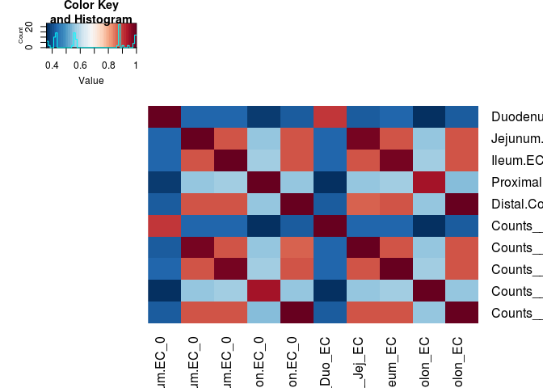
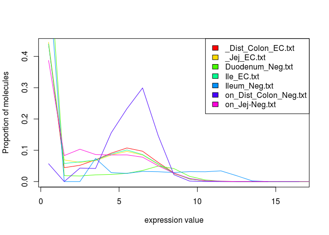
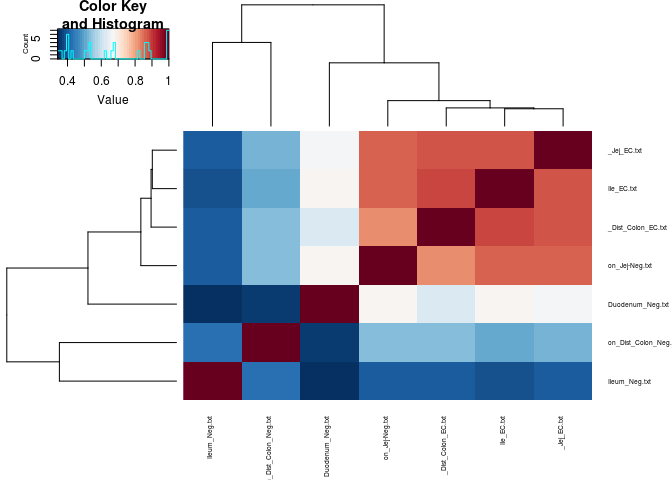
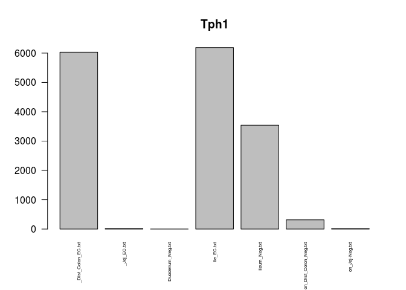
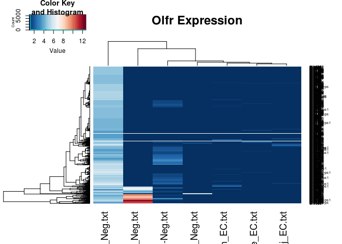

Enterochromaffin Cells
================
mtvector
March 21, 2018

A quick look at Jim's Data \# Loading Data

Following quality control, untrimmed paired-end reads were quantified using Salmon.

First I'll load the libraries and functions I'll need for the analysis (skip this part).

``` r
library(DESeq2)
library(EBSeq)
library(matrixStats)
library(biomaRt)
library(gplots)
library(clusterProfiler)
library(RColorBrewer)
library(tximport)
cols <-  colorRampPalette(rev(brewer.pal(11,"RdBu")))(50)

#see Github lengning
library(EACI)


median.normalize <- function(x){
  GetNormalizedMat(x,MedianNorm(x))
}

round.log <- function(s,base=2){
  round(log(s+1, base),digits = 1)
}

std.heatmap <- function(M,...){
  heatmap.2(M,Rowv = F,Colv = F,trace="none",col = cols,...)
}

rn.merge <- function(x,y,fill=0,simple.intersect=F){
  rn <- intersect(rownames(x),rownames(y))
  zerosx <- setdiff(rownames(x),rownames(y))
  zerosy <- setdiff(rownames(y),rownames(x))
  out <- cbind(x[rn,,drop=F],y[rn,,drop=F])
  if(simple.intersect){return(out)}
  else{
  if(length(zerosx)!=1  &length(zerosy)!=1){
    zx <- matrix(fill, nrow=length(zerosx), ncol =ncol(y), dimnames = list(zerosx,NULL))
    zy <- matrix(fill, nrow=length(zerosy), ncol =ncol(x), dimnames = list(zerosy,NULL))
    zx <- cbind(x[zerosx,],zx)
    zy <- cbind(zy,y[zerosy,])
  }else if(length(zerosx)==1){
    zx <- rep(fill, ncol(y))
    zy <- matrix(fill, nrow=length(zerosy), ncol =ncol(x), dimnames = list(zerosy,NULL))
    zx <- c(x[zerosx,],zx)
    zy <- cbind(zy,y[zerosy,])
  }else if(length(zerosy)==1){
    zx <- matrix(fill, nrow=length(zerosx), ncol =ncol(y), dimnames = list(zerosx,NULL))
    zy <- rep(fill, ncol(x))
    print(zx)
    print(zy)
    zx <- cbind(x[zerosx,],zx)
    zy <- c(zy,y[zerosy,])
  }
  out <- rbind(out,rbind(zx,zy))
  return(out)}
}

cor.compare <- function(x,y,min=0, varX=NULL ,interest.set =NULL, ...){
  d <- rn.compare(x,y)
  x <- d[[1]]
  y <- d[[2]]
  i = intersect(rownames(x), rownames(y))
  i = i[rowMaxs(x[i,],na.rm = T)>=min | rowMaxs(y[i,],na.rm = )>=min]
  if(!is.null(interest.set)){
    i = interest.set[interest.set%in%i]
  }
  if(!is.null(varX)){
    i = i[order(rowMeans(cbind(rowSds(x[i,]), rowSds(y[i,]))),decreasing = T)]
    i = i[1:ifelse(varX>length(i),length(i),varX)]
  }
  print("Num Genes:")
  print(length(i))
  return(cor(as.matrix(x[i,]),as.matrix(y[i,]), ...))
}

rn.compare <- function(x,y,fill=0){
  rn <- as.character(intersect(rownames(x),rownames(y)))
  zerosx <- setdiff(rownames(x),rownames(y))
  zerosy <- setdiff(rownames(y),rownames(x))
  zx <- matrix(fill, nrow=length(zerosx), ncol =ncol(y), dimnames = list(zerosx,NULL))
  zy <- matrix(fill, nrow=length(zerosy), ncol =ncol(x), dimnames = list(zerosy,NULL))
  nx <- rbind(x,zy)
  ny <- rbind(y,zx)
  return(list(nx[rownames(ny),,drop=F],ny[rownames(nx),,drop=F]))
}


hist.normalized <- function(x){
  nsamp <- dim(x)[2]
  h <- hist(x[,1], plot=FALSE)
  plot(h$mids, h$density, type="l", col=rainbow(nsamp)[1], main="",
       xlab="expression value", ylab="Proportion of molecules")
  for(i in 2:nsamp){
    h <- hist(x[,i], plot=FALSE)
    lines(h$mids, h$density, col=rainbow(nsamp)[i])
  }
}
```

``` r
datapath <- "~/code/IngrahamLabData/JimSalmonOutputs"
fileList <- dir(datapath)
fileList <- paste0(datapath,"/",fileList,"/","quant.sf")

dsList <- lapply(fileList,read.csv2, sep="\t",header=T,row.names=1,stringsAsFactors=F)
allRownames <- Reduce(union,lapply(dsList,rownames))

#Use Biomart to get the 
mart <- useMart(biomart = "ENSEMBL_MART_ENSEMBL", dataset = "mmusculus_gene_ensembl", host="www.ensembl.org")
rnSymbol <- getBM(attributes = c("ensembl_transcript_id_version","mgi_symbol","description"),filters = c("ensembl_transcript_id_version"),values =allRownames ,mart = mart) 
rnSymbolGenes <- rnSymbol[rnSymbol$mgi_symbol!="",]
rnSymbolGenes <- rnSymbol[rnSymbol$mgi_symbol!=""& !grepl("predicted gene", rnSymbol$description),]

txList <-  tximport(fileList,type="salmon",txOut = T)
```

    ## reading in files with read_tsv

    ## 1 2 3 4 5 6 7 8 9 10 11 12

``` r
gutMat <-  summarizeToGene(txList,rnSymbolGenes)$counts[-1,]
```

    ## removing duplicated transcript rows from tx2gene
    ## transcripts missing from tx2gene: 12967
    ## summarizing abundance
    ## summarizing counts
    ## summarizing length

``` r
colnames(gutMat) <- gsub("_L003_Rout","",lapply(strsplit(fileList,split = "/"),"[",5))

std.heatmap(cor(gutMat,method="spearman"),cexCol=.5,cexRow=.5)
```

    ## Warning in heatmap.2(M, Rowv = F, Colv = F, trace = "none", col = cols, :
    ## Discrepancy: Rowv is FALSE, while dendrogram is `both'. Omitting row
    ## dendogram.

    ## Warning in heatmap.2(M, Rowv = F, Colv = F, trace = "none", col = cols, :
    ## Discrepancy: Colv is FALSE, while dendrogram is `column'. Omitting column
    ## dendogram.



``` r
gutMatNorm <-  median.normalize(gutMat[rowMaxs(gutMat)>2,])
condits <- sapply(strsplit(colnames(gutMat),"_"),function(x)x[1])
```

``` r
barplot(colSums(gutMat),main = "Number of reads",las=3,cex.names = .6)
```


``` r
barplot(MedianNorm(gutMat),main = "Size Factors",las=3,cex.names = .6)
```


``` r
hist.normalized(log(gutMat+1,2))
legend("topright",fill = rainbow(ncol(gutMat)),col=rainbow(ncol(gutMat)),legend = colnames(gutMat))
```


``` r
barplot(colSums(gutMatNorm),main = "PostNorm Reads",las=3,cex.names = .6)
```


``` r
hist.normalized(log(gutMatNorm+1,2))
legend("topright",fill = rainbow(ncol(gutMatNorm)),col=rainbow(ncol(gutMatNorm)),legend = colnames(gutMatNorm))
```


``` r
gutMat <- gutMat[,c(-1,-3)]
gutMatNorm <-  median.normalize(gutMat[rowMaxs(gutMat)>2,])
condits <- sapply(strsplit(colnames(gutMat),"_"),function(x)x[1])
hist.normalized(log(gutMatNorm+1,2))
legend("topright",fill = rainbow(ncol(gutMatNorm)),col=rainbow(ncol(gutMatNorm)),legend = colnames(gutMatNorm))
```



``` r
barplot(colMaxs(gutMatNorm),las=2,cex.names = .5,main="Max Expression Values per Sample")
```


``` r
gutCLN <- round.log(gutMatNorm+1,2)
gutCLN <- gutCLN[rowSds(gutCLN)>1,]
svgut <- svd((gutCLN-rowMeans(gutCLN))/rowSds(gutCLN))

heatmap.2(cor(gutMatNorm,method = "spearman"),col = cols,trace="none",cexCol = .5,cexRow = .5)
```



``` r
conditNums <- sapply(condits,function(x)which(x==sort(unique(condits))))
par(mar=c(5.1, 4.1, 4.1, 9.1), xpd=TRUE)
plot(svgut$v[,1:2],col=conditNums,xlab="PC1",ylab="PC2",pch=1:3)
legend("bottomright",inset = c(-.4,0),legend = unique(names(conditNums)),col=conditNums,pch = 1:3)
```


``` r
eaciout <- list()
l <- 1
eacivector <- svgut$u[,l]
names(eacivector) <- rownames(gutCLN)
eaciout[[l]] <- eacitest(eacivector,"org.Mm.eg","SYMBOL",sets = "GO")$setscores
```

    ## Loading necessary libraries...

    ## Loaded Package org.Mm.eg.db

    ## Converting annotations to data.frames ...

    ## iteration 1 done; time  15.09 sec 
    ## iteration 2 done; time  9.55 sec 
    ## iteration 3 done; time  10.01 sec 
    ## iteration 4 done; time  10.87 sec 
    ## iteration 5 done; time  10.22 sec 
    ## iteration 6 done; time  10.02 sec 
    ## iteration 7 done; time  10.8 sec 
    ## iteration 8 done; time  11.89 sec 
    ## iteration 9 done; time  10.41 sec 
    ## iteration 10 done; time  12.19 sec

    ## Labeling output ...

    ## Loaded Package GO.db

``` r
l <- 2
eacivector <- svgut$u[,l]
names(eacivector) <- rownames(gutCLN)
eaciout[[l]] <- eacitest(eacivector,"org.Mm.eg","SYMBOL",sets = "GO")$setscores
```

    ## Loading necessary libraries...

    ## Loaded Package org.Mm.eg.db

    ## Converting annotations to data.frames ...

    ## iteration 1 done; time  6.84 sec 
    ## iteration 2 done; time  7.1 sec 
    ## iteration 3 done; time  7.54 sec 
    ## iteration 4 done; time  9.45 sec 
    ## iteration 5 done; time  8.47 sec 
    ## iteration 6 done; time  9.54 sec 
    ## iteration 7 done; time  8.7 sec 
    ## iteration 8 done; time  9.71 sec 
    ## iteration 9 done; time  11.56 sec 
    ## iteration 10 done; time  9.6 sec

    ## Labeling output ...

    ## Loaded Package GO.db

Now to print the enrichment along each of these components

``` r
#PC1 Positive
a <- eaciout[[1]][eaciout[[1]]$set.mean>0,]
print(a[1:25,])
```

    ##                                                                                                 Term
    ## GO:0048313                                                                         Golgi inheritance
    ## GO:0000028                                                          ribosomal small subunit assembly
    ## GO:0042589                                                                  zymogen granule membrane
    ## GO:1905214                                                                 regulation of RNA binding
    ## GO:0000346                                                              transcription export complex
    ## GO:0008250                                                         oligosaccharyltransferase complex
    ## GO:0051920                                                                    peroxiredoxin activity
    ## GO:1902188                                       positive regulation of viral release from host cell
    ## GO:0009133                                               nucleoside diphosphate biosynthetic process
    ## GO:0000276              mitochondrial proton-transporting ATP synthase complex, coupling factor F(o)
    ## GO:1904814                        regulation of protein localization to chromosome, telomeric region
    ## GO:0045653                                      negative regulation of megakaryocyte differentiation
    ## GO:0043162 ubiquitin-dependent protein catabolic process via the multivesicular body sorting pathway
    ## GO:0001056                                                               RNA polymerase III activity
    ## GO:1902414                                                     protein localization to cell junction
    ## GO:0036513                                                       Derlin-1 retrotranslocation complex
    ## GO:0048025                                     negative regulation of mRNA splicing, via spliceosome
    ## GO:0042788                                                                        polysomal ribosome
    ## GO:0042026                                                                         protein refolding
    ## GO:0000164                                                        protein phosphatase type 1 complex
    ## GO:0019215                                                             intermediate filament binding
    ## GO:0006896                                                                Golgi to vacuole transport
    ## GO:0042301                                                                     phosphate ion binding
    ## GO:0031489                                                                          myosin V binding
    ## GO:0044331                                                   cell-cell adhesion mediated by cadherin
    ##            Ontology    set.mean      set.sd set.size         pval
    ## GO:0048313       BP 0.008650015 0.001596332       14 0.000000e+00
    ## GO:0000028       BP 0.008170918 0.001940636       18 0.000000e+00
    ## GO:0042589       CC 0.008122700 0.001964066       13 0.000000e+00
    ## GO:1905214       BP 0.008085307 0.002226228       11 0.000000e+00
    ## GO:0000346       CC 0.007201842 0.002698546       11 8.881784e-16
    ## GO:0008250       CC 0.007074705 0.002750372        9 2.886580e-15
    ## GO:0051920       MF 0.006927537 0.002978696       10 1.065814e-14
    ## GO:1902188       BP 0.006867501 0.002412834       15 1.798561e-14
    ## GO:0009133       BP 0.006750619 0.002623720        8 4.929390e-14
    ## GO:0000276       CC 0.006713382 0.002938100       10 6.750156e-14
    ## GO:1904814       BP 0.006681652 0.002636596       12 8.837375e-14
    ## GO:0045653       BP 0.006545588 0.001589410       13 2.771117e-13
    ## GO:0043162       BP 0.006525335 0.003192407       12 3.277378e-13
    ## GO:0001056       MF 0.006468700 0.001614998       14 5.229150e-13
    ## GO:1902414       BP 0.006425024 0.003074890       11 7.476242e-13
    ## GO:0036513       CC 0.006421589 0.002926205       11 7.687184e-13
    ## GO:0048025       BP 0.006333242 0.003381633       23 1.572520e-12
    ## GO:0042788       CC 0.006234940 0.004706177       10 3.447465e-12
    ## GO:0042026       BP 0.006216119 0.003595566       18 4.001244e-12
    ## GO:0000164       CC 0.006199601 0.004149653       10 4.558354e-12
    ## GO:0019215       MF 0.006130343 0.002179466       12 7.845280e-12
    ## GO:0006896       BP 0.006047551 0.005248799       13 1.489853e-11
    ## GO:0042301       MF 0.005983801 0.004296854       11 2.427392e-11
    ## GO:0031489       MF 0.005942943 0.004717254       18 3.310330e-11
    ## GO:0044331       BP 0.005925346 0.002735549       10 3.781198e-11

``` r
#PC1 Negative
a <- eaciout[[1]][eaciout[[1]]$set.mean<0,]
print(a[1:25,])
```

    ##                                                                              Term
    ## GO:0050911 detection of chemical stimulus involved in sensory perception of smell
    ## GO:0005549                                                        odorant binding
    ## GO:0019236                                                  response to pheromone
    ## GO:0007638                                                mechanosensory behavior
    ## GO:0050907          detection of chemical stimulus involved in sensory perception
    ## GO:0005513                                               detection of calcium ion
    ## GO:0021520                       spinal cord motor neuron cell fate specification
    ## GO:0048642              negative regulation of skeletal muscle tissue development
    ## GO:0047555                            3',5'-cyclic-GMP phosphodiesterase activity
    ## GO:0004993                          G-protein coupled serotonin receptor activity
    ## GO:0060013                                                        righting reflex
    ## GO:0021859                                       pyramidal neuron differentiation
    ## GO:0000800                                                        lateral element
    ## GO:0035584          calcium-mediated signaling using intracellular calcium source
    ## GO:0007320                                                           insemination
    ## GO:1902711                                                GABA-A receptor complex
    ## GO:0045835                        negative regulation of meiotic nuclear division
    ## GO:0070166                                                  enamel mineralization
    ## GO:0043083                                                         synaptic cleft
    ## GO:0097493                     structural molecule activity conferring elasticity
    ## GO:0086012    membrane depolarization during cardiac muscle cell action potential
    ## GO:0042571                                    immunoglobulin complex, circulating
    ## GO:0032982                                                        myosin filament
    ## GO:0036156                                                       inner dynein arm
    ## GO:1903818        positive regulation of voltage-gated potassium channel activity
    ##            Ontology     set.mean      set.sd set.size         pval
    ## GO:0050911       BP -0.007488944 0.001770323       32 5.832565e-17
    ## GO:0005549       MF -0.006431093 0.001869770      250 6.615174e-13
    ## GO:0019236       BP -0.005939411 0.001793077       14 3.178455e-11
    ## GO:0007638       BP -0.005848106 0.002231202       13 6.314890e-11
    ## GO:0050907       BP -0.005821056 0.002150110      227 7.724055e-11
    ## GO:0005513       BP -0.005177831 0.002473761        8 7.142875e-09
    ## GO:0021520       BP -0.005144651 0.001748570       12 8.899296e-09
    ## GO:0048642       BP -0.004934032 0.002214245       13 3.482709e-08
    ## GO:0047555       MF -0.004608543 0.005282529       11 2.580623e-07
    ## GO:0004993       MF -0.004361956 0.002386696       23 1.080574e-06
    ## GO:0060013       BP -0.004331867 0.002514083       11 1.280451e-06
    ## GO:0021859       BP -0.004314998 0.001916702       12 1.407600e-06
    ## GO:0000800       CC -0.004196685 0.001857071       37 2.708199e-06
    ## GO:0035584       BP -0.004176265 0.002502789       14 3.026853e-06
    ## GO:0007320       BP -0.004165798 0.001785411       12 3.203843e-06
    ## GO:1902711       CC -0.004113963 0.002745628       13 4.236878e-06
    ## GO:0045835       BP -0.004026805 0.002211509       10 6.729352e-06
    ## GO:0070166       BP -0.003943605 0.003307468       12 1.037740e-05
    ## GO:0043083       CC -0.003943583 0.003866680       11 1.037858e-05
    ## GO:0097493       MF -0.003909805 0.002187460       11 1.234471e-05
    ## GO:0086012       BP -0.003882434 0.003662089       13 1.419382e-05
    ## GO:0042571       CC -0.003833892 0.002073316       14 1.814045e-05
    ## GO:0032982       CC -0.003728594 0.002113738       15 3.058931e-05
    ## GO:0036156       CC -0.003723474 0.002580057        9 3.136585e-05
    ## GO:1903818       BP -0.003626203 0.003613698       11 5.020197e-05

Interesting... Now PC2

``` r
#PC2 Positive
a <- eaciout[[2]][eaciout[[2]]$set.mean>0,]
print(a[1:25,])
```

    ##                                                                                                Term
    ## GO:0031573                                                            intra-S DNA damage checkpoint
    ## GO:0034472                                                                  snRNA 3'-end processing
    ## GO:0005351                                                          sugar:proton symporter activity
    ## GO:0005922                                                                         connexin complex
    ## GO:0045504                                                               dynein heavy chain binding
    ## GO:0072677                                                                     eosinophil migration
    ## GO:0003351                                                               epithelial cilium movement
    ## GO:0042923                                                                     neuropeptide binding
    ## GO:0043196                                                                               varicosity
    ## GO:0035641                                                          locomotory exploration behavior
    ## GO:0021516                                                           dorsal spinal cord development
    ## GO:0030992                                                        intraciliary transport particle B
    ## GO:0019373                                                                 epoxygenase P450 pathway
    ## GO:0043522                                                            leucine zipper domain binding
    ## GO:0009083                                              branched-chain amino acid catabolic process
    ## GO:0048845                                                        venous blood vessel morphogenesis
    ## GO:0005092                                                      GDP-dissociation inhibitor activity
    ## GO:0005614                                                                      interstitial matrix
    ## GO:0006957                                               complement activation, alternative pathway
    ## GO:0031683                                             G-protein beta/gamma-subunit complex binding
    ## GO:0048019                                                             receptor antagonist activity
    ## GO:0008074                                                       guanylate cyclase complex, soluble
    ## GO:0006448                                                   regulation of translational elongation
    ## GO:0010457                                                             centriole-centriole cohesion
    ## GO:0000479 endonucleolytic cleavage of tricistronic rRNA transcript (SSU-rRNA, 5.8S rRNA, LSU-rRNA)
    ##            Ontology    set.mean      set.sd set.size         pval
    ## GO:0031573       BP 0.008049437 0.002013079       14 0.000000e+00
    ## GO:0034472       BP 0.007640461 0.002601756       12 1.998401e-15
    ## GO:0005351       MF 0.007522974 0.002528065       14 5.329071e-15
    ## GO:0005922       CC 0.007490304 0.002958293       14 6.883383e-15
    ## GO:0045504       MF 0.007392213 0.002860593       13 1.532108e-14
    ## GO:0072677       BP 0.007373316 0.002597425       11 1.798561e-14
    ## GO:0003351       BP 0.007176292 0.002219549       17 8.704149e-14
    ## GO:0042923       MF 0.007129853 0.002409148       20 1.256772e-13
    ## GO:0043196       CC 0.007041008 0.001924454       11 2.517986e-13
    ## GO:0035641       BP 0.006797759 0.003389616       14 1.618261e-12
    ## GO:0021516       BP 0.006763673 0.002188432       17 2.089662e-12
    ## GO:0030992       CC 0.006748008 0.002802530       21 2.349232e-12
    ## GO:0019373       BP 0.006662436 0.002183162       26 4.432010e-12
    ## GO:0043522       MF 0.006617333 0.001921251       11 6.173950e-12
    ## GO:0009083       BP 0.006502330 0.002476902       11 1.423373e-11
    ## GO:0048845       BP 0.006463988 0.001971417       11 1.874545e-11
    ## GO:0005092       MF 0.006433179 0.002505603       12 2.336065e-11
    ## GO:0005614       CC 0.006401741 0.004249601       16 2.921285e-11
    ## GO:0006957       BP 0.006377904 0.002334970       10 3.458456e-11
    ## GO:0031683       MF 0.006375726 0.004196012       18 3.512124e-11
    ## GO:0048019       MF 0.006336945 0.002604493       10 4.615663e-11
    ## GO:0008074       CC 0.006304968 0.002599350       16 5.775047e-11
    ## GO:0006448       BP 0.006245805 0.003506386       15 8.717027e-11
    ## GO:0010457       BP 0.006077724 0.003083907       10 2.751193e-10
    ## GO:0000479       BP 0.006052482 0.001756313       12 3.261011e-10

``` r
#PC2 Negative
a <- eaciout[[2]][eaciout[[2]]$set.mean<0,]
print(a[1:25,])
```

    ##                                                                                                   Term
    ## GO:0015037                                                   peptide disulfide oxidoreductase activity
    ## GO:0034663                                                     endoplasmic reticulum chaperone complex
    ## GO:0070492                                                                     oligosaccharide binding
    ## GO:0005751                                                  mitochondrial respiratory chain complex IV
    ## GO:0033178                             proton-transporting two-sector ATPase complex, catalytic domain
    ## GO:0070006                                                              metalloaminopeptidase activity
    ## GO:0006000                                                                  fructose metabolic process
    ## GO:1990124                                                         messenger ribonucleoprotein complex
    ## GO:0031528                                                                        microvillus membrane
    ## GO:0043162   ubiquitin-dependent protein catabolic process via the multivesicular body sorting pathway
    ## GO:0099515                                                              actin filament-based transport
    ## GO:0034063                                                                     stress granule assembly
    ## GO:0034643                           establishment of mitochondrion localization, microtubule-mediated
    ## GO:0047497                                                   mitochondrion transport along microtubule
    ## GO:0015245                                                             fatty acid transporter activity
    ## GO:0036157                                                                            outer dynein arm
    ## GO:0042788                                                                          polysomal ribosome
    ## GO:0043619 regulation of transcription from RNA polymerase II promoter in response to oxidative stress
    ## GO:0046933                             proton-transporting ATP synthase activity, rotational mechanism
    ## GO:0034518                                                                     RNA cap binding complex
    ## GO:0005381                                                 iron ion transmembrane transporter activity
    ## GO:0004300                                                                enoyl-CoA hydratase activity
    ## GO:0031983                                                                               vesicle lumen
    ## GO:0006613                                               cotranslational protein targeting to membrane
    ## GO:0043220                                                                  Schmidt-Lanterman incisure
    ##            Ontology      set.mean       set.sd set.size        pval
    ## GO:0015037       MF -0.0030868419 0.0040587694       10 0.001128791
    ## GO:0034663       CC -0.0026455429 0.0017129309       10 0.005181310
    ## GO:0070492       MF -0.0024981906 0.0018206888       10 0.008249271
    ## GO:0005751       CC -0.0019832053 0.0047852331       10 0.035377477
    ## GO:0033178       CC -0.0017925301 0.0020241243       12 0.056788868
    ## GO:0070006       MF -0.0016525597 0.0011444886       15 0.078612680
    ## GO:0006000       BP -0.0015828835 0.0011298160        9 0.091786942
    ## GO:1990124       CC -0.0015233381 0.0010620858       13 0.104402231
    ## GO:0031528       CC -0.0015122394 0.0012184767       16 0.106899214
    ## GO:0043162       BP -0.0014013562 0.0012743536       12 0.134518665
    ## GO:0099515       BP -0.0013905404 0.0009392030       10 0.137484041
    ## GO:0034063       BP -0.0013892569 0.0029025684       11 0.137839271
    ## GO:0034643       BP -0.0013569437 0.0015407761       10 0.147017174
    ## GO:0047497       BP -0.0013569437 0.0015407761       10 0.147017174
    ## GO:0015245       MF -0.0011725666 0.0013458325       12 0.208520105
    ## GO:0036157       CC -0.0011664018 0.0009781748        8 0.210858373
    ## GO:0042788       CC -0.0010298818 0.0007071120       10 0.267571776
    ## GO:0043619       BP -0.0010249525 0.0027528836       10 0.269799125
    ## GO:0046933       MF -0.0009382247 0.0012120969       13 0.311072038
    ## GO:0034518       CC -0.0009374097 0.0009289872       10 0.311478660
    ## GO:0005381       MF -0.0009367741 0.0010447263        7 0.311796033
    ## GO:0004300       MF -0.0009072517 0.0027663007        8 0.326771774
    ## GO:0031983       CC -0.0008862658 0.0028811296       10 0.337696690
    ## GO:0006613       BP -0.0008806294 0.0016492348       14 0.340670449
    ## GO:0043220       CC -0.0008721698 0.0020059441       12 0.345165049

``` r
barplot(gutMatNorm["Chga",],las=2,cex.names = .5,main = "Chga")
```


``` r
barplot(gutMatNorm["Chga",grepl("GFP",colnames(gutMatNorm))],las=2,cex.names = .5,main = "Chga")
```


``` r
barplot(gutMatNorm["Lmx1a",],las=2,cex.names = .5,main = "Lmx1a")
```



``` r
barplot(gutMatNorm["Tph1",],las=2,cex.names = .5,main = "Tph1")
```


``` r
barplot(gutMatNorm["Scn1a",],las=2,cex.names = .5,main = "Scn1a")
```



``` r
heatmap.2(gutCLN[rownames(gutCLN)[grepl("Olfr",rownames(gutCLN))],],trace = "none",col = cols,main="Olfr Expression")
```


``` r
library(xCell)
bmnu <- gutMatNorm
rownames(bmnu) <- toupper(rownames(bmnu))
std.heatmap(xCell::xCellAnalysis(bmnu),cexRow=.45,cexCol=.5,main="xCell Scores")
```

    ## [1] "Num. of genes: 9611"
    ## Estimating ssGSEA scores for 489 gene sets.
    ## 
      |                                                                       
      |                                                                 |   0%Using parallel with 4 cores
    ## 
      |                                                                       
      |=====                                                            |   8%
      |                                                                       
      |===========                                                      |  17%
      |                                                                       
      |================                                                 |  25%
      |                                                                       
      |======================                                           |  33%
      |                                                                       
      |===========================                                      |  42%
      |                                                                       
      |================================                                 |  50%
      |                                                                       
      |======================================                           |  58%
      |                                                                       
      |===========================================                      |  67%
      |                                                                       
      |=================================================                |  75%
      |                                                                       
      |======================================================           |  83%
      |                                                                       
      |============================================================     |  92%
      |                                                                       
      |=================================================================| 100%

    ## Warning in heatmap.2(M, Rowv = F, Colv = F, trace = "none", col = cols, :
    ## Discrepancy: Rowv is FALSE, while dendrogram is `both'. Omitting row
    ## dendogram.

    ## Warning in heatmap.2(M, Rowv = F, Colv = F, trace = "none", col = cols, :
    ## Discrepancy: Colv is FALSE, while dendrogram is `column'. Omitting column
    ## dendogram.


``` r
std.heatmap(xCell::xCellSignifcanceBetaDist(xCell::xCellAnalysis(bmnu)),cexRow=.45,cexCol=.5,main="p Cell is not in mixture")
```

    ## [1] "Num. of genes: 9611"
    ## Estimating ssGSEA scores for 489 gene sets.
    ## 
      |                                                                       
      |                                                                 |   0%Using parallel with 4 cores
    ## 
      |                                                                       
      |=====                                                            |   8%
      |                                                                       
      |===========                                                      |  17%
      |                                                                       
      |================                                                 |  25%
      |                                                                       
      |======================                                           |  33%
      |                                                                       
      |===========================                                      |  42%
      |                                                                       
      |================================                                 |  50%
      |                                                                       
      |======================================                           |  58%
      |                                                                       
      |===========================================                      |  67%
      |                                                                       
      |=================================================                |  75%
      |                                                                       
      |======================================================           |  83%
      |                                                                       
      |============================================================     |  92%
      |                                                                       
      |=================================================================| 100%

    ## Warning in heatmap.2(M, Rowv = F, Colv = F, trace = "none", col = cols, :
    ## Discrepancy: Rowv is FALSE, while dendrogram is `both'. Omitting row
    ## dendogram.

    ## Warning in heatmap.2(M, Rowv = F, Colv = F, trace = "none", col = cols, :
    ## Discrepancy: Colv is FALSE, while dendrogram is `column'. Omitting column
    ## dendogram.


