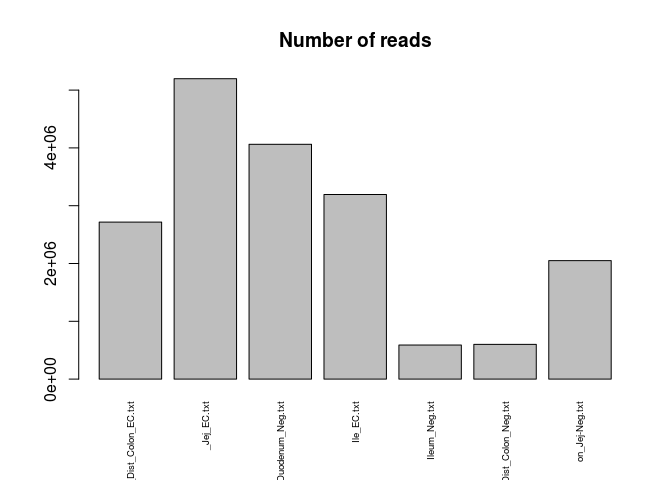
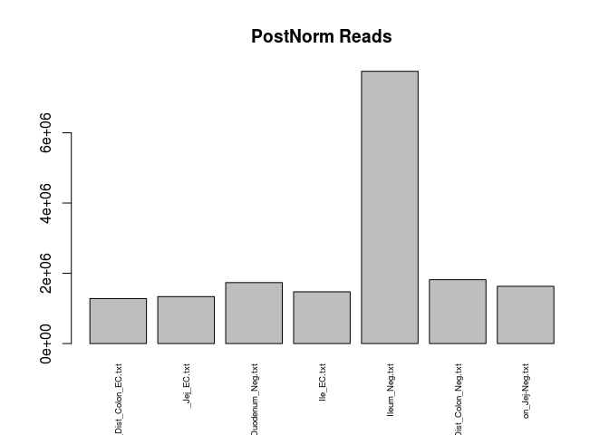

JimzGutz
================
mtvector
March 21, 2018

A quick look at Jim's Data \# Loading Data

Following quality control, untrimmed paired-end reads were quantified using Salmon.

First I'll load the libraries and functions I'll need for the analysis (skip this part).

``` r
library(DESeq2)
library(EBSeq)
library(matrixStats)
library(biomaRt)
library(gplots)
library(clusterProfiler)
library(RColorBrewer)
library(tximport)
cols <-  colorRampPalette(rev(brewer.pal(11,"RdBu")))(50)

#see Github lengning
library(EACI)


median.normalize <- function(x){
  GetNormalizedMat(x,MedianNorm(x))
}

round.log <- function(s,base=2){
  round(log(s+1, base),digits = 1)
}

std.heatmap <- function(M,...){
  heatmap.2(M,Rowv = F,Colv = F,trace="none",col = cols,...)
}

rn.merge <- function(x,y,fill=0,simple.intersect=F){
  rn <- intersect(rownames(x),rownames(y))
  zerosx <- setdiff(rownames(x),rownames(y))
  zerosy <- setdiff(rownames(y),rownames(x))
  out <- cbind(x[rn,,drop=F],y[rn,,drop=F])
  if(simple.intersect){return(out)}
  else{
  if(length(zerosx)!=1  &length(zerosy)!=1){
    zx <- matrix(fill, nrow=length(zerosx), ncol =ncol(y), dimnames = list(zerosx,NULL))
    zy <- matrix(fill, nrow=length(zerosy), ncol =ncol(x), dimnames = list(zerosy,NULL))
    zx <- cbind(x[zerosx,],zx)
    zy <- cbind(zy,y[zerosy,])
  }else if(length(zerosx)==1){
    zx <- rep(fill, ncol(y))
    zy <- matrix(fill, nrow=length(zerosy), ncol =ncol(x), dimnames = list(zerosy,NULL))
    zx <- c(x[zerosx,],zx)
    zy <- cbind(zy,y[zerosy,])
  }else if(length(zerosy)==1){
    zx <- matrix(fill, nrow=length(zerosx), ncol =ncol(y), dimnames = list(zerosx,NULL))
    zy <- rep(fill, ncol(x))
    print(zx)
    print(zy)
    zx <- cbind(x[zerosx,],zx)
    zy <- c(zy,y[zerosy,])
  }
  out <- rbind(out,rbind(zx,zy))
  return(out)}
}

cor.compare <- function(x,y,min=0, varX=NULL ,interest.set =NULL, ...){
  d <- rn.compare(x,y)
  x <- d[[1]]
  y <- d[[2]]
  i = intersect(rownames(x), rownames(y))
  i = i[rowMaxs(x[i,],na.rm = T)>=min | rowMaxs(y[i,],na.rm = )>=min]
  if(!is.null(interest.set)){
    i = interest.set[interest.set%in%i]
  }
  if(!is.null(varX)){
    i = i[order(rowMeans(cbind(rowSds(x[i,]), rowSds(y[i,]))),decreasing = T)]
    i = i[1:ifelse(varX>length(i),length(i),varX)]
  }
  print("Num Genes:")
  print(length(i))
  return(cor(as.matrix(x[i,]),as.matrix(y[i,]), ...))
}

rn.compare <- function(x,y,fill=0){
  rn <- as.character(intersect(rownames(x),rownames(y)))
  zerosx <- setdiff(rownames(x),rownames(y))
  zerosy <- setdiff(rownames(y),rownames(x))
  zx <- matrix(fill, nrow=length(zerosx), ncol =ncol(y), dimnames = list(zerosx,NULL))
  zy <- matrix(fill, nrow=length(zerosy), ncol =ncol(x), dimnames = list(zerosy,NULL))
  nx <- rbind(x,zy)
  ny <- rbind(y,zx)
  return(list(nx[rownames(ny),,drop=F],ny[rownames(nx),,drop=F]))
}
```

``` r
datapath <- "~/code/IngrahamLabData/JimSalmonOutputs"
fileList <- dir(datapath)
fileList <- paste0(datapath,"/",fileList,"/","quant.sf")

dsList <- lapply(fileList,read.csv2, sep="\t",header=T,row.names=1,stringsAsFactors=F)
allRownames <- Reduce(union,lapply(dsList,rownames))

#Use Biomart to get the 
mart <- useMart(biomart = "ENSEMBL_MART_ENSEMBL", dataset = "mmusculus_gene_ensembl", host="www.ensembl.org")
rnSymbol <- getBM(attributes = c("ensembl_transcript_id_version","mgi_symbol"),filters = c("ensembl_transcript_id_version"),values =allRownames ,mart = mart) 
rnSymbolGenes <- rnSymbol[rnSymbol$mgi_symbol!="",]

txList <-  tximport(fileList,type="salmon",txOut = T)
```

    ## reading in files with read_tsv

    ## 1 2 3 4 5 6 7 8 9 10 11 12

``` r
gutMat <-  summarizeToGene(txList,rnSymbol)$counts[-1,]
```

    ## removing duplicated transcript rows from tx2gene
    ## transcripts missing from tx2gene: 1293
    ## summarizing abundance
    ## summarizing counts
    ## summarizing length

``` r
colnames(gutMat) <- gsub("_L003_Rout","",lapply(strsplit(fileList,split = "/"),"[",5))

#There's a failed sample in there
std.heatmap(cor(gutMat,method="spearman"))
```

    ## Warning in heatmap.2(M, Rowv = F, Colv = F, trace = "none", col = cols, :
    ## Discrepancy: Rowv is FALSE, while dendrogram is `both'. Omitting row
    ## dendogram.

    ## Warning in heatmap.2(M, Rowv = F, Colv = F, trace = "none", col = cols, :
    ## Discrepancy: Colv is FALSE, while dendrogram is `column'. Omitting column
    ## dendogram.


``` r
gutMatNorm <-  median.normalize(gutMat[rowMaxs(gutMat)>2,])
condits <- sapply(strsplit(colnames(gutMat),"_"),function(x)x[1])
```

``` r
barplot(colSums(gutMat),main = "Number of reads",las=3,cex.names = .6)
```



``` r
barplot(colSums(gutMatNorm),main = "PostNorm Reads",las=3,cex.names = .6)
```


``` r
gutCLN <- round.log(gutMatNorm+1,2)
gutCLN <- gutCLN[rowSds(gutCLN)>1,]
svgut <- svd((gutCLN-rowMeans(gutCLN))/rowSds(gutCLN))

heatmap.2(cor(gutMatNorm,method = "spearman"),col = cols,trace="none",cexCol = .5,cexRow = .5)
```


``` r
conditNums <- sapply(condits,function(x)which(x==sort(unique(condits))))
par(mar=c(5.1, 4.1, 4.1, 9.1), xpd=TRUE)
plot(svgut$v[,1:2],col=conditNums,xlab="PC1",ylab="PC2",pch=1:3)
legend("bottomright",inset = c(-.4,0),legend = unique(names(conditNums)),col=conditNums,pch = 1:3)
```



``` r
eaciout <- list()
l <- 1
eacivector <- svgut$u[,l]
names(eacivector) <- rownames(gutCLN)
eaciout[[l]] <- eacitest(eacivector,"org.Mm.eg","SYMBOL",sets = "GO")$setscores
```

    ## Loading necessary libraries...

    ## Loading required package: org.Mm.eg.db

    ## Loading required package: AnnotationDbi

    ## 

    ## Loaded Package org.Mm.eg.db

    ## Converting annotations to data.frames ...

    ## iteration 1 done; time  14.13 sec 
    ## iteration 2 done; time  9.06 sec 
    ## iteration 3 done; time  10 sec 
    ## iteration 4 done; time  9.59 sec 
    ## iteration 5 done; time  10.45 sec 
    ## iteration 6 done; time  10.56 sec 
    ## iteration 7 done; time  10.81 sec 
    ## iteration 8 done; time  11.84 sec 
    ## iteration 9 done; time  9.98 sec 
    ## iteration 10 done; time  9.77 sec

    ## Labeling output ...

    ## Loading required package: GO.db

    ## Loaded Package GO.db

``` r
l <- 2
eacivector <- svgut$u[,l]
names(eacivector) <- rownames(gutCLN)
eaciout[[l]] <- eacitest(eacivector,"org.Mm.eg","SYMBOL",sets = "GO")$setscores
```

    ## Loading necessary libraries...

    ## Loaded Package org.Mm.eg.db

    ## Converting annotations to data.frames ...

    ## iteration 1 done; time  8.26 sec 
    ## iteration 2 done; time  11.79 sec 
    ## iteration 3 done; time  9.54 sec 
    ## iteration 4 done; time  9.75 sec 
    ## iteration 5 done; time  10.57 sec 
    ## iteration 6 done; time  10.5 sec 
    ## iteration 7 done; time  10.15 sec 
    ## iteration 8 done; time  9.65 sec 
    ## iteration 9 done; time  9.69 sec 
    ## iteration 10 done; time  10.05 sec

    ## Labeling output ...

    ## Loaded Package GO.db

Now to print the enrichment along each of these components

``` r
#PC1 Positive
a <- eaciout[[1]][eaciout[[1]]$set.mean>0,]
print(a[1:25,])
```

    ##                                                                                                 Term
    ## GO:0048313                                                                         Golgi inheritance
    ## GO:0000028                                                          ribosomal small subunit assembly
    ## GO:1905214                                                                 regulation of RNA binding
    ## GO:0042589                                                                  zymogen granule membrane
    ## GO:0000346                                                              transcription export complex
    ## GO:0008250                                                         oligosaccharyltransferase complex
    ## GO:0051920                                                                    peroxiredoxin activity
    ## GO:0044794                                              positive regulation by host of viral process
    ## GO:0009133                                               nucleoside diphosphate biosynthetic process
    ## GO:0000276              mitochondrial proton-transporting ATP synthase complex, coupling factor F(o)
    ## GO:1904814                        regulation of protein localization to chromosome, telomeric region
    ## GO:0045653                                      negative regulation of megakaryocyte differentiation
    ## GO:0001056                                                               RNA polymerase III activity
    ## GO:0043162 ubiquitin-dependent protein catabolic process via the multivesicular body sorting pathway
    ## GO:0036513                                                       Derlin-1 retrotranslocation complex
    ## GO:1902414                                                     protein localization to cell junction
    ## GO:0048025                                     negative regulation of mRNA splicing, via spliceosome
    ## GO:0045351                                                    type I interferon biosynthetic process
    ## GO:0042026                                                                         protein refolding
    ## GO:0019215                                                             intermediate filament binding
    ## GO:0042788                                                                        polysomal ribosome
    ## GO:0000164                                                        protein phosphatase type 1 complex
    ## GO:0006896                                                                Golgi to vacuole transport
    ## GO:0042301                                                                     phosphate ion binding
    ## GO:0004303                                                  estradiol 17-beta-dehydrogenase activity
    ##            Ontology    set.mean      set.sd set.size         pval
    ## GO:0048313       BP 0.008548244 0.001715923       14 0.000000e+00
    ## GO:0000028       BP 0.008321756 0.001933831       18 0.000000e+00
    ## GO:1905214       BP 0.008206651 0.002252132       11 0.000000e+00
    ## GO:0042589       CC 0.008165669 0.002034746       13 0.000000e+00
    ## GO:0000346       CC 0.007341036 0.002738055       11 8.881784e-16
    ## GO:0008250       CC 0.007152830 0.002781368        9 4.218847e-15
    ## GO:0051920       MF 0.006976960 0.003028346       10 1.953993e-14
    ## GO:0044794       BP 0.006858304 0.001975584       11 5.351275e-14
    ## GO:0009133       BP 0.006826034 0.002668688        8 7.016610e-14
    ## GO:0000276       CC 0.006782376 0.002970193       10 1.008083e-13
    ## GO:1904814       BP 0.006767063 0.002652704       12 1.145750e-13
    ## GO:0045653       BP 0.006661507 0.001608987       13 2.731149e-13
    ## GO:0001056       MF 0.006647881 0.001633267       14 3.050893e-13
    ## GO:0043162       BP 0.006570624 0.003274295       12 5.708767e-13
    ## GO:0036513       CC 0.006535732 0.002982295       11 7.556178e-13
    ## GO:1902414       BP 0.006509478 0.003055135       11 9.323653e-13
    ## GO:0048025       BP 0.006471980 0.003432121       23 1.256772e-12
    ## GO:0045351       BP 0.006360439 0.002313089       10 3.025802e-12
    ## GO:0042026       BP 0.006298203 0.003651096       18 4.908740e-12
    ## GO:0019215       MF 0.006274959 0.002212127       12 5.873968e-12
    ## GO:0042788       CC 0.006265067 0.004734981       10 6.339151e-12
    ## GO:0000164       CC 0.006263739 0.004190289       10 6.404210e-12
    ## GO:0006896       BP 0.006131629 0.005315433       13 1.752110e-11
    ## GO:0042301       MF 0.006093991 0.004309813       11 2.325162e-11
    ## GO:0004303       MF 0.006069689 0.001683361       10 2.788769e-11

``` r
#PC1 Negative
a <- eaciout[[1]][eaciout[[1]]$set.mean<0,]
print(a[1:25,])
```

    ##                                                                              Term
    ## GO:0050911 detection of chemical stimulus involved in sensory perception of smell
    ## GO:0005549                                                        odorant binding
    ## GO:0050907          detection of chemical stimulus involved in sensory perception
    ## GO:0021520                       spinal cord motor neuron cell fate specification
    ## GO:0007638                                                mechanosensory behavior
    ## GO:0060013                                                        righting reflex
    ## GO:0005513                                               detection of calcium ion
    ## GO:0048642              negative regulation of skeletal muscle tissue development
    ## GO:0004993                          G-protein coupled serotonin receptor activity
    ## GO:0047555                            3',5'-cyclic-GMP phosphodiesterase activity
    ## GO:1902711                                                GABA-A receptor complex
    ## GO:0021859                                       pyramidal neuron differentiation
    ## GO:0035584          calcium-mediated signaling using intracellular calcium source
    ## GO:0021794                                                   thalamus development
    ## GO:0070166                                                  enamel mineralization
    ## GO:0097493                     structural molecule activity conferring elasticity
    ## GO:0043083                                                         synaptic cleft
    ## GO:0086012    membrane depolarization during cardiac muscle cell action potential
    ## GO:0036156                                                       inner dynein arm
    ## GO:0032982                                                        myosin filament
    ## GO:0045836                        positive regulation of meiotic nuclear division
    ## GO:0042571                                    immunoglobulin complex, circulating
    ## GO:0004181                                       metallocarboxypeptidase activity
    ## GO:0001846                                                        opsonin binding
    ## GO:0032196                                                          transposition
    ##            Ontology     set.mean      set.sd set.size         pval
    ## GO:0050911       BP -0.007438283 0.001861624       31 3.018265e-16
    ## GO:0005549       MF -0.006671301 0.001814731      242 2.292040e-13
    ## GO:0050907       BP -0.005963878 0.002170380      216 5.605394e-11
    ## GO:0021520       BP -0.005837497 0.001594298       11 1.406835e-10
    ## GO:0007638       BP -0.005225225 0.002390733       13 9.303634e-09
    ## GO:0060013       BP -0.005131391 0.002529558       11 1.701071e-08
    ## GO:0005513       BP -0.005096729 0.002468942        8 2.120292e-08
    ## GO:0048642       BP -0.004835280 0.002388822       12 1.067433e-07
    ## GO:0004993       MF -0.004676278 0.002384419       21 2.743149e-07
    ## GO:0047555       MF -0.004625304 0.005702902       11 3.689307e-07
    ## GO:1902711       CC -0.004333683 0.002626253       12 1.896348e-06
    ## GO:0021859       BP -0.004294939 0.001972375       12 2.339599e-06
    ## GO:0035584       BP -0.004279837 0.002605522       14 2.538013e-06
    ## GO:0021794       BP -0.004039632 0.002349038       10 8.940041e-06
    ## GO:0070166       BP -0.003932534 0.003337904       12 1.533915e-05
    ## GO:0097493       MF -0.003885035 0.002176252       11 1.940636e-05
    ## GO:0043083       CC -0.003869607 0.003928638       11 2.093522e-05
    ## GO:0086012       BP -0.003847995 0.003676812       13 2.327078e-05
    ## GO:0036156       CC -0.003659191 0.002578355        9 5.729870e-05
    ## GO:0032982       CC -0.003647861 0.002095811       15 6.040337e-05
    ## GO:0045836       BP -0.003558962 0.002229100       12 9.091890e-05
    ## GO:0042571       CC -0.003485614 0.002199922       12 1.265362e-04
    ## GO:0004181       MF -0.003445749 0.002819526       19 1.510494e-04
    ## GO:0001846       MF -0.003442887 0.002477397       11 1.529714e-04
    ## GO:0032196       BP -0.003437957 0.005890540       11 1.563362e-04

Interesting... Now PC2

``` r
#PC2 Positive
a <- eaciout[[2]][eaciout[[2]]$set.mean>0,]
print(a[1:25,])
```

    ##                                                                                                Term
    ## GO:0031573                                                            intra-S DNA damage checkpoint
    ## GO:0034472                                                                  snRNA 3'-end processing
    ## GO:0003351                                                               epithelial cilium movement
    ## GO:0005351                                                          sugar:proton symporter activity
    ## GO:0072677                                                                     eosinophil migration
    ## GO:0005922                                                                         connexin complex
    ## GO:0043196                                                                               varicosity
    ## GO:0048845                                                        venous blood vessel morphogenesis
    ## GO:0045504                                                               dynein heavy chain binding
    ## GO:0030992                                                        intraciliary transport particle B
    ## GO:0043522                                                            leucine zipper domain binding
    ## GO:0005149                                                           interleukin-1 receptor binding
    ## GO:0006448                                                   regulation of translational elongation
    ## GO:0005614                                                                      interstitial matrix
    ## GO:0021516                                                           dorsal spinal cord development
    ## GO:0009083                                              branched-chain amino acid catabolic process
    ## GO:0019373                                                                 epoxygenase P450 pathway
    ## GO:0005092                                                      GDP-dissociation inhibitor activity
    ## GO:0042923                                                                     neuropeptide binding
    ## GO:0008074                                                       guanylate cyclase complex, soluble
    ## GO:0035641                                                          locomotory exploration behavior
    ## GO:0043252                                               sodium-independent organic anion transport
    ## GO:0000479 endonucleolytic cleavage of tricistronic rRNA transcript (SSU-rRNA, 5.8S rRNA, LSU-rRNA)
    ## GO:0010457                                                             centriole-centriole cohesion
    ## GO:0031683                                             G-protein beta/gamma-subunit complex binding
    ##            Ontology    set.mean      set.sd set.size         pval
    ## GO:0031573       BP 0.007976900 0.001969222       14 2.220446e-16
    ## GO:0034472       BP 0.007811050 0.002500110       12 4.440892e-16
    ## GO:0003351       BP 0.007766454 0.002117209       16 8.881784e-16
    ## GO:0005351       MF 0.007614838 0.002491734       14 2.886580e-15
    ## GO:0072677       BP 0.007423882 0.002621973       11 1.354472e-14
    ## GO:0005922       CC 0.007381116 0.002806560       13 1.931788e-14
    ## GO:0043196       CC 0.007200610 0.001970112       11 8.149037e-14
    ## GO:0048845       BP 0.006970944 0.002004059       11 4.882761e-13
    ## GO:0045504       MF 0.006913303 0.002884883       12 7.585044e-13
    ## GO:0030992       CC 0.006772419 0.002824854       21 2.191802e-12
    ## GO:0043522       MF 0.006761032 0.001886854       11 2.385869e-12
    ## GO:0005149       MF 0.006754797 0.002037722       14 2.499112e-12
    ## GO:0006448       BP 0.006747833 0.002431532       15 2.631895e-12
    ## GO:0005614       CC 0.006747612 0.004434365       15 2.636336e-12
    ## GO:0021516       BP 0.006706747 0.002311885       15 3.568479e-12
    ## GO:0009083       BP 0.006702853 0.002527604       11 3.672618e-12
    ## GO:0019373       BP 0.006657218 0.002173359       24 5.138334e-12
    ## GO:0005092       MF 0.006488832 0.002523847       12 1.740386e-11
    ## GO:0042923       MF 0.006438465 0.002087524       19 2.492162e-11
    ## GO:0008074       CC 0.006420866 0.002666907       16 2.823475e-11
    ## GO:0035641       BP 0.006391669 0.003905097       12 3.470579e-11
    ## GO:0043252       BP 0.006287457 0.002297238       27 7.195533e-11
    ## GO:0000479       BP 0.006210112 0.001789928       12 1.227003e-10
    ## GO:0010457       BP 0.006196653 0.003060419       10 1.345535e-10
    ## GO:0031683       MF 0.006172707 0.005126605       18 1.584706e-10

``` r
#PC2 Negative
a <- eaciout[[2]][eaciout[[2]]$set.mean<0,]
print(a[1:25,])
```

    ##                                                                                                   Term
    ## GO:0051654                                                 establishment of mitochondrion localization
    ## GO:0015037                                                   peptide disulfide oxidoreductase activity
    ## GO:0034663                                                     endoplasmic reticulum chaperone complex
    ## GO:0070492                                                                     oligosaccharide binding
    ## GO:0005751                                                  mitochondrial respiratory chain complex IV
    ## GO:0033178                             proton-transporting two-sector ATPase complex, catalytic domain
    ## GO:0006000                                                                  fructose metabolic process
    ## GO:0070006                                                              metalloaminopeptidase activity
    ## GO:1990124                                                         messenger ribonucleoprotein complex
    ## GO:0043162   ubiquitin-dependent protein catabolic process via the multivesicular body sorting pathway
    ## GO:0031528                                                                        microvillus membrane
    ## GO:0008250                                                           oligosaccharyltransferase complex
    ## GO:0090599                                                                  alpha-glucosidase activity
    ## GO:0034063                                                                     stress granule assembly
    ## GO:0042788                                                                          polysomal ribosome
    ## GO:0009650                                                                               UV protection
    ## GO:0046933                             proton-transporting ATP synthase activity, rotational mechanism
    ## GO:0031983                                                                               vesicle lumen
    ## GO:0005381                                                 iron ion transmembrane transporter activity
    ## GO:0004300                                                                enoyl-CoA hydratase activity
    ## GO:0015245                                                             fatty acid transporter activity
    ## GO:0043619 regulation of transcription from RNA polymerase II promoter in response to oxidative stress
    ## GO:0071360                                                        cellular response to exogenous dsRNA
    ## GO:0010818                                                                           T cell chemotaxis
    ## GO:0006103                                                            2-oxoglutarate metabolic process
    ##            Ontology      set.mean       set.sd set.size         pval
    ## GO:0051654       BP -0.0034098806 0.0016037939       11 0.0003369358
    ## GO:0015037       MF -0.0034038271 0.0041172461       10 0.0003451698
    ## GO:0034663       CC -0.0027526073 0.0017100526       10 0.0037264607
    ## GO:0070492       MF -0.0025534161 0.0019559106       10 0.0070825331
    ## GO:0005751       CC -0.0021709647 0.0050076018       10 0.0217593792
    ## GO:0033178       CC -0.0019301074 0.0020680209       12 0.0409888167
    ## GO:0006000       BP -0.0017277649 0.0011946316        9 0.0668227055
    ## GO:0070006       MF -0.0017126068 0.0011290388       15 0.0692056964
    ## GO:1990124       CC -0.0016221834 0.0011295830       13 0.0849099982
    ## GO:0043162       BP -0.0016097970 0.0013482736       12 0.0872698602
    ## GO:0031528       CC -0.0015785298 0.0012100961       16 0.0934627737
    ## GO:0008250       CC -0.0015615669 0.0018983052        9 0.0969672517
    ## GO:0090599       MF -0.0014703289 0.0012446751        6 0.1176542718
    ## GO:0034063       BP -0.0014568103 0.0031197605       11 0.1209943174
    ## GO:0042788       CC -0.0011501266 0.0007273710       10 0.2182691014
    ## GO:0009650       BP -0.0011359362 0.0009980335        8 0.2238471680
    ## GO:0046933       MF -0.0010990370 0.0012551405       13 0.2388268685
    ## GO:0031983       CC -0.0010474867 0.0027508614       10 0.2609177288
    ## GO:0005381       MF -0.0010378118 0.0010880037        7 0.2652163999
    ## GO:0004300       MF -0.0010079566 0.0027277549        8 0.2787877790
    ## GO:0015245       MF -0.0010027593 0.0013083780       11 0.2811977786
    ## GO:0043619       BP -0.0009878515 0.0028207227       10 0.2881888691
    ## GO:0071360       BP -0.0009004918 0.0011880312       12 0.3314978357
    ## GO:0010818       BP -0.0008560310 0.0021693151       11 0.3550767867
    ## GO:0006103       BP -0.0008468127 0.0018417187       16 0.3600948897

``` r
library(xCell)
bmnu <- gutMatNorm
rownames(bmnu) <- toupper(rownames(bmnu))
std.heatmap(xCell::xCellAnalysis(bmnu))
```

    ## [1] "Num. of genes: 9611"
    ## Estimating ssGSEA scores for 489 gene sets.
    ## 
      |                                                                       
      |                                                                 |   0%Using parallel with 4 cores
    ## 
      |                                                                       
      |=====                                                            |   8%
      |                                                                       
      |===========                                                      |  17%
      |                                                                       
      |================                                                 |  25%
      |                                                                       
      |======================                                           |  33%
      |                                                                       
      |===========================                                      |  42%
      |                                                                       
      |================================                                 |  50%
      |                                                                       
      |======================================                           |  58%
      |                                                                       
      |===========================================                      |  67%
      |                                                                       
      |=================================================                |  75%
      |                                                                       
      |======================================================           |  83%
      |                                                                       
      |============================================================     |  92%
      |                                                                       
      |=================================================================| 100%

    ## Warning in heatmap.2(M, Rowv = F, Colv = F, trace = "none", col = cols, :
    ## Discrepancy: Rowv is FALSE, while dendrogram is `both'. Omitting row
    ## dendogram.

    ## Warning in heatmap.2(M, Rowv = F, Colv = F, trace = "none", col = cols, :
    ## Discrepancy: Colv is FALSE, while dendrogram is `column'. Omitting column
    ## dendogram.


