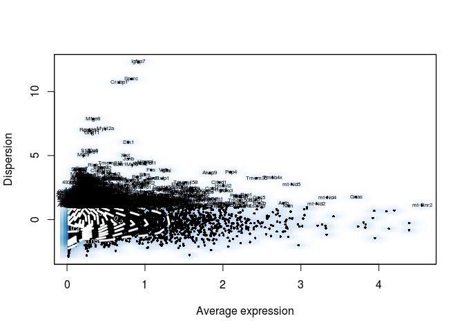
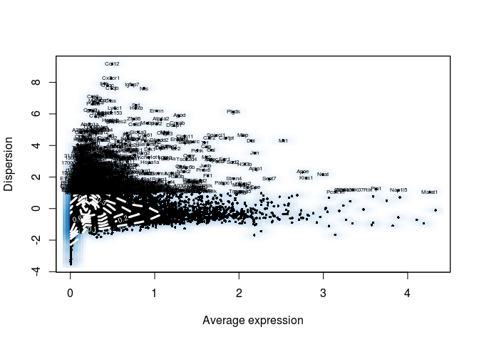
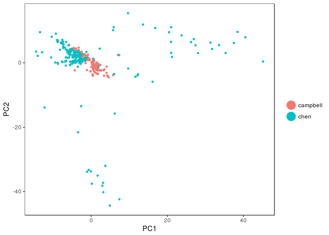
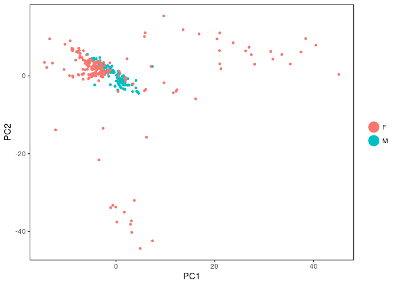
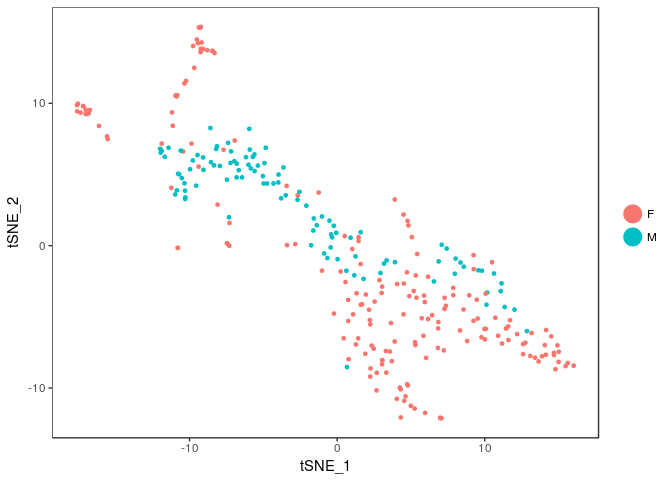
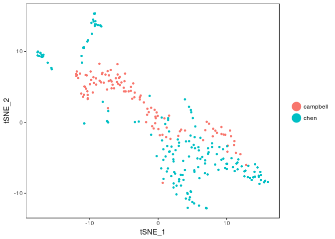
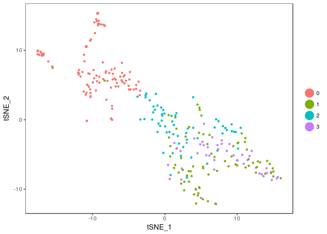

Kiss+SingleCell
================
mtvector
March 20, 2018

### For the papers and original data data, look here <https://hemberg-lab.github.io/scRNA.seq.datasets/mouse/brain/>

load libraries(skip)

``` r
library(dplyr)
library(rmarkdown)
library(Seurat)
library(RColorBrewer)
cols <-  colorRampPalette(rev(brewer.pal(11,"RdBu")))(50)
```

load the campbell data (skip)

``` r
### DATA
#d <- read.table("~/code/IngrahamLabData/campbellKiss1cells.txt",nrows = 200000)
#d <- d[,d["Kiss1",]>0]
#d <- d[,order(colnames(d))]
#write.table(d,"~/code/IngrahamLabData/campbellkissonly.txt",quote = F,sep = "\t")
d <- read.table("~/code/IngrahamLabData/campbellkissonly.txt")
write.table(cbind(rowSums=rowSums(d),d),"~/code/IngrahamLabData/campbellkissonlyExpression.txt",quote = F,sep = "\t",row.names = T)

### ANNOTATIONS
ann <- read.table("~/code/IngrahamLabData/GSE93374_cell_metadata.txt", sep = "\t", header = T)
ann <- ann[order(ann[,1]), ]
rownames(ann) <- ann[,1]
ann <- ann[,2:ncol(ann)]
colnames(ann)[9] <- "cell_type1"
ann <- ann[colnames(d),]
ann <- cbind(ann,batch=as.factor(rep("campbell",nrow(ann))))

#file.remove("./GSE93374_Merged_all_020816_DGE.txt")
#file.remove("./GSE93374_cell_metadata.txt")

library(Seurat)
campbell<-Seurat::CreateSeuratObject(d, min.cells=3,min.genes=10,project="ORG",meta.data = ann)
campbell<- NormalizeData(campbell)
campbell <- ScaleData(campbell)
```

    ## [1] "Scaling data matrix"
    ## 
      |                                                                       
      |                                                                 |   0%
      |                                                                       
      |=================================================================| 100%

``` r
campbell <- FindVariableGenes(campbell)
```



``` r
campbell <- RunPCA(campbell)
```

    ## [1] "PC1"
    ##  [1] "mt-Nd5"   "Syt5"     "Saraf"    "Tmem35"   "Prlr"     "Pdyn"    
    ##  [7] "Rrp1"     "Map2"     "Dner"     "Ctsl"     "Rasgrf1"  "Nnat"    
    ## [13] "Atp1a3"   "Mtdh"     "Ccdc47"   "Gpm6a"    "Snap47"   "Rab3c"   
    ## [19] "Usp29"    "Gabbr1"   "Mapt"     "Cited1"   "Cd47"     "Nell1"   
    ## [25] "Rpl37"    "Dtd1"     "Gnl3l"    "Cacna2d1" "Gria1"    "Arxes2"  
    ## [1] ""
    ##  [1] "Stat2"    "Myl9"     "Igfbp7"   "Mfge8"    "Spata6"   "Cald1"   
    ##  [7] "Rasl11a"  "Anxa2"    "Cd36"     "Tdp1"     "Asap2"    "Vcl"     
    ## [13] "Sparc"    "Hdac10"   "Sphk2"    "Zfp935"   "Fam53b"   "Bloc1s1" 
    ## [19] "Gng11"    "Emp3"     "Slc25a45" "Sdc4"     "Slc29a1"  "Sncg"    
    ## [25] "Prss23"   "Timp3"    "Cd9"      "Fxyd1"    "Rasgrp2"  "Lamb1"   
    ## [1] ""
    ## [1] ""
    ## [1] "PC2"
    ##  [1] "mt-Nd4"        "Actb"          "Cited1"        "Tdrp"         
    ##  [5] "mt-Nd2"        "Lzic"          "Rplp1"         "Chodl"        
    ##  [9] "Vps37b"        "Lrrc8d"        "Zdhhc14"       "Gnas"         
    ## [13] "Eef1a1"        "Inha"          "Ccdc64"        "Ostc"         
    ## [17] "Tgfbr3"        "Slc35g1"       "B230398E01Rik" "Cox8a"        
    ## [21] "Kcnv1"         "Gm14443"       "Nnat"          "Tmsb4x"       
    ## [25] "Plxnb1"        "Ubac1"         "Gas2l1"        "Fgfbp3"       
    ## [29] "Afap1"         "Thoc6"        
    ## [1] ""
    ##  [1] "Nrg3"          "Slc6a8"        "Gm10800"       "Dcdc2b"       
    ##  [5] "Ccdc176"       "Epb4.1l5"      "Pcolce2"       "Zfp248"       
    ##  [9] "Wdr78"         "Rpe"           "Fam122b"       "Nupr1l"       
    ## [13] "Nr1h2"         "Krba1"         "Trim62"        "Pigh"         
    ## [17] "Endov"         "Herc4"         "Vhl"           "Tns3"         
    ## [21] "4930481A15Rik" "Cep68"         "Usp31"         "Polr3f"       
    ## [25] "Lrch1"         "Mmgt2"         "Med15"         "Rab23"        
    ## [29] "Rpa1"          "Maneal"       
    ## [1] ""
    ## [1] ""
    ## [1] "PC3"
    ##  [1] "Pex11a"       "Gm15446"      "RP23-327M1.1" "Fam78b"      
    ##  [5] "Klhl3"        "Gm12258"      "Gm37305"      "Hist1h1e"    
    ##  [9] "Rpp25"        "Eif2ak3"      "Yes1"         "Polr1e"      
    ## [13] "Wrn"          "Lekr1"        "Rcor3"        "Gm15800"     
    ## [17] "Far2"         "Tapbp"        "Nnt"          "Tex261"      
    ## [21] "Tsix"         "Grm8"         "Riok1"        "Osbpl3"      
    ## [25] "Setd4"        "mt-Rnr2"      "Gm37607"      "Lzic"        
    ## [29] "Ccdc94"       "Xkr8"        
    ## [1] ""
    ##  [1] "Gm15893"       "Ralgapa2"      "Gmip"          "Slc2a6"       
    ##  [5] "Atxn1l"        "Ctss"          "Mthfr"         "Cdr2"         
    ##  [9] "Entpd3"        "Rft1"          "Gcfc2"         "Alg13"        
    ## [13] "Cep57l1"       "Zfp53"         "Invs"          "Myo1b"        
    ## [17] "Lsm5"          "Hip1"          "Zfp442"        "Rapgef1"      
    ## [21] "Map4k3"        "Pvr"           "Utrn"          "1110008L16Rik"
    ## [25] "Tsacc"         "Htr5a"         "Cep131"        "Gm26881"      
    ## [29] "Thnsl1"        "Atg10"        
    ## [1] ""
    ## [1] ""
    ## [1] "PC4"
    ##  [1] "Gm15446"      "RP23-327M1.1" "Gm12258"      "Lekr1"       
    ##  [5] "Polr1e"       "Fam78b"       "Grm8"         "Klhl3"       
    ##  [9] "Hist1h1e"     "Yes1"         "Gm37305"      "Tsix"        
    ## [13] "Far2"         "Eif2ak3"      "Dmwd"         "Osbpl3"      
    ## [17] "Lck"          "Setd4"        "Gm37607"      "Usp40"       
    ## [21] "Pnpla2"       "Slc38a3"      "Dolpp1"       "Ccdc94"      
    ## [25] "Per3"         "Xkr8"         "Speg"         "Mmgt1"       
    ## [29] "Nploc4"       "Pex11a"      
    ## [1] ""
    ##  [1] "mt-Nd5"     "Syt5"       "Tmem50a"    "Rplp1"      "Cited1"    
    ##  [6] "Rrp1"       "Sltm"       "Pdia3"      "Kcnk2"      "Hs6st2"    
    ## [11] "Pcsk1"      "Xbp1"       "Htatsf1"    "Saraf"      "Ostc"      
    ## [16] "Ndufv2"     "Vgf"        "Arxes2"     "Dld"        "Txndc15"   
    ## [21] "Rp9"        "Rps7"       "Gadd45gip1" "Pank1"      "Map2"      
    ## [26] "mt-Nd4"     "Eef1a1"     "Bdnf"       "Clptm1l"    "Mtdh"      
    ## [1] ""
    ## [1] ""
    ## [1] "PC5"
    ##  [1] "2810455O05Rik" "Map2k3"        "Gapdh"         "Mcc"          
    ##  [5] "Dmpk"          "Psat1"         "Gm37676"       "Scaf4"        
    ##  [9] "Fam13a"        "Tbc1d14"       "Lyrm7"         "Rfx5"         
    ## [13] "Cfap74"        "Grk4"          "Lrrc57"        "Cep83os"      
    ## [17] "Exosc2"        "Srcap"         "Rnasel"        "Gpr153"       
    ## [21] "Unkl"          "Gm17396"       "Rai2"          "B230354K17Rik"
    ## [25] "F3"            "Csrp2"         "Fntb"          "Map4k2"       
    ## [29] "Csgalnact1"    "Zfp383"       
    ## [1] ""
    ##  [1] "Gnas"          "mt-Nd2"        "Ankrd35"       "Mms19"        
    ##  [5] "2810468N07Rik" "3110009E18Rik" "Dzip1l"        "L3hypdh"      
    ##  [9] "Nacc2"         "Zfp346"        "Kcnf1"         "Ccng1"        
    ## [13] "Lpcat2"        "Pde9a"         "Ccdc47"        "Pdia3"        
    ## [17] "Samd10"        "Lgi2"          "2310003H01Rik" "Six6"         
    ## [21] "2010320M18Rik" "Mettl20"       "Dedd"          "Zfp719"       
    ## [25] "Shank2"        "Cptp"          "Gltscr1l"      "Klf10"        
    ## [29] "Trim59"        "Cyp7b1"       
    ## [1] ""
    ## [1] ""

``` r
campbell <- RunTSNE(campbell)

write.table(t(sort(rowMeans(campbell@scale.data),decreasing = T)),file = "~/Desktop/campbellMeanExpression.txt",sep = "\n")
```

Since, there are a number of unassigned sex cells and I know of male- and female-specific transcripts, I'll predict a sex for the unsexed celld (gain more than 10 female cells, error rate is 1.02% so the predictions should be). This gives us better power to pick markers for the male compared to female cells.

``` r
campbell <- SetAllIdent(campbell,id = "X4.sex")
sexmarkers <- FindAllMarkers(campbell)

TSNEPlot(campbell,group.by = "X4.sex")
```


``` r
top10 <- sexmarkers %>% group_by(cluster) %>% top_n(15, avg_logFC)

campbell <- SetAllIdent(campbell,id = "X4.sex")
DoHeatmap(
    object = campbell, 
    genes.use = top10$gene, 
    slim.col.label = TRUE, 
    remove.key = F
)
```


``` r
library(biomaRt)
mart <- useMart(biomart = "ENSEMBL_MART_ENSEMBL", dataset = "mmusculus_gene_ensembl", host="www.ensembl.org")
rnSymbol <- getBM(attributes = c("mgi_symbol","chromosome_name"),filters = c("mgi_symbol"),values =rownames(campbell@raw.data) ,mart = mart) 

rnSymbol[rnSymbol$chromosome_name=="Y",]
```

    ##      mgi_symbol chromosome_name
    ## 2369      Ddx3y               Y
    ## 2787    Eif2s3y               Y
    ## 3706    Gm29650               Y
    ## 4605      Kdm5d               Y
    ## 9815        Uty               Y

``` r
FeaturePlot(campbell,c("Ddx3y","Eif2s3y","Uty","Xist","Kdm5d"))
```


``` r
predMatO <- data.frame(sex=campbell@meta.data$X4.sex,t(campbell@raw.data[c("Ddx3y","Eif2s3y","Uty","Kdm5d","Xist"),]))
predMat <- predMatO[predMatO$sex!="U",]
predMat$sex <- droplevels(predMat$sex) 

library(randomForest)
```

    ## randomForest 4.6-14

    ## Type rfNews() to see new features/changes/bug fixes.

    ## 
    ## Attaching package: 'randomForest'

    ## The following object is masked from 'package:ggplot2':
    ## 
    ##     margin

    ## The following object is masked from 'package:dplyr':
    ## 
    ##     combine

``` r
rf <- randomForest(x=predMat[,-1],y=predMat[,1],importance = T)
campbell@meta.data <- cbind(campbell@meta.data,pred.sex=predict(rf,predMatO[,-1]))

campbell <- SetAllIdent(campbell,id = "pred.sex")
pred.sexmarkers <- FindAllMarkers(campbell)
write.table(pred.sexmarkers,"~/Desktop/Kiss1predictedsexmarkers.txt",quote = F,sep = "\t")

TSNEPlot(campbell,group.by = "pred.sex")
```


``` r
top10 <- pred.sexmarkers %>% group_by(cluster) %>% top_n(15, avg_logFC)

campbell <- SetAllIdent(campbell,id = "pred.sex")
DoHeatmap(
    object = campbell, 
    genes.use = top10$gene, 
    slim.col.label = TRUE, 
    remove.key = F
)
```


Load the Chen data (skip)

``` r
#system("~/code/other/scRNA.seq.datasets/bash/chen.sh")
### DATA
#d <- read.table("~/code/IngrahamLabData/chenKiss1cells.txt",nrows = 11000)
#d <- d[,d["Kiss1",]>0]
#d <- fread("~/code/other/scRNA.seq.datasets/")
#d <- d[,order(colnames(d))]

#load("~/code/IngrahamLab/cache/chenSet_beb7c09daca1fae5a4e8f93e732fdb64.RData")
#d <- d[,d["Kiss1",]>0]
#write.table(d,"~/code/IngrahamLabData/chenkissonly.txt",quote = F,sep = "\t")
d <- read.table("~/code/IngrahamLabData/chenkissonly.txt")
write.table(cbind(rowSums=rowSums(d),d),"~/code/IngrahamLabData/chenkissonlyExpression.txt",quote = F,sep = "\t")

### ANNOTATIONS
ann <- read.csv("~/code/IngrahamLabData/GSE87544_1443737Cells.SVM.cluster.identity.renamed.csv")
rownames(ann) <- ann[,2]
colnames(ann)[3] <- "cell_type1"
ann <- ann[,3,drop = FALSE]
ann <- ann[order(rownames(ann)), , drop = FALSE]
ann <- ann[colnames(d),,drop=F]
ann <- cbind(ann,X4.sex=as.factor(rep("F",nrow(ann))),pred.sex=as.factor(rep("F",nrow(ann))),batch=as.factor(rep("chen",nrow(ann))))

chen<-Seurat::CreateSeuratObject(d, min.cells=3,min.genes=10,project="ORG",meta.data = ann)
chen<- NormalizeData(chen)
chen <- ScaleData(chen)
```

    ## [1] "Scaling data matrix"
    ## 
      |                                                                       
      |                                                                 |   0%
      |                                                                       
      |=================================================================| 100%

``` r
write.table(t(sort(rowMeans(chen@scale.data),decreasing = T)),file = "~/Desktop/chenMeanExpression.txt",sep = "\n")
```

Remove ribosomal and mitochondrial genes since these are major drivers of the batch effects.

``` r
merged <- MergeSeurat(campbell,chen)
mito.genes <- grep(pattern = "^mt-", x = rownames(x = merged@raw.data), value = TRUE)
percent.mito <- Matrix::colSums(merged@raw.data[mito.genes, ])/Matrix::colSums(merged@raw.data)
merged <- AddMetaData(object = merged, metadata = percent.mito, col.name = "percent.mito")

ribo.genes <- grep(pattern = "^Rpl|^Rps", x = rownames(x = merged@raw.data), value = TRUE)
percent.ribo <- Matrix::colSums(merged@raw.data[ribo.genes, ])/Matrix::colSums(merged@raw.data)
merged <- AddMetaData(object = merged, metadata = percent.mito, col.name = "percent.ribo")
merged@raw.data <- merged@raw.data[!rownames(merged@raw.data)%in%union(ribo.genes,mito.genes),]
merged <- NormalizeData(merged)

merged <- ScaleData(merged, vars.to.regress = c("nUMI","nGene","percent.mito","batch","percent.ribo"))
```

    ## [1] "Regressing out nUMI"         "Regressing out nGene"       
    ## [3] "Regressing out percent.mito" "Regressing out batch"       
    ## [5] "Regressing out percent.ribo"
    ## 
      |                                                                       
      |                                                                 |   0%
      |                                                                       
      |                                                                 |   1%
      |                                                                       
      |=                                                                |   1%
      |                                                                       
      |=                                                                |   2%
      |                                                                       
      |==                                                               |   3%
      |                                                                       
      |==                                                               |   4%
      |                                                                       
      |===                                                              |   4%
      |                                                                       
      |===                                                              |   5%
      |                                                                       
      |====                                                             |   6%
      |                                                                       
      |=====                                                            |   7%
      |                                                                       
      |=====                                                            |   8%
      |                                                                       
      |======                                                           |   9%
      |                                                                       
      |=======                                                          |  10%
      |                                                                       
      |=======                                                          |  11%
      |                                                                       
      |=======                                                          |  12%
      |                                                                       
      |========                                                         |  12%
      |                                                                       
      |========                                                         |  13%
      |                                                                       
      |=========                                                        |  14%
      |                                                                       
      |==========                                                       |  15%
      |                                                                       
      |==========                                                       |  16%
      |                                                                       
      |===========                                                      |  17%
      |                                                                       
      |============                                                     |  18%
      |                                                                       
      |============                                                     |  19%
      |                                                                       
      |=============                                                    |  19%
      |                                                                       
      |=============                                                    |  20%
      |                                                                       
      |==============                                                   |  21%
      |                                                                       
      |==============                                                   |  22%
      |                                                                       
      |===============                                                  |  23%
      |                                                                       
      |===============                                                  |  24%
      |                                                                       
      |================                                                 |  24%
      |                                                                       
      |================                                                 |  25%
      |                                                                       
      |=================                                                |  26%
      |                                                                       
      |=================                                                |  27%
      |                                                                       
      |==================                                               |  27%
      |                                                                       
      |==================                                               |  28%
      |                                                                       
      |===================                                              |  29%
      |                                                                       
      |====================                                             |  30%
      |                                                                       
      |====================                                             |  31%
      |                                                                       
      |=====================                                            |  32%
      |                                                                       
      |======================                                           |  33%
      |                                                                       
      |======================                                           |  34%
      |                                                                       
      |======================                                           |  35%
      |                                                                       
      |=======================                                          |  35%
      |                                                                       
      |=======================                                          |  36%
      |                                                                       
      |========================                                         |  37%
      |                                                                       
      |=========================                                        |  38%
      |                                                                       
      |=========================                                        |  39%
      |                                                                       
      |==========================                                       |  40%
      |                                                                       
      |===========================                                      |  41%
      |                                                                       
      |===========================                                      |  42%
      |                                                                       
      |============================                                     |  42%
      |                                                                       
      |============================                                     |  43%
      |                                                                       
      |=============================                                    |  44%
      |                                                                       
      |=============================                                    |  45%
      |                                                                       
      |==============================                                   |  46%
      |                                                                       
      |==============================                                   |  47%
      |                                                                       
      |===============================                                  |  47%
      |                                                                       
      |===============================                                  |  48%
      |                                                                       
      |================================                                 |  49%
      |                                                                       
      |================================                                 |  50%
      |                                                                       
      |=================================                                |  50%
      |                                                                       
      |=================================                                |  51%
      |                                                                       
      |==================================                               |  52%
      |                                                                       
      |==================================                               |  53%
      |                                                                       
      |===================================                              |  53%
      |                                                                       
      |===================================                              |  54%
      |                                                                       
      |====================================                             |  55%
      |                                                                       
      |====================================                             |  56%
      |                                                                       
      |=====================================                            |  57%
      |                                                                       
      |=====================================                            |  58%
      |                                                                       
      |======================================                           |  58%
      |                                                                       
      |======================================                           |  59%
      |                                                                       
      |=======================================                          |  60%
      |                                                                       
      |========================================                         |  61%
      |                                                                       
      |========================================                         |  62%
      |                                                                       
      |=========================================                        |  63%
      |                                                                       
      |==========================================                       |  64%
      |                                                                       
      |==========================================                       |  65%
      |                                                                       
      |===========================================                      |  65%
      |                                                                       
      |===========================================                      |  66%
      |                                                                       
      |===========================================                      |  67%
      |                                                                       
      |============================================                     |  68%
      |                                                                       
      |=============================================                    |  69%
      |                                                                       
      |=============================================                    |  70%
      |                                                                       
      |==============================================                   |  71%
      |                                                                       
      |===============================================                  |  72%
      |                                                                       
      |===============================================                  |  73%
      |                                                                       
      |================================================                 |  73%
      |                                                                       
      |================================================                 |  74%
      |                                                                       
      |=================================================                |  75%
      |                                                                       
      |=================================================                |  76%
      |                                                                       
      |==================================================               |  76%
      |                                                                       
      |==================================================               |  77%
      |                                                                       
      |===================================================              |  78%
      |                                                                       
      |===================================================              |  79%
      |                                                                       
      |====================================================             |  80%
      |                                                                       
      |====================================================             |  81%
      |                                                                       
      |=====================================================            |  81%
      |                                                                       
      |=====================================================            |  82%
      |                                                                       
      |======================================================           |  83%
      |                                                                       
      |=======================================================          |  84%
      |                                                                       
      |=======================================================          |  85%
      |                                                                       
      |========================================================         |  86%
      |                                                                       
      |=========================================================        |  87%
      |                                                                       
      |=========================================================        |  88%
      |                                                                       
      |==========================================================       |  88%
      |                                                                       
      |==========================================================       |  89%
      |                                                                       
      |==========================================================       |  90%
      |                                                                       
      |===========================================================      |  91%
      |                                                                       
      |============================================================     |  92%
      |                                                                       
      |============================================================     |  93%
      |                                                                       
      |=============================================================    |  94%
      |                                                                       
      |==============================================================   |  95%
      |                                                                       
      |==============================================================   |  96%
      |                                                                       
      |===============================================================  |  96%
      |                                                                       
      |===============================================================  |  97%
      |                                                                       
      |================================================================ |  98%
      |                                                                       
      |================================================================ |  99%
      |                                                                       
      |=================================================================|  99%
      |                                                                       
      |=================================================================| 100%
    ## Time Elapsed:  39.2996802330017 secs
    ## [1] "Scaling data matrix"
    ## 
      |                                                                       
      |                                                                 |   0%
      |                                                                       
      |=================================================================| 100%

``` r
merged <- FindVariableGenes(merged)
```



``` r
merged <-  RunPCA(merged,pcs.compute = 30,pc.genes = merged@var.genes)
```

    ## [1] "PC1"
    ##  [1] "Atp1b1"        "Nap1l5"        "A030009H04Rik" "4933407C03Rik"
    ##  [5] "Pcsk1n"        "Gad2"          "Sncb"          "Stmn4"        
    ##  [9] "Kiss1"         "Tmem35"        "Vsnl1"         "Gad1"         
    ## [13] "Aplp1"         "Slc32a1"       "Rgs2"          "Odz2"         
    ## [17] "Vgf"           "Rab3b"         "Nrxn3"         "6330407J23Rik"
    ## [21] "Tmem158"       "Dlx1"          "Cacna2d1"      "Th"           
    ## [25] "Odz4"          "Cartpt"        "6330403K07Rik" "Hpca"         
    ## [29] "Slc18a2"       "Cacnb4"       
    ## [1] ""
    ##  [1] "Tagln2"  "Vim"     "Apoe"    "Zfp36l1" "Cyr61"   "Gja1"    "Sox9"   
    ##  [8] "Mlc1"    "Sparc"   "Hes1"    "Ier2"    "Pltp"    "Rarres2" "Ppap2b" 
    ## [15] "Mt1"     "S100a6"  "Mt2"     "Dbi"     "Ifitm3"  "Sdc4"    "Klf2"   
    ## [22] "Dynlrb2" "Ramp1"   "Atf3"    "Slc1a3"  "Ccdc146" "Foxj1"   "Crip1"  
    ## [29] "Mia1"    "S100a1" 
    ## [1] ""
    ## [1] ""
    ## [1] "PC2"
    ##  [1] "Opalin"   "Cldn11"   "Mobp"     "Apod"     "Ermn"     "Mog"     
    ##  [7] "Mag"      "Trf"      "Cryab"    "Car2"     "Evi2a"    "Gpr37"   
    ## [13] "Rhog"     "Tmem88b"  "Mal"      "Fa2h"     "Ppp1r14a" "Il33"    
    ## [19] "Cnp"      "Plp1"     "Tnfaip6"  "Cmtm5"    "Gltp"     "Aspa"    
    ## [25] "Sept4"    "Ptgds"    "Mbp"      "Tmem63a"  "Csrp1"    "Grb14"   
    ## [1] ""
    ##  [1] "6330403K07Rik" "Atp1b1"        "Nnat"          "Nap1l5"       
    ##  [5] "4933407C03Rik" "Cpe"           "Mlc1"          "Zfp36l1"      
    ##  [9] "Cyr61"         "Vim"           "Sox9"          "B2m"          
    ## [13] "1700027A23Rik" "1700009P17Rik" "Mia1"          "Pcsk1n"       
    ## [17] "Kiss1"         "Anxa2"         "Mlf1"          "Anxa5"        
    ## [21] "1700094D03Rik" "Clic1"         "Lass4"         "Ccnd2"        
    ## [25] "Sdc4"          "Ifitm3"        "Pltp"          "Txnip"        
    ## [29] "Col23a1"       "Mgst1"        
    ## [1] ""
    ## [1] ""
    ## [1] "PC3"
    ##  [1] "6330403K07Rik" "Ccdc146"       "Sdc4"          "Mia1"         
    ##  [5] "Sox9"          "Dynlrb2"       "Nnat"          "1700009P17Rik"
    ##  [9] "Ramp1"         "Fam166b"       "Foxj1"         "1700094D03Rik"
    ## [13] "Ak7"           "1700027A23Rik" "E230008N13Rik" "Ttyh1"        
    ## [17] "Nkain4"        "Nap1l5"        "Gja1"          "Ezr"          
    ## [21] "Cyr61"         "Ccdc19"        "Pcsk1n"        "Mlf1"         
    ## [25] "1700016K19Rik" "Wdr52"         "Prdx6"         "Ccdc37"       
    ## [29] "Odf3b"         "Tmem212"      
    ## [1] ""
    ##  [1] "Icam1"   "Srgn"    "F11r"    "Trem2"   "Rasgrp3" "Arid5a"  "Cebpb"  
    ##  [8] "Il1b"    "Ctss"    "Tyrobp"  "Laptm5"  "C1qb"    "Csf1r"   "C1qc"   
    ## [15] "Fgd2"    "Lat2"    "Ly86"    "Tnfaip3" "Ccl4"    "C1qa"    "Mmrn2"  
    ## [22] "Cx3cr1"  "Msn"     "Fcer1g"  "Gpr116"  "Sdpr"    "Slco1a4" "Apbb1ip"
    ## [29] "Ly6c1"   "Apold1" 
    ## [1] ""
    ## [1] ""
    ## [1] "PC4"
    ##  [1] "Tyrobp"        "C1qa"          "Ccl4"          "Lat2"         
    ##  [5] "Fgd2"          "Laptm5"        "C1qb"          "Csf1r"        
    ##  [9] "Ctss"          "C1qc"          "Apbb1ip"       "Ly86"         
    ## [13] "Cx3cr1"        "Stk17b"        "Fcer1g"        "Il1b"         
    ## [17] "Hexb"          "Cebpb"         "Rasgrp3"       "Plek"         
    ## [21] "Ltbr"          "Clic1"         "Lfng"          "Rnase4"       
    ## [25] "Id2"           "Acss1"         "Arid5a"        "1700029F09Rik"
    ## [29] "Icam1"         "Pon2"         
    ## [1] ""
    ##  [1] "Gpr116"   "Slco1a4"  "Apold1"   "Ly6c1"    "Esam"     "Abcb1a"  
    ##  [7] "Rgs5"     "Itm2a"    "Clic5"    "Igfbp7"   "Abcg2"    "Hspb1"   
    ## [13] "Flt1"     "Itih5"    "Ramp2"    "Dock1"    "Fcgrt"    "Fam101b" 
    ## [19] "Notch4"   "Cd34"     "S1pr1"    "Swap70"   "Serpinh1" "Tmem123" 
    ## [25] "Usp25"    "St8sia4"  "Utrn"     "Lima1"    "Plce1"    "Fndc5"   
    ## [1] ""
    ## [1] ""
    ## [1] "PC5"
    ##  [1] "Gpr17"         "Scrg1"         "Tmem100"       "Pdgfra"       
    ##  [5] "Fabp7"         "Matn4"         "Rlbp1"         "Neu4"         
    ##  [9] "Kcnip3"        "3110035E14Rik" "Ednrb"         "Olig2"        
    ## [13] "C1ql1"         "Bcan"          "Lims2"         "Gpr37l1"      
    ## [17] "Cyp2j9"        "Epas1"         "Dbx2"          "Tril"         
    ## [21] "Luzp2"         "Serpine2"      "Zcchc24"       "Atp1a2"       
    ## [25] "Olig1"         "Smox"          "Lmcd1"         "Rnf144a"      
    ## [29] "Vash1"         "Cyp2j6"       
    ## [1] ""
    ##  [1] "Tmem212"       "Hist1h4h"      "1700001C02Rik" "Ccdc153"      
    ##  [5] "Odf3b"         "1700016K19Rik" "Dynlrb2"       "1700094D03Rik"
    ##  [9] "Iqca"          "E230008N13Rik" "Fam166b"       "1700028P14Rik"
    ## [13] "Ak7"           "1700012B09Rik" "Txnip"         "Calml4"       
    ## [17] "Mns1"          "1700026D08Rik" "Ccdc146"       "Acta2"        
    ## [21] "Mia1"          "Cd24a"         "Lrrc51"        "1700009P17Rik"
    ## [25] "Gm10714"       "Atf3"          "Ccdc19"        "Rsph1"        
    ## [29] "Spef2"         "Ccdc37"       
    ## [1] ""
    ## [1] ""

``` r
merged <- RunTSNE(merged,check_duplicates = FALSE)

PCAPlot(merged,dim.1 = 1, dim.2 = 2,group.by = "batch")
```



``` r
PCAPlot(merged,dim.1 = 1, dim.2 = 2,group.by = "pred.sex")
```



``` r
TSNEPlot(merged,dim.1 = 1, dim.2 = 2,group.by = "pred.sex")
```



``` r
TSNEPlot(merged,dim.1 = 1, dim.2 = 2,group.by = "batch")
```



Now we'll find markers for each cluster, and between the sexes in the merger of the two datasets

``` r
merged <- FindClusters(object = merged, reduction.type = "pca", dims.use = 1:20,resolution = 1.2,force.recalc = T)
merged <- StashIdent(object = merged, save.name = "ClusterNames_0.6")
TSNEPlot(merged,dim.1 = 1, dim.2 = 2,group.by = "ClusterNames_0.6")
```



``` r
merged <- SetAllIdent(merged,id = "X4.sex")
sexmarkers <- FindAllMarkers(merged)

merged <- SetAllIdent(merged,id = "pred.sex")
pred.sexmarkers <- FindAllMarkers(merged)

merged <- SetAllIdent(merged,id = "batch")
batchmarkers <- FindAllMarkers(merged)

merged <- SetAllIdent(merged,id = "ClusterNames_0.6")
clustermarkers <- FindAllMarkers(merged)

write.table(sexmarkers,"~/Desktop/Kiss1sexmarkers.txt",quote = F,sep = "\t")
write.table(clustermarkers,"~/Desktop/Kiss1clustermarkers.txt",quote = F,sep = "\t")
```

First figure is the annotated sex, second is the predicted sex, third is the predicted cluster.

``` r
FeaturePlot(merged,features.plot = c("Pdyn","Pnrc2","Tac2","Esr1"))
```


``` r
top10 <- sexmarkers %>% group_by(cluster) %>% top_n(15, avg_logFC)

merged <- SetAllIdent(merged,id = "X4.sex")
DoHeatmap(
    object = merged, 
    genes.use = top10$gene, 
    slim.col.label = TRUE, 
    remove.key = F
)
```


``` r
top10 <- pred.sexmarkers %>% group_by(cluster) %>% top_n(15, avg_logFC)

merged <- SetAllIdent(merged,id = "pred.sex")
DoHeatmap(
    object = merged, 
    genes.use = top10$gene, 
    slim.col.label = TRUE, 
    remove.key = F
)
```


``` r
top10 <- clustermarkers %>% group_by(cluster) %>% top_n(10, avg_logFC)
merged <- SetAllIdent(merged,id = "ClusterNames_0.6")
DoHeatmap(
    object = merged, 
    genes.use = top10$gene, 
    slim.col.label = TRUE, 
    remove.key = TRUE
)
```


